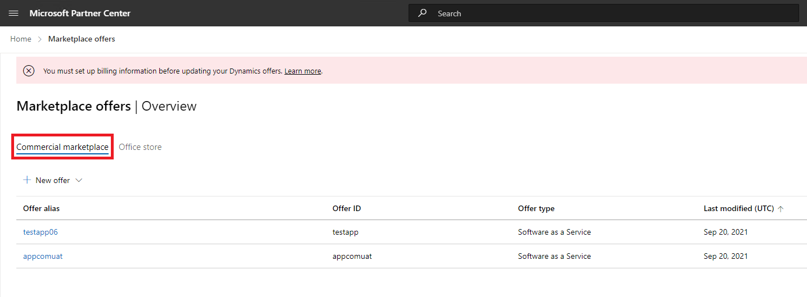
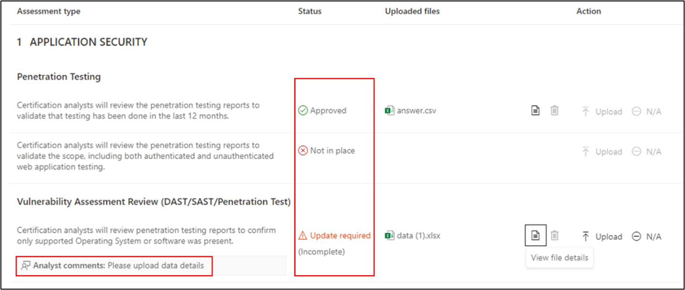

# Microsoft 365 앱 준수 프로그램에 대한 파트너의 사용자 가이드 - SaaS

|단계|제목|
|---|---|
|1단계| 게시자 증명|
|2단계| Microsoft 365 인증|

## 1. 개요 

이 문서는 파트너 센터 포털을 통해 SaaS 앱에 대한 Publisher 증명 및 인증을 받는 것을 목표로 하는 Microsoft 365 앱 준수 프로그램에 등록된 파트너에 대한 단계별 사용자 가이드 역할을 합니다.

>[!IMPORTANT]
>이 가이드는 Microsoft 365 앱 준수 팀에서 승인하고 허용 목록에 추가한 SaaS 앱에만 적용됩니다. 앱이 허용 목록에 없는 경우 파트너 센터 내에서 진행할 수 없습니다. SaaS 허용 목록을 받으려면 appcert@microsoft.com 문의하세요.

## 2. 약어 & 정의
|두문자어 | 정의 |
|----|----|
|[PC(파트너 센터)](https://partner.microsoft.com/)|모든 Microsoft 파트너를 위한 포털입니다. 파트너가 파트너 센터에 로그인하고 자체 평가 설문지를 제출합니다. [Microsoft 365 앱 규정 준수](https://partner.microsoft.com/dashboard/home)를 위한 파트너 센터|
|ISV | 독립 소프트웨어 공급업체(일명). 파트너 또는 개발자 |
|앱 원본 | 앱 카탈로그 |
|예제 |[이제 가상 에이전트](https://appsource.microsoft.com/product/office/WA104381816)|

## 3. Publisher 증명 워크플로

**홈페이지**: 파트너가 파트너 센터에 로그인하면 방문 페이지입니다.

  
**1단계** : Marketplace 제품 선택

  
**2단계**: 'Marketplace 제품'을 선택한 후 '상업용 Marketplace'로 전환합니다.

목록에서 앱을 선택하면 '앱 준수' 옵션과 함께 다른 탐색 모음이 나타납니다.
  
**3단계**: '앱 준수' 선택
  

  
**4단계**: Publisher 증명에 대한 자체 평가 설문지를 작성합니다.

  
**참고 애플리케이션을 업데이트/다시 제출하기 위해 돌아오는 경우 '제품 선택'에 대한 드롭다운을 클릭하고 앱을 선택하고 '복제'를 클릭합니다.**

**Import/Export 기능을 활용하여 양식을 오프라인으로 완료하고 완료되면 가져올 수도 있습니다.**

 
**5단계**: 완료되면 '제출'을 클릭하면 평가가 '검토 중'이 됩니다.
 
  
  
**시나리오 승인/거부:**
  
대답. Publisher 증명 거부
- 거부 시 파트너는 다음을 수행할 수 있습니다.
     - 실패 보고서 보기
          - 파트너는 이메일을 통해 알림을 받게 되며 파트너 센터에서 실패 보고서를 볼 수 있습니다.
     - 자체 평가 설문지를 업데이트하고 다시 제출합니다.
        

B.  Publisher 증명 승인
- 승인 시 파트너는 다음을 수행할 수 있습니다.
     - 증명 업데이트 및 다시 제출
     - 완료된 Publisher 증명 보기
     - Microsoft 365 인증 프로세스 시작
        
        
  
 
  
**증명 승인 Publisher 게시자 증명 앱에 대한 AppSource 링크의 예입니다.**
  

   
## 4. Microsoft 365 인증 워크플로
  
파트너는 확인란을 선택하고 '제출'을 클릭하여 인증 프로세스를 시작할 수 있습니다.
  
 
  
**1단계**: 초기 문서 제출

모든 세부 정보를 입력하고 관련 문서를 업로드한 다음 '제출'을 클릭합니다.
  
 

  
제출을 클릭하면 초기 문서 제출이 검토됩니다.

  
초기 문서가 충분하지 않거나 관련이 없는 경우 분석가가 수정을 요청합니다. 분석가는 파트너와 협력하여 승인에 적합한 문서를 얻을 수 있도록 도와줄 것입니다.

분석가가 초기 문서 제출을 승인하면 파트너는 제어 요구 사항을 제출해야 합니다.
  
**2단계**: 제어 요구 사항 제출
  
모든 세부 정보를 입력하고 관련 문서를 업로드한 다음 '제출'을 클릭합니다.

  

 
제출을 클릭하면 초기 문서 제출이 검토됩니다.

  
제어 요구 사항 문서가 충분하지 않거나 관련이 없는 경우 분석가가 수정을 요청합니다. 분석가는 파트너와 협력하여 승인에 적합한 문서를 얻을 수 있도록 도와줄 것입니다.

  
 
 
제출이 승인 표준을 충족하지 않는 경우 분석가는 제출을 거부합니다.
  
파트너는 분석가와 협력하여 관련 정보 및 문서를 제공할 수 있습니다.

  
모든 보안 표준이 충족되면 분석가가 제출을 승인하고 파트너는 Microsoft 365 인증됩니다.

  
**인증 후 승인: AppSource에서 Microsoft 365 인증 배지의 예입니다.** 

 
## 5. Microsoft 365 갱신 워크플로:
  
**Microsoft 365Publisher 증명 및 인증 갱신 워크플로:**  

Microsoft 365 앱 준수 프로그램은 이제 연간 갱신 프로세스를 제공합니다. 이 프로세스 중에 앱 개발자는 기존 Publisher 증명 설문지 및 Microsoft 365 인증에 필요한 문서를 업데이트할 수 있습니다. 
 
**혜택:** 

- AppSource, Office Microsoft Store, Teams Microsoft Store 및 다양한 관리 포털에서 인증 배지를 유지 관리하여 다른 사용자와 앱을 구분합니다. 
- 인증된 앱을 사용하는 고객 신뢰도를 높입니다. 
- IT 관리자가 업데이트된 인증 정보를 사용하여 정보에 입각한 결정을 내릴 수 있도록 지원합니다.

파트너 [센터에서](https://partner.microsoft.com/dashboard/home) 새로운 갱신 프로세스를 사용하여 원활한 환경을 제공할 수 있습니다. 갱신 미리 알림은 만료 날짜 90일 전에 파트너 센터에 표시됩니다. 주기적인 미리 알림은 만료 90일, 60일 및 30일 전에 이메일을 통해 전송됩니다. 
 
**1단계: Publisher 증명 갱신:**
  
앱의 Publisher 증명 답변은 매년 다시 제출해야 합니다. 증명이 1년 표시에 가까워지면 증명 재제출을 장려하는 이메일 미리 알림이 전송됩니다. 
 
**1단계**: **갱신** 을 선택하여 Publisher 증명을 갱신합니다.
  

  
**2단계**: 이전 Publisher 증명 답변을 검토하고 필요에 따라 최신 정보로 업데이트합니다. 
  
준비가 되면 갱신을 위해 Publisher 증명을 제출합니다. M365 앱 준수 분석가가 검토합니다.

  
**Publisher 증명 갱신 승인됨:**
  

  
**Publisher 증명 만료됨:**
  
Microsoft 문서에서 앱의 Publisher 증명 페이지를 유지하려면 만료 날짜 전에 앱의 정보를 갱신해야 합니다. 또한 적시에 갱신하면 다양한 상점의 앱에 대한 지속적인 배딩 및 아이콘이 보장됩니다. 
 

**참고**: 만료되면 '갱신'을 클릭하여 언제든지 Publisher 증명 갱신 프로세스를 시작할 수 있습니다.
 
**2단계: Microsoft 365 인증 갱신**
  
앱의 인증 정보는 매년 다시 제출해야 합니다. 이렇게 하려면 현재 환경의 범위 내 컨트롤의 유효성을 다시 검사해야 합니다. 인증이 1년 마크에 가까워지면 문서 및 증거를 다시 제출하도록 권장하는 이메일 알림이 전송됩니다.
 
 

**인증 갱신 승인/거부 시나리오:**

**시나리오 1:** 

인증 갱신이 시작되었으며 검토 중입니다.
 
 

시나리오 1A: 

인증 갱신 거부: 
- 다음과 같은 경우 인증이 거부될 수 있습니다. 
     - 앱에는 필요한 도구, 프로세스 또는 구성이 없으며 인증 창 내에서 필요한 변경 내용을 구현할 수 없습니다. 
     - 앱에 미해결 취약성이 있으며 인증 창 내에서 수정할 수 없습니다. 
 

시나리오 1B: 

인증 갱신이 승인됨

**인증 만료:**

Microsoft 문서에서 앱의 인증 페이지를 유지하려면 만료 날짜 전에 앱의 정보를 갱신해야 합니다. 또한 시기 적절한 갱신을 통해 AppSource 및 Team Microsoft Store 앱에 대한 계속해서 잘못된 작업과 아이콘을 확인할 수 있습니다.

  
참고: 만료되면 '갱신'을 클릭하여 언제든지 Publisher 증명 및 인증 프로세스를 시작할 수 있습니다. 
