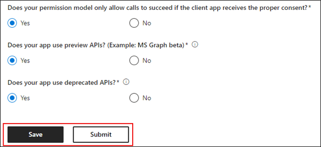

# 앱 준수 프로그램에 대한 Microsoft 365 사용자 가이드Partner's User Guide for Microsoft 365 App Compliance Program

|작업 단계Phase|제목Title|
|---|---|
|1단계Phase 1| 게시자 증명Publisher Attestation|
|2단계Phase 2| Microsoft 365 인증Microsoft 365 Certification|

## 1. 개요1. Overview
이 문서는 파트너 센터 포털을 통해 Microsoft 365 증명 및 인증을 획득하기 위한 Microsoft 365 Publisher 앱 준수 프로그램에 등록된 파트너를 위한 단계별 사용자 가이드 역할을 합니다.This document acts as a step-by-step user guide for our partners enrolled in the Microsoft 365 App Compliance Program aiming to undergo Publisher Attestation and Certification though Partner Center portal.

## 2. 약어 & 정의2. Acronyms & Definitions
| 두문자어Acronym |정의Definition |
|---|----|
|[PC(파트너 센터)](https://partner.microsoft.com/)PC [(Partner Center)](https://partner.microsoft.com/)|모든 Microsoft 파트너를 위한 포털입니다.A portal for all Microsoft Partners. 파트너가 파트너 센터에 로그인하여 설문 Self-Assessment 제출합니다.A Partner logs in to Partner Center and submits Self-Assessment Questionnaire. [앱 준수를](https://partner.microsoft.com/dashboard/home) Microsoft 365 파트너 센터[Partner Center](https://partner.microsoft.com/dashboard/home) for Microsoft 365 App Compliance|
|ISVISV|독립 소프트웨어 공급업체.Independent Software Vendor. A.k.a.A.k.a. 파트너 또는 개발자Partner or Developer|
|앱 원본App Source| [앱 카탈로그Catalog of apps](https://appsource.microsoft.com/)
||예: [이제 가상 에이전트](https://appsource.microsoft.com/product/office/WA104381816)Example: [Now virtual agent](https://appsource.microsoft.com/product/office/WA104381816)|

## 3. Publisher 워크플로3.   Publisher Attestation Workflow

홈페이지: 파트너가 파트너 센터에 로그인하면 방문 페이지입니다.Home Page: This is the landing page once a partner logs in to Partner Center.

**1단계:**   페이지 왼쪽의 탐색 모음에서 다음을 클릭합니다.**Step 1**   : On the left side of the page, in the navigation bar:
1. 저장소 Office 선택Select Office store
1. 개요 선택Select Overview

'개요'를 선택하면 파트너는 파트너 센터를 통해 제출된 앱 목록을 볼 수 있으며, 파트너는 파트너 준수 프로그램에 사용할 Microsoft 365 있습니다.Upon selecting ‘Overview’, partner can see list of apps submitted through Partner Center and available for the Microsoft 365 Compliance program.

**2단계:** 목록에서 앱을 선택하여 Publisher 프로세스를 시작할 수 있습니다.**Step 2** : Select an app from the list to begin the Publisher Attestation process.

앱을 선택하면 다른 탐색 모음에 '앱 준수' 옵션이 팝업됩니다.On selecting an app, another navigation bar will pop up with option ‘App Compliance.’

**3단계:**'앱 준수' 선택**Step 3**: Select ‘App Compliance’

**4단계:** Self-Assessment Publisher 설문지 작성**Step 4**: Fill out the Self-Assessment Questionnaire for Publisher Attestation

**참고:** 응용 프로그램을 업데이트/다시 제출할 예정인 경우 '제품 선택'에 대한 드롭다운을 클릭하고 앱을 선택하고 '복제'를 클릭합니다.**Note:** If you are coming back to update/re-submit your application, click dropdown for ‘Choose the product’, select the app and click ‘Clone.’

양식의 전체 Import/Export 사용하여 양식을 오프라인으로 완성하고 완료되면 가져올 수 있습니다.You can also leverage the Import/Export feature to complete the form offline and import it once completed.

양식의 전체 Import/Export 사용하여 양식을 오프라인으로 완성하고 완료되면 가져올 수 있습니다.You can also leverage the Import/Export feature to complete the form offline and import it once completed. 

**5단계:** 완료되면 '제출'을 클릭하면 평가가 '검토 중'이 됩니다.**Step 5**: Once completed, click on ‘Submit’, the assessment will now be ‘under review’.

### 승인/거부 시나리오:Approve/Reject Scenarios:

**A.Publisher 거부****A.Publisher Attestation Rejection**

이 단계에서 거부하는 경우 파트너는 다음을 할 수 있습니다.In case of rejection at this stage, an partner can:
-   실패 보고서 보기.View failure report.
    - 파트너는 전자 메일을 통해 알림을 보내며 파트너 센터에서 오류 보고서를 볼 수 있습니다.Partner will be notified via email, and they can view the failure report in Partner Center
-   Publisher 업데이트 및 다시 제출 평가 Update and re-submit Publisher Attestation 

**B.Publisher 다시 제출****B.Publisher Attestation Re-submission**

**C.Publisher 승인****C.Publisher Attestation Approval**

-   승인 파트너는 다음을 할 수 있습니다.Upon approval partner can:
    - 업데이트 및 다시 제출 attestationUpdate and resubmit attestation
    - 완료된 Publisher 보고 공유View and share completed Publisher Attestation
    - M365 인증 프로세스 시작Start M365 Certification Process

**Post Publisher Verification Approval: Example of link in AppSource for publisher attested apps****Post Publisher Verification Approval: Example of link in AppSource for publisher attested apps**

## 4. Microsoft 365 워크플로4. Microsoft 365 Certification Workflow

파트너가 '제출'을 클릭하고 검토를 위해 모든 문서 및 증거를 제출하면:Once partner clicks on ‘Submit’ and submits all documents and evidence for review: 

### Microsoft 365 인증 - 제출Microsoft 365 Certification - Submitted

**Microsoft 365 인증 - 거부****Microsoft 365 certification - Rejected**

**Microsoft 365 인증 - 승인됨****Microsoft 365 Certification - Approved**

**인증 후 승인: AppSource의 Microsoft 365 인증 배지 예****Post Certification Approval: Example of Microsoft 365 certification badge in AppSource**

## 5. 기존 ISV 워크플로5. Workflow for Existing ISVs

기존 ISV인 경우 기존 ISV를 업데이트하고 Publisher 합니다.If you are an existing ISV and want to Update Publisher Attestation.

**1단계:**'업데이트 및 Publisher 제출' 링크를 클릭합니다.**Step 1**: Click on ‘Update and re-submit your Publisher Attestation’ link.

**참고:** 응용 프로그램을 업데이트/다시 제출할 예정인 경우 '제품 선택'에 대한 드롭다운을 클릭하고 앱을 선택하고 '가져오기'를 클릭합니다.**Note:**: If you are coming back to update/re-submit your application, click dropdown for ‘Choose the product’, select the app and click ‘Import’.

**2단계:** 양식을 업데이트하고 저장/제출을 클릭합니다.**Step 2**: Make updates to your form and click Save/Submit.

제출된 후 검토 중입니다.Once submitted, it will be under review.

## 6. Microsoft 365 Publisher 증명 및 인증 갱신 워크플로:6.   Microsoft 365 Publisher Attestation and Certification Renewal Workflow:

Microsoft 365 이제 앱 준수 프로그램은 연간 갱신 프로세스를 제공합니다.Microsoft 365 App Compliance Program now offers an annual renewal process. 이 프로세스 동안 앱 개발자는 기존 Publisher 증명 설문지 및 인증에 필요한 문서를 Microsoft 365 있습니다.During this process, app developers can update their existing Publisher Attestation questionnaire and documents required for Microsoft 365 Certification. 

**이점:****Benefits:**

- 앱을 다른 앱과 차별화하기 위해 AppSource 및 팀 스토어에서 인증 배지를 유지 관리합니다.Maintain your certification badge in AppSource and Team Store to differentiate your app from others. 
- 인증된 앱을 사용할 때 고객의 신뢰를 높이기Increase customer confidence in using your certified app. 
- IT 관리자가 업데이트된 인증 정보를 통해 정보를 통해 의사 결정을 내리는 데 도움을 줄 수 있습니다.Help IT admins make informed decisions with updated certification information. 

새로운 갱신 프로세스는 원활한 [환경을](https://partner.microsoft.com/en-us/dashboard/home) 제공하기 위해 파트너 센터에서 사용할 수 있습니다.The new renewal process is available in [Partner Center](https://partner.microsoft.com/en-us/dashboard/home) to provide a seamless experience. 갱신 미리 알림은 만료 날짜 90일 전부터 파트너 센터에 표시됩니다.A renewal reminder will be shown in Partner Center starting 90 days before the expiration date. 만료 90일, 60일 및 30일 전에 전자 메일을 통해 주기적인 미리 알림도 전송됩니다.Periodic reminders will also be sent via email at 90, 60 and 30 days before expiration.

**계층 1: Publisher 갱신:****Tier 1: Publisher Attestation Renewal:** 

앱의 Publisher 답변을 매년 다시 제출해야 합니다.The app’s Publisher Attestation answers will need to be resubmitted on an annual basis. 1년이 다가오면 전자 메일 미리 알림이 전송되고 스터스터가 다시 전송됩니다.When the attestation nears 1-year mark, an email reminder will be sent encouraging a resubmission of the attestation. 

**1단계:** **갱신을** 선택하여 Publisher 갱신합니다.**Step 1**: Select **Renew** to renew the Publisher Attestation. 

**2단계:** 이전 Publisher 정보를 검토하고 필요한 경우 최신 정보로 업데이트합니다.**Step 2**: Review the previous Publisher Attestation answers and update with the latest information as needed. 준비가 Publisher 갱신에 대한 제출을 제출합니다.Submit Publisher Attestation for renewal when ready. M365 앱 준수 분석가가 검토합니다.It will be reviewed by an M365 App Compliance Analyst.

**Publisher 만료된 인증서:** Microsoft docs에서 앱의 Publisher 페이지를 유지 관리하기 위해 만료 날짜 전에 앱의 정보를 갱신해야 합니다. 또한 시기 적절한 갱신을 통해 AppSource 및 팀 스토어에서 앱의 배지 및 아이콘을 계속 사용할 수 있습니다.**Publisher Attestation Expired:** The app’s information needs to be renewed before the expiration date to maintain the app’s Publisher Attestation page on the Microsoft docs. Timely renewal will also ensure continued badging and icons for the app in AppSource and Team Store.

참고: 만료되면 Publisher 갱신 프로세스를 언제든지 '갱신'을 클릭하여 시작할 수 있습니다.Note: Once expired, Publisher Attestation renewal process can be started anytime by clicking ‘Renew’. 

**계층 2: Microsoft 365 갱신****Tier 2: Microsoft 365 Certification Renewal** 

앱의 인증 정보는 매년 다시 제출해야 합니다.The app’s certification information needs to be resubmitted on an annual basis. 이렇게 하면 현재 환경의 범위 내 컨트롤을 다시 확인해야 합니다.This will require revalidation of the in-scope controls of your current environment. 인증이 1년이 다가오면 문서 및 증거를 다시 전송할 수 있는 전자 메일 알림이 전송됩니다.When the Certification nears 1-year mark an email notification will be sent encouraging a resubmission of the documents and evidence. 

**인증 갱신 승인/거부 시나리오:****Certification Renewal Approve/Reject Scenarios:**

**시나리오 1:****Scenario 1:** 

Publisher 의거가 완료되었습니다.Publisher Attestation  is complete. 인증 갱신이 시작된 후 검토 중입니다.Certification renewal has started and under review. 

**시나리오 1A:****Scenario 1A:**

인증 갱신 거부: 인증이 거부될 수 있는 경우:Certification renewal rejection: Certification may be rejected if: 

 - 앱에 필요한 도구, 프로세스 또는 구성이 없는 경우 인증 기간 내에 필요한 변경 내용을 구현할 수 없습니다.The app does not have the required tooling, processes, or configurations in place and will not be able to implement required changes within the certification window. 
 - 앱에 미해결 취약점이 있으며 인증 기간 내에 수정될 수 없습니다.The app has outstanding vulnerabilities in place and cannot be fixed within the certification window. 

    
**시나리오 1B:****Scenario 1B:** 

인증 갱신 승인Certification renewal is approved  

**인증 만료:****Certification Expiration:**

Microsoft docs에서 앱의 인증 페이지를 유지 관리하기 위해 만료 날짜 전에 앱의 정보를 갱신해야 합니다. 또한 시기 적절한 갱신을 통해 AppSource 및 팀 스토어에서 앱의 배지 및 아이콘을 계속 사용할 수 있습니다.The app’s information needs to be renewed before the expiration date to maintain app’s Certification page on the Microsoft docs. Timely renewal will also ensure continued badging and icons for the app in AppSource and Team Store. 

    
**참고:** 만료되면 Publisher '갱신'을 클릭하여 언제든지 증명 및 인증 프로세스를 시작할 수 있습니다.**Note**: Once expired, Publisher Attestation and Certification process can be started anytime by clicking ‘Renew’. 

