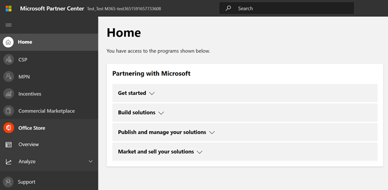

# Microsoft 365 앱 준수 프로그램에 대한 파트너의 사용자 가이드Partner's User Guide for Microsoft 365 App Compliance Program

|||
|---|---|
|계층 1Tier 1| 게시자 AttestationPublisher Attestation|
|계층 2Tier 2| Microsoft 365 인증Microsoft 365 Certification|

## 1. 개요1. Overview
이 문서는 파트너 센터 포털을 통해 게시자 증명 및 인증을 획득하기 위한 Microsoft 365 앱 준수 프로그램에 등록된 파트너를 위한 단계별 사용자 가이드 역할을 합니다.This document acts as a step-by-step user guide for our Partners, enrolled for Microsoft 365 App Compliance Program aiming to undergo Publisher Attestation and Certification though Partner Center portal.

## 2. 약어 & 정의2. Acronyms & Definitions
| | |
|---|----|
|두문자어Acronym | 정의Definition |
|PC(파트너 센터)PC (Partner Center)|모든 Microsoft 파트너를 위한 포털입니다.A portal for all Microsoft Partners. 파트너가 파트너 센터에 로그인하고 설문 Self-Assessment 제출합니다. https://partner.microsoft.com/A Partner logs in to Partner Center and submits Self-Assessment Questionnaire https://partner.microsoft.com/|
|ISVISV|Independent Software Vendor A.k.a.Independent Software Vendor A.k.a. 파트너 또는 개발자Partner or Developer|
|앱 원본App Source| 앱 카탈로그(https://appsource.microsoft.com/)Catalog of apps (https://appsource.microsoft.com/)
||예: 이제 가상 에이전트(https://appsource.microsoft.com/en-us/product/office/WA104381816)Example: Now virtual agent (https://appsource.microsoft.com/en-us/product/office/WA104381816)|

## 3. 게시자 Attestation Workflow3.   Publisher Attestation Workflow

홈페이지: 파트너가 파트너 센터에 로그인하면 방문 페이지입니다.Home Page: This is the landing page once a partner logs in to Partner Center.

**1단계:**   페이지 왼쪽의 탐색 모음에서 다음을 클릭합니다.**Step 1**   : On the left side of the page, in the navigation bar:
1. Office 스토어 선택Select Office store
1. 개요 선택Select Overview

'개요'를 선택하면 파트너는 파트너 센터를 통해 제출하고 Microsoft 365 규정 준수 프로그램에 사용할 수 있는 앱 목록을 볼 수 있습니다.Upon selecting ‘Overview’, partner can see list of apps submitted through Partner Center and available for the Microsoft 365 Compliance program.

**2단계:** 목록에서 앱을 선택하여 게시자 의거 프로세스를 시작할 수 있습니다.**Step 2** : Select an app from the list to begin the Publisher Attestation process.

앱을 선택하면 다른 탐색 모음에 '앱 준수' 옵션이 팝업됩니다.On selecting an app, another navigation bar will pop up with option ‘App Compliance’

**3단계:**'앱 준수' 선택**Step 3**: Select ‘App Compliance’

**4단계:** 게시자 Self-Assessment 설문지 작성**Step 4**: Fill out the Self-Assessment Questionnaire for Publisher Attestation

**참고**:응용 프로그램을 업데이트/다시 제출할 예정인 경우 '제품 선택'에 대한 드롭다운을 클릭하고 앱을 선택하고 '복제'를 클릭합니다.**Note**:If you are coming back to update/re-submit your application, click dropdown for ‘Choose the product’, select the app and click ‘clone’.

 

가져오기/내보내기 기능을 활용하여 양식을 오프라인으로 완성하고 완료되면 가져올 수 있습니다.You can also leverage the Import/Export feature to complete the form offline and import it once completed. 

**5단계:** 완료되면 '제출'을 클릭하면 평가가 '검토 중'이 됩니다.**Step 5**: Once completed, click on ‘Submit’, the assessment will now be ‘under review’.

### 승인/거부 시나리오:Approve/Reject Scenarios:

**A.Publisher 퇴장 거부****A.Publisher Attestation Rejection**

이 단계에서 거부하는 경우 파트너는 다음을 할 수 있습니다.In case of rejection at this stage, an partner can:
-   실패 보고서 보기.View failure report.
    - 파트너는 파트너 센터 및 전자 메일을 통해 알림을 하게 됩니다.Partner will be notified in Partner Center and via email.
-   응답 Self-Assessment 업데이트합니다.Update Self-Assessment responses.
-   자체 평가를 다시 제출합니다.Re-submit Self-Assessment.

**B.Publisher Attestation Re-submission****B.Publisher Attestation Re-submission**

**C.Publisher Attestation Approval****C.Publisher Attestation Approval**

-   승인 파트너는 다음을 할 수 있습니다.Upon approval partner can:
    - 업데이트 및 다시 제출 attestationUpdate and resubmit attestation
    - 완료된 게시자 Attestation 보기 및 공유View and share completed Publisher Attestation
    - M365 인증 프로세스 시작Start M365 Certification Process

**게시자 확인 승인 후: 게시자에서 검증된 앱에 대한 AppSource의 링크 예****Post Publisher Verification Approval: Example of link in AppSource for publisher attested apps**

## 4. Microsoft 365 인증 워크플로4. Microsoft 365 Certification Workflow

파트너가 '제출'을 클릭하고 검토를 위해 모든 문서 및 증거를 제출하면:Once partner clicks on ‘Submit’ and submits all documents and evidence for review: 

### Microsoft 365 인증 - 제출Microsoft 365 Certification - Submitted

**Microsoft 365 인증 - 거부****Microsoft 365 certification - Rejected**

**Microsoft 365 인증 - 승인됨****Microsoft 365 Certification - Approved**

**인증 후 승인: AppSource의 Microsoft 365 인증 배지 예****Post Certification Approval: Example of Microsoft 365 certification badge in AppSource**

## 5. 기존 ISV 워크플로5. Workflow for Existing ISVs

기존 ISV인 경우 Publisher Attestation을 업데이트합니다.If you are an existing ISV and want to Update Publisher Attestation.

**1단계:**'게시자 의거 업데이트 및 다시 제출' 링크를 클릭합니다.**Step 1**: Click on ‘Update and re-submit your Publisher Attestation’ link.

**참고:** 응용 프로그램을 업데이트/다시 제출할 예정인 경우 '제품 선택'에 대한 드롭다운을 클릭하고 앱을 선택하고 '가져오기'를 클릭합니다.**Note:**: If you are coming back to update/re-submit your application, click dropdown for ‘Choose the product’, select the app and click ‘Import’.

**2단계:** 양식을 업데이트하고 저장/제출을 클릭합니다.**Step 2**: Make updates to your form and click Save/Submit.

제출된 후 검토 중입니다.Once submitted, it will be under review.

## 6. Microsoft 365 Re-Certification 워크플로:6.   Microsoft 365 Re-Certification Workflow:

앱이 1년 인증 1주년이 될 예정인 경우 인증 갱신에 대한 주기적인 미리 알림이 있습니다.When an app is about to reach its 1-year Certification Anniversary, there will be periodic reminders to renew certification.

**Publisher Attestation Completed. Certification InProgress.****Publisher Attestation Completed. Certification InProgress.**

승인/거부 Secnario: A. 인증 거부Approval/Rejection Secnario: A. Certification Rejected

B.B. 인증 승인됨Certification Approved

만료 시나리오: A. 게시자 Attestation 만료Expiration Scenario: A. Publisher Attestation Expired

B.B. 인증 만료Certification Expired

