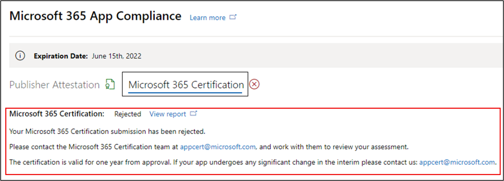

# 앱 준수 프로그램에 대한 Microsoft 365 사용자 가이드

|단계|제목|
|---|---|
|1단계| 게시자 증명|
|2단계| Microsoft 365 인증|

## 1. 개요
이 문서는 파트너 센터 포털을 통해 Microsoft 365 증명 및 인증을 획득하기 위한 Microsoft 365 Publisher 앱 준수 프로그램에 등록된 파트너를 위한 단계별 사용자 가이드 역할을 합니다.

## 2. 약어 & 정의
| 두문자어 |정의 |
|---|----|
|[PC(파트너 센터)](https://partner.microsoft.com/)|모든 Microsoft 파트너를 위한 포털입니다. 파트너는 파트너 센터에 로그인하고 자체 평가 설문서를 제출합니다. [앱 준수를](https://partner.microsoft.com/dashboard/home) Microsoft 365 파트너 센터|
|ISV|독립 소프트웨어 공급업체. A.k.a. 파트너 또는 개발자|
|앱 원본| [앱 카탈로그](https://appsource.microsoft.com/)
|예제|[이제 가상 에이전트](https://appsource.microsoft.com/product/office/WA104381816)|

## 3. Publisher 워크플로

**홈페이지:** 파트너가 파트너 센터에 로그인하면 방문 페이지입니다.

**1단계:** 마켓플레이스 제공을 선택합니다. 

  
**2단계:**'마켓플레이스 제공'을 선택한 후 'Office 스토어'로 전환합니다. 목록에서 앱을 선택하여 Publisher 프로세스를 시작할 수 있습니다.

앱을 선택하면 다른 탐색 모음에 '추가 인증 정보' 옵션이 표시됩니다. 그런 다음 '앱 준수'를 클릭합니다.
  
**3단계:**'앱 준수' 선택

**4단계:** Publisher 평가 설문지 작성

**참고 응용 프로그램을 업데이트/다시 제출할 예정인 경우 '제품 선택'에 대한 드롭다운을 클릭하고 앱을 선택하고 '복제'를 클릭합니다.**

양식의 전체 Import/Export 사용하여 양식을 오프라인으로 완성하고 완료되면 가져올 수 있습니다.

**5단계:** 완료되면 '제출'을 클릭하면 평가가 '검토 중'이 됩니다.

### 승인/거부 시나리오:

**A. Publisher 거부**

- 이 단계에서 거부하는 경우 파트너는 다음을 할 수 있습니다.
    - 실패 보고서 보기
         - 파트너는 전자 메일을 통해 알림을 보내며 파트너 센터에서 오류 보고서를 볼 수 있습니다.
    - Publisher 업데이트 및 다시 제출

**B. Publisher 승인**

- 승인 파트너는 다음을 할 수 있습니다.
    - 업데이트 및 다시 제출 attestation
    - 완료된 Publisher 보고 공유
    - 인증 Microsoft 365 시작

**Post Publisher Attestation Approval: Example of link in AppSource for publisher attested apps**

## 4. Microsoft 365 워크플로

파트너는 확인란을 선택하고 '제출'을 클릭하여 인증 프로세스를 시작할 수 있습니다. 

**1단계:** 초기 문서 제출 모든 세부 정보를 입력하고 관련 문서를 업로드한 다음 '제출'을 클릭합니다.

 

제출을 클릭하면 의거 제출이 검토됩니다. 

초기 문서가 충분하지 않을 경우 분석가가 개정을 요청합니다. 분석가가 파트너와 협력하여 승인을 위해 올바른 문서를 얻습니다. 

분석가가 초기 문서 제출을 승인하면 파트너는 제어 요구 사항을 제출해야 합니다. 

**2단계:** 제어 요구 사항 제출 모든 세부 정보를 입력하고 관련 문서를 업로드하고 '제출'을 클릭합니다. 

 
 

제출을 클릭하면 인증 제출이 검토됩니다. 

분석가가 제어 요구 사항 문서가 충분하지 않은 경우 또는 관련성이 없는 경우 개정을 요청합니다. 분석가가 파트너와 협력하여 승인을 위해 올바른 문서를 얻습니다. 

 
 

제출이 승인 표준을 충족하지 않는 경우 분석가가 제출을 거부합니다. 파트너는 분석가와 협력하여 관련 정보 및 문서를 제공할 수 있습니다. 

모든 보안 표준이 충족되고 나면 분석가가 제출을 승인하고 파트너가 인증을 Microsoft 365 합니다. 

**인증 후 승인: AppSource의 Microsoft 365 인증 배지 예**

## 5. Microsoft 365 갱신 워크플로:
  
Microsoft 365 Publisher 증명 및 인증 갱신 **워크플로:** Microsoft 365 앱 준수 프로그램은 이제 연간 갱신 프로세스를 제공합니다. 이 프로세스 동안 앱 개발자는 기존 Publisher 증명 설문지 및 인증에 필요한 문서를 Microsoft 365 있습니다. 
 
**이점:** 

- 앱을 차별화하기 위해 AppSource, Teams 스토어, Office 스토어 및 기타 스토어에서 인증 배지를 유지 관리합니다. 
- 인증된 앱을 사용할 때 고객의 신뢰를 높이기 
- IT 관리자가 업데이트된 인증 정보를 통해 정보를 통해 의사 결정을 내리는 데 도움을 줄 수 있습니다. 

갱신 프로세스는 원활한 [환경을](https://partner.microsoft.com/dashboard/home) 제공하기 위해 파트너 센터에서 사용할 수 있습니다. 갱신 미리 알림은 만료 날짜 90일 전부터 파트너 센터에 표시됩니다. 만료 90일, 60일 및 30일 전에 전자 메일을 통해 주기적인 미리 알림도 전송됩니다.

**1단계: Publisher 갱신:** 

새로운 갱신 프로세스는 원활한 [환경을](https://partner.microsoft.com/dashboard/home) 제공하기 위해 파트너 센터에서 사용할 수 있습니다. 갱신 미리 알림은 만료 날짜 90일 전부터 파트너 센터에 표시됩니다. 만료 90일, 60일 및 30일 전에 전자 메일을 통해 주기적인 미리 알림도 전송됩니다. 

**1단계:** **갱신을** 선택하여 Publisher 갱신합니다. 

**2단계:** 이전 Publisher 정보를 검토하고 필요한 경우 최신 정보로 업데이트합니다. 준비가 Publisher 갱신에 대한 제출을 제출합니다. 앱 준수 분석가가 Microsoft 365 검토합니다.

**Publisher 갱신 승인됨**

Publisher 만료된 **앱:** Microsoft docs에서 앱의 Publisher Attestation 페이지를 유지 관리하기 위해 만료 날짜 전에 앱 정보를 갱신해야 합니다. 또한 시기 적절한 갱신을 통해 AppSource, 스토어, Teams 스토어 및 기타 스토어에서 앱에 대한 Office 및 아이콘을 계속 사용할 수 있습니다.

참고: 만료되면 Publisher 갱신 프로세스를 언제든지 '갱신'을 클릭하여 시작할 수 있습니다. 

**2단계: Microsoft 365 갱신** 

앱의 인증 정보는 매년 다시 제출해야 합니다. 이렇게 하면 현재 환경의 범위 내 컨트롤을 다시 확인해야 합니다. 인증이 1년이 다가오면 문서 및 증거를 다시 전송할 수 있는 전자 메일 알림이 전송됩니다. 

**인증 갱신 승인/거부 시나리오:**
 
**시나리오 1:** 

인증 갱신이 시작된 후 검토 중입니다.

**시나리오 1A:**

인증 갱신 거부: 인증이 거부될 수 있는 경우: 
- 앱에 필요한 도구, 프로세스 또는 구성이 없는 경우 인증 기간 내에 필요한 변경 내용을 구현할 수 없습니다. 
- 앱에 미해결 취약점이 있으며 인증 기간 내에 수정될 수 없습니다. 
 

    
**시나리오 1B:** 

인증 갱신 승인  

**인증 만료:**
 
Microsoft docs에서 앱의 인증 페이지를 유지 관리하기 위해 만료 날짜 전에 앱의 정보를 갱신해야 합니다. 또한 시기 적절한 갱신을 통해 AppSource 및 팀 스토어에서 앱의 배지 및 아이콘을 계속 사용할 수 있습니다.

Microsoft docs에서 앱의 인증 페이지를 유지 관리하기 위해 만료 날짜 전에 앱의 정보를 갱신해야 합니다. 또한 시기 적절한 갱신을 통해 AppSource, 스토어, Teams 스토어 및 기타 스토어에서 앱에 대한 Office 및 아이콘을 계속 사용할 수 있습니다. 

    
**참고:** 만료되면 Publisher '갱신'을 클릭하여 언제든지 증명 및 인증 프로세스를 시작할 수 있습니다. 

