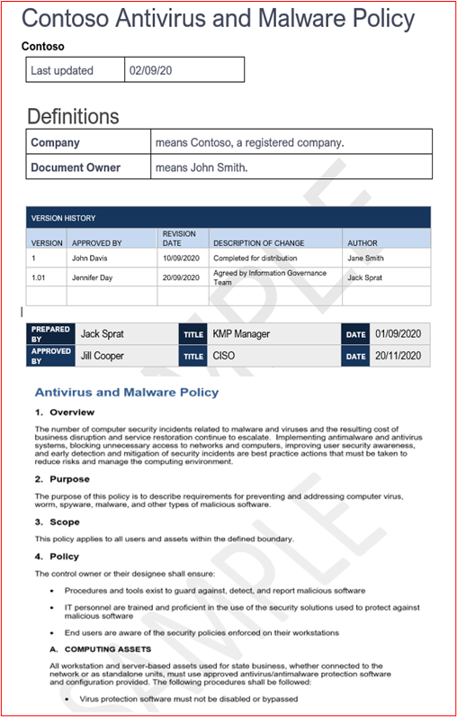

# Microsoft 365 인증 - 샘플 증거 가이드

## 개요

이 지침은 ISV에게 인증 컨트롤에 필요한 세부 수준에 대한 지원을 Microsoft 365 만들어졌습니다. 또한 증거 제출을 구성하는 방법에 대한 지침과 잠재적으로 인증 컨트롤을 충족하는 데 사용될 수 있는 증거 유형 예제를 제공합니다. 이 문서에서 공유되는 모든 예는 컨트롤이 충족될 것 같은 보장을 제공하는 데 사용할 수 있는 유일한 증거는 아니며 인증 분석가에게 이 어설션에 도움이 되는 필요한 증거를 제공하는 데 도움이 될 수 있는 정보 유형에 대한 지침으로만 사용할 수 있습니다. 참고: - 요구 사항을 충족하는 데 사용되는 실제 인터페이스, 스크린샷 및 설명서는 제품 사용, 시스템 설정 및 내부 프로세스에 따라 달라집니다. 또한 정책 또는 절차 설명서가 필요한 경우 ISV는 실제 문서를 보내고 일부 예제에 표시된 스크린샷이 아닌 실제 문서를 보내야 합니다. 증거 부족으로 인해 평가가 지연되는 것을 방지하기 위해 다음 지침을 따르는 것이 좋습니다. 

인증에는 제출이 필요한 두 가지 섹션이 있습니다.
1. 초기 문서 제출: 평가의 규모를 정하는 데 필요한 작은 수준의 문서 집합입니다.
1. 증거 제출: 인증 평가에 필요한 전체 증거 집합 

## 초기 문서 제출 가이드

## 증거 제출 샘플 증거 가이드

### 구조 

이는 온라인 인증 제출 가이드에 제공된 범주와 Microsoft 365 상관 관계가 있습니다. 이 가이드는 이 지침의 각 예제를 참조하는 컨트롤이 오해를 피하기 위해 제공된 Microsoft 365 인증 검사 목록 스프레드시트와 함께 직접 사용하는 것이 가장 까다로우며, 이 문서에서 제공하는 지침은 다음과 같이 자세히 설명되어 있습니다.
- 보안 도메인: 모든 컨트롤이 그룹화되는 세 가지 보안 도메인인 응용 프로그램 보안, 운영 보안 및 데이터 보안 및 개인 정보 보호.
- 제어: = 평가 활동 설명 - 이러한 컨트롤 및 관련 번호(아니요)는 인증 검사 목록에서 Microsoft 365 않습니다.  
- 의도: = 보안 제어가 프로그램에 포함된 이유와 완화를 위한 특정 위험의 의도입니다.  이 정보가 ISV에 수집해야 하는 증거의 유형과 ISV가 증거 생성에 대해 인식하고 이해해야 하는 사항을 보다 잘 이해할 수 있도록 제어의 이유를 제공하게 될 것입니다.
- 예제 증거 지침: = Microsoft 365 인증 검사 목록 스프레드시트에서 증거 수집 작업을 안내하는 데 도움을 주어 ISV가 이를 사용하여 컨트롤이 현재 자리에 있으며 유지 관리되는지 확실하게 확인할 수 있는 인증 분석가가 사용할 수 있는 증거 유형의 예를 명확하게 확인할 수 있습니다. 이는 본질적으로 모든 것을 의미하지 않습니다.
- 증거 예제: = 이 섹션에서는 특히 운영 보안 및 데이터 보안 및 개인 정보 보안 도메인(스프레드시트 내의 탭)에 대한 Microsoft 365 인증 검사 목록 스프레드시트 내의 각 컨트롤에 대해 캡처된 잠재적인 증거의 예제 스크린샷 및 이미지를 제공합니다. 예제 내에 빨간색 화살표와 상자가 있는 정보는 제어를 충족하는 데 필요한 요구 사항을 보다 잘 이해하는 데 도움이 됩니다.

### 보안 도메인: 응용 프로그램 보안

응용 프로그램 보안 도메인은 앱에 미해결 취약점이 없음을 보여 주며 지난 12개월 내에 발급된 침투 테스트 보고서를 생성하는 데 중점을 . 유일한 필수 제출은 잘 아는 독립 회사가 정리한 보고서입니다. 

### 보안 도메인: 운영 보안/보안 개발

'운영 보안/ 보안 개발' 보안 도메인은 ISV가 위협 공격자로부터 직면한 다양한 위협에 대해 강력한 보안 완화 기술을 구현하도록 디자인되었습니다.  이는 보안 환경을 구축하기 위해 운영 환경 및 소프트웨어 개발 프로세스를 보호하도록 설계되었습니다.

#### 맬웨어 보호 - 바이러스 백신

**컨트롤 1:** 바이러스 백신 모범 사례를 홍보하는 문서화된 정책 및 절차를 제공합니다.
- 의도: 이 제어의 의도는 컴퓨터 바이러스의 위협을 고려할 때 ISV가 직면하는 문제를 이해하는지 평가하기 위한 것입니다. ISV는 바이러스 백신 정책 및 프로세스를 개발하는 데 업계 모범 사례를 설정하고 사용하여 맬웨어로 직면하는 위험을 완화하는 조직의 능력에 맞게 조정된 리소스를 제공하며, 바이러스 검색 및 제거에 대한 모범 사례를 나열하고, 문서화된 정책이 조직 및 해당 직원에게 제안된 보안 지침을 제공하는 증거를 제공합니다. ISV에서 맬웨어 방지 감소를 배포하는 방법의 정책 및 절차를 문서화하면 이 기술을 일관되게 롤아웃하고 유지 관리하여 환경에 맬웨어의 위험을 줄일 수 있습니다.

- 예제 증거 지침: 바이러스 백신/맬웨어 모범 사례를 홍보하기 위해 인프라 내에서 구현된 프로세스 및 절차를 자세히 설명하는 바이러스 백신/맬웨어 방지 정책의 복사본을 제공합니다.
예제 증거

- 예제 증거:

 앱/미디어/AMWExample1.png
