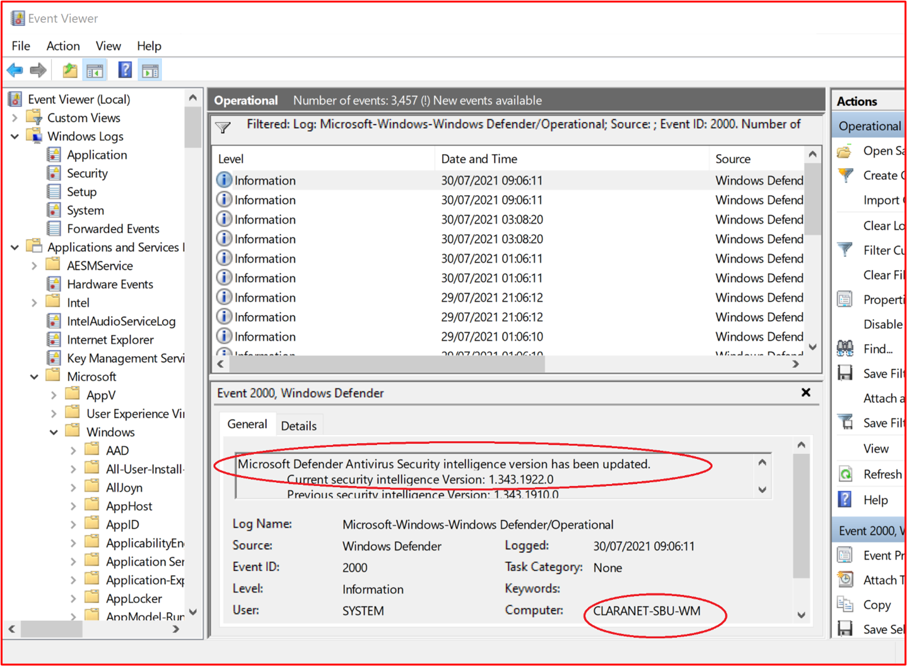
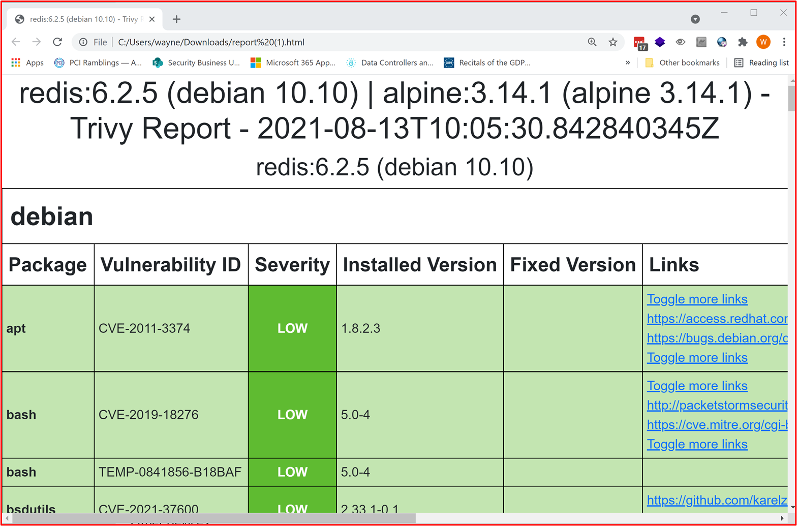
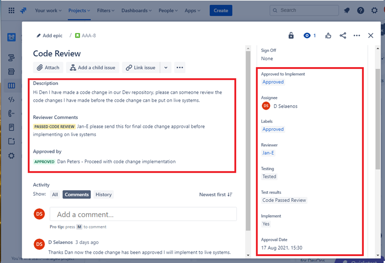
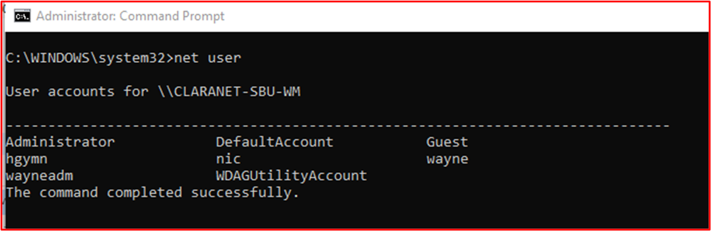
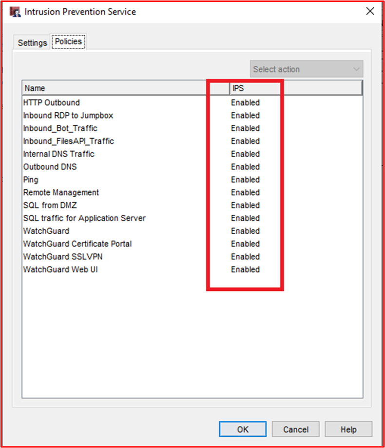
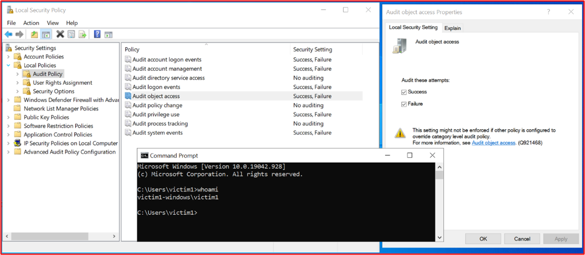
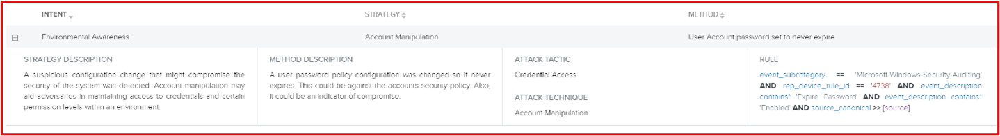
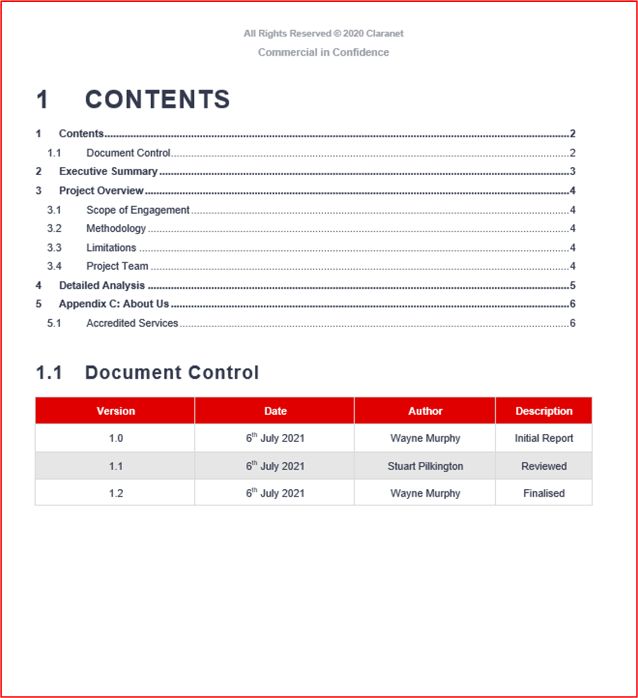
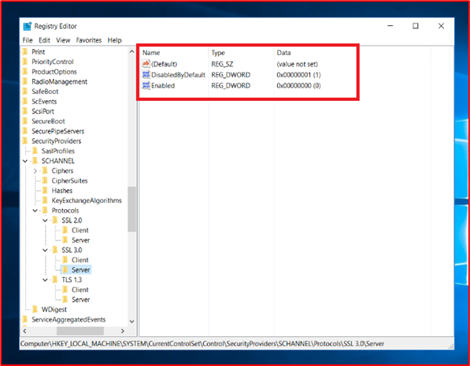
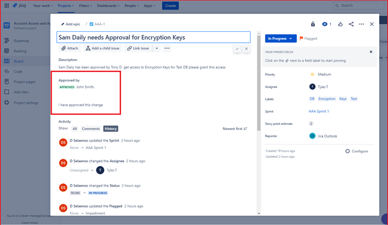

# Microsoft 365 인증 - 샘플 증거 가이드

## 개요

이 지침은 ISV에게 인증 컨트롤에 필요한 세부 수준에 대한 지원을 Microsoft 365 만들어졌습니다. 또한 증거 제출을 구성하는 방법에 대한 지침과 잠재적으로 인증 컨트롤을 충족하는 데 사용될 수 있는 증거 유형 예제를 제공합니다. 이 문서에서 공유되는 모든 예는 컨트롤이 충족될 것 같은 보장을 제공하는 데 사용할 수 있는 유일한 증거는 아니며 인증 분석가에게 이 어설션에 도움이 되는 필요한 증거를 제공하는 데 도움이 될 수 있는 정보 유형에 대한 지침으로만 사용할 수 있습니다. 참고: - 요구 사항을 충족하는 데 사용되는 실제 인터페이스, 스크린샷 및 설명서는 제품 사용, 시스템 설정 및 내부 프로세스에 따라 달라집니다. 또한 정책 또는 절차 설명서가 필요한 경우 ISV는 실제 문서를 보내고 일부 예제에 표시된 스크린샷이 아닌 실제 문서를 보내야 합니다. 증거 부족으로 인해 평가가 지연되는 것을 방지하기 위해 다음 지침을 따르는 것이 좋습니다. 

인증에는 제출이 필요한 두 가지 섹션이 있습니다.
1. [**초기 문서 제출:**](https://docs.microsoft.com/en-us/microsoft-365-app-certification/docs/initialdocumentsubguide) 평가의 규모를 정하는 데 필요한 작은 수준의 문서 집합입니다.
1. **증거 제출:** 인증 평가를 위해 범위 내 각 컨트롤에 필요한 전체 증거 집합입니다. 각 컨트롤에 대한 증거의 예는 다음과 같습니다.

## 구조 

이는 온라인 인증 제출 가이드에 제공된 범주와 Microsoft 365 상관 관계가 있습니다. 이 가이드는 이 지침의 각 예제를 참조하는 컨트롤이 오해를 피하기 위해 제공된 Microsoft 365 인증 검사 목록 스프레드시트와 함께 직접 사용하는 것이 가장 까다로우며, 이 문서에서 제공하는 지침은 다음과 같이 자세히 설명되어 있습니다.
- 보안 도메인: 모든 컨트롤이 그룹화되는 세 가지 보안 도메인인 응용 프로그램 보안, 운영 보안 및 데이터 보안 및 개인 정보 보호.
- 제어: = 평가 활동 설명 - 이러한 컨트롤 및 관련 번호(아니요)는 인증 검사 목록에서 Microsoft 365 않습니다.  
- 의도: = 보안 제어가 프로그램에 포함된 이유와 완화를 위한 특정 위험의 의도입니다.  이 정보가 ISV에 수집해야 하는 증거의 유형과 ISV가 증거 생성에 대해 인식하고 이해해야 하는 사항을 보다 잘 이해할 수 있도록 제어의 이유를 제공하게 될 것입니다.
- 예제 증거 지침: = Microsoft 365 인증 검사 목록 스프레드시트에서 증거 수집 작업을 안내하는 데 도움을 주어 ISV가 이를 사용하여 컨트롤이 현재 자리에 있으며 유지 관리되는지 확실하게 확인할 수 있는 인증 분석가가 사용할 수 있는 증거 유형의 예를 명확하게 확인할 수 있습니다. 이는 본질적으로 모든 것을 의미하지 않습니다.
- 증거 예제: = 이 섹션에서는 특히 운영 보안 및 데이터 보안 및 개인 정보 보안 도메인(스프레드시트 내의 탭)에 대한 Microsoft 365 인증 검사 목록 스프레드시트 내의 각 컨트롤에 대해 캡처된 잠재적인 증거의 예제 스크린샷 및 이미지를 제공합니다. 예제 내에 빨간색 화살표와 상자가 있는 정보는 제어를 충족하는 데 필요한 요구 사항을 보다 잘 이해하는 데 도움이 됩니다.

## 보안 도메인: 응용 프로그램 보안

**컨트롤 1 - 컨트롤 16**:

응용 프로그램 보안 도메인 컨트롤은 앱에 미해결 취약점이 없음을 보여 주며 지난 12개월 내에 실행된 침투 테스트 보고서에 만족할 수 있습니다. 유일한 필수 제출은 잘 아는 독립 회사가 정리한 보고서입니다. 

## 보안 도메인: 운영 보안/보안 개발

'운영 보안/ 보안 개발' 보안 도메인은 ISV가 위협 공격자로부터 직면한 다양한 위협에 대해 강력한 보안 완화 기술을 구현하도록 디자인되었습니다.  이는 보안 환경을 구축하기 위해 운영 환경 및 소프트웨어 개발 프로세스를 보호하도록 설계되었습니다.

#### 맬웨어 보호 - 바이러스 백신

**컨트롤 아니요 1:** 바이러스 백신 사례 및 절차를 관리 하는 정책 설명서를 제공합니다.
- 의도: 이 제어의 의도는 컴퓨터 바이러스의 위협을 고려할 때 ISV가 직면하는 문제를 이해하는지 평가하기 위한 것입니다. ISV는 바이러스 백신 정책 및 프로세스를 개발하는 데 업계 모범 사례를 설정하고 사용하여 맬웨어로 직면하는 위험을 완화하는 조직의 능력에 맞게 조정된 리소스를 제공하며, 바이러스 검색 및 제거에 대한 모범 사례를 나열하고, 문서화된 정책이 조직 및 해당 직원에게 제안된 보안 지침을 제공하는 증거를 제공합니다. ISV에서 맬웨어 방지 감소를 배포하는 방법의 정책 및 절차를 문서화하면 이 기술을 일관되게 롤아웃하고 유지 관리하여 환경에 맬웨어의 위험을 줄일 수 있습니다.

- 예제 증거 지침: 바이러스 백신/맬웨어 모범 사례를 홍보하기 위해 인프라 내에서 구현된 프로세스 및 절차를 자세히 설명하는 바이러스 백신/맬웨어 방지 정책의 복사본을 제공합니다.
예제 증거

- 예제 증거:

**참고:** 이 스크린샷은 정책/프로세스 문서를 보여 주며 ISV가 단순히 스크린샷을 제공하는 것이 아니라 실제 지원 정책/절차 설명서를 공유하는 것입니다.

**컨트롤 아니요. 2:** 바이러스 백신 소프트웨어가 샘플링된 모든 시스템 구성 요소에서 실행되고 있는 데모 증거를 제공합니다.

- 의도: AV(바이러스 백신)(또는 맬웨어 방지 방어)를 사용자 환경에서 실행하여 정체성 및 숫자 모두에서 잠재적으로 손상될 수 있는 공격이 증가하고 있는 것으로 인식하거나 인식하지 않을 수 있는 사이버 보안 위험을 방지하는 것이 중요합니다. AV를 해당 사용을 지원하는 모든 시스템 구성 요소에 AV를 배포하면 환경에 맬웨어 방지가 도입될 위험을 일부 완화하는 데 도움이 됩니다. 위협 요소에 대한 공격 벡터를 제공하여 환경으로 발판을 얻기 위해 보호되지 않는 단일 끝점만 사용하게 됩니다. 따라서 AV는 이러한 유형의 위협으로부터 보호하기 위한 여러 방어 계층 중 하나로 사용되어야 합니다.

- 예제 증거 지침: AV의 활성 인스턴스가 평가된 환경에서 실행되고 있는 것을 증명하기 위한 것입니다. 실행 중인  바이러스 백신 프로세스, 바이러스 백신 소프트웨어가 활성화된 경우 또는 바이러스 백신에 대한 중앙 집중식 관리 콘솔이 있는 경우 해당 관리 콘솔에서 이를 시연할 수 있는 바이러스 백신 프로세스를 보여줄 수 있는 샘플의 모든 장치에 대한 스크린샷을 제공합니다. 관리 콘솔을 사용하는 경우 샘플링된 장치가 연결되고 작동하고 있는 스크린샷의 증거를 확인합니다.

- 증거 예제 1: 아래 스크린샷은 Azure 보안 센터에서 생성됩니다. 맬웨어 방지 확장이 &quot; MSPGPRODAZUR01이라는 VM에 배포된 것으로 나타났습니다. &quot;

- 증거 예제 2

아래 스크린샷은 Windows 10 호스트 이름 &quot; &quot; &quot; CLARANET-SBU-WM에 대한 실시간 보호가 켜진 것으로 표시되어 &quot; 있습니다.

**컨트롤 아니요. 3:** 바이러스 백신 서명이 모든 환경 전체에서 최신(1일 이내)에 걸쳐 최신임에 대한 악의적인 증거를 제공합니다.

- 의도: 매일 수백만 개의 새로운 맬웨어 및 PUA(사용자들이 원치 않는 응용 프로그램)를 식별합니다. 새로 릴리스된 맬웨어에 대해 적절한 보호를 제공하려면 새로 릴리스된 맬웨어를 고려하여 AV 서명을 정기적으로 업데이트해야 합니다.

- 이 컨트롤은 ISV가 환경의 보안과, 기한이 지난 AV가 보안에 대한 영향을 고려할 수 있도록 합니다.

- 예제 증거 지침: 샘플링된 각 장치에서 바이러스 백신 로그 파일을 제공하고 업데이트가 매일 적용되고 있습니다.

- 예제 증거: 다음 스크린샷은 업데이트인 &#39;Event 2000, Windows Defender&#39; 표시하여 매일 Microsoft Defender를 업데이트하는 모습을 보여줍니다. 호스트 이름을 표시하여 범위 내 시스템 &quot; CLARANET-SBU-WM에서 이 이름을 &quot; 사용했습니다.

**참고:** 제공된 증거에는 더 많은 기간에 대한 일별 업데이트를 표시하기 위해 로그 내보내기가 포함되어야 합니다. 일부 바이러스 백신 제품은 업데이트 로그 파일을 생성하여 이러한 파일을 제공하거나 이벤트 뷰어에서 로그를 내보내야 합니다.

**컨트롤 아니요. 4:** 샘플링된 모든 시스템 구성 요소에서 액세스 검사 또는 주기적 스캔을 수행하도록 바이러스 백신이 구성되어 있는 악의적인 증거를 제공합니다.

**참고:** 액세스 시 검색을 사용하도록 설정하지 않은 경우 최소 일일 검사  및 alerting_ 사용 _be 합니다.

- 의도: 이 제어의 의도는 맬웨어를 빠르게 식별하여 환경에 미치는 영향을 최소화하기 위한 것입니다. 액세스 검사가 수행되고 맬웨어를 자동으로 차단하는 경우 바이러스 백신 소프트웨어에서 알려진 맬웨어 감염을 중지하는 데 도움이 됩니다. 액세스 시 검사가&#39;가음성으로 인해 서비스가 정전될 수 있는 위험으로 인해 바람직하지 않은 경우, 매일(또는 이상) 적절한 검사 및 경고 메커니즘을 구현하여 맬웨어 감염에 대한 적시 대응을 보장하여 손상을 최소화해야 합니다.

- 예제 증거 지침: 바이러스  백신을 지원하는 샘플의 모든 디바이스에 대한 스크린샷을 제공하고, 장치에서 바이러스 백신이 실행되고 있으며, 액세스(실시간 검색) 검사에 대해 구성되어 있는지를 보여 주거나,  일상적인 검사에 대해 주기적  검사가 사용하도록 설정되어 있는지, 경고가 구성되고, 샘플의 모든 장치에 대한 마지막 검사 날짜를 보여 주도록 스크린샷을 제공합니다.

- 예제 증거: 다음 스크린샷은 &quot; 호스트 CLARANET-SBU-WM에 대해 실시간 보호가 사용하도록 설정되어 있는 경우를 &quot; 보여줍니다.

**컨트롤 아니요. 5:** 바이러스 백신이 샘플링된 모든 시스템 구성 요소에서 자동으로 맬웨어를 차단하거나, 맬웨어를 차단하고, 경고를 차단하고 경고하도록 구성되어 있는 악의적인 증거를 제공합니다.

- 의도: 맬웨어의 정체성은 맬웨어가 가져올 수 있는 다양한 변화량과 함께 모든 시간을 진화하고 있습니다. 이 컨트롤의 의도는 맬웨어 실행을 중지하여 잠재적으로 치명적인 페이로드 실행을 중지하거나 자동 차단이 옵션이 아닌 경우 잠재적인 맬웨어 감염에 대해 경고하고 즉시 대응하여 맬웨어가 중단될 수 있는 시간을 제한하는 것입니다.

- 예제 증거 지침: 바이러스  백신을 지원하는 샘플의 모든 디바이스에 대한 스크린샷을 제공합니다. 이 스크린샷은 바이러스 백신이 장치에서 실행되고 있으며 맬웨어, 경고 또는 맬웨어를 자동으로 차단하거나, 검사 및 경고를 받도록 구성되어 있는지를 보여 주도록 합니다.

- 예제 증거 1: 다음 스크린샷은 호스트 &quot; CLARANET-SBU-WM이 호스트에 대한 실시간 보호를 &quot; Microsoft Defender 바이러스 백신. 설정에서 설명하는 것 처럼 이 설정은 맬웨어가 디바이스에 설치 또는 실행되지 못하도록 찾아서 중지합니다.

**컨트롤 No.6:** 배포하기 전에 응용 프로그램이 승인된 악의적인 증거를 제공합니다.

- 의도: 응용 프로그램 제어를 사용하여 조직은 운영 체제에서 실행이 허용된 각 응용 프로그램/프로세스를 승인합니다. 이 컨트롤의 의도는 실행할 수 있는 응용 프로그램/프로세스를 승인하기 위한 승인 프로세스가 적용되도록 하는 것입니다.

- 예제 증거 지침: 승인 프로세스가 진행되고 있는 것을 보여주는 증거가 제공될 수 있습니다. 서명된 문서, 변경 제어 시스템 내에서 추적 또는 이러한 요청 및 권한 부여를 추적하기 위해 Azure DevOps 또는 JIRA와 같은 방법을 통해 제공될 수 있습니다.

- 예제 증거: 다음 스크린샷은 각 응용 프로그램이 환경 내에서 실행될 수 있도록 허용된 관리의 승인을 보여 줍니다. 이 프로세스는 Contoso의 용지 기반 프로세스지만 다른 메커니즘을 사용할 수 있습니다.

**컨트롤 No.7:** 비즈니스 근거가 있는 승인된 응용 프로그램의 전체 목록이 존재하고 유지 관리되는 악의적인 증거를 제공합니다.

- 의도: 조직은 응용 프로그램/프로세스가 승인된 이유에 대한 정보와 함께 승인된 모든 응용 프로그램 목록을 유지 관리해야 합니다. 이렇게 하면 구성이 최신으로 유지되도록 보장하고 기준에 따라 검토하여 권한이 없는 응용 프로그램/프로세스가 구성되지 않도록 할 수 있습니다.

- 예제 증거 지침: 비즈니스 사정과 함께 문서화된 승인된 응용 프로그램/프로세스 목록을 제공합니다.

- 예제 증거: 다음 스크린샷에는 업무 정당성과 함께 승인된 응용 프로그램이 나열됩니다.

**참고:** 이 스크린샷은 문서를 보여 주며 ISV가 단순히 스크린샷을 제공하는 것이 아니라 실제 지원 문서를 공유하는 것입니다.

**컨트롤 No.8:** 응용 프로그램 제어 소프트웨어가 특정 응용 프로그램 제어 메커니즘을 충족하도록 구성되어 있는지 자세히 설명하는 지원 설명서를 제공합니다.

- 의도: 응용 프로그램 제어 기술의 구성을 기술 유지 관리 방법(예: 응용 프로그램/프로세스 추가 및 삭제)과 함께 문서화해야 합니다. 이 설명서의 일부로 사용되는 메커니즘의 유형은 각 응용 프로그램/프로세스에 대해 자세히 설명해야 합니다. 그러면 기술이 문서화에 따라 구성되도록 다음 컨트롤에 공급됩니다.

- 예제 증거 지침: 응용 프로그램 제어가 설정된 방식과 각 응용 프로그램/프로세스가 기술 내에서 구성된 방법을 자세히 설명하는 지원 설명서를 제공합니다.

- 예제 증거: 다음 스크린샷에는 응용 프로그램 컨트롤을 구현하는 데 사용되는 컨트롤 메커니즘이 나와 있습니다. 아래에서 1개 앱이 인증서 컨트롤을 사용하고 다른 앱은 파일 경로를 사용 중입니다.

**참고:** 이 스크린샷은 문서를 보여 주며 ISV가 단순히 스크린샷을 제공하는 것이 아니라 실제 지원 문서를 공유하는 것입니다.

**컨트롤 아니요. 9:** 응용 프로그램 제어가 모든 샘플링된 시스템 구성 요소에서 문서화한 것으로 구성되는 악의적인 증거를 제공합니다.

- 의도: 이 문서의 의도는 설명서에 따라 샘플 전체에서 응용 프로그램 제어가 구성되어 있는지 유효성을 검사하기 위한 것입니다.

- 예제 증거 지침: 샘플의  모든 디바이스에 대한 스크린샷을 제공하여 응용 프로그램 컨트롤이 구성되고 활성화되어 있는지 확인합니다. 여기에는 컴퓨터 이름, 컴퓨터 이름이 속한 그룹 및 해당 그룹 및 컴퓨터의 응용 프로그램 제어 정책이 표시될 것입니다.

- 증거 예제: 다음 스크린샷은 소프트웨어 제한 정책이 사용하도록 설정된 그룹 정책 개체를 보여줍니다.

다음 스크린샷은 위의 컨트롤과 함께 구성을 보여줍니다.

다음 스크린샷은 M365 환경 및 이 GPO 개체 또는 도메인 컴퓨터 컴퓨터에 적용되는 범위에 &#39;컴퓨터를 설정&#39;.

이 마지막 스크린샷은 위의 스크린샷 내에서 범위 내 서버 &quot; DBServer1이 &quot; OU 내에 있는 것을 보여줍니다.

### 패치 관리 - 위험 순위

보안 취약점을 신속하게 식별하고 수정하면 환경이나 응용 프로그램에 영향을 미치는 위협 요소의 위험을 최소화하는 데 도움이 됩니다. 패치 관리는 위험 순위와 패치의 두 섹션으로 분할됩니다. 이러한 세 가지 컨트롤은 보안 취약성을 식별하고 보안 취약성의 위험에 따라 순위를 정합니다.

이 보안 제어 그룹은 응용 프로그램/추가 기능 타사 소프트웨어 라이브러리 및 코드 베이스가 위험 순위에 따라 패치되어야 하기 때문에 PaaS(Platform-as-a-Service) 호스팅 환경에 적용됩니다.

**컨트롤 아니요. 10:** 새 보안 취약성을 식별하고 위험 점수를 할당하는 방법을 관리하는 정책 설명서를 제공합니다.

- 의도: 이 제어의 의도는 보안 취약성을 빠르게 식별하여 위협 공격자들이 이러한 취약점을 악용해야 하는 기회를 줄이기 위해 문서를 지원하기 위한 것입니다. 조직에서 사용하는 모든 시스템 구성 요소를 다루는 취약점을 식별하기 위해 강력한 메커니즘을 구축해야 합니다. 예를 들어 운영 체제(Windows Server, Ubuntu 등), 응용 프로그램(Tomcat, MS Exchange,아이프라이즈Winds 등), 코드 종속성(AngularJS, jQuery 등)을 예로 들 수 있습니다. 조직은 자산 내에서 취약점을 시기 적절한 시기에 식별할 뿐만 아니라 취약점이 있는 위험에 따라 적절한 기간 내에 수정이 수행되도록 그에 따라 모든 취약성의 순위를 매기야 합니다.

**참고** 전적으로 플랫폼 as a Service 환경에서 실행 중인 경우에도 코드 기반 내에서 취약성을 식별할 책임이 있습니다( 예: 타사 라이브러리).

- 예제 증거 지침: 지원 설명서 제공(스크린샷 아미트)

- 증거 예: 이 스크린샷은 위험 순위 정책의 스니킷을 보여줍니다.

**참고:** 이 스크린샷은 정책/프로세스 문서를 보여 주며 ISV가 단순히 정책을 제공하는 것이 아니라 실제 지원 정책/절차 설명서를 공유해야 screenshot._

**컨트롤 아니요. 11:** 새로운 보안 취약점이 식별되는 방식에 대한 증거를 제공합니다.

- 의도: 이 제어의 의도는 프로세스가 진행되고 있으며 환경 전체에서&#39;보안 취약점을 식별할 수 있을 만큼 강력해지기 위한 것입니다. 이는 운영 체제일 뿐만이 아니어도 됩니다. 여기에는 환경 내에서 실행되는 응용 프로그램과 모든 코드 종속성이 포함되어 있을 수 있습니다.

- 예제 증거 지침: 메일링 목록에 구독을 표시하고, 새로 릴리스된 취약성에 대한 보안 원본을 수동으로 검토하여 증거를 제공(예: JIRA 또는 Azure DevOps 사용) 최신 소프트웨어를 찾는 도구(예: 최신 소프트웨어 라이브러리를 찾을 때 Snyk일 수 있습니다.)  또는 최신 소프트웨어를 식별하는 인증된 검색을 사용하는 Nessus일 수 있습니다.

**참고** Nessus를 사용하는 경우 취약성을 신속하게 식별하기 위해 정기적으로 실행해야 합니다. 적어도 매주 권장됩니다.

- 증거 예: 이 스크린샷은 메일 그룹이 보안 취약점에 대한 알림을 받기 위해 사용 중이기 때문에 이를 보여줄 수 있습니다.

**컨트롤 아니요. 12:** 모든 취약점이 식별되면 위험 순위가 할당되었다는 증거를 제공합니다.

- 의도: 패치는 위험, 취약성, 더 빨리 수정해야 하는 위험에 기반해야 합니다. 식별된 취약점의 위험 순위는 이 프로세스의 중요한 부분입니다. 이 제어의 의도는 식별된 모든 취약점이 위험에 따라 적절한 순위를 정할 수 있도록 문서화된 위험 순위 프로세스가 진행되도록 하는 것입니다. 조직은 일반적으로 공급업체 또는 보안 연구원이 제공하는 CVSS(Common Vulnerability Scoring System) 등급을 활용합니다. 조직에서 CVSS를 사용할 경우 조직이 내부 위험 평가에 따라 순위를 변경할 수 있도록 프로세스 내에 다시 순위 메커니즘을 포함하도록 하는 것이 좋습니다. 응용 프로그램이 환경 내에 배포된 방식 때문에 취약성은 응용 프로그램이 아닌 경우도 있습니다. 예를 들어 Java 취약성은 조직에서 사용되지 않는 특정 라이브러리에 영향을 미치는 릴리스될 수 있습니다.

- 예제 증거 지침: 스크린샷 또는 기타 수단(예: DevOps/Jira)을 통해 증거를 제공합니다. 이는 취약점이 위험 순위 프로세스를 거치고 조직에 적절한 위험 순위가 할당되고 있는 것을 보여 주며,

- 증거 예: 이 스크린샷은 조직이 위험 평가를 수행하고 위험을 다운그레이드할 수 있는지 판단할 경우 D 열에서 발생하는 위험 순위를 보여 주며 F 및 G 열에서 다시 순위를 정합니다. 위험 평가의 다시 순위를 정하는 증거를 지원 증거로 제공해야 합니다.

### 패치 관리 - 패치

아래 컨트롤은 패치 관리에 대한 패치 요소용입니다. 보안 운영 환경을 유지하려면 응용 프로그램/추가 기능 및 지원 시스템을 적합한 패치가 적용되어야 합니다. 식별(또는 공개 릴리스) 및 패치 간의 적절한 기간을 관리하여 위협 공격자에 의해 취약성을 악용할 기회를 줄여야 합니다. Microsoft 365 인증은 &#39;패치 창을&#39;, 그러나 인증 분석가가 합리적이지 않은 기간을 거부합니다.

이 보안 제어 그룹은 응용 프로그램/추가 기능 타사 소프트웨어 라이브러리 및 코드 베이스가 위험 순위에 따라 패치되어야 하기 때문에 PaaS(Platform-as-a-Service) 호스팅 환경에 적용됩니다.

**컨트롤 아니요. 13:** 위험, 높음 및 중간 위험 취약성에 적합한 최소 패치 기간을 포함하는 범위 내 시스템 구성 요소의 패치에 대한 정책 설명서를 제공합니다. 지원되지 않는 운영 체제 및 소프트웨어의 해제

- 의도: 패치 관리는 많은 보안 준수 프레임워크(예: PCI-DSS, ISO 27001, NIST(SP) 800-53)에 필요합니다. 좋은 패치 관리의 중요성은 소프트웨어, 펌웨어의 보안 및 기능 문제를 해결하고 취약점을 완화하여 악용 기회를 줄이기 때문에 과도하게 강조될 수 없습니다. 이 제어의 의도는 위협 공격이 범위 내 환경에 존재할 수 있는 취약점을 악용해야 할 기회를 최소화하기 위한 것입니다.

- 예제 증거 지침: 패치 관리 프로세스를 자세히 설명하는 모든 정책 및 절차의 복사본을 제공합니다. 여기에는 최소 패치 창의 섹션이 포함되어야 하며, 지원되지 않는 운영 체제 및 소프트웨어를 환경 내에서 사용하면 안 됩니다.

- 예제 증거: 다음은 정책 문서의 예입니다.

**참고:** 이 스크린샷은 정책/프로세스 문서를 보여 주며 ISV가 단순히 정책을 제공하는 것이 아니라 실제 지원 정책/절차 설명서를 공유해야 screenshot._

**컨트롤 아니요. 14:** 샘플링된 모든 시스템 구성 요소가 패치되고 있는 악의적인 증거를 제공합니다.

**참고:** 소프트웨어/타사 라이브러리를 포함합니다.

- 의도: 취약점을 패치하면 정보 기술 인프라(하드웨어, 소프트웨어 및 서비스)의 일부를 구성하는 서로 다른 모듈이 최신으로 유지될 수 있으며 알려진 취약점으로부터 보호됩니다. 취약점 세부 정보 릴리스와 패치 간의 보안 인시던트 가능성을 최소화하기 위해 최대한 빨리 패치를 수행해야 합니다. 이는 취약성의 악용이 와일드에 있는 것으로 알려진 경우 더욱 중요합니다.

- 예제 증거 지침: 문서화한 패치 프로세스에 따라 패치가 설치되는지 보여주는 샘플 및 지원 소프트웨어 구성 요소의 모든 디바이스에 대한 스크린샷을 제공합니다. 

- 예제 증거: 다음 스크린샷은 범위 내 시스템 구성 요소 &quot; CLARANET-SBU-WM이 패치 정책에 따라 Windows 업데이트를 수행하고 있는 &quot; 경우를 보여줍니다.

**참고:** 모든 범위 내 시스템 구성 요소의 패치는 증거가 될 수 있습니다. 여기에는 다음과 같은 것이 포함됩니다. OS 업데이트, 응용 프로그램/구성 요소 업데이트(i.e__.,_ _Apache Tomcat, OpenSSL 등), 소프트웨어 종속성(예: JQuery, AngularJS_ 등)

**컨트롤 아니요. 15:** 지원되지 않는 운영 체제 및 소프트웨어 구성 요소가 환경 내에서 사용되지 않는 악의적인 증거를 제공합니다.

- 의도: 공급업체에서 유지 관리하지 않는 소프트웨어는 해결되지 않은 알려진 취약성으로 과부하를 겪게 됩니다. 따라서 프로덕션 환경에서는 지원되지 않는 운영 체제 및 소프트웨어 구성 요소를 사용하면 안 됩니다.

- 예제 증거 지침: 실행  중인 OS 버전을 보여주는 샘플의 모든 디바이스에 대한 스크린샷을 제공합니다(스크린샷에 서버 이름 포함&#39;포함). 이 외에도 환경 내에서 실행되는 소프트웨어 구성 요소가 지원되는 버전을 실행하고 있는 증거를 제공합니다. 이 작업을 수행하기 위해 내부 취약성 검사 보고서의 출력(인증된 검색 제공 포함) 및/또는 [Snyk,](https://snyk.io/) [Trivy](https://github.com/aquasecurity/trivy) 또는 [NPM 감사와](https://docs.npmjs.com/cli/v7/commands/npm-audit)같은 타사 라이브러리를 검사하는 도구의 출력을 제공하면 됩니다. PaaS에서만 실행되는 경우 타사 라이브러리 패치만 패치 제어 그룹에서 적용해야 합니다.

- 예제 증거: 다음 증거는 범위 내 시스템 구성 요소 THOR이 Nessus에서 문제가 플래그가 지정되지 않은 경우 공급업체에서 지원하는 소프트웨어를&#39;보여줍니다.

**참고:** 전체 보고서는 인증 분석가와 공유해야 합니다.

- 예제 증거 2

이 스크린샷은 범위 내 시스템 구성 요소 &quot; CLARANET-SBU-WM이 지원되는 버전에서 Windows &quot; 보여줍니다.

- 예제 증거 3

다음 스크린샷은 전체 보고서에서 지원되지 않는 응용&#39;목록을 표시하지 않는 [Trivy](https://github.com/aquasecurity/trivy) 출력의 스크린샷입니다.

**참고:** 전체 보고서는 인증 분석가와 공유해야 합니다.

### 취약점 검색

정기적인 취약점 평가를 도입하여 조직은 환경 내의 약점과 안전하지 않은 문제를 감지하여 악의적인 공격자에 의해 환경을 손상시킬 수 있는 진입점을 제공할 수 있습니다. 취약점 검색은 환경 내에서 누락된 패치 또는 잘못된 구성을 식별하는 데 도움이 될 수 있습니다. 조직은 이러한 검색을 정기적으로 수행하여 이러한 취약점 검사 도구에서 일반적으로 선택되는 문제로 인해 손상 위험을 최소화하기 위해 적절한 수정을 제공할 수 있습니다.

**제어 아니요. 16:** 분기별 인프라 및 웹 응용 프로그램 취약성 검사 보고서를 제공합니다. 전체 공용 공간(IP 주소 및 URL) 및 내부 IP 범위에 대해 검색을 수행해야 합니다.

**참고:** 여기에는 **환경의** 전체 범위가 포함되어야 합니다.

- 의도: 취약점 검사는 조직 컴퓨터 시스템, 네트워크 및 웹 응용 프로그램에서 가능한 취약점을 찾아 보안 침해 및 중요한 데이터의 노출로 이어질 수 있는 구멍을 식별합니다. 취약성 검사는 PCI DSS(Payment Card Industry Data Security Standard)과 같은 산업 표준 및 정부 규정에 필요한 경우가 많습니다.

- PCI DS &#39;S 규정 준수에 대한 &quot; [2020](https://info.securitymetrics.com/pci-guide-2020) 보안 메트릭 가이드의 보고서는 조직에서 공격자가 시스템을 손상시킬 취약한 것으로 확인된 시간으로부터 평균 166일이 걸렸다고 설명하고 &quot; 있습니다. 손상된 후 공격자는 평균 127일 동안&#39; 액세스할 수 있으므로 이 제어는 범위 내 환경 내에서 잠재적인 보안 약점을 식별하기 위한 것입니다.

- 예제 증거 지침: 지난 12개월 동안 수행된 취약점&#39;검사에 대한 전체 검사 보고서를 제공합니다. 보고서는 전체 공용 공간과 해당하는 경우 각 내부 서브넷이 포함되어 있는지 확인할 대상을 명확하게 설명해야 합니다. 모든 **분기에** 대한 **모든 검사 보고서를** 제공 합니다.

- 증거 예제: 예제 증거는 사용 중이 되는 검사 도구에서 검색 보고서를 제공 하는 것입니다. 각 분기&#39;검토를 위해 검색 보고서를 제공해야 합니다. 검사에는 전체 환경 시스템 구성 요소가 포함되어야 합니다. 환경에 사용할 수 있는 모든 내부 서브넷 및 모든 공용 IP 주소/URL

**컨트롤 아니요. 17:** 취약점 검사 중에 식별된 취약점의 수정이 문서 패치 기간에 따라 패치되는 악의적인 증거를 제공합니다.

- 의도: 취약성 및 잘못 구성을 빠르게 식별, 관리 및 수정하지 못하면 조직이&#39;위반으로 이어지는 손상의 위험을 증가시킬 수 있습니다. 문제를 올바르게 식별하고 수정하는 것은 다양한 보안 프레임워크의 모범 사례에&#39;전반적인 보안 환경 및 환경에 대한 조직에서 중요한 것으로 볼 수 있습니다. 예: ISO 27001 및 PCI DSS

- 예제 증거 지침: 위의 제어 13에 이미 제공된 패치 창과 함께 취약점 검사에서 발견된 취약점 샘플이 수정된 것을 보여 주며 적절한 아티팩트(즉, 스크린샷)를 제공합니다.

- 예제 증거: 다음 스크린샷은 2021년 8월 2일의 취약점을 보여 주며 범위 내 환경(이 &quot; 예에서는 단일 컴퓨터인 THOR)의 &quot; Nessus 스캔을 보여 줍니다.

다음 스크린샷은 패치 정책 내에 정의된 패치 창 내에 있는 2일 후에 문제가 해결된 것으로 표시되어 있습니다.

**참고:** 이 제어를 위해 인증 분석가는 지난 12개월 동안의 각 분기에 대한 취약점 검사 보고서 및 수정을 확인해야 합니다.

### 방화벽

방화벽은 종종 신뢰할 수 있는(내부 네트워크), 신뢰할 수 없는(인터넷) 및 DMZ(반 신뢰할 수 있는) 환경 간의 보안 경계를 제공합니다. 이러한 보안 전략은 일반적으로 조직에서 심층 방어 보안 전략으로, 서비스 유입 및 유입을 위한 트래픽 흐름을 제어하고 원치 않는 트래픽을 차단하도록 설계된 첫 번째 방어선입니다. 이러한 장치는 효과적으로 작동하고 환경을 위험에 노출할 수 있는 구성이 잘못되지 않도록 세밀하게 제어해야 합니다.

**컨트롤 아니요. 18:** 방화벽 관리 사례 및 절차를 관리하는 정책 설명서를 제공합니다.

- 의도: 방화벽은 계층적 보안(심층 방어) 전략에서 중요한 첫 번째 방어선으로, 신뢰할 수 있는 네트워크 영역으로부터 환경을 보호합니다. 방화벽은 일반적으로 IP 주소 및 프로토콜/포트를 기반으로 트래픽 흐름을 제어하며, 더 많은 기능이 풍부한 방화벽은 액세스하는 응용 프로그램을 기반으로 오용, 취약성 및 위협을 보호하기 위해 응용 프로그램 트래픽을 검사하여 추가 응용 프로그램 계층 방어를 제공할 수 &quot; &quot; 있습니다. 이러한 보호는 방화벽 구성만큼만 양호하므로 내부 자산의 적절한 보호를 제공하도록 구성되도록 강력한 방화벽 정책 및 지원 절차를 설정해야 합니다. 예를 들어 모든 원본에서 모든 대상으로의 모든 트래픽을 허용하는 규칙이 있는 방화벽은 라우터 역할을 합니다.

- 예제 증거 지침: 설명서를 지원하는 전체 방화벽 정책/절차를 제공합니다. 이 문서에서는 아래 모든 점과 해당 환경에 적용할 수 있는 추가 모범 사례에 대해 설명합니다.

- 증거 예: 다음은 필요한 방화벽 정책 문서 유형의 예입니다(데모인 경우 완료되지 않을 수 있습니다).

**컨트롤 아니요. 19:** 프로덕션 환경에 설치하기 전에 기본 관리 자격 증명이 변경된 데모 증거를 제공합니다.

- 의도: 조직은 장치 또는 소프트웨어를 구성하는 동안 구성된 기본 관리 자격 증명을 제공한 공급업체에 유의해야 합니다. 기본 자격 증명은 공급업체에서 공개적으로 사용할 수 있으며 외부 위협 공격자에게 환경을 손상시킬 수 있는 기회를 제공할 수 있습니다. 예를 들어 인터넷에서 기본 iDrac(통합 Dell 원격 액세스 컨트롤러) 자격 증명을 간단하게 검색하면 _root::calvin이_ 기본 사용자 이름 및 암호로 강조 표시됩니다. 이렇게 하면 원격 서버 관리에 원격으로 액세스할 수 있습니다. 이 제어의 의도는 환경이 장치/응용 프로그램 보안 동안 변경되지 않은 기본 공급업체 자격 증명을 통해 공격을 받아들이지 않도록 하는 것입니다.

- 예제 증거 지침

- 이는 인증 분석가가 기본 자격 증명을 사용하여 범위 내 장치에 인증을 시도할 수 있는 화면 공유 세션을 통해 증명될 수 있습니다.

- 예제 증거

아래 스크린샷은 WatchGuard 방화벽의 잘못된 사용자 이름/암호에서 인증 분석가가 볼 수 있는 것을 보여줍니다.

**컨트롤 아니요. 20:** 경계 네트워크(DMZ, 비무장 영역 및 차단된 서브넷) 및 내부 트러스트된 네트워크 사이에 방화벽이 설치되는 데모 증거를 제공합니다.

- 의도: 방화벽은 서로 다른 보안 수준의 서로 다른 네트워크 영역 간의 트래픽을 제어하는 기능을 제공합니다. 모든 환경이 인터넷에 연결되어 있는 것이기 때문에 방화벽을 경계(예: 인터넷과 범위 내 환경 사이에)에 설치해야 합니다. 또한 신뢰할 수 있는 DMZ(De-Militarized Zone) 네트워크와 내부 신뢰할 수 있는 네트워크 사이에 방화벽을 설치해야 합니다. DMZ는 일반적으로 인터넷에서 트래픽을 서비스하는 데 사용 하므로 공격의 대상입니다. DMZ를 구현하고 방화벽을 사용하여 트래픽 흐름을 제어하면 DMZ의 손상이&#39;신뢰할 수 있는 내부 네트워크와 회사/고객 데이터가 손상될 필요는 없습니다. 조직에서 손상을 빠르게 식별하여 위협 공격자에 대한 내부 신뢰할 수 있는 네트워크 손상 기회를 최소화할 수 있도록 적절한 로깅 및 경고를 설정해야 합니다. 이 컨트롤의 의도는 신뢰할 수 있는 네트워크와 신뢰가 낮은 네트워크 간에 적절한 제어를 보장하기 위한 것입니다.

- 증거 지침 예: 방화벽 구성 파일 또는 DMZ가 적용되어 있는 것을 입증하는 스크린샷을 통해 증거를 제공해야 합니다. 이 다이어그램은 환경을 지원하는 여러 네트워크를 표시하는 제공된 아키텍처 다이어그램과 일치해야 합니다. 초기 문서 제출의 일부로 이미 제공된 네트워크 다이어그램과 함께 방화벽의 네트워크 인터페이스 스크린샷은 이 증거를 제공해야 합니다.

- 증거 예: 아래는 두 개의 DMZ를 시연하는 WatchGuard 방화벽의 스크린샷입니다. 하나는 인바운드 서비스(DMZ)를 위한 것이고 다른 하나는 jumpbox(Bastian Host)를 서비스합니다.

**제어 아니요. 21:** 모든 공용 액세스가 DMZ(비무장 영역)에서 종료된다고 입증할 수 있는 증거를 제공합니다.

- 의도: 공개적으로 액세스할 수 있는 리소스는 많은 공격에 액세스할 수 있습니다. 앞서 설명한 바와 같은 DMZ의 의도는 신뢰할 수 없는 네트워크를 중요한 데이터가 포함될 수 있는 신뢰할 수 있는 내부 네트워크에서 구분하기 위한 것입니다. 외부 위협 공격자에 의해 공개적으로 액세스할 수 있는 호스트의 위험이 매우 많기 때문에 DMZ는 신뢰가 낮아진 것으로 생각됩니다. 공용 액세스는 내부 리소스 및 데이터를 보호하기 위해 방화벽으로 적절히 분할된 신뢰할 수 있는 네트워크에서 항상 종료해야 합니다. 이 제어의 의도는 신뢰할 수 있는 내부 네트워크의 리소스가 공개적으로 노출된 경우처럼 신뢰할 수 없는 DMZ 내에서 모든 공용 액세스가 종료되도록 하는 데 있습니다. 이러한 리소스가 손상되면 위협 공격자에게 중요한 데이터가 저장되는 네트워크의 발판이 됩니다.

- 예제 증거 지침

- 이를 위한 증거는 인바운드 규칙을 표시하는 방화벽 구성과 이러한 규칙이 종료되는 위치(공용 IP 주소를 리소스로 라우팅하거나 인바운드 트래픽의 NAT(Network Address Translation))를 제공하여 종료하는 방화벽 구성일 수 있습니다.

- 예제 증거

아래 스크린샷에는 각각 DMZ 서브넷인 10.0.3.x 및 10.0.4.x 서브넷에 NAT를 표시하는 세 개의 들어오는 규칙이 있습니다.

**컨트롤 아니요. 22:** 방화벽을 통해 허용되는 모든 트래픽이 승인 프로세스를 통과하는 데 입증할 수 있는 증거를 제공합니다.

- 의도: 방화벽은 신뢰할 수 없는 트래픽과 내부 리소스 사이의 방어 장벽이기 때문에 서로 다른 신뢰 수준의 네트워크 간에 방화벽을 안전하게 구성하고 비즈니스 작업에 필요한 트래픽만 사용하도록 설정해야 합니다. 불필요한 트래픽 흐름 또는 과도하게 허용된 트래픽 흐름을 허용하면 이러한 다양한 네트워크 영역 경계에서 방어에 약점이 될 수 있습니다. 모든 방화벽 변경에 대한 강력한 승인 프로세스를 설정하면 환경에 심각한 위험을 도입하는 규칙이 도입될 위험이 줄어듭니다. Verizon&#39;[2020](https://enterprise.verizon.com/en-gb/resources/reports/dbir/) 데이터 위반 조사 보고서에서는 오류&#39;(구성 잘못 포함)가 연도에서 지속적으로 증가하는 유일한 작업 &quot; &quot; 유형입니다.

- 예제 증거 지침: 증거는 권한이 부여되는 방화벽 변경 요청을 보여 주며, CAB(변경 어드바이저 보드) 모임 또는 모든 변경 내용을 추적하는 변경 제어 시스템에서 몇 분일 수 있습니다.

- 증거 예: 다음 스크린샷은 용지 기반 프로세스를 사용하여 요청 및 권한이 부여되는 방화벽 규칙 변경을 보여줍니다. 예를 들어 Jira 또는 Jira와 같은 DevOps 수 있습니다.

**컨트롤 아니요. 23:** 방화벽 규칙 기준이 명시적으로 정의되지 않은 트래픽을 삭제하도록 구성되어 있는지 입증할 수 있는 증거를 제공합니다.

- 의도: 대부분의 방화벽은 하향식 접근 방식의 규칙을 처리하여 일치하는 규칙을 찾아서 시도합니다. 규칙이 일치하면 해당 규칙의 동작이 적용되고 규칙의 추가 처리가 모두 중지됩니다. 일치하는 규칙을 찾을 수 없는 경우 기본적으로 트래픽이 거부됩니다. 이 제어의 의도는 일치하는 규칙이&#39;방화벽이 기본적으로 트래픽을 삭제하지 않는 경우 규칙 기준에 모든 방화벽 목록 끝에 모두 거부 규칙을 포함해야 &quot; &quot; 합니다.  이는 방화벽이 규칙을&#39;기본 허용 상태로 설정되지 않도록 하여 명시적으로 정의되지 않은 트래픽이&#39;합니다.

- 증거 지침 예: 방화벽 구성을 통해 증거를 제공하거나, 끝에 모두 거부 규칙을 보여 주는 모든 방화벽 규칙을 보여 주거나, 방화벽이 기본적으로 규칙과 일치하지 않는 트래픽을&#39;경우 모든 방화벽 규칙의 스크린샷을 제공한 다음 기본적으로 방화벽이 일치하지 않는 모든 트래픽을 삭제하는 것을 강조하는 공급업체 관리 가이드에 대한 링크를 &quot; &quot; 제공합니다.

- 증거 예: 아래는 모든 트래픽을 허용하도록 구성된 규칙이 없음을 보여 주도록 WatchGuard 방화벽 규칙 기준의 스크린샷입니다. WatchGuard는 기본적으로 일치하지 않는 트래픽을 삭제하기 때문에&#39;없습니다.

다음 WatchGuard 도움말 센터 링크 [https://www.watchguard.com/help/docs/help-center/en-US/Content/en-US/Fireware/policies/policies\_about\_c.html](https://www.watchguard.com/help/docs/help-center/en-US/Content/en-US/Fireware/policies/policies_about_c.html) 다음 정보가 포함됩니다.

**컨트롤 아니요. 24:** 방화벽이 콘솔이 아닌 모든 관리 인터페이스에서 강력한 암호화만 지원하고 있는 입증 가능한 증거를 제공합니다.

- 의도: 관리 트래픽의 중간자 공격을 완화하기 위해 콘솔이 아닌 모든 관리 인터페이스는 강력한 암호화만 지원해야 합니다. 이 컨트롤의 주요 의도는 콘솔이 아닌 연결이 설정되어 있는 관리 자격 증명을 보호하는 것입니다. 또한 이 기능은 연결 도청으로부터 보호하는 데 도움이 될 수 있습니다. 관리 기능을 재생하여 장치를 재구성하거나 정비의 일부로 재생하려고 시도합니다.

- 예제 증거 지침: 구성에서 콘솔이 아닌 관리 인터페이스의 암호화 구성을 제공하는 경우 방화벽 구성을 제공합니다(일부 장치에는 구성 가능한 옵션으로 포함하지는 않습니다). 구성 내에서&#39;경우 디바이스에 명령을 실행하여 이러한 연결에 대해 구성된 것을 표시할 수 있습니다. 일부 공급업체는 이 정보를 문서 내에 게시할 수 있으므로 이 정보를 증명하는 방법일 수도 있습니다. 마지막으로 지원되는 암호화를 출력하는 도구를 실행해야 할 수 있습니다.

- 증거 예: 아래 스크린샷은 TCP 포트 8080에서 WatchGuard 방화벽의 웹 관리자 인터페이스에 대해 [SSLScan의](https://github.com/rbsec/sslscan) 출력을 보여줍니다. 이는 최소 암호화 암호화가 AES-128bit인 TLS 1.2 이상을 보여줍니다.

**참고:** WatchGuard 방화벽은 SSH(TCP 포트 4118) 및 WatchGuard System Manager(TCP 포트 4105 4117)를 사용하는 관리 기능도 &amp; 지원합니다. 이러한 콘솔이 아닌 관리 인터페이스에 대한 증거도 제공해야 합니다.

**컨트롤 아니요. 25:** 최소 6개월마다 방화벽 규칙 검토를 수행하고 있는 악의적인 증거를 제공합니다.

- 의도: 시간이 지날 때 범위 내 환경을 사용하여 시스템 구성 요소에 구성 크리프가 적용될 위험이 있습니다. 이로인하여 환경의 손상 위험을 증가시킬 수 있는 보안이나 잘못된 구성이 자주 일어날 수 있습니다. 빠른 수정을 도입해야 하는 압박으로 인해 가끔 너무 많은 부담이 될 수 있는 문제에 대한 빠른 수정을 도입하기 위해 문제 해결을 위한 임시 변경, 임시 기능 변경 등 다양한 이유로 구성 크리프를 도입할 수 있습니다. 예를 들어 긴급한 문제를 해결하도록 모두 허용 임시 방화벽 규칙을 &quot; &quot; 도입할 수 있습니다. 이 컨트롤의 의도는 두 가지입니다. 첫째로, 보안 문제가 있을 수 있는 잘못된 구성이 있는 위치를 식별하고, 둘째로, 더 이상 필요하지 않은 방화벽 규칙을 식별하여 제거할 수 있는 방화벽 규칙을 식별하는 데 도움을 주기 위한 것입니다. 즉, 서비스가 사용 중지되어 방화벽 규칙이 남은 경우입니다.

- 예제 증거 지침: 증거는 검토 모임이 발생했다는 증거를 입증할 수 있습니다. 이 작업은 방화벽 검토의 모임 시간(분)과 검토에서 수행된 작업을 보여 주며 추가 변경 제어 증거를 공유하여 수행할 수 있습니다. 이 모임 중 최소&#39;(예: 6개월마다)가 표시되도록 날짜가 표시되도록 합니다.

- 증거 예: 다음 스크린샷은 2021년 1월에 진행된 방화벽 검토의 증거를 보여줍니다.

다음 스크린샷은 2021년 7월에 진행된 방화벽 검토의 증거를 보여줍니다.

### 방화벽 - WAF

WAF(웹 응용 프로그램 방화벽)를 솔루션에 배포하는 것은 선택 사항입니다. WAF를 사용하는 경우 이는 보안 도메인의 운영 보안 또는 &#39;행렬에 대한 추가&#39; 계산됩니다. WAF는 웹 트래픽을 검사하여 인터넷과 게시된 웹 응용 프로그램 간의 웹 트래픽을 필터링하고 모니터링하여 웹 응용 프로그램별 공격을 식별할 수 있습니다. 웹 응용 프로그램은 SQLi(SQL Injection), XSS(교차 사이트 스크립팅), CSRF/XSRF(Cross Site Request Forgery) 등의 웹 응용 프로그램과 관련이 있는 많은 공격을 겪을 수 있습니다. WAF는 이러한 유형의 악성 페이로드로부터 보호하여 웹 응용 프로그램이 공격 및 잠재적인 손상으로부터 보호하도록 설계되었습니다.

**컨트롤 아니요. 26:** WAF(웹 응용 프로그램 방화벽)가 악의적인 트래픽을 적극적으로 모니터링, 경고 및 차단하도록 구성되어 있는 악의적인 증거를 제공합니다.

- 의도: 이 컨트롤은 들어오는 모든 웹 연결에 대해 WAF가 있는지 확인하고 악의적인 트래픽을 차단하거나 경고하도록 구성되어 있는지 확인하기 위해 설정됩니다. 웹 트래픽에 대한 추가 방어 계층을 제공하려면 들어오는 모든 웹 연결에 대해 WAF를 구성해야 합니다. 그렇지 않으면 외부 위협 공격자도 이 추가 보호 계층을 제공하도록 설계된 WAF를 무시할 수 있습니다. WAF가 악의적인 트래픽을&#39;T로 구성되지 않은 경우 WAF는 잠재적인 악의적인 트래픽에 신속하게 대응하여 환경의 보안을 유지하고 공격을 중지할 수 있도록 직원에게 즉각적인 경고를 제공할 수 있습니다.

- 예제 증거 지침: 제공되는 들어오는 웹 연결을 강조 표시하고 구성이 악의적인 트래픽을 적극적으로 차단하거나 모니터링 및 경고하는 WAF의 구성 출력을 제공합니다. 또는 특정 설정의 스크린샷을 공유하여 조직이 이 컨트롤을 만나고 있는 경우를 보여줄 수 있습니다.

- 증거 예: 다음 스크린샷은 Contoso Production Azure Application Gateway WAF 정책이 사용하도록 설정되어 있으며 악의적인 트래픽을 적극적으로 삭제하는 &#39;방지&#39; 모드로 구성되어 있는지 보여줍니다.

아래 스크린샷은 프런트 엔드 IP 구성을 보여줍니다.

**참고:** 증거는 이 스크린샷이 포함된 이유인 모든 데이터 수집 지점을 다루기 위해 환경에서 사용하는 모든 공용 IP를 보여야 합니다.

아래 스크린샷에는 이 WAF를 사용하는 들어오는 웹 연결이 표시됩니다.

다음 스크린샷은 Contoso \_ AppGW \_ CoreRules가 api.contoso.com 보여줍니다.

**컨트롤 아니요. 27:** WAF가 SSL 오프로드를 지원하고 있는 데모 증거를 제공합니다.

- 의도: SSL 오프로드를 지원하도록 WAF를 구성하는 능력이 중요합니다. 그렇지 않으면 WAF가 HTTPS 트래픽을 검사할 수 없습니다. 이러한 환경은 HTTPS 트래픽을 지원해야 하기 때문에 이 기능은 HTTPS 트래픽 내의 악의적인 페이로드를 식별하고 중지할 수 있도록 WAF에 중요한 기능입니다.

- 예제 증거 지침: 구성 내보내기 또는 SSL 오프로드가 지원 및 구성되는 스크린샷을 통해 구성 증거를 제공합니다.

- 증거 예제: Azure 응용 프로그램 게이트웨이 내에서 SSL 수신기 사용 SSL 오프로더 구성은 Application Gateway Microsoft docs를 사용하여 TLS 종료 및 [종료 TLS](https://docs.microsoft.com/en-us/azure/application-gateway/ssl-overview) 개요를 참조하세요. 다음 스크린샷은 Contoso Production Azure Application Gateway에 대해 구성된 스크린샷입니다.

**컨트롤 아니요. 28:** 'WAF가 OWASP 핵심 규칙 집합(3.0 또는 3.1)에 따라 다음과 같은 취약점의 일부 또는 전체로부터 보호하고 있는 악의적인 증거를 제공합니다.
- 프로토콜 및 인코딩 문제,
- 헤더 삽입, 요청 밀기 및 응답 분할,
- 파일 및 경로 트래버스 공격,
- RFI(원격 파일 포함) 공격,
- 원격 코드 실행 공격,
- PHP 주입 공격,
- 교차 사이트 스크립팅 공격,
- SQL 주입 공격,
- 세션 수정 공격.

- 의도: 일반적인 취약성 클래스에 대한 공격 페이로드를 식별하도록 WAF를 구성해야 합니다. 이 컨트롤은 OWASP 핵심 규칙 집합을 활용하여 취약성 클래스의 적절한 검색을 보장하기 위한 것입니다.

- 예제 증거 지침: 구성 내보내기 또는 스크린샷을 통해 구성 증거를 제공하면 위에 식별된 대부분의 취약성 클래스가 검사에 포함되고 있습니다.

- 예제 증거: 아래 스크린샷은 Contoso Production Azure Application Gateway WAF 정책이 OWASP 핵심 규칙 집합 버전 3.2에 대해 검색하도록 구성되어 있는 것으로 표시됩니다.

### 변경 컨트롤

설정 및 이해되는 변경 제어 프로세스는 모든 변경 내용이 반복 가능한 구조화된 프로세스를 거치게 하는 데 필수적입니다. 조직은 모든 변경 내용이 구조화된 프로세스를 거치게 하여 변경 내용을 효과적으로 관리하고, 피어를 검토하고, 서명하기 전에 적절하게 테스트할 수 있도록 할 수 있습니다. 이는 시스템 정전 위험을 최소화하는 데 도움이 될 뿐만 아니라 부적절한 변경을 통해 잠재적인 보안 인시던트의 위험을 최소화하는 데에도 도움이 됩니다.

**컨트롤 아니요. 29:** 변경 제어 프로세스를 제어하는 정책 설명서를 제공합니다.

- 의도: 보안 환경과 보안 응용 프로그램을 유지 관리하려면 강력한 변경 제어 프로세스를 설정하여 모든 인프라 및 코드 변경이 강력한 감독 및 정의된 프로세스로 수행되도록 해야 합니다. 이렇게 하면 변경 내용이 문서화되어 보안에 영향을 미치고, 변경이 미칠 보안 영향 등을 고려할 수 있습니다. 변경 제어 프로세스가 문서화되어 환경 및 응용 프로그램 개발 방법 내의 모든 변경 내용에 대해 안전하고 일관된 접근 방식을 취하도록 보장하기 위한 것입니다.

- 예제 증거 지침: 문서화한 변경 제어 정책/절차는 인증 분석가와 공유해야 합니다.

- 예제 증거: 아래에 변경 관리 정책 예제의 시작이 표시됩니다. 전체 정책 및 절차를 평가의 일부로 제공하십시오.

**참고:** 이 스크린샷은 정책/프로세스 문서를 보여 주며 ISV가 단순히 스크린샷을 제공하는 것이 아니라 실제 지원 정책/절차 설명서를 공유하는 것입니다.

**컨트롤 아니요. 30:** 개발 및 테스트 환경이 프로덕션 환경에서 업무를 분리할 수 있는 악의적인 증거를 제공합니다.

- 의도: 개발/테스트&#39;대부분의 조직은 프로덕션 환경과 동일하게 구성되지 때문에 보안이 낮습니다. 또한 테스트는 프로덕션 환경 내에서 수행하면 보안 문제가 있을 수 있습니다. 또는 고객의 서비스 배달에 문제가 될 수 있습니다. 업무 분리를 적용하는 별도의 환경을 유지함으로써 조직은 변경 내용이 올바른 환경에 적용되도록 하여 개발/테스트 환경의 용도가 변경된 프로덕션 환경을 구현하여 오류 위험을 줄일 수 있습니다.

- 예제 증거 지침: 개발/테스트 환경 및 프로덕션 환경에 사용되는 다양한 환경을 보여줄 스크린샷을 제공해야 합니다. 일반적으로 각 환경에 액세스할 수 있는 다른 사용자/팀이 있는 경우 또는 이러한 액세스가 불가능한 경우 환경은 다른 권한 부여 서비스를 사용하여 사용자가 잘못된 환경에 실수로 로그인하여 변경 내용을 적용하지 못하도록 합니다.

- 예제 증거: 다음 스크린샷은 Contoso&#39;Azure 구독을 보여 줍니다.

이 다음 스크린샷은 Contoso&#39;PRODUCTION &#39;별도의 Azure&#39; 보여줍니다.

**컨트롤 아니요. 31:** 개발 또는 테스트 환경에서 중요한 프로덕션 데이터가 사용되지 않는 악의적인 증거를 제공합니다.

- 의도: 앞서 설명한 대로 조직은 개발/테스트 환경의 보안 조치를 프로덕션 환경과 동일한 환경에 구현하지 않습니다. 따라서 이러한 개발/테스트 환경에서 중요한 프로덕션 데이터를 활용하여 손상 위험이 증가하고 이러한 개발/테스트 환경 내에서 라이브/중요 데이터를 사용하지 않도록 해야 합니다.

**참고:** 개발/테스트 환경에서 라이브 데이터를 사용할 수 있으므로 개발/테스트가 평가 범위 내에 포함되어 있으므로 인증 컨트롤에 대해 보안을 평가할 Microsoft 365 있습니다.

- 예제 증거 지침: 프로덕션 데이터베이스 및 개발/테스트 데이터베이스에 대해 동일한 SQL 쿼리의 출력 스크린샷을 공유하여 증거를 제공하면 됩니다. 동일한 명령의 출력은 서로 다른 데이터 집합을 생성해야 합니다. 파일이 저장되는 위치, 두 환경 내의 폴더 내용을 보는 것 또한 서로 다른 데이터 집합을 보여 주야 합니다.

- 증거 예: 다음 스크린샷은 프로덕션 데이터베이스의 상위 3개 레코드(증거 제출용, 상위 20개 제공)를 보여줍니다.

다음 스크린샷은 개발 데이터베이스의 동일한 쿼리를 보여 주며 다른 레코드를 보여줍니다.

이는 데이터 집합이 다른 경우를 보여 주며,

**컨트롤 아니요. 32:** 문서화한 변경 요청에 변경의 영향, 백아웃 절차의 세부 정보 및 수행될 테스트가 포함되어 있는 악의적인 증거를 제공합니다.

- 의도: 이 컨트롤의 의도는 요청되는 변경에 대한 생각이 들어갔는지 확인하기 위한 것입니다. 시스템/환경의 보안에 미치는 영향을 고려하고 명확하게 문서화해야 하고, 문제가 있는 경우 복구를 지원하기 위해 모든 백아웃 절차를 문서화해야 합니다. 마지막으로 변경의 유효성을 검사하는 데 필요한 테스트의 세부 정보도 고려하고 문서화해야 합니다.

- 예제 증거 지침: 변경 요청 샘플을 내보내거나, 용지 변경 요청을 제공하거나, 변경 요청 내에 있는 이러한 세 가지 세부 정보를 보여 주어 변경 요청의 스크린샷을 제공하여 증거를 제공하면 됩니다.

- 예제 증거: 아래 이미지에는 할당되는 새로운 XSS(교차 사이트 스크립팅 취약성)와 변경 요청에 대한 문서가 표시됩니다.

아래 티켓에는 해결을 위한 여정에 티켓에 설정되거나 추가된 정보가 표시됩니다.

 

아래 두 티켓은 변경이 시스템과 문제 발생 시 필요할 수 있는 모든 아웃 절차의 영향을 보여 주며, 변경 내용 및 백아웃 절차가 승인 프로세스를 거치며 테스트가 승인된 경우 영향을 볼 수 있습니다.

화면 왼쪽에서 변경 내용 테스트가 승인됨을 오른쪽에서 볼 수 있습니다. 그러면 변경 내용이 승인되고 테스트되었습니다.

프로세스 전체에서 작업을 수행하고 있는 사람, 보고하는 사람 및 작업을 완료할 수 있는 사람이 서로 다릅니다.

 

위의 티켓은 변경 내용이 프로덕션 환경에 구현하기 위해 승인됨을 보여 줍니다. 오른쪽 상자에는 테스트가 성공적으로 완료되고 변경 내용이 Prod Environment에 구현된 것이 표시됩니다.

**컨트롤 아니요. 33:** 권한 부여 및 서명 프로세스를 통해 요청을 변경하는 악의적인 증거를 제공합니다.

- 의도: 적절한 권한 부여 없이 변경을 금지하고 사인오프하는 프로세스를 구현해야 합니다. 변경 사항을 구현하기 전에 권한을 부여해야 합니다. 변경이 완료되면 서명해야 합니다. 이렇게 하면 변경 요청이 제대로 검토되고 권한이 있는 누군가가 변경을 서명했습니다.

- 예제 증거 지침: 변경 요청 샘플을 내보내거나, 용지 변경 요청을 제공하거나, 구현 전에 권한이 부여된 변경 요청의 스크린샷을 제공함으로써 증거를 제공하거나, 변경이 완료된 후 서명된 것을 증명할 수 있습니다.

- 예제 증거: 아래 스크린샷에는 개발자/요청자 외의 사용자가 변경 사항을 구현하고 승인하기 전에 승인해야 하다는 예가 나와 있는 Jira 티켓이 나와 있습니다. 권한 있는 사용자가 승인한 변경 내용을 볼 수 있습니다. 완료되면 오른쪽에 DP에 의해 서명됩니다.

아래 티켓에서 변경이 완료된 후 서명된 것으로 표시되고 작업이 완료되고 닫힌 것으로 표시됩니다.

### 보안 소프트웨어 개발/배포

소프트웨어 개발 활동에 관련된 조직은 종종 보안과 TTM(출시 시간) 압박 사이에서 우선 순위를 정해야 하지만 SDLC(소프트웨어 개발 수명 주기) 전체에서 보안 관련 활동을 구현하면 비용을 절약할 수 있으며 시간을 절약할 수도 있습니다. 보안이 사후에 해결되지 않은 경우 문제는 일반적으로 DSLC(테스트 단계)의 테스트 단계에서만 식별됩니다. 이 경우 수정에 시간이 많이 걸리고 많은 비용이 소요될 수 있습니다. 이 보안 섹션의 의도는 개발된 소프트웨어에 코딩 결함이 도입될 위험을 줄이기 위해 보안 소프트웨어 개발 사례를 따르기 위한 것입니다. 또한 이 섹션에는 소프트웨어의 보안 배포를 지원하기 위한 몇 가지 컨트롤이 포함되어 있습니다.

**컨트롤 아니요. 34:** OWASP 상위 10 또는 SANS 상위 25개 CWE와 같은 일반적인 취약성 클래스에 대한 보안 코딩 모범 사례 지침을 포함하여 보안 소프트웨어 개발 및 배포를 지원하는 정책 및 절차를 제공합니다.

- 의도: 조직은 소프트웨어가 안전하게 개발되고 취약성에서 자유로운지 보장하기 위해 모든 작업을 해야 합니다. 이를 위해 강력한 SDLC(Secure Software Development Lifecycle) 및 보안 코딩 모범 사례를 설정하여 전체 소프트웨어 개발 프로세스에서 보안 코딩 기술을 촉진하고 보안 개발을 촉진해야 합니다. 소프트웨어의 취약성 수와 심각도 감소를 위한 것입니다.

- 예제 증거 지침: 보안 개발 수명 주기가 사용 중이고 모든 개발자가 안전한 코딩 모범 사례를 촉진할 수 있도록 해당 지침을 제공하는 문서화된 SDLC 및/또는 지원 설명서를 제공합니다. [SDLC의 OWASP 및](https://owasp.org/www-project-integration-standards/writeups/owasp_in_sdlc/) [OWASP SAMM(Software Assurance Maturity](https://owaspsamm.org/model/) Model)을 살펴보아야 합니다.

- 예제 증거: 다음은 보안 개발 및 코딩 사례를&#39;Contoso&#39;추출한 것입니다.

**참고:** 이 스크린샷은 보안 소프트웨어 개발 문서를 보여 주며 ISV가 단순히 스크린샷을 제공하는 것이 아니라 실제 지원 설명서를 공유해야 합니다.

**컨트롤 아니요. 35:** 두 번째 검토자가 코드 변경에 대한 검토 및 권한 부여 프로세스를 진행하는 악의적인 증거를 제공합니다.

- 의도: 이 컨트롤의 의도는 다른 개발자가 코드 검토를 수행하여 소프트웨어의 취약성을 도입할 수 있는 코딩 실수를 식별하는 데 도움을 주기 위한 것입니다. 코드 검토를 수행하고 테스트가 수행되도록 권한 부여를 설정해야 합니다. 배포 전에 권한 부여 단계에서는 위에 정의된 SDLC를 밑으로 하는 올바른 프로세스가 따랐는지 확인할 수 있습니다.

- 예제 증거 지침: 코드가 피어 검토를 진행하며 프로덕션 환경에 적용하려면 먼저 권한을 부여해야 하다는 증거를 제공합니다. 이 증거는 변경 티켓 내보내기를 통해 코드 검토가 수행되고 권한이 부여된 변경을 입증하거나 Crucible()과 같은 코드 검토 소프트웨어를 통해서일 수 [https://www.atlassian.com/software/crucible](https://www.atlassian.com/software/crucible) 있습니다.

- 예제 증거

다음은 원래 개발자가 아는 사람이 검토 및 권한 부여 프로세스를 진행하는 코드 변경 내용을 보여 주는 티켓입니다. 이 코드는 담당자가 코드 검토를 요청하고 코드 검토를 위해 다른 사람에게 할당된 것을 보여 주며,

아래 이미지는 아래 이미지 오른쪽의 강조 표시된 섹션에 표시된 코드 검토가 원래 개발자가 아니라 다른 사용자에게 할당된 것으로 표시됩니다. 왼쪽에서는 코드를 검토하고 코드 검토자에 의해 &#39;PASSED CODE REVIEW&#39; 상태를 확인할 수 있습니다.

변경 내용을 라이브 프로덕션 시스템에 적용하려면 먼저 관리자가 티켓을 승인해야 합니다.

 위의 이미지는 검토된 코드가 라이브 프로덕션 시스템에서 구현될 수 있는 승인을 제공했다는 것입니다.

 코드 변경이 완료되면 위 이미지에 표시된 대로 최종 작업이 사인오프됩니다.

프로세스 전체에 코드의 원래 개발자, 코드 검토자 및 승인을 제공한 후 사인오프하는 관리자 등 세 명이 관련이 있습니다. 이 컨트롤에 대한 조건을 충족하기 위해 티켓이 이 프로세스를 따르는 것이 예상됩니다. 코드 검토를 위한 변경 제어 프로세스에 3명 이상이 참여합니다.

**컨트롤 아니요. 36:** 개발자가 매년 보안 소프트웨어 개발 교육을 실시하고 있는 악의적인 증거를 제공합니다.

- 의도: 코드가 안전하게 개발되도록 모든 프로그래밍 언어에 대한 코딩 모범 사례 및 기술이 있습니다. 개발자에게 소프트웨어에 이러한 취약점의 도입을 중지하는 데 사용할 수 있는 다양한 유형의 소프트웨어 취약성 클래스 및 코딩 기술을 교육하기 위해 설계된 외부 교육 과정이 있습니다. 이 컨트롤의 의도는 모든 개발자에게 이러한 기술을 교육하고 이러한 기술을 잊어버려서도 안 되거나 새로운 기술을 1년에 한 년에 한 개 이상 학습하도록 하는 것입니다.

- 예제 증거 지침: 외부 교육 회사에서 수행한 경우 또는 개발자가 교육에 참석했다는 것을 보여줄 수 있는 교육 다이어리 또는 기타 아티팩트의 스크린샷을 제공하여 인증서를 통해 증거를 제공합니다. 이 교육이 내부 리소스를 통해 수행되는 경우 교육 자료의 증거도 제공합니다.

- 증거 예: DevOps 팀에서 요청하는 전자 메일이 OWASP 상위 10개 교육 연례 교육에 등록되어 있습니다.

아래에서는 비즈니스 정당성 및 승인을 통해 교육이 요청된 것으로 표시됩니다. 그런 다음 교육에서 찍은 스크린샷과 연례 교육을 완료했다는 완료 레코드가 나타났습니다.

**제어 아니요. 37:** MFA(다단계 인증)를 사용하여 코드 리포지토리가 보호된다고 강증할 수 있는 증거를 제공합니다.

- 의도: 위협 사용자가 코드 기반의 소프트웨어&#39;액세스하고 수정할 수 있는 경우 취약성, 백도어 또는 악성 코드를 코드 베이스 및 응용 프로그램에 도입할 수 있습니다. 이미 여러 인스턴스가 있습니다. 그 중 가장 많이 공개된 것은 'NotPetya 랜섬웨어 공격'으로, 우크라이나어(NotPetya)라는 우크라이나 세금 소프트웨어의 손상된 업데이트를 통해 감염된 것으로 M.E.Doc 있습니다(What [is NotPetya](https://www.itpro.co.uk/malware/34381/what-is-notpetya)참조).

- 예제 증거 지침: 모든 사용자가 MFA를 사용하도록 설정한 코드 리포지토리의 스크린샷을 통해 증거를 제공합니다. 

- 증거 예: 다음 스크린샷은 8개 GitLab 사용자 모두에서 MFA가 사용하도록 설정되어 있는 것으로 표시됩니다.

**컨트롤 아니요. 38:** 코드 리포지토리를 보호하기 위해 액세스 제어가 구현되어 있는 악의적인 증거를 제공합니다.

- 의도: 이전 컨트롤에서 앞서 액세스 제어를 구현하여 특정 프로젝트에서 작업하는 개별 사용자만 액세스할 수 있도록 제한해야 합니다. 액세스를 제한하면 권한이 없는 변경이 수행될 위험을 제한하여 보안되지 않은 코드 변경이 도입됩니다. 코드 리포지토리를 보호하기 위해 최소 권한 접근 방식을 취해야 합니다.

- 예제 증거 지침: 다른 권한을 포함하여 액세스가 필요한 개인으로 제한되는 코드 리포지토리의 스크린샷을 통해 증거를 제공합니다.

- 예제 증거: 다음 스크린샷은 Contoso 고객 포털인 &quot; GitLab에서 Customers 프로젝트의 &quot; &quot; 구성원을 &quot; 보여줍니다. 스크린샷에서 볼 수 있는 것 처럼 사용자에게 프로젝트에 대한 액세스를 제한하는 다른 &quot; &quot; 역할이 있습니다.

### 계정 관리

보안 계정 관리 방법은 사용자 계정이 정보 시스템, 시스템 환경 및 데이터에 대한 액세스를 허용하는 기반을 형성할 때 중요합니다. 사용자 계정은 사용자&#39;자격 증명을 통해 환경에 대한 발자국을 제공할 수 있을 뿐만 아니라 사용자 자격 증명에 관리 권한이 있는 경우 전체 환경이나 주요 시스템에 대한 관리 제어를 제공할 수도&#39;보안이 필요합니다.

**컨트롤 아니요. 39:** 계정 관리 사례 및 절차를 관리하는 정책 설명서를 제공합니다.

- 의도: 사용자 계정은 위협 공격자에 의해 계속 대상이 지정되고 데이터 손상의 원본이 될 수 있습니다. 조직은 과도하게 권한을 부여하는 계정을 구성하여 위협 공격자에 의해 활용될 수 있는 &#39;권한 있는&#39; 계정 풀을 늘리는 것은 물론 특정 권한이 필요한 취약점이 악용될 위험이 높아질 수 있습니다.

-  BeyondTrust는 매년 전년도에 대한 Microsoft 보안 취약점을 분석하고 관리자 권한이 있는 사용자 계정에 대한 이러한 취약성의 백분율을 자세히 설명하는 Microsoft 취약점 보고서를 &quot; &quot; 생성합니다. 최근 블로그 게시물인 New Microsoft Vulnerabilities Report에서는 최소 권한으로 &quot; [48% &amp; ](https://www.beyondtrust.com/blog/entry/microsoft-vulnerabilities-report)증가한 취약성을 노출하고, 최소 권한으로 완화할 수 있는 방법, Internet Explorer의 중요 취약성 중 90%, Microsoft Edge 및 Microsoft Outlook의 중요 취약성 중 100%는 관리자 권한을 제거하여 완화될 수 &quot; 있습니다. 보안 계정 관리를 지원하려면 조직에서 보안 모범 사례를 정하고 이러한 위협을 완화하는 지원 정책 및 절차를 준수해야 합니다.

- 예제 증거 지침: 계정 관리 사례를 다루는 문서화된 정책 및 절차 문서를 제공합니다. 최소한 다국어 인증 내의 컨트롤에 맞춰야 Microsoft 365 있습니다.

- 증거 예: 다음 스크린샷은 Contoso의 예시 계정 관리 정책을 보여 주며,

**참고:** 이 스크린샷은 정책/프로세스 문서를 보여 주며 ISV가 단순히 스크린샷을 제공하는 것이 아니라 실제 지원 정책/절차 설명서를 공유하는 것입니다.

**컨트롤 아니요. 40:** 샘플링된 시스템 구성 요소 전체에서 기본 자격 증명이 비활성화, 제거 또는 변경되었다는 악의적인 증거를 제공합니다.

- 의도: 점점 더 많이 사용되지는 않는데도 위협 요소가 기본 및 잘 문서화된 사용자 자격 증명을 활용하여 프로덕션 시스템 구성 요소를 손상시킬 수 있는 경우도 있습니다. 이러한 예로는 Dell iDRAC(Integrated Dell Remote Access Controller)가 있습니다. 이 시스템을 사용하여 Dell Server를 원격으로 관리할 수 있습니다. 이 시스템은 위협 요소에 의해 서버 서버 운영 체제를 제어하기 위해&#39;있습니다. root::calvin의 기본 자격 증명이 문서화되어 있으며 조직에서 사용하는 시스템에 액세스하기 위해 위협 요소에 의해 활용될 수 있습니다. 이 컨트롤의 의도는 이러한 기본 자격 증명을 사용하지 않도록 설정하거나 제거하기 위한 것입니다.

- 예제 증거 지침: 이 컨트롤을 지원하기 위해 증거를 수집할 수 있는 다양한 방법이 있습니다. 모든 시스템 구성 요소에서 구성된 사용자의 스크린샷은 도움이 될 수 있습니다. 예: Linux /etc/shadow 및 /etc/passwd 파일의 스크린샷은 계정이 비활성화되어 있는지를 보여 줄 수 있습니다. 계정 설명을 위해 /etc/shadow 파일이 필요합니다. 암호 해시가 암호를 사용할 수 없다고 나타내는 &#39;!&#39; 문자로 시작되는 것을 확인하면 계정이 정말로 사용하지 않도록 설정됩니다. 암호의 일부 문자만 사용하지 않도록 설정하고 나머지는 다시 고치면 됩니다. 다른 옵션은 평가가 기본 자격 증명을 수동으로 시도할 수 있는 화면 공유 세션에 대한 것입니다. 예를 들어 Dell iDRAC에 대한 위의 설명에서 평가는 기본 자격 증명을 사용하여 모든 Dell iDRAC 인터페이스에 대해 인증을 시도해야 합니다.

- 예제 증거: 다음 스크린샷은 범위 내 시스템 구성 요소 &quot; CLARANET-SBU-WM에 대해 구성된 사용자 계정을 &quot; 보여줍니다. 이 예에서는 몇 가지 기본 계정을 보여 주며, 그러나 관리자, DefaultAccount 및 게스트는 다음 스크린샷에 이러한 계정이 사용하지 않도록 설정되어 있습니다.

다음 스크린샷은 범위 내 시스템 구성 요소 &quot; CLARANET-SBU-WM에서 관리자 계정을 사용하지 않도록 설정되어 있는 것으로 보여 주며, &quot;

다음 스크린샷은 범위 내 시스템 구성 요소 &quot; CLARANET-SBU-WM에서 게스트 계정을 사용하지 않도록 설정되어 있는 것으로 보여 주며, &quot;

이 다음 스크린샷은 범위 내 시스템 구성 요소 &quot; CLARANET-SBU-WM에서 DefaultAccount가 사용하지 않도록 설정되어 있는 것으로 &quot; 표시됩니다.

**컨트롤 아니요. 41:** 계정 생성, 수정 및 삭제가 확립된 승인 프로세스를 통과하는 악의적인 증거를 제공합니다.

- 의도: 모든 계정 관리 활동이 승인되도록 하는 프로세스를 설정하여 계정 권한이 최소 권한 원칙을 유지 관리하고 계정 관리 활동을 제대로 검토하고 추적할 수 있도록 하는 것입니다.

- 예제 증거 지침: 증거는 일반적으로 변경 요청 티켓, ITSM(IT 서비스 관리) 요청 또는 승인 프로세스를 거치게 될 계정의 요청을 보여 주는 문서화 형식입니다.

- 예제 증거: 아래 이미지는 개발 환경에 대한 액세스 권한과 다른 모든 환경에 대한 표준 비권한 액세스 권한 없이 프로덕션 환경 사용 권한에 따라 RBAC 설정을 설정해야 하는 DevOps 팀에 대한 새 시작에 대한 계정을 만들 수 있는 계정을 보여 줍니다.

계정을 만든 후 티켓이 닫히면 승인 프로세스와 사인오프 프로세스를 거쳤습니다.

**컨트롤 아니요. 42:** 프로세스가 3개월 내에 사용되지 않는 계정을 사용하지 않도록 설정하거나 삭제하기 위해 진행 중임에 대한 악의적인 증거를 제공합니다.

- 의도: 비활성 계정은 사용자가 계정에 로그인을 시도하지 않을 때 플래그가 지정되지 않을 수 있는 무차별 암호 대입 공격의 대상이 되거나, 사용자가&#39;암호가 다시 사용되어 인터넷의 사용자 이름/암호 덤프 내에서 사용할 수 있는 암호 데이터베이스 위반의 대상이 될 수 있기 때문에 때때로 손상될 수 있습니다. 사용되지 않는 계정을 사용하지 않도록 설정/제거하여 위협 공격자가 계정 손상 활동을 수행해야 하는 공격 표면을 줄여야 합니다. 이러한 계정은 휴가 프로세스가 제대로 수행되지 않는 경우, 장기 병가를 진행하는 직원 구성원 또는 출산/출산 휴가를 진행하는 직원 때문일 수 있습니다. 조직은 분기별 프로세스를 구현하여 이러한 계정을 식별하여 공격 표면을 최소화할 수 있습니다.

- 예제 증거 지침: 증거는 두 접기입니다. 첫째, 범위 내 환경 내의 모든 사용자 계정의 마지막 로그온을 보여 줄 스크린샷 또는 파일 &quot; &quot; 내보내기입니다. 이 계정은 로컬 계정 및 중앙 디렉터리 서비스 내의 계정(예: AAD(Azure Active Directory)일 수 있습니다. 이 예에서는 3개월보다 오래된 계정이 사용되지 않습니다. 둘째, ADO(Azure DevOps) 또는 JIRA 티켓 내에서 또는 서명해야 하는 용지 레코드를 통해 완료되는 작업에 대한 문서적인 증거일 수 있는 분기별 검토 프로세스의 증거입니다.

- 예제 증거: 이 첫 번째 스크린샷은 분기별 실행 스크립트의 출력을 보여 주며, 분기별 로그온 내 사용자의 마지막 로그온 특성을 AAD.

위의 스크린샷에서 볼 수 있는 대로 두 사용자가 한 동안 로그인하지 않은 것으로 표시되어 있습니다. 다음 두 스크린샷은 이러한 두 사용자가 사용하지 않도록 설정되어 있습니다.

**컨트롤 아니요. 43:** 강력한 암호 정책 또는 사용자 자격 증명을 보호하기 위한 기타 적절한 완화가 적용되어 있는 악의적인 증거를 제공합니다.  다음을 최소 지침으로 사용해야 합니다.
- 최소 암호 길이 8자
- 계정 잠금 임계값이 10회를 넘지 않습니다.
- 최소 5개 암호의 암호 기록
- 강력한 암호 사용 적용

- 의도: 이미 설명한 것 처럼 사용자 자격 증명은 종종 위협 공격자가 조직의 환경에 액세스하려고 시도하는&#39;대상입니다. 강력한 암호 정책의 의도는 사용자가 강력한 암호를 선택하게 하여 위협 공격자에 대한 무차별 암호 대입(brute force)의 기회를 완화하기 위해 시도하는 것입니다. 조직에서 NIST 특수 발행물 &quot; &quot; &quot; [800-63B와](https://pages.nist.gov/800-63-3/sp800-63b.html) &quot; 같은 산업 개발을 기반으로 사용자 자격 증명을 보호하기 위해 다른 보안 조치를 구현할 수 있는지를 인식하기 위한 것입니다.

- 증거 지침 예: 강력한 암호 정책을 입증하는 증거는 조직 그룹 정책 개체 또는 로컬 보안 정책 계정 정책 à 암호 정책 및 계정 정책 à 계정 잠금 정책 설정의 스크린샷 형식일 수 &quot; &quot; &quot; &quot; 있습니다. 증거는 사용되는 기술에 따라 다를 수 있습니다. 예를 들어 Linux의 경우 관리 포털() 내의 인증 정책 섹션에 대한 /etc/pam.d/common-password 구성 파일일 &quot; &quot; 수 [https://support.atlassian.com/security-and-access-policies/docs/manage-your-password-policy/](https://support.atlassian.com/security-and-access-policies/docs/manage-your-password-policy/) 있습니다.

- 증거 예: 아래 증거는 범위 내 시스템 구성 요소 &quot; &quot; &quot; CLARANET-SBU-WM의 로컬 보안 정책 내에 구성된 암호 정책을 &quot; 보여줍니다.

아래 스크린샷은 WatchGuard 방화벽에 대한 계정 잠금 설정을 보여줍니다.

다음은 WatchGaurd 방화벽에 대한 최소 암호 길이의 예입니다.

**컨트롤 아니요. 44:** 고유한 사용자 계정이 모든 사용자에게 발급된 악의적인 증거를 제공합니다.

- 의도: 이 컨트롤의 의도는 책임입니다. 고유한 사용자 계정을 사용하여 사용자를 발행하면 개별 사용자에게 사용자 활동을 추적할 수 있는 사용자의 작업에 대한 책임이 부여됩니다.

- 예제 증거 지침: 증거는 서버, 코드 리포지토리, 클라우드 관리 플랫폼, Active Directory, 방화벽 등을 포함할 수 있는 범위 내 시스템 구성 요소에서 구성된 사용자 계정을 보여 주는 스크린샷을 통해 사용됩니다.

- 예제 증거: 다음 스크린샷은 범위 내 시스템 구성 요소 &quot; CLARANET-SBU-WM에 대해 구성된 사용자 계정을 &quot; 보여줍니다.

다음 스크린샷은 범위 내 시스템 구성 요소 &quot; CLARANET-SBU-WM에서 관리자 계정을 사용하지 않도록 설정되어 있는 것으로 보여 주며, &quot;

다음 스크린샷은 범위 내 시스템 구성 요소 &quot; CLARANET-SBU-WM에서 게스트 계정을 사용하지 않도록 설정되어 있는 것으로 보여 주며, &quot;

이 다음 스크린샷은 범위 내 시스템 구성 요소 &quot; CLARANET-SBU-WM에서 DefaultAccount가 사용하지 않도록 설정되어 있는 것으로 &quot; 표시됩니다.

**컨트롤 아니요. 45:** 환경 내에서 최소 권한 원칙이 따르고 있는 악의적인 증거를 제공합니다.

- 의도: 사용자에게는 직무를 이행하는 데 필요한 권한만 제공해야 합니다. 이는 T 또는 악의적인 행위를 수행하여 사용자가 의도적으로 또는 의도치 않은 데이터에&#39;위험을 제한하기 위한 것입니다. 이 원칙에 따라 악의적인 위협 공격자가 대상으로 할 수 있는 잠재적인 공격 표면(즉, 권한 있는 계정)도 줄입니다.

- 예제 증거 지침: 대부분의 조직에서는 그룹을 통해 조직 내의 팀에 따라 권한을 할당합니다. 증거는 다양한 권한 있는 그룹과 이러한 권한이 필요한 팀의 사용자 계정만 보여 주는 스크린샷일 수 있습니다. 일반적으로 이 백업은 필요한 권한 및 업무 정당성으로 정의된 각 그룹을 정의하는 지원 정책/프로세스와 그룹 구성원 자격의 유효성을 검사하는 팀 구성원의 계층 구조가 올바르게 구성됩니다.

- 예를 들어 Azure 내에서 Owners 그룹은 매우 제한되어 있으므로 문서화해야 하며 해당 그룹에 할당된 사용자 수가 제한됩니다. 또 다른 예로는 코드를 변경할 수 있는 제한된 수의 직원이 있을 수 있습니다. 이 권한이 구성되어 있는 것으로 확인된 직원의 구성원이 이 권한을 사용하여 그룹을 설정하는 경우도 있습니다. 인증 분석가가 구성된 그룹 등에서 문서를 상호 참조할 수 있도록 문서화해야 합니다.

- 예제 증거: 다음 스크린샷은 작업 기능에 따라 할당된 그룹으로 환경이 구성되어 있는지 보여줍니다.

다음 스크린샷은 사용자가 직무 기능에 따라 그룹에 할당된 경우를 보여 주며,

**컨트롤 아니요. 46:** 서비스 계정을 보호하거나 보안하기 위해 프로세스가 진행 중이고 프로세스를 따르고 있는 악의적인 증거를 제공합니다.

- 의도: 서비스 계정은 종종 상승된 권한으로 구성되는 위협자에 의해 대상이 지정됩니다. 서비스 계정 암호 만료로 기능이 중단되는 경우가 자주 있기 때문에 이러한 계정은 표준 암호 정책을 따르지 않을 수 있습니다. 따라서 조직 내에서 다시 사용하는 약한 암호 또는 암호로 구성할 수 있습니다. 특히 Windows 환경에서 발생할 수 있는 또 다른 문제는 운영 체제가 암호 해시를 캐시하는 것일 수 있습니다. 이는 서비스 계정이 디렉터리 서비스 내에서 구성될 경우 큰 문제가 될 수 있습니다. 이 계정은 권한 수준이 구성된 여러 시스템에서 액세스 권한을 사용할 수 있도록 되거나 서비스 계정이 로컬이기 때문에 환경 내의 여러 시스템에서 동일한 계정/암호가 사용될 가능성이 까다로울 수 있습니다. 위의 문제로 인해 위협 동작이 환경 내의 더 많은 시스템에 액세스할 수 있으며 권한 및/또는 측면 이동이 추가로 증가할 수 있습니다. 따라서 이러한 서비스 계정 중 하나를 손상시킬 경우 위험을 제한하여 서비스 계정을 제대로 보안하고 보호할 수 있도록 합니다.

- 예제 증거 지침: 인터넷에는 서비스 계정을 보안하는 데 도움이 되는 많은 가이드가 있습니다. 증거는 조직이 계정의 보안 보안 보안을 구현한 방법을 보여 주는 스크린샷 형식일 수 있습니다. 몇 가지 예(여러 기술이 사용될 것으로 예상)에는 다음이 포함됩니다.
- 계정을 Active Directory 내의 컴퓨터 집합으로 제한
- 대화형 로그인이 허용되지&#39;설정,
- 매우 복잡한 암호 설정,
- Active Directory의 경우 계정이 중요하며 &quot; 플래그를 위임할 수 &quot; 없습니다. 이러한 기술은 다음 문서 Cardholder 데이터 환경에 대한 분할 및 공유 &quot; [Active Directory에서 설명됩니다.](https://pciramblings.com/2019/12/13/segmentation-and-shared-active-directory-of-a-cardholder-data-environment/) &quot;

- 증거 예제: 각 개별 환경에 따라 달라지는 여러 가지 방법으로 서비스 계정을 강하게 할 수 있습니다. 사용 환경에 적합한 메커니즘은 이 증거를 검토하는 데 도움이 되는 계정 관리 정책/절차 문서 앞부분에 설명되어 있습니다. 다음은 사용될 수 있는 몇 가지 메커니즘입니다.

다음 스크린샷은 &#39;계정이 중요하고 서비스 계정 Prod&#39; 서비스 계정에서 위임된 SQL &quot; \_ &quot; 보여줍니다.

다음 스크린샷은 서비스 계정 Prod SQL 계정이 서비스 계정으로 잠겨 있으며 SQL Server 서버에만 로그온할 수 있는 &quot; \_ &quot; 것을 보여줍니다.

이 다음 스크린샷은 서비스 계정 Prod SQL 서비스 계정이 서비스로 로그온할 수만 있는 &quot; \_ &quot; 것으로 표시됩니다.

**컨트롤 아니요. 47:** 모든 원격 액세스 연결 및 모든 콘솔이 아닌 모든 관리 인터페이스에 대해 MFA가 구성되어 있는 악의적인 증거를 제공합니다.

다음과 같이 정의된 용어:
- **원격 액세스** – 일반적으로 지원 환경에 액세스하는 데 사용되는 기술을 참조합니다. 예를 들어 원격 액세스 IPSec VPN, SSL VPN 또는 Jumpbox/Bastian Host를 예로 들 수 있습니다.
- **콘솔이 아닌 관리 인터페이스** – 일반적으로 시스템 구성 요소에 대한 네트워크 관리 연결을 통해 참조합니다. 원격 데스크톱, SSH 또는 웹 인터페이스를 통해 사용할 수 있습니다.

- 의도: 이 컨트롤의 의도는 권한 있는 계정 및 환경에 대한 보안 액세스 권한이 부여된 계정의 무차별 무차별 실행에 대한 완화를 제공하기 위한 것입니다. MFA(다단계 인증)를 제공하면 MFA 메커니즘을 계속 보호해야 하기에 성공적인 로그인으로부터 손상된 암호를 계속 보호해야 합니다. 이렇게 하면 권한 있는 직원과 신뢰할 수 있는 직원만 액세스 및 관리 작업을 수행할 수 있습니다.

- 예제 증거 지침: MFA를 표시해야 하는 증거는 위의 범주에 맞는 모든 기술에서 사용하도록 설정됩니다. 이는 시스템 수준에서 MFA가 사용하도록 설정되어 있는 스크린샷을 통해서일 수 있습니다. 시스템 수준에서는 MFA가 설정된 계정의 예가 아니라 모든 사용자에 대해 사용하도록 설정되어 있는 증거가 필요합니다. 기술이 MFA 솔루션으로 지원되는 경우 사용 및 사용에 대한 증거가 필요합니다. 그 의미는 무엇일 수 있습니다. 이 기술이 MFA 공급자를 포인트하는 Radius 인증을 설정하는 경우 Radius Server가 MFA 솔루션이고 해당 계정을 활용하도록 계정이 구성되어 있는지를 증명해야 합니다.

- 예제 증거 1: 다음 스크린샷은 환경에 대한 원격 액세스에 사용되는 Pulse Secure에 구성된 인증 환경을 보여 줍니다. 인증은 Duo SaaS Service for MFA 지원에서 지원됩니다.

이 스크린샷은 Duo - 기본 경로 인증 &#39;&quot; Duo-LDAP를&#39; 추가 인증 서버를 사용하도록 설정되어 있는 &quot; 것입니다.

이 마지막 스크린샷은 Duo-LDAP 인증 서버의 구성을 보여 주며, 이 서버가 MFA용 Duo SaaS 서비스를 참조하고 있습니다.

예제 증거 2: 다음 스크린샷은 모든 Azure 사용자가 MFA를 사용하도록 설정한 것으로 표시됩니다.

**참고:** 모든 비 콘솔 연결에 대한 증거를 제공해야 MFA가 사용하도록 설정되어 있는 것입니다. 예를 들어 서버 또는 기타 시스템 구성 요소(예: 방화벽)에 대한 RDP 또는 SSH를 사용할 수 있습니다.

**컨트롤 아니요. 48:** 코드 리포지토리 및 클라우드 관리 인터페이스에 대한 액세스를 포함하여 모든 원격 액세스 연결 및 콘솔이 아닌 모든 관리 인터페이스에 대해 강력한 암호화가 구성되어 있는 악의적인 증거를 제공합니다.

다음과 같이 정의된 용어:
- **코드 리포지토리** – 앱의 코드 베이스를 악성 수정으로부터 보호해야 하여 맬웨어가 앱에 유입될 수 있습니다. 코드 리포지토리에서 MFA를 구성해야 합니다.
- **클라우드 관리 인터페이스** – 일부 또는 모든 환경이 CSP(클라우드 서비스 공급자) 내에서 호스팅되는 경우 클라우드 관리를 위한 관리 인터페이스가 여기에 포함됩니다.

- 의도: 이 제어의 의도는 모든 관리 트래픽이 중간에 있는 공격으로부터 보호하기 위해 적절한 암호화를 하도록 하는 것입니다.

- 예제 증거 지침: 원격 액세스 기술, RDP, SSH 및 웹 관리 인터페이스에 대한 암호화 설정을 보여 주는 스크린샷을 통해 증거를 제공 할 수 있습니다. 웹 관리 인터페이스의 경우 Qualys SSL 랩 스캐너(공개적으로 액세스할 수 있는 경우, 클라우드 관리 인터페이스, SaaS 코드 리포지토리 또는 SSL VPN 연결)를 사용할 수 있습니다.

- 예제 증거: 아래 증거는 높은 수준으로 설정하여 구성되는 Webserver01의 RDP 암호화 &#39;&quot; &quot; &quot; 보여줍니다. 도움말 텍스트에서 보시다시피 이는 강력한 128비트 암호화(Microsoft Windows RDP에 대한 최고 수준)를 사용합니다.

아래 증거는 Webserver01에서 TLS 1.0을 사용하도록 RDP 전송 보안이 구성되어 있는지도 보여 &quot; &quot; 주며(Windows Server에서 가장 높음).

**컨트롤 아니요. 49:** MFA를 사용하여 모든 공용 DNS(도메인 이름 서비스) 레코드를 관리 및 유지 관리하는 데 사용하는 관리 포털을 보호하는 데 사용된다고 강하게 증명합니다.

- 의도: 악의적인 위협 사용자가 공용 DNS 레코드에 액세스할 수 있는 경우 앱에서 사용하는 URL이나 매니페스트 파일이 악의적인 코드를 도입하거나 사용자 트래픽을 공격자 제어 아래 끝점으로 연결하도록 할 위험이 있습니다. 이로 인해 앱의 사용자 기반에서 사용자 데이터가 손실되거나 맬웨어/랜섬웨어 감염으로 이어질 수 있습니다.

- 예제 증거 지침: 공용 DNS 관리 포털이 MFA에 의해 보호되는 것을 보여 주는 증거를 제공합니다. 공용 DNS가 범위 내 환경(즉, 조직에서 제어 및 운영)의 서버에서 호스팅되는 경우에도 도메인 이름이 등록된 위치의 관리 포털이 있을 수 있으며 DNS 레코드가 DNS 서버를 자체 인프라를 &#39;&#39; 관리되는 관리되는 서버가&#39; 있습니다. 이 경우 도메인 DNS 레코드를 수정할 수 있는 경우 도메인 등록자 관리 인터페이스에서 MFA를 사용하도록 설정해야 합니다. 시스템 수준에서 MFA에 대한 관리 인터페이스가 사용하도록 설정되어 있는 경우(예: 모든 권한 있는 계정)를 보여 주야 합니다.

- 예제 증거: 다음 스크린샷은 contoso corporation의 contoso.com 관리되는 Microsoft Azure 보여 주며,

**참고:** IP 주소는 공개적으로 라우팅되지 않는 개인 RFC 1918 주소입니다. 이는 데모 목적으로만 사용할 수 있습니다.

다음 스크린샷은 모든 Azure 사용자가 MFA를 사용하도록 설정되어 있는 것으로 표시됩니다.

### 침입 감지 및 방지(선택 사항)

게이트웨이의 IDPS(침입 감지 및 방지 시스템)는 다양한 인터넷 기반 및 내부 위협에 대한 추가 보호 계층을 제공할 수 있습니다. 이러한 시스템은 이러한 위협이 성공하지 못하도록 방지하는 데 도움이 될 수 있으며 조직이 이러한 활성 위협으로부터 환경을 추가로 보호하기 위한 추가 방어 전략을 구현할 수 있도록 조직에 실시간 손상 시도를 알리는 중요한 경고 기능을 제공할 수 있습니다.

**이 섹션은 추가 크레딧을 위한 것이기 때문에 선택 사항입니다. 요구 사항은 아닙니다. 그러나 완료하는 경우 평가는 사용자 환경과 적용한 컨트롤 및 표준에 대한 보다 완전한 그림을 보여 줍니다.**

**컨트롤 아니요. 50:** IDPS(침입 감지 및 방지 시스템)가 범위 내 환경의 경계에 배포되는 악의적인 증거를 제공합니다.

- 의도: 일부 원본에서는 내부자 위협이 외부 위협 공격자에 의해 위협을 능가하는 것으로 설명하기도 하지만 내부자 위협에는 과실이 포함되고, 연도에 대해 연도에 인적 오류가 증가합니다. 범위 내 환경의 경계에 IDPS를 설치하기 위한 의도는 이러한 유형의 위협에 사용되는 특성과 기술로 인해 외부 위협이 IDPS 메커니즘을 통해 감지되는 경우가 종종 있습니다.

- 예제 증거 지침: IDPS가 경계에 설치되고, NextGen 방화벽을 실행하는 경우 방화벽에 직접 있을 수 있는 증거를 제공해야 합니다. 배포된 센서가 모든 트래픽을 볼 수 있도록 미러 스위치 포트에 구성된 배포 IDPS 센서일 수 있습니다. IDPS 센서를 사용하는 경우 센서가 모든 외부 트래픽 흐름을 볼 수 있는 것을 입증하기 위해 추가 증거를 제공해야 할 수 있습니다.

- 증거 예: 아래 스크린샷은 WatchGuard 방화벽에서 IDPS 기능이 사용하도록 설정되어 있는 것을 보여줍니다.

아래 추가 스크린샷은 WatchGuard 방화벽 서버 구성 내의 모든 규칙에서 IDPS가&#39;보여집니다.

**컨트롤 아니요. 51:** IDPS 서명이 최신(24시간 내에) 유지된다고 강증할 수 있는 증거를 제공합니다.

- 의도: IDPS에 대한 여러 작업 모드가 있습니다. 가장 일반적인 것은 서명을 사용하여 공격 트래픽을 식별하는 것입니다. 공격이 진화하고 최신 취약점이 식별되면 IDPS 서명이 적절한 보호를 제공하기 위해 최신 정보를 제공하는 것이 중요합니다. 이 컨트롤의 의도는 IDPS를 유지 관리하기 위한 것입니다.

- 예제 증거 지침: IDPS가 적어도 매일 서명을 업데이트하고 마지막 업데이트를 표시하도록 구성된 스크린샷을 통해 증거가 될 수 있습니다.

- 증거 예: 이 스크린샷은&#39;IDPS 서명이 지난 24시간 내에 업데이트된 것으로 보여 주는 것은 아니며, 1주 전부터 설치된 최신 버전(5월 2일에서 수집된 증거)을 보여 주는 것입니다 _18__th._  이 스크린샷과 함께 24시간 내에 서명이 최신으로 유지될 것 같습니다.

**컨트롤 아니요. 52:** 들어오는 모든 웹 트래픽에 대한 TLS 검사를 지원하도록 IDPS가 구성된다고 강등할 수 있는 증거를 제공합니다.

- 의도: IDPS는 서명에 의존하기 때문에 모든 트래픽 흐름을 검사하여 공격 트래픽을 식별할 수 있습니다. TLS 트래픽이 암호화되어 있으므로 IDPS가 트래픽을 제대로 조사할 수 없습니다. 이는 HTTPS 트래픽에 매우 중요한 요소입니다. 웹 서비스에 공통적인 위협이 많이 있습니다. 이 제어의 의도는 암호화된 트래픽 흐름도 IDPS를 검사할 수 있도록 하는 것입니다.

- 예제 증거 지침: IDPS 솔루션에서 암호화된 TLS 트래픽을 검사하고 있는 것을 입증하는 스크린샷을 통해 증거를 제공해야 합니다.

- 증거 예: 이 스크린샷은 방화벽의 HTTPS 규칙을 보여줍니다.

다음 스크린샷은 이러한 규칙에서 IDPS가 사용하도록 설정되어 있습니다.

다음 스크린샷은 콘텐츠 검사를 켜는 데 사용되는 &#39;인바운드 봇 트래픽&#39; 규칙에 적용되는 프록시 작업을 &quot; &quot; \_ \_ 보여줍니다.

다음 스크린샷은 콘텐츠 검사가 사용하도록 설정되어 있는 경우를 보여줍니다.

**컨트롤 아니요. 53:** 모든 인바운드 트래픽 흐름을 모니터링하도록 IDPS가 구성되는 악의적인 증거를 제공합니다.

- 의도: 이미 설명한 것 처럼 모든 인바운드 트래픽 흐름을 IDPS에서 모니터링하여 모든 형태의 공격 트래픽을 식별하는 것이 중요합니다.

- 예제 증거 지침: 모든 인바운드 트래픽 흐름이 모니터링되는지 보여 주기 위해 스크린샷을 통해 증거를 제공해야 합니다. 이는 NextGen 방화벽을 사용하여 들어오는 모든 규칙이 IDPS를 사용하도록 설정되어 있는지를 보여 주거나, IDPS 센서를 사용하고 모든 트래픽이 IDPS 센서에 도달하도록 구성되어 있는지를 보여 줄 수 있습니다.

- 예제 증거: 이 스크린샷은 IDPS가 모든 WatchGuard 방화벽 규칙(정책)에&#39;보여줍니다.

**컨트롤 아니요. 54:** 모든 아웃바운드 트래픽 흐름을 모니터링하도록 IDPS가 구성되는 강등할 수 있는 증거를 제공합니다.

- 의도: 이미 설명한 것 처럼 모든 아웃바운드 트래픽 흐름을 IDPS에서 모니터링하여 모든 형태의 공격 트래픽을 식별하는 것이 중요합니다. 일부 IDPS 시스템은 모든 아웃바운드 트래픽을 모니터링하여 잠재적인 내부 위반을 식별할 수도 있습니다. 이 경우 명령 및 제어 끝점에서 &#39;트래픽을 식별하여&#39; 수 있습니다.

- 예제 증거 지침: 모든 아웃바운드 트래픽 흐름이 모니터링되는지 보여 주기 위해 스크린샷을 통해 증거를 제공해야 합니다. 이는 NextGen 방화벽을 사용하여 모든 아웃바우드 규칙이 IDPS를 사용하도록 설정되어 있는지를 보여 주거나, IDPS 센서를 사용하고 모든 트래픽이 IDPS 센서에 도달하도록 구성되어 있는지를 보여 주면 됩니다.

- 예제 증거: 이 스크린샷은 IDPS가 모든 WatchGuard 방화벽 규칙(정책)에&#39;보여줍니다.

- 예제 증거 2: Azure는 타사 앱을 통해 IDPS를 제공합니다. Netwatcher 패킷 캡처 아래 예제에서는 패킷을 캡처하는 데 사용되어 IDS 도구인 Suricata와 함께 Open-Source 있습니다.

네트워크 감시자에서 제공하는 패킷 캡처와 Suricata와 같은 오픈 소스 IDS 도구를 결합하면 광범위한 위협에 대한 네트워크 침입 감지를 수행할 수 있습니다. 아래 이미지는 수리타 인터페이스를 보여줍니다.

서명은 경고를 트리거하는 데 사용되어 쉽게 설치 및 업데이트할 수 있습니다. 아래 이미지는 일부 서명의 스냅숏을 보여줍니다.

아래 이미지는 Sentinel SIEM/SOAR을 사용하여 Netwatcher 및 Suricata 타사 소프트웨어의 IDPS 설정 모니터링 방법을 보여줍니다.

- 예제 증거 3: 아래 이미지는 침입 감지에 대한 무시 침입 서명 또는 우회 규칙을 추가하는 방법을 보여줍니다. CLI 사용

아래 이미지는 CLI를 사용하여 모든 침입 감지 구성을 나열하는 방법을 보여줍니다.

- 예제 증거 4: Azure는 최근에 Azure Firewall Premium 라는 IDPS를 제공하기 시작하여 정책을 통한 TLS, 위협 인텔리전스, IDPS의 구성을 허용하지만 Azure Firewall Premium 인바운드 SSL 연결의 IDPS를 지원하지 않는 경우 인바운드 트래픽의 SSL 오프로드를 위해 Front Door 또는 응용 프로그램 게이트웨이를 계속 사용해야 합니다.

정책 규칙 및 TLS 검사, IDPS 모드의 구성에 기본 프리미엄 설정이 사용되었습니다. 위협 인텔리전스가 모두 Vnet 보호와 함께 사용하도록 설정되었습니다.

### 보안 이벤트 로깅

보안 이벤트 로깅은 조직의 보안&#39;부분입니다. 조정된 경고 및 검토 프로세스와 함께 보안 이벤트의 적절한 로깅은 조직이 보안 및 방어 보안 전략을 강화하는 데 사용할 수 있는 위반 또는 시도된 위반을 식별하는 데 도움이 됩니다. 또한 적절한 로깅은 조직 인시던트 대응 기능을 통해 데이터 손상의 원인과 사용자, 손상 기간을 정확하게 식별하고 정부 기관에 자세한 분석 보고서를 제공하는 등의 다른 활동에 공급할 수 있는 인&#39;시던트 대응 기능을 제공합니다.

**컨트롤 아니요. 55:** 보안 이벤트 로깅을 관리하는 모범 사례 및 절차에 대한 정책 설명서를 제공합니다.

- 의도: 보안 이벤트 로깅은 보안 프로그램의 모든 조직에서&#39;기능입니다. 조직이 공급업체 및 업계 권장 사례에 따라 로깅 제어를 구현할 수 있도록 명확하고 일관성을 제공하려면 정책 및 절차를 설정해야 합니다. 이렇게 하면 잠재적 또는 실제 보안 이벤트를 식별하는 데 유용할 뿐만 아니라 보안 위반의 범위를 식별하는 인시던트 대응 활동도 도움이 될 수 있는 관련 및 자세한 로그를 사용할 수 있습니다.

- 예제 증거 지침: 보안 이벤트 로깅 모범 사례를 다루는 정책 및 절차 문서를 조직에 제공합니다.

- 증거 예: 다음은 로깅 정책/절차에서 추출한 것입니다.

**참고:** 이 스크린샷은 정책/프로세스 문서를 보여 주며 ISV가 단순히 스크린샷을 제공하는 것이 아니라 실제 지원 정책/절차 설명서를 공유하는 것입니다.

**컨트롤 아니요. 56:** 다음 이벤트를 기록하기 위해 샘플링된 모든 시스템 구성 요소에서 보안 이벤트 로깅이 설정되어 있는 것으로 표시하는 악의적인 증거를 제공합니다.
- 시스템 구성 요소 및 응용 프로그램에 대한 사용자 액세스
- 권한이 높은 사용자가 수행한 모든 작업
- 논리적 액세스 시도가 잘못되었습니다.
- 권한이 부여된 계정 만들기 또는 수정
- 이벤트 로그 변조
- 맬웨어 방지 또는 이벤트 로깅과 같은 보안 도구를 사용할 수 없습니다.
- 맬웨어 방지 로깅(예: 업데이트, 맬웨어 검색 및 검사 실패)
- 구성된 경우 IDPS 및 WAF 이벤트

- 의도: 시도된 침해 및 실제 위반을 식별하려면 환경을 구성하는 모든 시스템에서 적절한 보안 이벤트 로그를 수집하는 것이 중요합니다. 이 컨트롤의 의도는 올바른 유형의 보안 이벤트가 캡처되도록 하는 것입니다. 그런 다음 검토 및 경고 프로세스에 정보를 공급하여 이러한 이벤트를 식별하고 대응하는 데 도움이 됩니다.

- 예제 증거 지침: 스크린샷 또는 구성 설정을 통해 모든 샘플링된 디바이스와 관련성의 시스템 구성 요소를 통해 이러한 유형의 보안 이벤트가 캡처될 수 있도록 로깅을 구성하는 방법을 보여 주도록 제공해야 합니다.

- 예제 증거 1: 다음 스크린샷은 VICTIM1-WINDOWS라는 샘플링된 디바이스 중 하나의 구성 &quot; 설정을 &quot; 보여줍니다. 이 설정은 &#39;로컬 보안 정책  정책 및 감사 정책  내에서 사용하도록 설정된 다양한&#39; 표시됩니다.

다음 스크린샷은 사용자가 VICTIM1-WINDOWS라는 샘플링된 디바이스 중 하나에서 이벤트 로그를 &quot; 지운 이벤트를 &quot; 보여줍니다.

이 최종 스크린샷은 중앙 로깅 솔루션 내에 로그 메시지가 표시됩니다.

**참고:** 스크린샷은 샘플링된 모든 시스템 구성 요소에서 **필요하며**  위에 자세히 설명된 모든 보안 이벤트를 증명해야 합니다.

**컨트롤 아니요. 57:** 기록된 보안 이벤트에 다음과 같은 최소 정보가 포함되어 있는 악의적인 증거를 제공합니다.
- 사용자
- 이벤트 유형
- 날짜 및 시간
- 성공 또는 실패 표시기
- 영향을 받는 시스템을 식별하는 레이블

- 의도: 기록된 보안 이벤트는 공격 트래픽이 성공적이지, 액세스된 정보, 누가 어떤 수준에 액세스했는가, 누가 어디서 시작했는가 등을 확인하는 데 도움이 되는 충분한 정보를 제공해야 합니다.

- 예제 증거 지침: 증거는 이러한 유형의 보안 이벤트를 보여 주어 모든 시스템 구성 요소의 로그 샘플을 표시해야 합니다. 로그에는 위에 나열된 모든 정보가 포함되어야 합니다.

- 예제 증거: 다음 스크린샷은 범위 내 시스템 구성 요소 &quot; SEGSVR02의 Windows 이벤트 뷰어 내의 보안 이벤트 정보를 &quot; 보여줍니다.

**참고:** 스크린샷은 샘플링된 모든 시스템 구성 요소에서 **필요하며** 위의 컨트롤에 자세히 설명된 모든 보안 이벤트를 증명해야 합니다. 위의 컨트롤에 대해 수집된 증거도 이 컨트롤을 충족하여 로깅 정보에 대한 적절한 세부 정보를 제공한 것일 수 있습니다.

**컨트롤 아니요. 58:** 샘플링된 모든 시스템 구성 요소가 동일한 기본 서버와 보조 서버로 시간 동기화되는 강등할 수 있는 증거를 제공합니다.

- 의도: 로깅의 중요한 구성 요소는 모든 시스템의 로그에 모두 동기화된 시스템 시계가 있도록 하는 것입니다. 이는 손상 및/또는 데이터 위반을 추적하기 위해 조사가 필요한 경우 중요합니다. 로그에 중요한 로그가 누락될 수 있으며 추적하기가 어려워지기 때문에 로그에 다양한 타임스탬프가 있는 경우 다양한 시스템을 통해 이벤트를 추적하는 것은 거의 불가능할 수 있습니다.

- 예제 증거 지침: 이상적으로 시간 동기화 토폴로지가 유지 관리됩니다. 이 토폴로지에서는 자산 전체에서 시간을 동기화하는 방법을 보여야 합니다. 그런 다음 샘플링된 시스템 구성 요소 전체의 시간 동기화 설정 스크린샷을 통해 증거를 제공합니다. 이는 모든 시간 동기화가 동일한 기본(또는 보조 서버)에 대한 것일 수 있습니다.

- 예제 증거: 이 다이어그램은 사용 중인 시간 동기화 토폴로지가 표시됩니다.

다음 스크린샷은 NTP 서버로 구성된 WatchGuard를 보여 주며 time.windows.com 원본으로&#39;표시되어 있습니다.

이 마지막 스크린샷은 범위 내 시스템 구성 &quot; 요소인 CLARANET-SBU-WM이 &quot; WatchGuard 방화벽(10.0.1.1)인 기본 서버를 지점하도록 NTP에 대해 구성됩니다.

**컨트롤 아니요. 59:** 보안 이벤트 로그가 경계 네트워크 내에 없는 중앙 로깅 솔루션으로 전송되는 공용 연결 시스템이 사용 중일 때 강하는 증거를 제공합니다.

- 의도: 이 컨트롤의 의도는 DMZ와 로깅 끝점 간의 논리적 또는 물리적 분리를 보장하기 위한 것입니다. DMZ가 공개되면 외부 위협 요소에 노출되어 환경 내의 다른 구성 요소보다 위험에 노출됩니다. DMZ 구성 요소가 손상된 경우 위협 요소가 로그를 변조하여 손상을 숨기지 못하게 할 뿐만 아니라 필요한 모든 포렌식 조사 작업을 지원하기 위해 로깅 데이터의 무결성을 유지 관리해야 합니다. DMZ 외부의 시스템에 로깅하면 DMZ에서 이러한 보안 시스템으로의 트래픽을 제한하는 데 사용할 보안 제어가 악의적인 활동 및 변조 시도로부터 보호하는 데 도움이 됩니다.

- 증거 지침 예제: 증거는 스크린샷 또는 구성 설정을 통해 제공해야 합니다. 이는 DMZ 외부의 중앙 로깅 솔루션으로 즉시(또는 즉시 닫기) 로그가 전송될 수 있도록 구성되어 있는지를 입증하는 구성 설정입니다. 중앙 로깅 솔루션으로 로그를 전달하는 데 시간이 오래 걸리면 처리된 사용자가 전달이 발생하기 전에 로컬 로그를 변조해야 하는 시간이 길어지기 때문에 거의 즉시 로그 전달을 찾고 있습니다.

- 증거 예제: Contoso DMZ 시스템은 로그 파일의 전달을 위해 NXLog를 활용합니다. 다음 스크린샷은 모든 DMZ &#39;관리하는 데 사용되는 &quot; DESKTOP-7S65PN DMZ 점프 상자에서 실행되는&#39; nxlog&#39; 서비스를 &quot; 보여줍니다.

다음 스크린샷은 10.0.1.250에서 Destination이 10.0.1.250에 있는 응용 프로그램 서브넷 내의 내부 로그 수집기인지를 보여 주며 nxlog.conf 파일에서 추출을 보여줍니다.

NXLog의 다음 URL( )은 다음 추출을 통해 로그 전달이 실시간으로 [https://nxlog.co/documentation/nxlog-user-guide/modes.html](https://nxlog.co/documentation/nxlog-user-guide/modes.html) 진행 중입니다.

**컨트롤 아니요. 60:** 중앙 로깅 솔루션이 로깅 데이터를 무단으로 변조하는 것을 방지하는 데 사용할 수 있는 증거를 제공합니다.

- 의도: 로깅 장치와 중앙 로깅 솔루션 간에 논리적/물리적 분리가 설정되는 경우가 까다로우지만, 누군가가 로그를 변조하여 작업을 숨길 위험이 있습니다. 이 제어의 의도는 중앙 로깅 솔루션에 대해 관리 작업을 수행할 수 있는 사용자 수를 제한하기 위해 적절한 권한 부여 메커니즘을 설정하기 위한 것입니다.

- 예제 증거 지침: 증거는 일반적으로 중앙 로깅 솔루션의 권한 부여 및 인증 구성을 보여 주며 사용자가 직무 역할/기능에 필요한 것으로 제한되는 것으로 입증하는 스크린샷을 통해 수행됩니다.

- 증거 예: Contoso 아웃소싱 SOC는 중부 SIEM 도구로 EdemVault를 활용합니다. 2018년 AT T에서 100만 달러를 &amp; 구입한 이제는 USM Anywhere를 통해 구매합니다. 다음 웹 페이지( )에서는 USM Anywhere가 무단 변조로부터 데이터를 보호하는 [https://cybersecurity.att.com/documentation/usm-anywhere/deployment-guide/admin/usm-anywhere-data-security.htm](https://cybersecurity.att.com/documentation/usm-anywhere/deployment-guide/admin/usm-anywhere-data-security.htm) 방법에 대해 논의합니다. 다음 링크( )는 USM Anywhere 제품이 보관된 로그의 무결성을 보장하는 [https://cybersecurity.att.com/documentation/usm-appliance/raw-logs/raw-log-management.htm](https://cybersecurity.att.com/documentation/usm-appliance/raw-logs/raw-log-management.htm) 방법을 강조합니다.

**참고:** SIEM이 내부에 있는 경우 로깅 데이터에 대한 액세스가 작업 요구에 따라 선택한 사용자 수로 제한되고 플랫폼 자체가 변조로부터 보호되고 있는 것을 입증하기 위해 증거를 제공해야 합니다(대부분의 솔루션은 로깅 솔루션의 기능에 이를 빌드합니다).

**컨트롤 아니요. 61:** 최소 30일의 보안 이벤트 로깅 데이터를 즉시 사용할 수 있는 데모 증거를 제공하고 90일 동안의 보안 이벤트 로그를 보존합니다.

- 의도: 경우에 따라 손상 또는 보안 이벤트와 이를 식별하는 조직 간에 시간 차이가 있습니다. 이 제어의 의도는 조직이 기록된 이벤트 데이터에 액세스하여 인시던트 대응 및 필요한 모든 포렌식 조사 작업을 지원하기 위한 것입니다.

- 예제 증거 지침: 증거는 일반적으로 데이터가 보관되는 기간을 보여&#39;중앙 로깅 솔루션을 표시하는 것입니다. 30일 상당의 보안 이벤트 로깅 데이터를 솔루션 내에서 즉시 사용할 수 있어야 하지만 데이터가 보관되는 경우 90일을 사용할 수 있습니다. 이는 내보낼 데이터의 날짜가 있는 보관 폴더를 표시하는 것일 수 있습니다.

- 예제 증거 1: 다음 스크린샷은 30일 상당의 로그가 30일 이내에 사용 가능해진 것으로 나타났습니다.

**참고:** 이 문서는 공용 문서이기 때문에 방화벽 일련 번호가 개정되어 있습니다. 그러나 개인 식별이 가능한 정보가&#39;스크린샷을 지원할 수 있도록 ISV를 계획하지는 않습니다.

다음 스크린샷은 5개월 뒤로 돌아가는 로그 추출을 표시하여 로그를 사용할 수 있는 것으로 보여 주며,

**참고:** 공용 문서이기 때문에 공용 IP 주소가 개정되어 있습니다. 그러나 개인 식별이 가능한 정보가&#39;스크린샷을 지원할 수 있도록 ISV를 계획하지는 않습니다.

- 예제 증거 2: 다음 스크린샷은 Azure 내의 콜드 저장소에서 30일 동안 사용 가능한 라이브 및 90일 동안 로그 이벤트를 보관하는지 보여줍니다.

### 검토(보안 이벤트 로깅 데이터)

보안 로그 검토는 조직에서 보안 위반 또는 정비 활동으로 표시될 수 있는 보안 이벤트를 식별하는 데 도움이 될 수 있는 중요한 기능입니다. 이 과정은 매일 수동 프로세스를 통해 수행하거나 감사 로그를 분석하고, 수동 검사에 대해 플래그가 지정될 수 있는 상관 관계 및 이상을 찾는 데 도움이 되는 SIEM(보안 정보 및 이벤트 관리) 솔루션을 사용하여 수행될 수 있습니다.

**컨트롤 아니요. 62:** 로그 검토 사례 및 절차를 관리하는 정책 설명서를 제공합니다.

- 의도: IBM의 데이터 위반 비용 보고서 &quot; [보고서 2020에서는](https://www.ibm.com/security/digital-assets/cost-data-breach-report/#/) 데이터 위반을 식별하고 포함하는 데 평균적으로 280일이 걸릴 수 있다는 것을 강조합니다. 이는 위반이 315일로 보고된 악의적인 위협 공격자에 의해 발생한 경우 더 크다는 &quot; 것입니다. 데이터 위반이 보고되는 평균 비용은 수백만 달러에 달하는 것으로 보고되는 경우 데이터 노출 기간을 최소화할 뿐만 아니라 위협 요소로 하여금 환경에서 데이터를 유출해야 하는 기간을 줄이기 위해 이 데이터 위반 수명 주기를 줄이는 것이 중요합니다. 이 창을 줄이면 조직은 데이터 위반의 전체 비용을 줄일 수 있습니다.

- 강력한 검토 및 경고 프로세스를 구현하여 조직은 데이터 위반 수명 주기에서 훨씬 더 빨리 위반을 식별하여 조직에 미치는 영향을 최소화할 수 있도록 훨씬 더 잘 갖추게 됩니다. 또한 강력한 프로세스는 위반 시도를 식별하는 데 도움이 되므로 조직은 보안 방어 메커니즘을 강화하여 이 증가된 위협을 완화하여 공격 캠페인에 의해 손상될 가능성이 더 줄어듭화할 수 있습니다.

- 예제 증거 지침: 로그 검토 모범 사례를 다루는 조직에 문서화된 정책 및 절차 문서를 제공합니다.

- 예제 증거: 아래는 로그 검토 정책/절차에서 추출한 것입니다.

**참고:** 이 스크린샷은 정책/프로세스 문서를 보여 주며 ISV가 단순히 스크린샷을 제공하는 것이 아니라 실제 지원 정책/절차 설명서를 공유하는 것입니다.

**컨트롤 아니요. 63:** 잠재적인 보안 이벤트를 식별하기 위해 수동 또는 자동화된 도구로 로그를 매일 검토하는 데 사용할 수 있는 증거를 제공합니다.

- 의도: 이 컨트롤의 의도는 일별 로그 검토가 수행되도록 하는 것입니다. 이는 보안 이벤트 경고를 제공하도록 구성된 경고 스크립트/쿼리에서 선택하지 않을 수 있는 모든 문제를 식별하는 데 중요합니다.

- 예제 증거 지침: 증거는 일반적으로 스크린샷 또는 화면 공유에서 제공되고 로그 검토가 수행되고 있는 것을 입증합니다. 매일 완료되는 양식을 사용할 수도 있습니다. 또는 관련 설명이 게시되는 JIRA 또는 DevOps 티켓을 통해 매일 수행될 수 있습니다. 예를 들어 매주 JIRA 티켓은 매일 로그 검토 &quot; W/C 26th 2021년 6월 26일을 만들 수 있습니다. 매일 누군가가 일별 로그 검토 결과를 &quot; 게시합니다. 플래그가 지정되어 있는 경우 동일한 티켓 내에서 이를 문서화하여 단일 JIRA에서 다음 컨트롤을 모두 보여줄 수 있습니다.

- 자동화된 도구를 사용하는 경우 자동화가 구성된 것을 보여 주며 자동화가 실행 중이고 누군가가 자동화된 출력을 검토하고 있는지를 보여줄 수 있는 추가 증거를 제공할 수 있는 스크린샷 증거를 제공할 수 있습니다.

- 증거 예: Contoso는 로그 상관 관계 및 검토를 위해 타사 SOC 공급자인 Claranet 사이버 보안을 활용합니다. AlienVault는 잠재적인 보안 이벤트를 강조할 수 있는 체인으로 된 이벤트 및 이질적인 로그에 대한 자동화된 로그 분석을 제공하는 SOC 공급자에 의해 사용됩니다. 다음 세 개의 스크린샷은 에나이언트보안 내의 상관 관계 규칙을 보여 주며,

이 첫 번째 스크린샷은 사용자가 도메인 관리자 &#39;추가된 위치를&#39; 식별합니다.

다음 스크린샷은 여러 번의 로그온 시도가 성공한 후 성공적인 로그인이 진행되는 위치를 식별하여 성공적인 무차별 암호 대전 공격을 강조할 수 있습니다.

이 최종 스크린샷은 정책 설정 암호 정책 변경이 발생한 위치를 식별하여 계정 암호가 만료되지&#39;않습니다.

다음 스크린샷은 SOC&#39;S ServiceNow 도구 내에서 티켓이 자동으로 발생하여 위의 규칙을 트리거하는지 보여줍니다.

**컨트롤 아니요. 64:** 잠재적인 보안 이벤트 및 이의를 조사하고 수정하는 데 입증할 수 있는 증거를 제공합니다.

- 의도: 일별 로그 검토 프로세스 중에 식별된 모든 이상을 조사하고 적절한 수정 또는 조치를 수행하기 위한 것입니다. 일반적으로 이 프로세스는 특이적에 대한 조치가 필요한지 식별한 다음 인시던트 대응 프로세스를 호출해야 할 수 있는 세분화 프로세스와 관련이 있습니다.

- 예제 증거 지침: 증거는 일별 로그 검토의 일부로 식별된 이례적이 후속 수행되는 경우를 보여 주어 스크린샷을 통해 제공해야 합니다. 위에서 설명한 대로 이 티켓은 플래그가 지정되는 이상을 표시한 다음 이후 수행된 활동을 자세히 설명하는 JIRA 티켓을 통해서일 수 있습니다. 이 경우 수행되는 모든 활동을 추적하기 위해 특정 JIRA 티켓이 발생하거나 일별 로그 검토 티켓 내에 문서화될 수 있습니다. 인시던트 대응 조치가 필요한 경우 이를 인시던트 대응 프로세스의 일부로 문서화하고 이를 입증하기 위해 증거를 제공해야 합니다.

- 예제 증거: 다음 스크린샷 예에서는 Claranet Cyber Security MDR(관리되는 검색 및 응답) SOC에서 ServiceNow 내에서 추적하는 보안 경고를 보여줍니다.

이 다음 스크린샷은 ServiceNow 고객 포털 내의 업데이트를 통해 David Ashton @ Contoso가 이 문제를 해결했다는 확인 메시지를 보여줍니다.

### 보안 이벤트 경고

중요한 보안 이벤트는 데이터 및 운영 환경에 미치는 영향을 최소화하기 위해 즉시 조사해야 합니다. 경고는 조직이 가능한 한 빨리 보안 이벤트를 포함할 수 있도록 적절한 대응을 보장하기 위해 직원에 대한 잠재적인 보안 위반을 즉시 강조하는 데 도움이 됩니다. 경고가 효과적으로 작동하도록 함으로써 조직은 보안 위반의 영향을 최소화하여 조직 브랜드를 손상하고 벌금 및 평판 손상을 통해 금전적 손실을 부과할 수 있는 심각한 위반의 기회를 줄일 수 있습니다.

**컨트롤 아니요. 65:** 보안 이벤트 경고 사례 및 절차를 관리하는 정책 설명서를 제공합니다.

- 의도: 이벤트가 환경 위반 및/또는 데이터 위반으로 표시될 가능성이 있는 경우 조직의 즉각적인 응답이 필요한 주요 보안 이벤트에 경고를 사용해야 합니다. 이를 일관되고 반복 가능한 방식으로 수행하도록 경고 프로세스에 대한 강력한 프로세스를 문서화해야 합니다. 이렇게 하면 데이터 위반 수명 &quot; 주기 타임라인을 줄이는 데 도움이 &quot; 됩니다.

- 예제 증거 지침: 모범 사례를 경고하는 보안 이벤트에 대한 문서화 정책 및 절차 문서를 조직에 제공합니다.

- 예제 증거: 다음은 정책/프로시저를 경고하는 보안 이벤트에서 추출한 것입니다. 평가를 지원하기 위해 전체 정책 및 절차 문서를 제공하십시오.

 

**참고:** 이 스크린샷은 정책/프로세스 문서를 보여 주며 ISV가 단순히 스크린샷을 제공하는 것이 아니라 실제 지원 정책/절차 설명서를 공유하는 것입니다.

**컨트롤 아니요. 66:** 다음과 같은 유형의 보안 이벤트에 대해 즉시 경고가 트리거되는 증거를 제공합니다.
- 권한이 부여된 계정 만들기 또는 수정
- 바이러스 또는 맬웨어 이벤트
- 이벤트 로그 변조
- 구성된 경우 IDPS 또는 WAF 이벤트

- 의도: 위에는 환경 위반 및/또는 데이터 위반을 지점으로 할 수 있는 보안 이벤트가 발생한 경우를 강조할 수 있는 몇 가지 유형의 보안 이벤트 목록이 있습니다.

- 예제 증거 지침: 경고 구성 및 수신되는 경고의  증거 스크린샷을 통해 증거를 제공해야 합니다. 구성 스크린샷에는 경고를 트리거하는 논리와 경고가 전송되는 방식이 표시되어야 합니다. SMS, 전자 메일, 알림 채널, Teams Slack 채널 등을 통해 알림을 보낼 수 있습니다.

- 증거 예: Contoso는 Claranet 사이버 보안에서 제공하는 타사 [SOC를 활용합니다.](https://www.claranet.co.uk/services/cybersecurity/managed-detection-and-response) 다음 예에서는 SOC에서 활용하는, 에나이터키 내 경고가 Claranet 사이버 보안의 SOC 팀 구성원인 Dan Turner에게 경고를 보내도록 구성되어 있는지 보여줍니다.

다음 스크린샷에는 Dan이 수신한 경고가 표시됩니다.

**제어 아니요. 67:** 보안 경고에 대응하기 위해 직원을 항상 매일 사용할 수 있는 데모 증거를 제공합니다.

- 의도: 환경 및/또는 데이터에 대한 노출을 제한하기 위해 가능한 한 빨리 보안 경고를심의해야 합니다. 직원은 경고에 대응하고 위반이 식별된 경우 중요한 조사 작업을 제공할 수 있어야 합니다. 이 프로세스가 빠르게 시작되면 데이터를 보호하거나 위반의 영향을 제한하기 위해 보안 인시던트가 더 빠르게 포함될 수 있습니다.

- 예제 증거 지침: 직원의 보안 경고에 대응하기 위해 하루 24시간 동안 사용할 수 있는 증거를 제공해야 합니다. 이는 통화 로타를 통해일 수 있습니다.

- 예제 증거: 다음 스크린샷은 Contoso에 대한 2020년 12월 통화 로타를 보여줍니다. Claranet 사이버 보안 SOC 팀은 Contoso 통화 팀의 구성원에게 경고합니다.

### 정보 보안 위험 관리

정보 보안 위험 관리는 모든 조직이 적어도 매년 수행해야 하는 중요한 활동입니다. 조직은 이러한 위협을 효과적으로 완화하기 위해 위협과 위험을 이해해야 합니다. 효과적인 위험 관리가 없는 경우 조직은 중요한 것으로 인식되는 영역에서 보안 모범 사례를 구현하여 다른 위협이 훨씬 더 높기 때문에 완화해야 하는 경우 이러한 영역에 리소스, 시간 및 돈을 투자할 수 있습니다. 효과적인 위험 관리는 조직이 비즈니스에 가장 위협을 줄 수 있는 위험에 집중하는 데 도움이 됩니다. 이는 보안 환경이 변하고 있으므로 위협과 위험으로 하여금 오버타임이 변경될 수 있으므로 매년 이행해야 합니다. 이 사례의 좋은 예는 피싱 공격이 대폭 증가하고 수백 또는 수천 명의 작업자를 위해 원격 작업을 대량(및 빠른) 롤아웃하는 COVID-19에서 볼 수 있습니다.

**컨트롤 아니요. 68:** 공식적인 정보 보안 위험 관리 프로세스가 설정되었다는 악의적인 증거를 제공합니다.

- 의도: 위에서 설명한 바와 같은 강력한 정보 보안 위험 관리 프로세스는 조직에서 위험을 효과적으로 관리하는 데 중요합니다. 이를 통해 조직은 환경에 대한 위협에 대한 효과적인 완화를 계획하는 데 도움이 됩니다.

**위험 평가에는 일반적인 비즈니스 위험 뿐만 아니라 정보 보안 위험이 &quot; &quot; 포함되어야 합니다.**

- 예제 증거 지침: 공식적으로 문서화된 위험 평가 관리 프로세스를 제공해야 합니다.

- 증거 예: 다음 증거는 Contoso의 위험 평가&#39;스크린샷입니다.

**참고:** 이 스크린샷은 정책/프로세스 문서를 보여 주며 ISV가 단순히 스크린샷을 제공하는 것이 아니라 실제 지원 정책/절차 설명서를 공유하는 것입니다.

**컨트롤 아니요. 69:** 최소한 매년 공식적인 위험 평가가 수행된다고 입증할 수 있는 증거를 제공합니다.

- 의도: 보안 위협은 환경의 변경, 제공된 서비스의 변경, 외부 영향, 보안 위협 환경의 발전 등에 따라 지속적으로 변경됩니다. 조직은 적어도 매년 이 프로세스를 거치야 합니다. 위협이 변경될 수 있는 중요한 변경 시에도 이 프로세스를 수행해 두는 것이 좋습니다.

- 예제 증거 지침: 증거는 버전 추적 또는 날짜가 정해진 증거일 수 있습니다. 정보 보안 위험 평가 프로세스 자체에 대한 정보 보안 위험 평가 및 **NOT** 날짜의 출력을 보여 주야 합니다.

- 예제 증거: 이 스크린샷은 6개월마다 예약되는 위험 평가 모임을 보여줍니다.

이 두 스크린샷은 두 위험 평가 모임의 모임 시간(분)을 보여 합니다.

**컨트롤 아니요. 70:** 정보 보안 위험 평가에 위협, 취약성 또는 동등한 증거가 포함되어 있는 데모 증거를 제공합니다.

- 의도: 환경 및 데이터에 대한 위협과 존재할 수 있는 취약점에 대해 정보 보안 위험 평가를 수행해야 합니다. 이를 통해 조직은 상당한 위험을 내포할 수 있는 다양한 위협/취약성을 식별하는 데 도움이 됩니다.

- 예제 증거 지침: 이미 제공된 정보 보안 위험 평가 프로세스뿐만 아니라 위험 및 취약성을 포함해야 하는 위험 평가 결과(위험 등록/위험 처리 계획의 방법)를 통해 증거를 제공해야 합니다.

- 증거 예: 다음 스크린샷은 위협 및 취약성을 보여 주며 위험 등록을 보여줍니다.

**참고:** 스크린샷 대신 전체 위험 평가 설명서를 제공해야 합니다.

**컨트롤 아니요. 71:** 정보 보안 위험 평가에 영향, 가능성 위험 행렬 또는 그에 해당하는 증거를 제공합니다.

- 의도: 정보 보안 위험 평가는 영향 및 가능성 등급을 문서화해야 합니다. 이러한 처리는 일반적으로 조직에서 위험 처리의 우선 순위를 지정하여 위험 값을 줄이는 데 사용할 수 있는 위험 값을 식별하는 데 사용됩니다.

- 예제 증거 지침: 증거는 이미 제공된 정보 보안 위험 평가 프로세스뿐만 아니라 영향 및 가능성 등급을 포함해야 하는 위험 평가의 출력(위험 등록/위험 처리 계획을 통해)을 통해 제공해야 합니다.

- 증거 예: 다음 스크린샷은 영향 및 가능성에 대한 설명이 포함된 위험 레지스터를 보여줍니다.

**참고:** 전체 위험 assessment_ _document__ation 스크린샷 대신 제공해야 합니다.

**컨트롤 아니요. 72:** 정보 보안 위험 평가에 위험 등록 및 처리 계획이 포함되어 있는 데모 증거를 제공합니다.

- 의도: 조직은 위험을 효과적으로 관리해야 합니다. 적용되고 있는 네 가지 위험 처리 중 하나의 레코드를 제공하려면 적절히 추적해야 합니다. 위험 처리는:

- **방지/종료:** 비즈니스는 위험을 다루는 비용이 서비스에서 생성된 수익보다 더 많은지 결정할 수 있습니다. 따라서 비즈니스는 서비스 수행을 중지할 수 있습니다.
- **전송/공유:** 비즈니스는 처리를 타사로 이동하여 위험을 제3자에 이전할 수 있습니다.
- **수락/허용/유지:** 비즈니스는 위험을 허용할 수 있는 것으로 결정할 수 있습니다. 이는 비즈니스 위험 식량에 따라 크게 달라지며 조직에 따라 다를 수 있습니다.
- **처리/완화/수정:** 비즈니스는 위험을 허용 가능한 수준으로 줄이기 위해 완화 컨트롤을 구현하기로 결정합니다.

- 이 제어의 의도는 조직이 위험 평가를 수행하고 그에 따라 이에 대해 작업을 수행하는지 확인하기 위한 것입니다.

- 예제 증거 지침: 위험 평가 프로세스가 제대로 수행되고 있는지 보여주기 위해 위험 처리 계획/위험 등록(또는 동등한 것)을 제공해야 합니다.

- 증거 예제: 아래는 Contoso에 대한 위험 등록입니다.

**참고:** 스크린샷 대신 전체 위험 평가 설명서를 제공해야 합니다.

다음 스크린샷은 위험 처리 계획을 보여 제공합니다.

### 보안 인시던트 대응

보안 인시던트 대응은 조직에서 보안 인시던트가 포함되는 데 소요되는 시간을 줄이고 데이터 유출에 대한 조직 수준을 제한할 수 있는 모든 조직에 중요합니다. 포괄적이고 세부적인 보안 인시던트 대응 계획을 개발하면 식별 시간에서 포함 시간까지 이 노출을 현저히 줄일 수 있습니다.

IBM의 데이터 위반 비용 보고서 &quot; [보고서 2020에서는](https://www.ibm.com/security/digital-assets/cost-data-breach-report/#/) 평균적으로 위반을 포함하는 데 73일이 났다는 것이 &quot; 강조됩니다. 또한 동일한 보고서는 위반을 겪은 조직에 대한 가장 큰 비용 절약 효과를 식별하고 인시던트 대응 준비를 통해 평균 2,000,000달러의 비용 절감 효과를 제공했습니다.

조직은 ISO 27001, NIST, SOC 2, PCI DSS 등의 업계 표준 프레임워크를 사용하여 보안 규정 준수에 대한 모범 사례를 따라야 합니다.

**컨트롤 아니요. 73:** IRP(보안 인시던트 대응 계획)를 제공합니다.

- 의도: 이미 설명한 것 처럼 이 제어의 의도는 공식적으로 문서화된 인시던트 대응 계획을 요구하는 것입니다. 이렇게 하면 궁극적으로 조직 데이터 손실 노출을 제한하고 손상 비용을 줄일 수 있는 보안 인시던트 대응을 보다 효율적으로 관리하는 데 도움이 됩니다.

- 예제 증거 지침: 인시던트 대응 계획/절차의 전체 버전을 제공합니다. 여기에는 다음 컨트롤에서 다루는 문서화된 통신 프로세스가 포함되어야 합니다.

- 예제 증거: 아래 스크린샷은 Contoso의 인시던트 대응&#39;시작을 보여줍니다. 증거 제출의 일부로 전체 인시던트 대응 계획을 제공해야 합니다.

**참고:** 이 스크린샷은 정책/프로세스 문서를 보여 주며 ISV가 단순히 스크린샷을 제공하는 것이 아니라 실제 지원 정책/절차 설명서를 공유하는 것입니다.

**컨트롤 아니요. 74:** 보안 IRP에 결제 브랜드 및 인수자, 규제 기관, 감독 기관, 디렉터 및 고객과 같은 주요 이해 관계자에게 시기 적절한 알림을 제공하기 위한 문서화된 통신 프로세스가 포함되어 있습니다.

- 의도: 조직은 운영하는 국가/국가(예: 일반 데이터 보호 규정)에 따라 위반 알림 의무를 위반할 수 있습니다. GDPR) 또는 제공되는 기능을 기반으로 합니다(예: 결제 데이터가 처리되는 경우 PCI DSS). 시기 적절한 알림의 실패는 심각한 원인을 포함할 수 있으므로 알림 의무를 충족하기 위해 인시던트 대응 계획에는 모든 이해 관계자와의 통신, 미디어 통신 프로세스 및 미디어에 말할 수 있는 사람 및 말할 수 없는 사용자와의 통신을 비롯한 통신 프로세스가 포함되어야 합니다.

- 예제 증거 지침: 커뮤니케이션 프로세스에 대한 섹션을 포함해야 하는 인시던트 대응 계획/절차의 전체 버전을 제공합니다.

- 증거 예: 다음 스크린샷은 통신 프로세스를 보여 주며 인시던트 대응 계획에서 추출을 보여줍니다.

**컨트롤 아니요. 75:** 인시던트 대응 팀의 모든 구성원이 연례 교육 또는 표 상위 연습을 완료했다는 데 입증할 수 있는 증거를 제공하세요.

- 의도: 앞에서 설명한 대로 조직이 손상을 포함하는 데 시간이 더 오래 걸리면 데이터 유출 위험이 커지며 잠재적으로 데이터가 유출되는 볼륨이 커지고 손상의 전체 비용이 커집니다. 조직은 인시던트&#39;대응 팀이 시기적시에 보안 인시던트에 대응할 수 있는 기능을 갖추는 것이 중요합니다. 정기 교육을 실시하고 태블릿PC 연습을 수행하면 팀이 보안 인시던트가 빠르고 효율적으로 처리됩니다.

- 인시던트 대응 팀을 위한 내부 인시던트 대응 교육을 모두 수행하고 정기적인 태블릿OP 연습을 실시하는 것이 좋습니다. 이 교육은 정보 보안 위험 평가에 연결하여 발생할 가능성이 높은 보안 사고를 식별해야 합니다.  이렇게 하면 팀에서는 가장 가능성이 높은 보안 인시던트가 빠르게 포함 및 조사하기 위해 취할 조치를 알 수 있습니다.

- 예제 증거 지침: 교육 콘텐츠를 공유하여 교육을 수행한 증거와 참석한 사람(모든 인시던트 대응 팀 포함)을 보여주는 기록을 제공해야 합니다. 또는 태블릿 연습이 수행된 레코드도 있습니다. 증거가 제출된 후 12일 이내에 이 모든 작업을 완료해야 합니다.

- 예제 증거: Contoso는 Claranet Cyber Security라는 외부 보안 회사를 사용하여 인시던트 대응 태블릿톱 연습을 수행했습니다. 다음은 컨설팅의 일부로 생성된 보고서의 샘플입니다.

**참고:** 전체 보고서를 공유해야 합니다. 이 연습은 타사에서 수행하기 위한 Microsoft 365 요구 사항이 아니기 때문에 내부적으로 수행될 수도 있습니다.

**컨트롤 아니요. 76:** 학습된 교훈 또는 조직 변경 내용에 따라 업데이트된 보안 IRP를 표시하는 데 사용할 수 있는 증거를 제공합니다.

- 의도: 시간이 지날 때 IRP(인시던트 대응 계획)는 조직의 변경에 따라 또는 IRP를 제정할 때 얻은 교훈에 따라 진화해야 합니다. 운영 환경을 변경하면 위협이 변경되거나 규정 요구 사항이 변경될 수 있는 IRP가 변경될 수 있습니다. 또한 태블릿PC 연습 및 실제 보안 인시던트 대응이 수행될 때 개선할 수 있는 IRP 영역을 식별할 수 있습니다. 이 프로세스를 계획에 기본 제공해야 합니다. 이 제어의 의도는 이 프로세스가 IRP 내에 포함되도록 하는 것입니다.

- 예제 증거 지침: 학습된 교훈을 식별하고 IRP 업데이트 내에서 얻은 보안 인시던트 또는 태블릿 팝 연습의 결과를 검토하여 증거가 될 수 있습니다. IRP는 변경 로그를 유지 관리해야 합니다. 또한 학습된 교훈 또는 조직 변경 내용에 따라 구현된 변경 내용도 참조해야 합니다.

- 예제 증거: 다음 스크린샷은 제공된 IRP의 스크린샷으로, 학습된 교훈 및/또는 조직 변경 내용에 따라 IRP를 업데이트하는 섹션을 포함합니다.

IRP 변경 로그에는 2021년 7월에 수행된 tabletop 연습의 뒤에서 수행되는 업데이트가 표시됩니다.

## 보안 도메인: 데이터 처리 보안 및 개인 정보

이 보안 도메인은 M365에서 소비되는 모든 데이터가 전송 중 및 미사용 데이터를 모두 적절하게 보호하도록 보장하기 위해 포함되어 있습니다. 또한 이 도메인은 EU 시민의 개인 정보 보호와 관련되어 있는 GDPR(일반 데이터 보호 규정)에 따라 ISV에서 소비자(데이터 주체) 개인 정보 보호 우려를 충족하도록 보장합니다.

### 전송 중 데이터

M365 개발된 앱/추가 기능의 연결 요구 사항으로 인해 공용 네트워크, 즉 인터넷을 통해 통신이 진행됩니다. 이러한 이유로 전송되는 데이터는 적합한 보호가 필요합니다. 이 섹션에서는 인터넷을 통해 데이터 통신을 보호하는 데 대해 설명합니다.

**컨트롤 아니요. 1:** TLS 구성이 TLS 프로필 구성 요구 사항 내에서 암호화 요구 사항을 충족하거나 초과하는 악의적인 [증거를 제공합니다.](https://docs.microsoft.com/en-us/microsoft-365-app-certification/docs/certification-submission-guide#appendix-a)

- 의도: 이 제어의 의도는 조직에서 사용중인 M365 데이터가 안전하게 전송되도록 하는 것입니다. TLS 프로필 구성은 트인(man-in-the-middle) 공격에 대한 트래픽을 보호하는 데 도움이 되도록 TLS 관련 요구 사항을 정의합니다.

- 예제 증거 지침: 이를 증명하는 가장 쉬운 방법은 비보안 포트에서 실행되는 모든 웹 수신기 등 모든 웹 수신기에서 [Qualys SSL 서버](https://www.ssllabs.com/ssltest/) 테스트 도구를 실행하는 것입니다. 

- 결과를 게시판에 표시 안 하세요. 옵션을 선택하면 URL이 웹 사이트에 추가되지 &quot; &quot; 않습니다.

- TLS 프로필 구성 요구 사항 내에서 개별 검사를 보여 주기 위한 증거를 제공할 수도 있습니다. 구성 설정을 스크립트 및 소프트웨어 도구와 함께 사용하여 특정 설정 중 일부에 대한 증거를 제공할 수 있습니다. 예: TLS 압축이 사용되지 않도록 설정됩니다.

- 예제 증거: 아래 스크린샷은  웹 수신기 www.clara.net:443 보여줍니다.

**참고:** 인증 분석가가 전체 출력을 검토하여 TLS 프로필 구성 요구 사항의 모든 요구 사항을 충족하는지 확인합니다(전체 검사 출력 스크린샷 제공). Depending_ __what_ 경우 분석가가 자체 Qualys 검색을 실행할 수 있습니다.

- 예제 증거 2: 다음 스크린샷은 저장소에 TLS 1.2가 구성되어 있는지 보여줍니다.

**참고:** 이 스크린샷만 이 요구 사항을 충족할 수 없습니다.

- 예제 증거 3: 다음 스크린샷은 TLS V1.3이 서버에서만 사용하도록 설정되어 있습니다.

이 예에서는 레지스트리 키를 사용하여 다음과 같이 값을 조정하여 프로토콜을 사용하지 않도록 설정하거나 사용하도록 설정할 수 있습니다.

이진: 0 - off 1 - on

16진수: 0x00000000 - 0xffffffff - on

**참고:** - 이 방법론을 이해하지 못하면(Microsoft)이 이 예제를 사용하거나 이 예제를 사용하는 것은 책임이 아니며, 사용이 시스템에 영향을 미치기 때문에 이 방법을 사용하지 않습니다. 여기서는 TLS를 사용할지 또는 사용하지 않도록 설정할지 여부를 보여 주는 다른 방법을 보여 주기만 합니다.

**참고:** 이러한 스크린샷만 이 요구 사항을 충족할 수 없습니다.

**컨트롤 아니요. 2:** 웹 요청을 처리하는 모든 공용 서비스에서 TLS 압축을 사용하지 않도록 설정했다는 악의적인 증거를 제공합니다.

- 의도: TLS 압축에 영향을 주는 특정 TLS 취약성, CRIME([CVE-2012-4929)가](https://nvd.nist.gov/vuln/detail/CVE-2012-4929)있습니다. 따라서 이 기능을 끄는 것이 업계의 권장 사항입니다.

- 예제 증거 지침: Qualys SSL 랩 도구를 통해 증거가 될 수 있습니다.

- 예제 증거: 다음 스크린샷은 Qualys SSL 랩 도구를 통해 보여줍니다.

**컨트롤 아니요. 3:** TLS HTTP 엄격한 전송 보안이 사용하도록 설정되고 모든 사이트 전체에서 >= 15552000으로 구성되고 강해진 증거를 제공합니다.

- 의도: HTTP HSTS(Strict Transport Security)는 Strict-Transport-Security라는 HTTPS 응답 헤더 필드를 통해 TLS 연결을 적용하여 중간의 공격으로부터 웹 사이트를 보호하도록 설계된 보안 &quot; &quot; 메커니즘입니다.

- 예제 증거 지침: Qualys SSL 랩 도구 또는 기타 도구 및 웹 브라우저 추가 기능을 통한 증거일 수 있습니다.

- 예제 증거: 다음 스크린샷은 &#39;HTTP 헤더 Spy라는 웹 브라우저 추가 기능을 통해&#39; 웹 www.microsoft.com [보여줍니다.](http://www.microsoft.com/)

### 미사시 데이터

MICROSOFT 365 플랫폼에서 소비하는 데이터가 ISV에 의해 저장되는 경우 데이터를 적합하게 보호해야 합니다. 이 섹션에서는 데이터베이스 및 파일 저장소에 저장된 데이터의 보호 요구 사항에 대해 설명합니다.

**컨트롤 아니요. 4:** AES, 128비트 및 256비트의 암호화 키 크기와 같은 암호화 알고리즘을 사용하여 미사용 데이터가 암호화 프로필 요구 사항에 따라 인라인으로 암호화되고 있는 악의적인 증거를 제공합니다.

- 의도: 일부 이전 암호화 알고리즘에는 일부 암호화 약점이 포함되어 위협 요소의 키를 알지 못해 데이터의 암호를 해독할 가능성이 높아집니다. 이러한 이유로 이 제어의 의도는 저장된 M365 데이터를 보호하는 데 업계에서 허용되는 암호화 알고리즘만 사용할 수 있도록 하는 것입니다.

- 예제 증거 지침: 증거는 데이터베이스 및 기타 저장소 위치 내의 M365 데이터를 보호하기 위해 사용되는 암호화를 보여 주며 스크린샷을 통해 제공될 수 있습니다. 증거는 암호화 구성이 인증 인증의  암호화 프로필 구성 요구 사항에 Microsoft 365 증명해야 합니다.

- 예제 증거: 다음 스크린샷은 Contoso 데이터베이스에서 TDE(투명한 데이터 암호화)가 사용하도록 설정되어 있습니다. 두 번째 스크린샷은 Azure TDE에 AES 256 암호화가 &#39;SQL Database, SQL 관리되는 인스턴스 및 [Azure Synapse Analytics](https://docs.microsoft.com/en-us/azure/azure-sql/database/transparent-data-encryption-tde-overview?view=sql-server-ver15&amp;tabs=azure-portal)&#39; 대한 투명한 데이터 암호화에 대한 Microsoft doc 페이지를 보여줍니다.

- 예제 증거 2: 다음 스크린샷은 blob 및 Azure Storage 암호화를 사용하여 구성된 설정을 보여줍니다. 다음 스크린샷은 암호화를 위해 &quot; [AES-256을 Azure Storage](https://docs.microsoft.com/en-gb/azure/storage/common/storage-service-encryption) 데이터 암호화를 Azure Storage Microsoft docs 페이지 &quot; 암호화를 보여줍니다.

**컨트롤 아니요. 5:** 해시 기능 또는 메시지 인증(HMAC-SHA1)은 암호화 프로필 요구 사항을 사용하여 미사용 데이터를 보호하는 데만 사용되는 악의적인 증거를 제공합니다.

- 의도: 암호화 알고리즘과 함께 일부 해시 기능 및 메시지 인증 알고리즘은 암호화 약점이 있는 알고리즘을 기반으로 합니다. 이 컨트롤의 의도는 해시가 데이터 보호 메커니즘으로 사용되는 경우 M365 데이터가 강력한 해시 기능으로 보호되도록 하는 것입니다. 환경 및/또는 응용 프로그램에서 사용되지 않는 경우 이를 증분할 수 있는 증거를 제공해야 합니다.

- 예제 증거 지침: 증거는 해시 함수가 작동하고 있는 코드의 코드 코드를 보여 주는 스크린샷 형식일 수 있습니다.

- 증거 예제: Contoso는 응용 프로그램 내에서 해시 기능을 활용합니다. 아래 스크린샷은 SHA256이 해시 함수의 일부로 활용되고 있는 것입니다.

**컨트롤 아니요. 6:** 저장 위치 및 데이터를 보호하는 데 사용되는 암호화를 포함하여 저장된 모든 데이터의 인벤토리를 제공합니다.

- 의도: 데이터를 올바르게 보호하려면 조직에서 환경/시스템이 소비하는 데이터와 데이터가 저장되는 위치를 인식해야 합니다. 이를 완전히 이해하고 문서화하면 조직은 적절한 데이터 보호를 구현할 수 있을 뿐만 아니라 데이터가 있는 위치를 통합하여 보호를 보다 효과적으로 구현할 수 있습니다. 또한 데이터가 가능한 한 적게 통합되는 경우 적절한 RBAC(역할 기반 액세스 제어)를 구현하여 필요한 만큼의 직원에 대한 액세스를 제한하는 것이 훨씬 더 쉽습니다.

- 예제 증거 지침: 내부 시스템(예: SharePoint 또는 Confluence)에서 문서를 통해 증거를 제공해야 합니다. 사용된 모든 데이터, 모든 저장소 위치 및 구현되는 암호화 수준에 대해 자세히 설명되어 있습니다.

- 예제 증거: 다음 스크린샷은 데이터 형식을 보여 주며 문서의 예를 보여줍니다.

### 데이터 보존 및 삭제

ISV가 M365 데이터를 사용 및 저장하는 경우 위협 공격자에서 ISV 환경을 손상시킬 경우 데이터 손상의 위험이 있습니다. 이 위험을 최소화하기 위해 조직은 향후 사용할 수 있는 데이터가 아니라 배달 서비스에 필요한 데이터만 &quot; &quot; 유지해야 합니다. 또한 데이터가 캡처된 서비스를 제공하는 데 필요한 기간 동안만 데이터를 유지해야 합니다. 데이터 보존을 정의하고 사용자와 통신해야 합니다. 데이터가 정의된 보존 기간을 초과하면 데이터를 재구성하거나 복구할 수 있도록 안전하게 삭제해야 합니다.

**컨트롤 아니요. 7:** 승인 및 문서화된 데이터 보존 기간이 공식적으로 설정되었다는 악의적인 증거를 제공합니다.

- 의도: 문서화 및 팔로우된 보존 정책은 EU GDPR(일반 데이터 보호 규정) 및 데이터 보호법(UK DPA 2018)과 같은 데이터 개인 정보 보호 법률과 같은 일부 법적 의무를 충족할 뿐만 아니라 조직 위험을 제한하는 데도 중요합니다. 조직 데이터 요구 사항과 비즈니스가 기능을 수행하는 데 필요한 데이터 기간을 이해하면 조직은 유용성 만료 시 데이터가 제대로 처리되도록 할 수 있습니다. 조직에서는 저장된 데이터 양을 줄이면서 데이터 손상이 발생할 경우 노출되는 데이터 양을 줄입니다. 이렇게 하면 전체적인 영향이 제한됩니다.

- 조직에서는 경우에&#39;것이 좋습니다. 그러나 조직에서 서비스 또는 비즈니스 기능을 수행하기 위해 데이터를&#39;필요가 없는 경우에는 데이터를 저장하지 말아야 합니다. 이는 불필요하게 조직 위험이 증가하기 때문에 데이터를 저장하지 말아야 &quot; &quot; 합니다.

- 예제 증거 지침: 비즈니스가 비즈니스 기능을 수행할 수 있도록 데이터를 보관할 기간(모든 데이터 형식을 지원해야 하는)을 명확하게 설명하는 전체 데이터 보존 정책을 제공합니다.

- 예제 증거: 아래 스크린샷에는 Contoso&#39;보존 정책이 표시됩니다.

**참고:** 이 스크린샷은 정책/프로세스 문서를 보여 주며 ISV가 단순히 스크린샷을 제공하는 것이 아니라 실제 지원 정책/절차 설명서를 공유하는 것입니다.

**컨트롤 아니요. 8:** 보존된 데이터가 정의된 보존 기간과 일치하는 악의적인 증거를 제공합니다.

- 의도: 이 컨트롤의 의도는 정의된 데이터 보존 기간이 충족되고 있는지 단순히 유효성을 검사하기 위한 것입니다. 앞서 설명한 것 처럼 조직은 이를 충족해야 할 법적 의무가 있을 수 있지만, 또한 필요한 데이터를 보관하여 데이터 위반이 발생할 경우 조직에 대한 위험을 줄이는 데 도움이 됩니다.

- 예제 증거 지침: 저장된 데이터(예: 모든 다양한 데이터 위치, 데이터베이스, 파일 공유, 보관 등)가 정의된 데이터 보존 정책을&#39;않는지 보여주는 스크린샷 증거(또는 화면 공유를 통해)를 제공합니다. 예로는 날짜 필드가 있는 데이터베이스 레코드 스크린샷, 가장 오래된 레코드 순서로 검색된 데이터베이스 레코드 및/또는 보존 기간 내에 있는 타임스탬프를 표시하는 파일 저장소 위치가 있습니다.

**참고:** 개인/중요한 고객 데이터는 스크린샷 내에서 변경해야 합니다.

- 예제 증거: 다음 증거는 SQL 가장 오래된 레코드를 표시하기 위해 &#39;DATE TRANSACTION&#39; 필드에서 오차 순서대로 순서가 정해진 데이터베이스 테이블의 내용을 보여 주는&#39; 쿼리를 \_ 보여줍니다. 이 데이터는 2개월 후인&#39;보존 기간을 초과하지 않습니다.

**참고:** 이 데이터베이스는 테스트 데이터베이스이기 때문에&#39;데이터가 많지 않습니다.

**컨트롤 아니요. 9:** 보존 기간이 지난 후 데이터를 안전하게 삭제하기 위해 프로세스가 설정되어 있는 악의적인 증거를 제공합니다.

- 의도: 이 제어의 의도는 보존 기간을 초과하는 데이터를 삭제하는 데 사용되는 메커니즘이 안전하게 삭제되도록 하기 위한 것입니다. 삭제된 데이터를 복구할 수 있는 경우도 있습니다. 따라서 삭제 프로세스는 삭제 후 데이터를 복구할 수 있도록 충분히 강력해야 합니다.

- 예제 증거 지침: 프로그램적으로 지우기 프로세스가 수행된 경우 이 작업을 수행하는 데 사용되는 스크립트의 스크린샷을 제공합니다. 일정에&#39;실행되는 경우 일정을 보여 주어 스크린샷을 제공하세요. 예를 들어 파일 공유 내의 파일을 삭제하는 스크립트는 CRON 작업으로 구성될 수 있으며, 실행되는 일정 및 스크립트를 보여 주며, 사용된 명령을 보여 주도록 CRON 작업을 스크린샷할 수 있습니다.

- 예제 증거 1: 이 스크립트는 날짜를 기준으로 보존된 모든 데이터 레코드를 삭제하는 데 사용할 수 있는 간단한 스크립트입니다. WHERE DateAdd는 -30일로, 선택한 데이터 보존 날짜보다 30일이 지난 보존된 모든 레코드를 삭제합니다. 스크립트가 필요하지만 실행되는 작업 및 결과에 대한 증거도 필요합니다.

- 예제 증거 2: 아래는 제어 7의 Contoso 데이터 보존 계획에서 찍은 것입니다. 이 절차는 데이터 파기에 사용되는 절차를 보여줍니다.

**참고:** 이 스크린샷은 정책/프로세스 문서를 보여 주며 ISV가 단순히 스크린샷을 제공하는 것이 아니라 실제 지원 정책/절차 설명서를 공유하는 것입니다.

- 예제 증거 3: 이 예제에서는 데이터 레코드 보존 정책이 만료된 후 30일이 지난 종료 날짜가 있는 레코드를 안전하게 삭제하기 위한 런북과 Azure에서 해당 일정을 생성했습니다. 이 작업은 매월 마지막 날에 실행됩니다.

아래 창에는 레코드를 찾기 위해 런북이 편집되고 스크립트와 같이 보기에 없는 삭제 명령이 표시됩니다. 전체 URL과 사용자 이름은 이러한 스크린샷에 대한 보기에 있어야&#39;레코드 수 이전의 스크린샷과 레코드를 지운 후의 스크린샷을 표시하는 데 ISV가 필요합니다. 이러한 스크린샷은 전적으로 접근할 수 있는 다양한 방법의 예입니다.

### 데이터 액세스 관리

데이터 액세스는 악의적으로 또는 사고로 데이터가 손상될 위험을 줄이기 위해 필요한 수만큼의 사용자로 제한해야 합니다. 데이터 및 암호화 키에 대한 액세스는 업무 역할을 이행하기 위한 합법적인 비즈니스 요구가 있는 사용자로 제한해야 합니다. 이러한 프로세스를 잘 문서화하고 액세스를 요청하는 잘 정립된 프로세스를 구현해야 합니다. 데이터 및 암호화 키에 대한 액세스는 최소 권한 원칙을 따라야 합니다.

**컨트롤 아니요. 10:** 업무 정당성 등 데이터 또는 암호화 키에 액세스할 수 있는 모든 개인 목록을 제공합니다.

- 의도: 조직은 데이터 및 암호화 키에 대한 액세스를 가능한 한 소수의 직원으로 제한해야 합니다. 이 제어의 의도는 데이터 및/또는 암호화 키에 대한 직원의 액세스가 해당 액세스에 대한 명확한 업무상 필요한 직원으로 제한되도록 하는 것입니다.

- 예제 증거 지침: 데이터 및/또는 암호화 키에 대한 액세스 권한이 있는 모든 직원을 문서화하는 내부 시스템의 설명서 또는 스크린샷과 이러한 개인이 액세스 권한을 부여해야 하는 이유에 대한 업무 정당성. 이 목록은 인증 분석가가 다음 컨트롤에 대한 샘플 사용자를 위해 사용됩니다.

- 예제 증거: 다음 문서에서는 데이터에 액세스할 수 있는 문서화된 사용자 목록과 업무 정당성에 대한 목록을 보여줍니다.

**컨트롤 아니요. 11:** 데이터 또는 암호화 키에 대한 액세스 권한이 있는 샘플링된 개인이 공식적으로 승인되어 업무 기능에 필요한 권한을 자세히 설명하는 악의적인 증거를 제공합니다.

- 의도: 데이터 및/또는 암호화 키에 대한 액세스 권한을 부여하는 프로세스에 승인을 포함해야 합니다. 따라서 작업 기능에는 개별&#39;액세스 권한이 필요합니다. 이렇게 하면 정품 액세스 이유가 없는 직원은 불필요한&#39;수 없습니다.

- 예제 증거 지침: 일반적으로 이전 컨트롤에 대해 제공된 증거는 이 컨트롤을 지원하는 데 도움이 될 수 있습니다. 제공된&#39;정식 승인이 없는 경우 증거는 도구 내의 액세스에 대해 요청(예: Azure DevOps 또는 Jira)으로 구성될 수 있습니다.

- 증거 예제: 이 이미지 집합은 제어 10에서 중요한 데이터 및/또는 암호화 키에 대한 액세스 권한을 부여하거나 거부하기 위해 위의 목록에 대해 생성 및 승인된 Jira 티켓을 보여 주며,

이 이미지는 시스템 백end 환경에서 암호화 키에 대한 Sam Daily 승인을 Jira에서 요청이 생성했다는 사실이 표시됩니다. 이 단계는 서면 권한 부여를 얻은 위의 10을 제어하기 위한 다음 단계로 수행됩니다.

이는 Sam Daily 액세스 권한을 부여하기 위한 요청이 Jon Smith가 제어 10에 표시될 수 있는 관리부에서 승인한 것으로 나타났습니다. (승인은 변경 요청을 허용하기에 충분한 권한이 있는 누군가로부터 제공되어야 합니다. 다른 개발자는 승인할 수 없습니다).에 유의하세요.

위의 워크플로는 이 프로세스에 대한 Jira의 워크플로를 보여 주며, 자동화된 승인 프로세스를 거치지 않으면 완료로 추가할 수 없습니다. 따라서 전달할 수 없습니다.

위의 Project 게시판에는 Sam Daily&#39;대한 승인이 제공된 것으로 표시되어 있습니다. 백로그 아래에 Sam Daily&#39;요청 승인 및 작업을 할 담당자가 표시됩니다.

이 컨트롤의 요구 사항을 충족하려면 이러한 스크린샷을 모두 표시하거나 컨트롤 요구 사항을 충족하는지 설명과 함께 표시해야 합니다.

- 예제 증거 2: 아래 예제에서는 프로덕션 DB에 대한 사용자에 대한 관리자 액세스 및 모든 권한을 요청했습니다. 요청은 이미지 오른쪽에 표시될 수 있는 승인을 위해 전송되었습니다. 이 요청은 왼쪽에 표시될 수 있는 승인을 받은 것입니다.

위에서 액세스가 승인되고 완료된 대로 서명된 것으로 볼 수 있습니다.

**컨트롤 아니요. 12:** 데이터 또는 암호화 키에 대한 액세스 권한이 있는 샘플링된 개인에게 승인에 포함된 권한만 갖는 악의적인 증거를 제공합니다.

- 의도: 이 컨트롤의 의도는 데이터 및/또는 암호화 키 액세스가 문서화에 따라 구성되어 있는지 확인하기 위한 것입니다.

- 예제 증거 지침: 샘플링된 개인에게 부여된 데이터 및/또는 암호화 키 액세스 권한을 보여 주는 스크린샷을 통해 증거를 제공 할 수 있습니다. 증거는 모든 데이터 위치를 다루야 합니다.

- 증거 예: 이 스크린샷은 이전 컨트롤에 대한 증거와 동일한 사용자에 대한 승인 요청에 대해 상호 참조되는 사용자 John Smith에게 부여된 사용 권한을 &quot; &quot; 보여줍니다.

**컨트롤 아니요. 13:** 고객 데이터가 공유되는 모든 타사 목록을 제공합니다.

- 의도: 타사가 M365 데이터를 저장하거나 처리하는 데 사용되는 경우 이러한 엔터티는 심각한 위험을 내포할 수 있습니다. 조직은 이러한 타사가 데이터를 안전하게 저장/처리하고 GDPR에 따라 데이터 프로세서와 같은 법적 의무를 준수할 수 있도록 적절한 제3자 실사 및 관리 프로세스를 개발해야 합니다.

- 조직은 데이터를 공유하는 모든 타사의 목록을 다음 중 일부 또는 전체와 유지 관리해야 합니다.

- 제공되고 있는 서비스
- 공유되는 데이터,
- 데이터가 공유되는 이유
- 주요 연락처 정보(예: 기본 연락처, 위반 알림 연락처, DPO 등)
- 계약 갱신/만료
- 법적/규정 준수 의무(예: GDPR, HIPPA, PCI DSS, FedRamp 등)

- 예제 증거 지침: M365 데이터가 공유되는 모든 타사에 대한 설명서를 제공합니다. 

**참고:** 타사를 사용하지 않는 경우 선임 리더십 팀의 구성원이 서면(전자 메일)으로 확인해야 합니다.

- 예제 증거 1

- 예제 증거 2: 이 스크린샷은 M365 데이터를 처리하기 위해 타사가 사용되지 않았다는 선임 리더십 팀 구성원의 전자 메일 예를 보여줍니다.

**컨트롤 아니요. 14:** 고객 데이터를 사용하는 모든 타사가 공유 계약을 체결했다는 악의적인 증거를 제공합니다.

- 의도: M365 데이터가 타사와 공유되는 경우 데이터가 적절하고 안전하게 처리되는 것이 중요합니다. 제3자는 필요한 경우만 데이터를 처리하고 보안 의무를 이해하도록 데이터 공유 계약을 설정해야 합니다. 조직 보안은 가장 약한 링크만큼 강합니다. 이 제어의 의도는 타사가 조직 약한 링크가 되지 않도록 하는 것입니다.

- 예제 증거 지침: 제3자와 체결된 데이터 공유 계약을 공유합니다.

- 예제 증거: 다음 스크린샷은 단순 예제 데이터 공유 계약을 보여줍니다.

**참고:** 전체 계약은 스크린샷이 아닌 공유해야 합니다.

### GDPR

대부분의 조직은 잠재적으로 유럽 시민권자(데이터 주체) 데이터인&#39;처리합니다. 모든 데이터  주체의 데이터가 처리되는 경우 조직은 GDPR(일반 데이터 보호 규정)을 충족해야 합니다. 이는 데이터 컨트롤러(즉, 직접 캡처하는 데이터) 또는 데이터 프로세서(데이터 컨트롤러를 대신하여 이 데이터를 처리 중)에 모두 적용됩니다. 이 섹션에서는&#39;규정 전체를 다루지는 않습니다. 단, 조직이 GDPR을 심각하게 고려하고 있습니다.

**컨트롤 아니요. 15:** 문서화된 SAR(주체 액세스 요청) 프로세스를 제공하고 데이터 주체가 SARS를 발생시 이를 입증하는 증거를 제공합니다.

- 의도: GDPR에는 데이터 주체 및 데이터 주체 데이터를 처리하는 조직에서 충족해야 하는 특정&#39; 포함됩니다. 조직이 SARS(주체 액세스 요청)를 관리할 의무는 제12조에 포함되어 있습니다. 제12조에 따라 데이터 컨트롤러는 요청에 응답할 수 있는 SAR을 한 달 이내에 부여합니다. 필요한 경우 추가 2개월 동안 확장이 허용됩니다. 조직이 데이터 프로세서 역할을 하는 경우에도 고객(데이터 컨트롤러)이 SAS 의무를 이행하는 데 도움이 되는 데 여전히 필요합니다.

- 예제 증거 지침: SARS 처리에 대해 문서화된 프로세스를 제공합니다.

- 예제 증거: 다음 예제에서는 SARS 처리에 대한 문서화 프로세스를 보여 제공합니다.

**참고:** 이 스크린샷은 정책/프로세스 문서를 보여 주며 ISV가 단순히 스크린샷을 제공하는 것이 아니라 실제 지원 정책/절차 설명서를 공유하는 것입니다.

**제어 아니요. 16:** SAR에 응답할 때 데이터 주체 데이터의 모든 위치를 식별할 수 있는 악의적인 증거를 제공합니다.

- 의도: 이 제어의 의도는 조직이 모든 데이터 주체와 데이터를 식별하는 강력한 메커니즘을&#39; 것입니다. 이 프로세스는 모든 데이터 저장소가 잘 문서화되어 있기 때문에 수동 프로세스일 수도 있습니다. 또는 다른 도구를 사용하여 모든 데이터가 SARS 프로세스의 일부로 위치하도록 할 수도 있습니다.

- 예제 증거 지침: 증거는 모든 데이터 위치 목록과 모든 데이터 위치를 검색하기 위한 문서화 프로세스를 통해 제공될 수 있습니다. 여기에는 데이터를 검색하는 데 필요한 모든 명령이 포함됩니다. 즉, SQL 위치가 포함된 경우 특정 SQL 문이 자세히 설명되어 데이터가 제대로 검색되도록 할 수 있습니다.

- 예제 증거: 다음 스크린샷은 데이터를 찾을 방법을 보여&#39;SAR SAR 프로시저의 코드 코드입니다.

아래 4개의 이미지는 SARS 요청을 준수하기 위해 저장소에서 제거해야 하는 파일 또는 blob으로 드릴다운하는 데 사용된 ISV 데이터 위치를 Storage 탐색기에서 어떻게 보여 주었다고 할 수 있습니다.

이 쿼리는 사용 중 저장소 계정을 확인하는 쿼리입니다. Resource Graph Explorer(Kusto) 또는 PowerShell을 사용하여 저장소, blob 및/또는 파일을 쿼리하고 제거할 수 있습니다(아래 참조).

위의 이미지는 제거해야 하는 클라이언트의 Blob 컨테이너 내에서 발견된 데이터를 보여 주며 아래에서는 Blob에서 정보를 삭제하거나 소프트 삭제하는 작업을 보여줍니다.

**컨트롤 아니요. 17:** 다음과 같이 필요한 모든 요소를 포함해야 하는 개인 정보 취급 방침 링크를 제공합니다.

- 회사 세부 정보(이름, 주소 등).
- 처리되는 개인 데이터의 유형에 대해 자세히 설명
- 개인 데이터 처리의 법률성에 대해 자세히 설명
- 데이터 주체의 권리에&#39;세부 정보:
  - - 통보할 권리,
  - - 데이터 주체의 액세스권,
  - - 삭제권,
  - - 처리 제한권,
  - - 데이터 이식성에 대한 권리,
  - - 개체 오른쪽,
  - - 프로파일링을 포함한 자동화된 의사 결정과 관련한 권한
- 개인 데이터를 보관할 기간에 대해 자세히 설명

- 의도: GDPR 제13조에는 개인 데이터를 얻을 때 데이터 주체에게 제공해야 하는 특정 정보가 포함되어 있습니다. 이 제어의 의도는 조직 데이터 개인 정보 취급 방침이 데이터 주체에게 제13조에 포함된 주요 정보 중 일부를 제공하도록 보장하기 위한 것입니다.

- 예제 증거 지침: 일반적으로 데이터 개인 정보 보호 공지를 제공하면 제공됩니다. 인증 분석가가 이를 검토하여 컨트롤 내에 제공된 모든 정보가 데이터 개인 정보 취급 방침에 포함되도록 합니다.

- 예제 증거

위와 인접한 개인 정보 취급 방침 이미지에는 GDPR 제13조가 포함된 온라인 개인 정보 취급 방침의 예가 표시되어 있습니다.

다음은 이전에 표시된 개인 정보 취급 방침과 함께 사용할 수 있는 데이터 보호 정책입니다.

Azure의 위의 이미지는 백end 환경에 저장된 데이터에 대한 GDPR의 규정 준수 요구 사항을 충족하도록 Azure가 구성된 방법을 보여 줍니다. _Azure Blueprints에서_ 사용자 지정하거나 만들 수 있는 정책(사용자 지정 또는 구축 가능)을 통해 ISV는 클라이언트&#39;데이터가 올바르게 저장되고 설정된 메트릭 및 경고에 의해서만 액세스할 수 있도록 규정 준수를 보장하고 준수 관리자 대시보드에 비호준 데이터 또는 사용자 액세스를 표시하도록 할 수 있습니다.

책

Murdoch D. (2018) Blue Team Handbook: Incident Response Edition: 사이버 보안 인시던트 대응자에 대한 압축된 필드 가이드입니다. 2nd Edition, Publisher: CreateSpace Independent Publishing Platform.

참조

- 작업 사기 사이버 범죄 보고: [https://www.actionfraud.police.uk/](https://www.actionfraud.police.uk/) (08/02/21에 액세스)
- EU. (2021) 데이터 컨트롤러에 대한 GDPR 검사 목록: [https://gdpr.eu/checklist/](https://gdpr.eu/checklist/) (01/02/21에 액세스)
- Microsoft. (2018) 이벤트 로깅(Windows 설치 관리자)은 docs.microsoft.com/en-us/windows/win32/msi/event-logging(액세스: 23/12/20)에서 사용할 수 있습니다.
- 긍정적인 기술. (2020) 보안 소프트웨어 개발에 접근하는 방법: [https://www.ptsecurity.com/ww-en/analytics/knowledge-base/how-to-approach-secure-software-development/](https://www.ptsecurity.com/ww-en/analytics/knowledge-base/how-to-approach-secure-software-development/) (액세스: 21/12/20)에서 사용할 수 있습니다.
- 개인 데이터 처리와 관련한 자연인 보호 및 이러한 데이터의 자유 이동에 관한 유럽 의회 및 2016년 4월 27일 위원회의 규정(EU) 2016/679 및 repealing 지시문 95/46/EC(일반 데이터 보호 규정)(EEA 관련성 있는 텍스트)(2016) 사용 가능: [https://www.legislation.gov.uk/eur/2016/679/contents](https://www.legislation.gov.uk/eur/2016/679/contents) (액세스: 2021년 11월 11일).
- 보안 메트릭. (2020) PCI DSS 규정 준수에 대한 보안 메트릭 가이드입니다. 사용 가능: [https://info.securitymetrics.com/pci-guide-2020](https://info.securitymetrics.com/pci-guide-2020) (액세스: 01/06/21).
- Williams J. OWASP 위험 순위: [https://owasp.org/www-community/OWASP\_Risk\_Rating\_Methodology](https://owasp.org/www-community/OWASP_Risk_Rating_Methodology) (액세스: 2020년 8월 12일)
- Qualys. (2014) SSL 랩: 새 신뢰(T) 및 불일치(M) 문제: [https://blog.qualys.com/product-tech/2014/06/17/ssl-labs-new-grades-for-trust-t-and-mismatch-m-issues](https://blog.qualys.com/product-tech/2014/06/17/ssl-labs-new-grades-for-trust-t-and-mismatch-m-issues) (액세스: 29/01/21)에서 사용할 수 있습니다.
- NIST SP800-61r2: 컴퓨터 보안 인시던트 처리 가이드: [https://csrc.nist.gov/publications/detail/sp/800-61/rev-2/final](https://csrc.nist.gov/publications/detail/sp/800-61/rev-2/final) (24/01/21에 액세스)

**Microsoft 문서에서 찍은 이미지**

- [https://www.sans.org/information-security-policy/](https://www.sans.org/information-security-policy/)(18/02/21에 액세스했습니다.
- [https://docs.microsoft.com/en-us/cloud-app-security/anomaly-detection-policy](https://docs.microsoft.com/en-us/cloud-app-security/anomaly-detection-policy)(16/02/21에 액세스).
- [https://docs.microsoft.com/en-us/azure/azure-monitor/alerts/alerts-overview](https://docs.microsoft.com/en-us/azure/azure-monitor/alerts/alerts-overview) (2017년 17월 21일 액세스)
- [https://docs.microsoft.com/en-us/cloud-app-security/anomaly-detection-policy](https://docs.microsoft.com/en-us/cloud-app-security/anomaly-detection-policy) (22/02/21에 액세스).
- [https://docs.microsoft.com/en-us/azure/security-center/security-center-managing-and-responding-alerts](https://docs.microsoft.com/en-us/azure/security-center/security-center-managing-and-responding-alerts) (21/02/24에 액세스).
- [https://docs.microsoft.com/en-us/azure/security-center/security-center-managing-and-responding-alerts](https://docs.microsoft.com/en-us/azure/security-center/security-center-managing-and-responding-alerts) (21/02/24에 액세스).
- [https://microsoft.github.io/AzureTipsAndTricks/blog/tip272.html](https://microsoft.github.io/AzureTipsAndTricks/blog/tip272.html)
- [https://docs.microsoft.com/en-gb/azure/information-protection/what-is-information-protection](https://docs.microsoft.com/en-gb/azure/information-protection/what-is-information-protection)
- [https://docs.microsoft.com/en-us/azure/azure-sql/database/transparent-data-encryption-tde-overview?tabs=azure-portal](https://docs.microsoft.com/en-us/azure/azure-sql/database/transparent-data-encryption-tde-overview?tabs=azure-portal)
- [https://docs.microsoft.com/en-us/azure/governance/policy/assign-policy-portal](https://docs.microsoft.com/en-us/azure/governance/policy/assign-policy-portal)
- [https://docs.microsoft.com/en-us/azure/azure-sql/database/threat-detection-configure](https://docs.microsoft.com/en-us/azure/azure-sql/database/threat-detection-configure)
