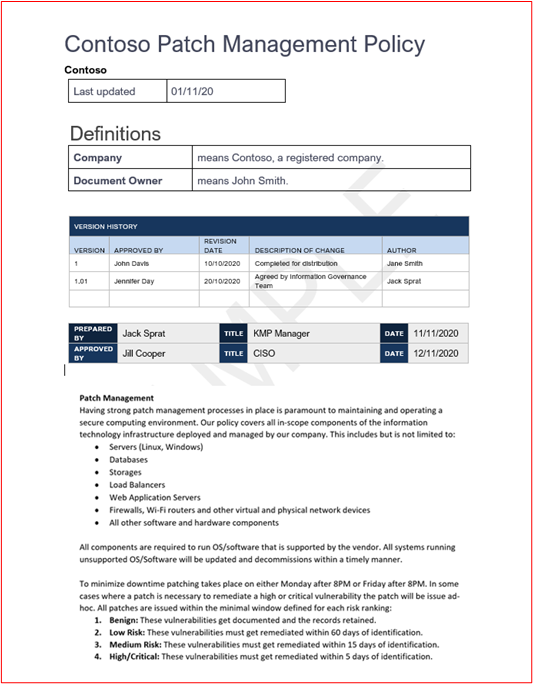
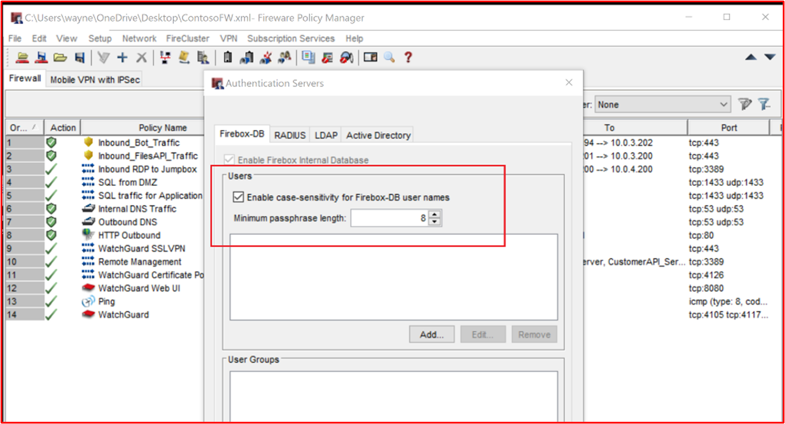
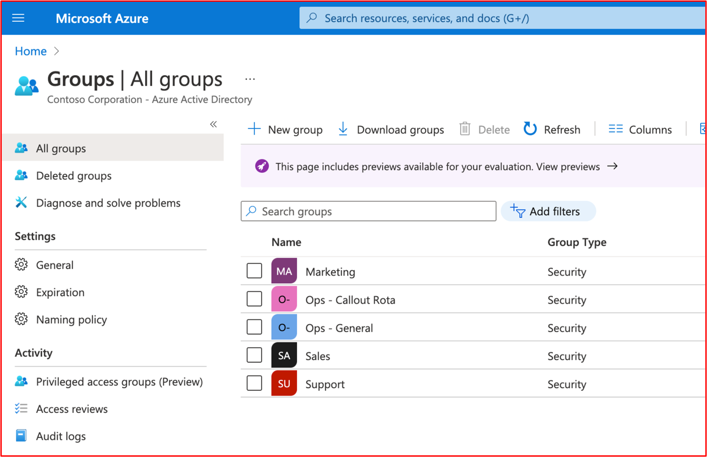
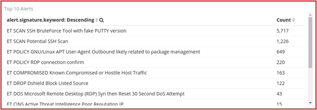
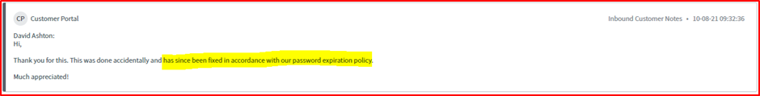
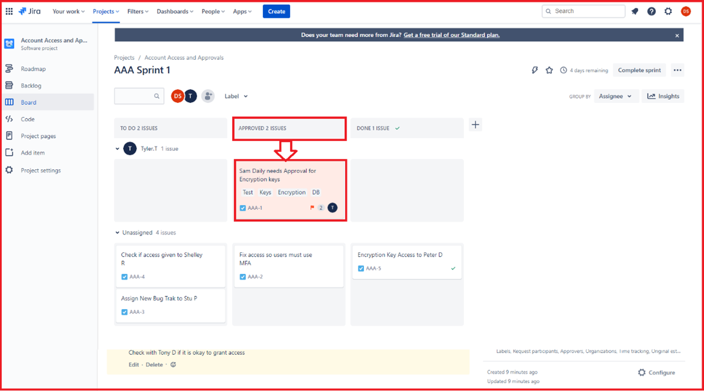
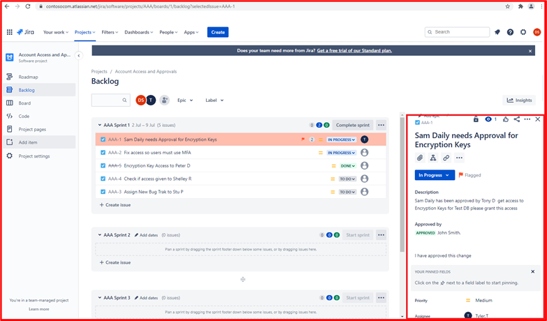
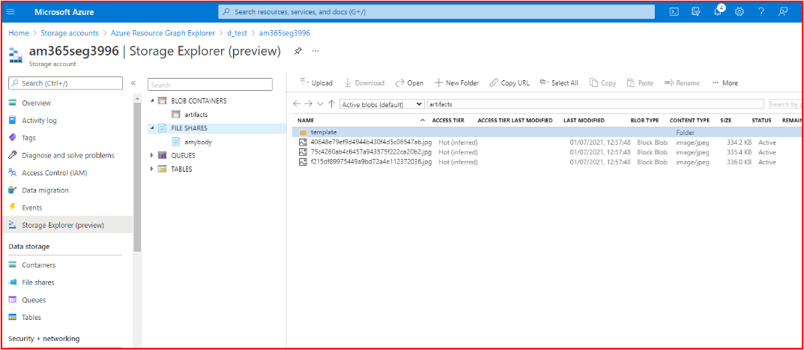

# Microsoft 365 인증 - 샘플 증거 가이드

## 개요

이 가이드는 ISV에 각 Microsoft 365 인증 컨트롤에 필요한 증명 정보 유형 및 자세한 수준의 예제를 제공하기 위해 만들어졌습니다. 이 문서에서 공유되는 예제는 컨트롤이 충족되고 있음을 입증하는 데 사용할 수 있는 유일한 증거를 나타내지 않지만 필요한 증거 유형에 대한 지침으로만 작동합니다. 

참고: 요구 사항을 충족하는 데 사용되는 실제 인터페이스, 스크린샷 및 설명서는 제품 사용, 시스템 설정 및 내부 프로세스에 따라 달라집니다. 또한 정책 또는 절차 설명서가 필요한 경우 ISV는 일부 예제와 같이 스크린샷이 아닌 실제 문서를 보내야 합니다. 

인증에는 제출이 필요한 두 개의 섹션이 있습니다.
1. [**초기 문서 제출:**](../docs/initialdocumentsubguide.md) 평가 범위를 지정하는 데 필요한 개략적인 문서 집합입니다.
1. **증거 제출:** 인증 평가의 범위 내 각 컨트롤에 필요한 전체 증거 집합입니다. 

## 구조 

이 문서는 파트너 센터에서 인증하는 동안 표시되는 컨트롤에 직접 매핑됩니다. 이 문서에 제공된 지침은 다음과 같이 자세히 설명되어 있습니다.
- 보안 도메인: 모든 컨트롤이 그룹화되는 세 가지 보안 도메인: 애플리케이션 보안, 운영 보안 및 데이터 보안 및 개인 정보
- Control( s): = 평가 활동 설명 - 이러한 컨트롤 및 연결된 번호(아니요)는 Microsoft 365 인증 검사 목록에서 직접 가져옵니다.  
- 의도: = 보안 컨트롤이 프로그램에 포함된 이유와 완화를 위한 특정 위험의 의도입니다.  희망은이 정보는 더 나은 수집해야 증거의 유형을 이해하기 위해 제어 뒤에 추론을 ISV를 제공하고 ISV의 관심을 지불해야하고 자신의 증거를 생산에 대한 인식과 이해를 가지고 있다는 것입니다.
- 증거 지침 예제: = Microsoft 365 인증 검사 목록 스프레드시트에서 증거 수집 작업을 안내하는 데 도움이 되므로 ISV는 이를 사용하여 제어가 제자리에 있고 유지 관리된다는 확실한 결정을 내리는 데 사용할 수 있는 증거 유형의 예를 명확하게 볼 수 있습니다.
- 증거 예제: = 이 섹션에서는 특히 운영 보안 및 데이터 보안 및 개인 정보 보호 도메인(스프레드시트 내의 탭)에 대해 Microsoft 365 인증 검사 목록 스프레드시트 내의 각 컨트롤에 대해 캡처된 잠재적 증거의 스크린샷과 이미지를 제공합니다. 예제 내에 빨간색 화살표와 상자가 있는 정보는 컨트롤을 충족하는 데 필요한 요구 사항을 이해하는 데 도움이 됩니다.

## 보안 도메인: 애플리케이션 보안

**컨트롤 1 - 컨트롤 16**:

애플리케이션 보안 도메인 컨트롤은 앱에 미해결 취약성이 없음을 보여주는 지난 12개월 이내에 발행된 침투 테스트 보고서로 만족할 수 있습니다. 유일하게 필요한 제출은 평판이 좋은 독립 회사의 깨끗한 보고서입니다. 

## 보안 도메인: 운영 보안/보안 개발

'운영 보안/보안 개발' 보안 도메인은 ISV가 위협 행위자가 직면한 수많은 위협에 대해 강력한 보안 완화 기술을 구현하도록 설계되었습니다.  이는 운영 환경 및 소프트웨어 개발 프로세스를 보호하여 보안 환경을 빌드하도록 설계되었습니다.

#### 맬웨어 보호 - 바이러스 백신

**컨트롤 번호 1:** 바이러스 백신 사례 및 절차를 제어하는 정책 설명서를 제공합니다.
- 의도: 이 제어의 의도는 컴퓨터 바이러스의 위협을 고려할 때 ISV가 직면한 문제에 대한 ISV의 이해를 평가하는 것입니다. ISV는 바이러스 백신 정책 및 프로세스를 개발할 때 업계 모범 사례를 수립하고 사용하여 맬웨어가 직면한 위험을 완화하고 바이러스 탐지 및 제거에 모범 사례를 나열하는 조직의 기능에 맞는 리소스를 제공하며 문서화된 정책이 조직과 직원에게 제안된 보안 지침을 제공한다는 증거를 제공합니다. ISV가 맬웨어 방지 암호 해독을 배포하는 방법에 대한 정책 및 절차를 문서화하여 이 기술의 일관된 롤아웃 및 유지 관리를 보장하여 환경에 대한 맬웨어의 위험을 줄입니다.

- 증거 지침 예제: 바이러스 백신/맬웨어 방지 모범 사례를 홍보하기 위해 인프라 내에서 구현된 프로세스 및 절차를 자세히 설명하는 바이러스 백신/맬웨어 방지 정책의 복사본을 제공합니다.
예제 증거

- 예제 증거:

**참고:** 이 스크린샷은 정책/프로세스 문서를 보여줍니다. ISV는 단순히 스크린샷을 제공하는 것이 아니라 실제 지원 정책/절차 설명서를 공유해야 합니다.

**컨트롤 번호 2:** 바이러스 백신 소프트웨어가 샘플링된 모든 시스템 구성 요소에서 실행되고 있다는 입증 가능한 증거를 제공합니다.

- 의도: 사용자 환경에서 바이러스 백신(AV) 또는 맬웨어 방지 방어가 실행되어 잠재적으로 손상될 수 있는 공격이 정교함과 숫자 모두에서 증가하고 있다는 것을 알고 있거나 인식하지 못할 수 있는 사이버 보안 위험으로부터 보호하는 것이 중요합니다. AV를 사용을 지원하는 모든 시스템 구성 요소에 배포하면 맬웨어 방지가 환경에 도입될 위험을 완화하는 데 도움이 됩니다. 위협 행위자가 환경에 발판을 마련할 수 있도록 잠재적으로 공격 벡터를 제공하기 위해 단일 엔드포인트만 보호되지 않습니다. 따라서 AV는 이러한 유형의 위협으로부터 보호하기 위해 여러 방어 계층 중 하나로 사용되어야 합니다.

- 증거 지침 예제: AV의 활성 인스턴스가 평가된 환경에서 실행 중임을 증명합니다. 바이러스 백신 프로세스가 실행 중이거나, 바이러스 백신 소프트웨어가 활성 상태이거나, 바이러스 백신에 대한 중앙 집중식 관리 콘솔이 있는 경우 해당 관리 콘솔에서 이를 시연할 수 있는 바이러스 백신 사용을 지원하는 샘플의 _모든 디바이스_ 에 대한 스크린샷을 제공합니다. 관리 콘솔을 사용하는 경우 스크린샷에서 샘플링된 디바이스가 연결되고 작동하고 있음을 증명해야 합니다.

- 증거 예제 1: 아래 스크린샷은 Azure Security Center 가져온 것입니다. MSPGPRODAZUR01&quot;이라는 &quot;VM에 맬웨어 방지 확장이 배포되었음을 보여줍니다.

- 증거 예제 2

아래 스크린샷은 호스트 이름 &quot;CLARANET-SBU-WM&quot;에 대해 실시간 보호&quot;가 켜져 있음을 보여 주는 &quot;Windows 10 디바이스에서 촬영되었습니다.

**컨트롤 번호 3:** 바이러스 백신 서명이 모든 환경에서 최신 상태라는 입증 가능한 증거를 제공합니다(1일 이내).

- 의도: 매일 수십만 개의 새로운 맬웨어 및 PUA(사용자 동의 없이 설치된 애플리케이션)가 식별됩니다. 새로 릴리스된 맬웨어에 대해 적절한 보호를 제공하려면 AV 서명을 정기적으로 업데이트하여 새로 릴리스된 맬웨어를 고려해야 합니다.

- 이 컨트롤은 ISV가 환경의 보안과 오래된 AV가 보안에 미칠 수 있는 영향을 고려하도록 하기 위해 존재합니다.

- 증거 지침 예제: 각 샘플링된 디바이스에서 바이러스 백신 로그 파일을 제공하여 업데이트가 매일 적용됨을 보여 줍니다.

- 증거 예제: 다음 스크린샷은 업데이트인 &#39;이벤트 2000 Windows Defender&#39; 보여 줌으로써 Microsoft Defender 업데이트를 매일 보여줍니다. 범위 내 시스템 &quot;CLARANET-SBU-WM&quot;에서 가져온 것을 보여 주는 호스트 이름이 표시됩니다.

**참고:** 제공된 증거는 더 많은 기간 동안 매일 업데이트를 표시하기 위해 로그 내보내기를 포함해야 합니다. 일부 바이러스 백신 제품은 업데이트 로그 파일을 생성하므로 이러한 파일을 제공하거나 이벤트 뷰어 로그를 내보냅니다.

**컨트롤 번호 4:** 바이러스 백신이 모든 샘플링된 시스템 구성 요소에서 액세스 시 검사 또는 주기적 검사를 수행하도록 구성되어 있음을 입증할 수 있는 증거를 제공합니다.

**참고:** 액세스 상태 검사를 사용하도록 설정하지 않은 경우 최소 일일 검사 및 alerting_ _be 사용하도록 설정 **해야 합니다** .

- 의도: 이 컨트롤의 의도는 맬웨어가 환경에 미칠 수 있는 영향을 최소화하기 위해 신속하게 식별되도록 하는 것입니다. 액세스 검사가 수행되고 자동으로 차단되는 맬웨어와 결합되는 경우 바이러스 백신 소프트웨어로 알려진 맬웨어 감염을 중지하는 데 도움이 됩니다. 서비스 중단을 유발하는 가양성의 위험으로 인해 액세스 시 검사가&#39;바람직하지 않은 경우, 손상을 최소화하기 위해 맬웨어 감염에 대한 적시 대응을 보장하기 위해 매일(또는 그 이상) 적절한 검사 및 경고 메커니즘을 구현해야 합니다.

- 증거 지침 예제: 바이러스 백신을 지원하는 샘플의 _모든 디바이스_ 에 대한 스크린샷을 제공하여 바이러스 백신이 디바이스에서 실행되고 있으며 액세스 시(실시간 검사) 검사를 위해 구성되었음을 보여 **줍니다. 또는** 정기적인 검사가 매일 검사에 사용하도록 설정되고 경고가 구성되고 샘플의 _모든 디바이스_ 에 대한 마지막 검사 날짜가 있음을 보여 주는 스크린샷을 제공합니다.

- 증거 예제: 다음 스크린샷은 호스트 CLARANET-SBU-WM&quot;&quot;에 대해 실시간 보호가 사용하도록 설정된 것을 보여 줍니다.

**컨트롤 번호 5:** 바이러스 백신이 샘플링된 모든 시스템 구성 요소에서 맬웨어 또는 격리 및 경고를 자동으로 차단하도록 구성되어 있음을 입증할 수 있는 증거를 제공합니다.

- 의도: 맬웨어의 정교함은 다양한 수준의 파괴와 함께 항상 진화하고 있습니다. 이 컨트롤의 의도는 맬웨어 실행을 중지하여 잠재적으로 파괴적인 페이로드를 실행하지 못하게 하거나 자동 차단이 옵션이 아닌 경우 맬웨어가 잠재적인 맬웨어 감염을 경고하고 즉시 대응하여 혼란을 야기할 수 있는 시간을 제한하는 것입니다.

- 증거 지침 예제: 바이러스 백신을 지원하는 샘플의 _모든 디바이스_ 에 대한 스크린샷을 제공하여 바이러스 백신이 컴퓨터에서 실행 중이며 맬웨어, 경고 또는 격리 및 경고를 자동으로 차단하도록 구성되어 있음을 보여 줍니다.

- 증거 예제 1: 다음 스크린샷은 호스트 &quot;CLARANET-SBU-WM&quot;이 Microsoft Defender 바이러스 백신 대한 실시간 보호로 구성된 것을 보여줍니다. 설정에서 설명한 대로 맬웨어가 디바이스에서 설치 또는 실행되는 것을 찾아서 중지합니다.

**컨트롤 번호 6:** 애플리케이션이 배포되기 전에 승인되었다는 입증 가능한 증거를 제공합니다.

- 의도: 애플리케이션 제어를 사용하면 조직은 운영 체제에서 실행할 수 있는 각 애플리케이션/프로세스를 승인합니다. 이 컨트롤의 목적은 실행할 수 있는 애플리케이션/프로세스에 권한을 부여하기 위한 승인 프로세스가 있는지 확인하는 것입니다.

- 증거 지침 예제: 승인 프로세스를 따르고 있음을 보여 주는 증거를 제공할 수 있습니다. 서명된 문서, 변경 제어 시스템 내에서 추적 또는 Azure DevOps 또는 JIRA와 같은 항목을 사용하여 이러한 요청 및 권한 부여를 추적하여 제공할 수 있습니다.

- 증거 예제: 다음 스크린샷은 환경 내에서 실행하도록 허용된 각 애플리케이션이 승인 프로세스를 따르는 관리의 승인을 보여 줍니다. Contoso의 종이 기반 프로세스이지만 다른 메커니즘을 사용할 수 있습니다.

**컨트롤 번호 7:** 비즈니스 정당성이 있는 승인된 애플리케이션의 전체 목록이 존재하고 유지 관리된다는 입증 가능한 증거를 제공합니다.

- 의도: 조직에서 승인된 모든 애플리케이션 목록과 애플리케이션/프로세스가 승인된 이유에 대한 정보를 유지하는 것이 중요합니다. 이렇게 하면 구성이 최신 상태로 유지되고 기준선에 대해 검토하여 권한이 없는 애플리케이션/프로세스가 구성되지 않도록 할 수 있습니다.

- 증거 지침 예제: 비즈니스 근거와 함께 승인된 애플리케이션/프로세스의 문서화된 목록을 제공합니다.

- 증거 예제: 다음 스크린샷에는 비즈니스 근거를 사용하여 승인된 애플리케이션이 나열되어 있습니다.

**참고:** 이 스크린샷은 단순히 스크린샷을 제공하는 것이 아니라 ISV가 실제 지원 문서를 공유하는 것으로 예상하는 문서를 보여줍니다.

**컨트롤 번호 8:** 애플리케이션 제어 소프트웨어가 특정 애플리케이션 제어 메커니즘을 충족하도록 구성되어 있음을 자세히 설명하는 지원 설명서를 제공합니다.

- 의도: 애플리케이션 제어 기술의 구성은 기술을 유지 관리하는 방법(예: 애플리케이션/프로세스 추가 및 삭제)의 프로세스와 함께 문서화되어야 합니다. 이 설명서의 일부로 사용되는 메커니즘 유형은 각 애플리케이션/프로세스에 대해 자세히 설명해야 합니다. 이렇게 하면 다음 컨트롤에 공급되어 기술이 문서화된 대로 구성되었는지 확인합니다.

- 증거 지침 예제: 애플리케이션 제어가 설정된 방법 및 각 애플리케이션/프로세스가 기술 내에서 구성된 방법을 자세히 설명하는 지원 설명서를 제공합니다.

- 증거 예제: 다음 스크린샷에는 애플리케이션 컨트롤을 구현하는 데 사용되는 컨트롤 메커니즘이 나열됩니다. 아래에서 1개의 앱이 인증서 컨트롤을 사용하고 있고 다른 앱은 파일 경로를 사용하는 것을 볼 수 있습니다.

**참고:** 이 스크린샷은 단순히 스크린샷을 제공하는 것이 아니라 ISV가 실제 지원 문서를 공유하는 것으로 예상하는 문서를 보여줍니다.

**컨트롤 번호 9:** 애플리케이션 제어가 샘플링된 모든 시스템 구성 요소에서 문서화된 대로 구성되었다는 입증 가능한 증거를 제공합니다.

- 의도: 이 의도는 설명서에 따라 애플리케이션 제어가 샘플 전체에서 구성되었는지 확인하는 것입니다.

- 증거 지침 예제: 애플리케이션 컨트롤이 구성되고 활성화되었음을 보여 주는 샘플의 _모든 디바이스_ 에 대한 스크린샷을 제공합니다. 그러면 컴퓨터 이름, 컴퓨터가 속한 그룹 및 해당 그룹 및 컴퓨터에 적용된 애플리케이션 제어 정책이 표시됩니다.

- 증거 예제: 다음 스크린샷은 소프트웨어 제한 정책을 사용하도록 설정된 그룹 정책 개체를 보여 줍니다.

다음 스크린샷은 위의 컨트롤과 일치하는 구성을 보여줍니다.

다음 스크린샷은 이 GPO 개체 &#39;Domain Computer 설정&#39; 적용되는 범위 내에 포함된 M365 환경 및 컴퓨터를 보여줍니다.

이 마지막 스크린샷은 위의 스크린샷 내에서 OU 내에 있는 범위 내 서버 &quot;DBServer1&quot; 을 보여줍니다.

### 패치 관리 – 위험 순위

보안 취약성의 신속한 식별 및 수정은 환경 또는 애플리케이션을 손상시키는 위협 행위자의 위험을 최소화하는 데 도움이 됩니다. 패치 관리는 위험 순위 및 패치의 두 섹션으로 나뉩니다. 이 세 가지 컨트롤은 보안 취약성의 식별을 커버하고 그들이 제기하는 위험에 따라 순위를 지정합니다.

이 보안 제어 그룹은 애플리케이션/추가 기능 타사 소프트웨어 라이브러리 및 코드 베이스가 위험 순위에 따라 패치되어야 하기 때문에 PaaS(Platform-as-a-Service) 호스팅 환경의 범위에 있습니다.

**컨트롤 번호 10:** 새 보안 취약성을 식별하고 위험 점수를 할당하는 방법을 제어하는 정책 설명서를 제공합니다.

- 의도: 이 컨트롤의 목적은 위협 행위자가 이러한 취약성을 악용해야 하는 기회의 창을 줄이기 위해 보안 취약성을 신속하게 식별할 수 있도록 지원하는 설명서를 포함하는 것입니다. 조직에서 사용 중인 모든 시스템 구성 요소를 포함하는 취약성을 식별하기 위해 강력한 메커니즘을 마련해야 합니다. 예를 들어 운영 체제(Windows Server, Ubuntu 등), 애플리케이션(Tomcat, MS Exchange, SolarWinds 등), 코드 종속성(AngularJS, jQuery 등)이 있습니다. 조직은 자산 내의 취약성을 적시에 식별할 뿐만 아니라 취약성이 발생하는 위험에 따라 적절한 기간 내에 수정이 수행되도록 그에 따라 취약성의 순위를 지정해야 합니다.

**참고** 순수하게 Platform as a Service 환경에서 실행하는 경우에도 코드 베이스 내의 취약성(예: 타사 라이브러리)을 식별할 책임이 있습니다.

- 증거 지침 예제: 지원 설명서 제공(스크린샷 아님)

- 증거 예제: 이 스크린샷은 위험 순위 정책의 조각을 보여줍니다.

**참고:** 이 스크린샷은 정책/프로세스 문서를 보여줍니다. ISV는 단순히 screenshot._ 제공하는 것이 아니라 실제 지원 정책/절차 설명서를 공유해야 합니다.

**컨트롤 번호 11:** 새로운 보안 취약성이 식별되는 방법에 대한 증거를 제공합니다.

- 의도: 이 컨트롤의 의도는 프로세스를 따르고 있으며 환경 전체에서 새로운 보안 취약성을 식별할 수 있을 만큼 견고하게&#39;것입니다. 이는 운영 체제만이 아닐 수도 있습니다. 환경 내에서 실행되는 애플리케이션과 모든 코드 종속성이 포함될 수 있습니다.

- 증거 지침 예: 메일링 목록에 대한 구독을 표시하고, 새로 릴리스된 취약성에 대한 보안 원본을 수동으로 검토하는 방법(예: JIRA 또는 Azure DevOps 사용하여 활동의 타임스탬프로 적절하게 추적해야 함), 오래된 소프트웨어를 찾는 도구(예: 오래된 소프트웨어 라이브러리를 찾을 때 Snyk일 수 있음) 또는 인증된 스캔을 사용하는 네서스일 수 있는 도구를 통해 증거를 제공할 수 있습니다.  오래된 소프트웨어입니다.).

**참고** Nessus를 사용하는 경우 취약성을 신속하게 식별하기 위해 정기적으로 실행해야 합니다. 우리는 적어도 매주 권장합니다.

- 증거 예제: 이 스크린샷은 메일 그룹이 보안 취약성에 대한 알림을 받는 데 사용되고 있음을 보여 줍니다.

**컨트롤 번호 12:** 모든 취약성이 식별되면 위험 순위가 할당됨을 보여 주는 증거를 제공합니다.

- 의도: 패치는 위험을 기반으로 하고, 취약성을 위험하게 하고, 더 빨리 수정해야 합니다. 식별된 취약성의 위험 순위는 이 프로세스의 필수적인 부분입니다. 이 컨트롤의 목적은 식별된 모든 취약성이 위험에 따라 적절하게 순위가 지정되도록 하기 위해 수행되는 문서화된 위험 순위 프로세스가 있는지 확인하는 것입니다. 조직은 일반적으로 공급업체 또는 보안 연구원이 제공하는 CVSS(일반적인 취약성 점수 매기기 시스템) 등급을 활용합니다. 조직에서 CVSS를 사용하는 경우 조직에서 내부 위험 평가에 따라 순위를 변경할 수 있도록 프로세스에 재순위 메커니즘이 포함되는 것이 좋습니다. 경우에 따라 환경 내에서 애플리케이션이 배포된 방식으로 인해 취약성이 애플리케이션이 아닐 수 있습니다. 예를 들어 조직에서 사용하지 않는 특정 라이브러리에 영향을 주는 Java 취약성이 릴리스될 수 있습니다.

- 증거 지침 예제: 스크린샷 또는 기타 방법을 통해 증거를 제공합니다(예: DevOps/Jira). 이는 취약성이 위험 순위 프로세스를 거치고 조직에서 적절한 위험 순위를 할당받고 있음을 보여 줍니다.

- 증거 예: 이 스크린샷은 조직에서 위험 평가를 수행하고 위험을 다운그레이드할 수 있다고 판단하는 경우 D열 내에서 발생하는 위험 순위와 F 및 G 열의 순위를 다시 지정하는 것을 보여 줍니다. 위험 평가의 순위를 다시 지정하는 증거는 지원 증거로 제공되어야 합니다.

### 패치 관리 – 패치

아래 컨트롤은 패치 관리의 패치 요소에 대한 것입니다. 보안 운영 환경을 유지하려면 애플리케이션/추가 기능 및 지원 시스템을 적절하게 패치해야 합니다. 식별(또는 공개 릴리스)과 패치 간의 적절한 기간을 관리하여 위협 행위자가 취약성을 악용할 수 있는 기회를 줄여야 합니다. Microsoft 365 인증은 &#39;패치 창&#39; 규정하지 않지만 인증 분석가는 합리적이지 않은 기간을 거부합니다.

이 보안 제어 그룹은 애플리케이션/추가 기능 타사 소프트웨어 라이브러리 및 코드 베이스가 위험 순위에 따라 패치되어야 하기 때문에 PaaS(Platform-as-a-Service) 호스팅 환경의 범위에 있습니다.

**컨트롤 번호 13:** 위험, 높음 및 중간 위험 취약성에 적합한 최소 패치 기간을 포함하는 범위 내 시스템 구성 요소의 패치에 대한 정책 설명서를 제공합니다. 지원되지 않는 운영 체제 및 소프트웨어의 서비스 해제

- 의도: 패치 관리는 많은 보안 규정 준수 프레임워크(예: PCI-DSS, ISO 27001, NIST(SP) 800-53)에 필요합니다. 소프트웨어, 펌웨어의 보안 및 기능 문제를 해결하고 취약성을 완화하여 악용 기회를 줄이는 데 도움이 되므로 좋은 패치 관리의 중요성은 지나치게 강조될 수 없습니다. 이 컨트롤의 목적은 위협 행위자가 범위 내 환경 내에 존재할 수 있는 취약성을 악용해야 하는 기회의 창을 최소화하는 것입니다.

- 증거 지침 예제: 패치 관리 프로세스를 자세히 설명하는 모든 정책 및 절차의 복사본을 제공합니다. 여기에는 최소한의 패치 창에 섹션이 포함되어야 하며 지원되지 않는 운영 체제 및 소프트웨어는 환경 내에서 사용해서는 안 됩니다.

- 증거 예제: 다음은 정책 문서 예제입니다.

**참고:** 이 스크린샷은 정책/프로세스 문서를 보여줍니다. ISV는 단순히 screenshot._ 제공하는 것이 아니라 실제 지원 정책/절차 설명서를 공유해야 합니다.

**컨트롤 번호 14:** 샘플링된 모든 시스템 구성 요소가 패치되고 있다는 입증 가능한 증거를 제공합니다.

**참고:** 소프트웨어/타사 라이브러리를 포함합니다.

- 의도: 취약성을 패치하면 정보 기술 인프라(하드웨어, 소프트웨어 및 서비스)의 일부를 구성하는 다양한 모듈이 최신 상태로 유지되고 알려진 취약성으로부터 자유로워집니다. 취약성 세부 정보 릴리스와 패치 간의 보안 인시던트 가능성을 최소화하려면 가능한 한 빨리 패치를 수행해야 합니다. 이것은 야생에있는 것으로 알려진 취약점의 악용이 더욱 중요합니다.

- 증거 지침 예제: 샘플의 _모든 디바이스_ 및 지원 소프트웨어 구성 요소에 대한 스크린샷을 제공하여 패치가 문서화된 패치 프로세스에 따라 설치됨을 보여 줍니다.

- 증거 예제: 다음 스크린샷은 범위 내 시스템 구성 요소 &quot;CLARANET-SBU-WM&quot;이 패치 정책에 따라 Windows 업데이트를 수행하고 있음을 보여 줍니다.

**참고:** 모든 범위 내 시스템 구성 요소의 패치는 증명 정보여야 합니다. 여기에는 다음과 같은 항목이 포함됩니다. OS 업데이트, 애플리케이션/구성 요소 업데이트(i.e__.,_ _Apache Tomcat, OpenSSL 등), 소프트웨어 종속성(예: JQuery, AngularJS 등)_

**컨트롤 번호 15:** 지원되지 않는 운영 체제 및 소프트웨어 구성 요소가 환경 내에서 사용되지 않는다는 입증 가능한 증거를 제공합니다.

- 의도: 공급업체에서 유지 관리하지 않는 소프트웨어는 초과 작업으로 인해 수정되지 않은 알려진 취약성을 겪게 됩니다. 따라서 지원되지 않는 운영 체제 및 소프트웨어 구성 요소를 프로덕션 환경 내에서 사용하면 안 됩니다.

- 증거 지침 예제: 실행 중인 OS 버전을 보여 주는 샘플의 _모든 디바이스_ 에 대한 스크린샷을 제공합니다(스크린샷에 서버&#39;이름 포함). 이 외에도 환경 내에서 실행되는 소프트웨어 구성 요소가 지원되는 버전을 실행하고 있다는 증거를 제공합니다. 이 작업은 내부 취약성 검사 보고서의 출력(인증된 검사 포함 제공) 및/또는 [Snyk](https://snyk.io/), [Trivy](https://github.com/aquasecurity/trivy) 또는 [NPM 감사](https://docs.npmjs.com/cli/v7/commands/npm-audit)와 같은 타사 라이브러리를 확인하는 도구의 출력을 제공하여 수행할 수 있습니다. PaaS에서만 실행되는 경우 타사 라이브러리 패치만 패치 제어 그룹에서 다루어야 합니다.

- 예제 증거: 다음 증거는 범위 내 시스템 구성 요소 THOR이 Nessus에서 문제를 플래그 지정하지&#39;않았기 때문에 공급업체에서 지원하는 소프트웨어를 실행하고 있음을 보여 줍니다.

**참고:** 전체 보고서는 인증 분석가와 공유해야 합니다.

- 예제 증명 정보 2

이 스크린샷은 범위 내 시스템 구성 요소 &quot;CLARANET-SBU-WM&quot;이 지원되는 Windows 버전에서 실행되고 있음을 보여줍니다.

- 예제 증거 3

다음 스크린샷은 전체 보고서에서 지원되지 않는 애플리케이션을 나열하지&#39;[Trivy](https://github.com/aquasecurity/trivy) 출력의 스크린샷입니다.

**참고:** 전체 보고서는 인증 분석가와 공유해야 합니다.

### 취약점 검색

조직은 정기적인 취약성 평가를 도입하여 환경 내에서 약점과 불안을 감지할 수 있으며, 악의적인 행위자가 환경을 손상시키는 진입점을 제공할 수 있습니다. 취약성 검사는 환경 내에서 누락된 패치 또는 잘못된 구성을 식별하는 데 도움이 될 수 있습니다. 조직은 이러한 검사를 정기적으로 수행하여 이러한 취약성 검사 도구에서 일반적으로 포착되는 문제로 인해 손상 위험을 최소화할 수 있는 적절한 수정을 제공할 수 있습니다.

**컨트롤 번호 16:** 분기별 인프라 및 웹 애플리케이션 취약성 검사 보고서를 제공합니다. 전체 공용 공간(IP 주소 및 URL) 및 내부 IP 범위에 대해 검사를 수행해야 합니다.

**참고:** 여기에는 환경의 전체 범위가 포함되어 **야 합니다** .

- 의도: 취약성 검사는 조직 컴퓨터 시스템, 네트워크 및 웹 애플리케이션에서 가능한 약점을 찾아 보안 위반 및 중요한 데이터의 노출로 이어질 수 있는 구멍을 식별합니다. 취약성 검사는 종종 업계 표준 및 정부 규정(예: PCI DSS(결제 카드 산업 데이터 보안 표준))에 필요합니다.

- [PCI DSS 규정 준수에 대한 2020 보안 메트릭 가이드](https://info.securitymetrics.com/pci-guide-2020)라는 보안 &quot; 메트릭의 보고서에 따르면 조직이 공격자가 시스템을 손상시키는 취약성이 있는 것으로 나타난 시간으로부터 평균적으로 166일이 걸린 것으로 &#39;.&quot; 손상되면 공격자는 평균 127일 동안 중요한 데이터에 액세스할 수&#39; 이 제어는 범위 내 환경 내에서 잠재적인 보안 약점을 식별하기 위한 것입니다.

- 증거 지침 예제: 지난 12개월 동안 수행된 각 분기&#39;취약성 검사에 대한 전체 검사 보고서를 제공합니다. 보고서는 전체 공용 공간이 포함되고 해당하는 경우 각 내부 서브넷의 유효성을 검사하기 위해 대상을 명확하게 명시해야 합니다. **매** 분기에 대한 **모든** 검사 보고서를 제공합니다.

- 예시 증거: 예제 증거는 사용 중인 검사 도구에서 검사 보고서를 제공하는 것입니다. 각 분기&#39;검사 보고서는 검토를 위해 제공해야 합니다. 검사에는 전체 환경 시스템 구성 요소가 포함되어야 합니다. 모든 내부 서브넷 및 환경에서 사용할 수 있는 모든 공용 IP 주소/URL입니다.

**컨트롤 번호 17:** 취약성 검사 중에 식별된 취약성의 수정이 문서화된 패치 기간에 따라 패치된다는 입증 가능한 증거를 제공합니다.

- 의도: 취약성 및 잘못된 구성을 신속하게 식별, 관리 및 수정하지 못하면 조직&#39;손상 위험이 증가하여 잠재적인 데이터 위반이 발생할 수 있습니다. 다양한 보안 프레임워크의 모범 사례에 부합하는 조직&#39;전반적인 보안 상태 및 환경에 대해 문제를 올바르게 식별하고 수정하는 것이 중요합니다. 예: ISO 27001 및 PCI DSS

- 증거 지침 예: 취약성 검사에서 검색된 취약성 샘플이 위의 Control 13에 이미 제공된 패치 창에 따라 수정되었음을 보여 주는 적절한 아티팩트(즉, 스크린샷)를 제공합니다.

- 예제 증거: 다음 스크린샷은 2021년 8월 2일에 취약성을 보여 주는 범위 내 환경(이 예제 &quot;의 단일 컴퓨터인 THOR&quot;)의 Nessus 검사를 보여 줍니다.

다음 스크린샷은 문제가 해결되었음을 보여 줍니다. 2일 후 패치 정책 내에 정의된 패치 창 내에 있습니다.

**참고:** 이 제어를 위해 인증 분석가는 지난 12개월 동안 각 분기에 대한 취약성 검사 보고서 및 수정을 확인해야 합니다.

### 방화벽

방화벽은 신뢰할 수 있는(내부 네트워크), 신뢰할 수 없는(인터넷) 및 DMZ(반신탁) 환경 간에 보안 경계를 제공하는 경우가 많습니다. 이는 일반적으로 수신 및 송신 서비스의 트래픽 흐름을 제어하고 원치 않는 트래픽을 차단하도록 설계된 조직 심층 방어 보안 전략 내에서 첫 번째 방어선이 됩니다. 이러한 디바이스는 효과적으로 작동하고 환경을 위험에 빠뜨릴 수 있는 잘못된 구성으로부터 자유로워지도록 엄격하게 제어되어야 합니다.

**컨트롤 번호 18:** 방화벽 관리 사례 및 절차를 제어하는 정책 설명서를 제공합니다.

- 의도: 방화벽은 덜 신뢰할 수 있는 네트워크 영역으로부터 환경을 보호하는 계층화된 보안(심층 방어) 전략에서 중요한 첫 번째 방어선입니다. 방화벽은 일반적으로 IP 주소 및 프로토콜/포트를 기반으로 트래픽 흐름을 제어하며, 기능이 풍부한 방화벽은 애플리케이션 트래픽을 검사하여 액세스되는 애플리케이션에 기반한 오용, 취약성 및 위협으로부터 보호함으로써 추가 &quot;애플리케이션 계층&quot; 방어를 제공할 수도 있습니다. 이러한 보호는 방화벽의 구성에만 적합하므로 내부 자산을 적절하게 보호하도록 구성되도록 강력한 방화벽 정책 및 지원 절차를 마련해야 합니다. 예를 들어 ANY 원본에서 ANY 대상으로의 모든 트래픽을 허용하는 규칙이 있는 방화벽은 라우터 역할을 합니다.

- 증거 지침 예제: 설명서를 지원하는 전체 방화벽 정책/절차를 제공합니다. 이 문서에서는 아래의 모든 점과 사용자 환경에 적용되는 추가 모범 사례를 다루어야 합니다.

- 증거 예제: 다음은 필요한 방화벽 정책 문서의 예입니다(데모이며 완료되지 않을 수 있음).

**컨트롤 번호 19:** 프로덕션 환경에 설치하기 전에 모든 기본 관리 자격 증명이 변경되었다는 입증 가능한 증거를 제공합니다.

- 의도: 조직은 디바이스 또는 소프트웨어를 구성하는 동안 구성된 공급업체 제공 기본 관리 자격 증명을 염두에 두어야 합니다. 기본 자격 증명은 종종 공급업체에서 공개적으로 사용할 수 있으며 외부 위협 행위자에게 환경을 손상시킬 수 있는 기회를 제공할 수 있습니다. 예를 들어 인터넷에서 기본 iDrac(통합 Dell 원격 액세스 컨트롤러) 자격 증명에 대한 간단한 검색은 _root::calvin_ 을 기본 사용자 이름 및 암호로 강조 표시합니다. 이렇게 하면 원격 서버 관리에 대한 원격 액세스 권한이 사용자에게 부여됩니다. 이 컨트롤의 목적은 환경이 디바이스/애플리케이션 강화 중에 변경되지 않은 기본 공급업체 자격 증명을 통해 공격에 취약하지 않도록 하는 것입니다.

- 증거 지침 예제

- 이는 인증 분석가가 기본 자격 증명을 사용하여 범위 내 디바이스에 인증을 시도할 수 있는 화면 공유 세션을 통해 확인할 수 있습니다.

- 예제 증거

아래 스크린샷은 WatchGuard 방화벽의 잘못된 사용자 이름/암호에서 인증 분석가가 볼 수 있는 내용을 보여줍니다.

**컨트롤 번호 20:** 방화벽이 범위 내 환경의 경계에 설치되고 경계 네트워크(DMZ, 완만 영역 및 스크린된 서브넷이라고도 함) 및 내부 신뢰할 수 있는 네트워크 사이에 설치된다는 입증 가능한 증거를 제공합니다.

- 의도: 방화벽은 서로 다른 보안 수준의 서로 다른 네트워크 영역 간의 트래픽을 제어하는 기능을 제공합니다. 모든 환경이 인터넷에 연결되어 있으므로 인터넷과 범위 내 환경 간에 방화벽을 경계에 설치해야 합니다. 또한 덜 신뢰할 수 있는 DMZ(군사화 영역) 네트워크와 내부 신뢰할 수 있는 네트워크 간에 방화벽을 설치해야 합니다. DMZ는 일반적으로 인터넷에서 트래픽을 제공하는 데 사용되므로 공격의 대상입니다. DMZ를 구현하고 방화벽을 사용하여 트래픽 흐름을 제어함으로써 DMZ의 손상은 내부 신뢰할 수 있는 네트워크와 회사/고객 데이터의 손상이 반드시 의미하지는&#39;. 조직이 위협 행위자가 내부 신뢰할 수 있는 네트워크를 추가로 손상시킬 기회를 최소화하기 위해 신속하게 타협을 식별할 수 있도록 적절한 로깅 및 경고가 있어야 합니다. 이 컨트롤의 목적은 신뢰할 수 있는 네트워크와 덜 신뢰할 수 있는 네트워크 간에 적절한 제어가 있는지 확인하는 것입니다.

- 증거 지침 예제: DMZ가 제자리에 있음을 보여 주는 방화벽 구성 파일 또는 스크린샷을 통해 증거를 제공해야 합니다. 이는 환경을 지원하는 다양한 네트워크를 보여 주는 제공된 아키텍처 다이어그램과 일치해야 합니다. 초기 문서 제출의 일부로 이미 제공된 네트워크 다이어그램과 함께 방화벽의 네트워크 인터페이스 스크린샷은 이 증거를 제공해야 합니다.

- 예시 증거: 다음은 두 개의 DMZ를 보여주는 WatchGuard 방화벽의 스크린샷입니다. 하나는 인바운드 서비스(DMZ)를 위한 것이고, 다른 하나는 jumpbox(Bastian Host)를 제공하고 있습니다.

**컨트롤 번호 21:** 모든 공용 액세스가 비무장지대(DMZ)에서 종료된다는 입증 가능한 증거를 제공합니다.

- 의도: 공개적으로 액세스할 수 있는 리소스는 무수한 공격에 노출됩니다. 위에서 이미 설명한 것처럼 DMZ의 의도는 중요한 데이터를 포함할 수 있는 신뢰할 수 있는 내부 네트워크에서 덜 신뢰할 수 있는 네트워크를 분할하는 것입니다. DMZ는 외부 위협 행위자가 공개적으로 액세스할 수 있는 호스트의 위험이 매우 크기 때문에 신뢰도가 낮은 것으로 간주됩니다. 공용 액세스는 내부 리소스 및 데이터를 보호하기 위해 방화벽에 의해 적절하게 분할되는 덜 신뢰할 수 있는 네트워크에서 항상 종료되어야 합니다. 이 제어의 목적은 신뢰할 수 있는 내부 네트워크의 리소스가 공개적으로 연결된 것처럼 이러한 덜 신뢰할 수 있는 DMZ 내에서 모든 공용 액세스가 종료되도록 하기 위한 것입니다. 이러한 리소스의 손상은 위협 행위자가 중요한 데이터가 보관되는 네트워크에 대한 발판을 제공합니다.

- 증거 지침 예제

- 이에 대해 제공된 증거는 공용 IP 주소를 리소스로 라우팅하거나 인바운드 트래픽의 NAT(네트워크 주소 변환)를 제공하여 인바운드 규칙을 표시하고 이러한 규칙이 종료되는 위치를 보여주는 방화벽 구성일 수 있습니다.

- 예제 증거

아래 스크린샷에는 각각 DMZ 서브넷인 10.0.3.x 및 10.0.4.x 서브넷에 대한 NAT를 보여주는 세 가지 들어오는 규칙이 있습니다.

**컨트롤 번호 22:** 방화벽을 통해 허용되는 모든 트래픽이 승인 프로세스를 통과한다는 입증 가능한 증거를 제공합니다.

- 의도: 방화벽은 신뢰할 수 없는 트래픽과 내부 리소스 간의 방어 장벽이며 서로 다른 신뢰 수준의 네트워크 간에 보호 장벽이므로 방화벽을 안전하게 구성하고 비즈니스 운영에 필요한 트래픽만 사용하도록 설정해야 합니다. 불필요한 트래픽 흐름 또는 지나치게 허용되는 트래픽 흐름을 허용하면 이러한 다양한 네트워크 영역의 경계에서 방어 내에서 약점이 발생할 수 있습니다. 모든 방화벽 변경에 대한 강력한 승인 프로세스를 설정하면 환경에 상당한 위험을 초래하는 규칙을 도입할 위험이 줄어듭니다. Verizon&#39;[2020년 데이터 위반 조사 보고서는](https://enterprise.verizon.com/en-gb/resources/reports/dbir/) 잘못된 구성을 포함하는 오류&#39;&quot; 매년 지속적으로 증가하는 유일한 작업 유형임을 강조&quot;합니다.

- 증거 지침 예: 증거는 승인되는 방화벽 변경 요청을 보여 주는 설명서 형식일 수 있으며, CAB(변경 관리자 위원회) 회의 또는 변경 제어 시스템에서 모든 변경 내용을 추적하는 데 몇 분이 소요될 수 있습니다.

- 증거 예제: 다음 스크린샷은 종이 기반 프로세스를 사용하여 요청되고 권한이 부여되는 방화벽 규칙 변경을 보여줍니다. 예를 들어 DevOps 또는 Jira와 같은 작업을 통해 이 작업을 수행할 수 있습니다.

**컨트롤 번호 23:** 방화벽 규칙 기반이 명시적으로 정의되지 않은 트래픽을 삭제하도록 구성되었다는 입증 가능한 증거를 제공합니다.

- 의도: 대부분의 방화벽은 하향식 접근 방식에서 규칙을 처리하여 일치하는 규칙을 찾아봅니다. 규칙이 일치하면 해당 규칙의 동작이 적용되고 규칙의 모든 추가 처리가 중지됩니다. 일치하는 규칙이 없으면 기본적으로 트래픽이 거부됩니다. 이 컨트롤의 의도는 일치하는 규칙이 없으면 방화벽이 트래픽 삭제를 기본값으로&#39;않는 경우 규칙 기반에 **ALL** 방화벽 목록 끝에 모두&quot; 거부 규칙을 포함&quot;해야 합니다. 이는 방화벽이 규칙을 처리할 때 기본 허용 상태로&#39;않도록 하여 명시적으로 정의되지 않은 트래픽을 허용하도록&#39;.

- 증거 지침 예제: 방화벽 구성을 통해 또는 마지막에 모든 거부&quot; 규칙을 보여 주는 모든 방화벽 규칙을 보여 &quot;주는 스크린샷을 통해 증거를 제공할 수 있습니다. 또는 방화벽이 기본적으로 규칙과 일치하지 않는&#39;트래픽을 삭제하는 경우 모든 방화벽 규칙의 스크린샷과 기본적으로 방화벽이 일치하지 않는 모든 트래픽을 삭제한다는 것을 강조하는 공급업체 관리 가이드에 대한 링크를 제공합니다.

- 증거 예제: 다음은 모든 트래픽을 허용하도록 구성된 규칙이 없음을 보여 주는 WatchGuard 방화벽 규칙 기반의 스크린샷입니다. WatchGuard는 기본적으로 일치하지&#39;트래픽을 삭제하므로 끝에 거부 규칙이 없습니다.

다음 WatchGuard 도움말 센터 링크; [https://www.watchguard.com/help/docs/help-center/en-US/Content/en-US/Fireware/policies/policies\_about\_c.html](https://www.watchguard.com/help/docs/help-center/en-US/Content/en-US/Fireware/policies/policies_about_c.html) 에는 다음 정보가 포함됩니다.

**컨트롤 번호 24:** 방화벽이 모든 비 콘솔 관리 인터페이스에서 강력한 암호화만 지원한다는 입증 가능한 증거를 제공합니다.

- 의도: 관리 트래픽의 중간자 공격을 완화하려면 모든 비 콘솔 관리 인터페이스는 강력한 암호화만 지원해야 합니다. 이 컨트롤의 주요 의도는 비 콘솔 연결이 설정되므로 관리 자격 증명을 보호하는 것입니다. 또한 이는 디바이스를 재구성하거나 정찰의 일부로 관리 기능을 재생하려고 시도하여 연결에 대한 도청으로부터 보호하는 데 도움이 될 수 있습니다.

- 증거 지침 예제: 구성이 콘솔이 아닌 관리 인터페이스의 암호화 구성을 제공하는 경우 방화벽 구성을 제공합니다(모든 디바이스에 구성 가능한 옵션으로 포함되는 것은 아님). 구성 내에&#39;없는 경우 디바이스에 명령을 실행하여 이러한 연결에 대해 구성된 항목을 표시할 수 있습니다. 일부 공급업체는 이 정보를 문서 내에 게시할 수 있으므로 이 정보를 입증하는 방법일 수도 있습니다. 마지막으로 지원되는 암호화를 출력하는 도구를 실행해야 할 수 있습니다.

- 증거 예제: 아래 스크린샷은 TCP 포트 8080에서 WatchGuard 방화벽의 웹 관리자 인터페이스에 대한 [SSLScan](https://github.com/rbsec/sslscan) 의 출력을 보여 줍니다. AES-128bit의 최소 암호화 암호화가 있는 TLS 1.2 이상을 보여 집니다.

**참고**: WatchGuard 방화벽은 SSH(TCP 포트 4118) 및 WatchGuard 시스템 관리자(TCP 포트 4105 &amp; 4117)를 사용하는 관리 기능도 지원합니다. 이러한 비 콘솔 관리 인터페이스의 증거도 제공해야 합니다.

**컨트롤 번호 25:** 적어도 6개월마다 방화벽 규칙 검토를 수행하고 있다는 입증 가능한 증거를 제공합니다.

- 의도: 시간이 지남에 따라 범위 내 환경이 있는 시스템 구성 요소에서 구성 크리프의 위험이 있습니다. 이렇게 하면 환경에 대한 손상 위험을 증가시킬 수 있는 불안 또는 잘못된 구성이 발생할 수 있습니다. 구성 크리프는 문제 해결을 지원하기 위한 임시 변경, 임시 기능 변경에 대한 임시 변경 등과 같은 여러 가지 이유로 도입될 수 있으며, 빠른 수정을 도입해야 하는 부담으로 인해 지나치게 허용될 수 있는 문제에 대한 빠른 수정을 도입할 수 있습니다. 예를 들어 긴급한 문제를 해결하기 위해 임시 방화벽 규칙 &quot;인 Allow All&quot; 을 도입할 수 있습니다. 이 컨트롤의 의도는 두 가지입니다. 첫째로, 안전하지 않을 수 있는 잘못된 구성이 있는 위치를 식별하고, 두 번째로 더 이상 필요하지 않으므로 제거할 수 있는 방화벽 규칙을 식별하는 데 도움이 됩니다. 즉, 서비스가 사용 중지되었지만 방화벽 규칙이 남아 있는 경우입니다.

- 증거 지침 예제: 검토 모임이 발생했음을 입증할 수 있어야 합니다. 이 작업은 방화벽 검토의 회의 시간(분)과 검토에서 수행된 작업을 보여 주는 추가 변경 제어 증거를 공유하여 수행할 수 있습니다. 이러한 모임 중 최소 2개(즉, 6개월마다)를 확인해야 할&#39;있으므로 날짜가 있는지 확인합니다.

- 증거 예: 다음 스크린샷은 2021년 1월에 발생한 방화벽 검토의 증거를 보여줍니다.

다음 스크린샷은 2021년 7월에 발생한 방화벽 검토의 증거를 보여줍니다.

### 방화벽 – WAF

솔루션에 WAF(Web Application Firewall)를 배포하는 것은 선택 사항입니다. WAF를 사용하는 경우 &#39;Operational Security&#39; 보안 도메인 내의 점수 매기기 매트릭스에 대한 추가 크레딧으로 계산됩니다. WAF는 웹 트래픽을 검사하여 인터넷과 게시된 웹 애플리케이션 간의 웹 트래픽을 필터링하고 모니터링하여 웹 애플리케이션 관련 공격을 식별할 수 있습니다. 웹 애플리케이션은 SQLi(SQL 삽입), XSS(교차 사이트 스크립팅), CSRF/XSRF(교차 사이트 요청 위조) 등과 같은 웹 애플리케이션과 관련된 많은 공격을 겪을 수 있으며, WAF는 이러한 유형의 악의적인 페이로드로부터 보호하여 웹 애플리케이션을 공격 및 잠재적 손상으로부터 보호하도록 설계되었습니다.

**컨트롤 번호 26:** WAF(Web Application Firewall)가 악의적인 트래픽을 적극적으로 모니터링, 경고 및 차단하도록 구성되었다는 입증 가능한 증거를 제공합니다.

- 의도: 이 컨트롤은 WAF가 들어오는 모든 웹 연결에 대해 제자리에 있는지, 악성 트래픽을 차단하거나 경고하도록 구성되어 있는지 확인하기 위해 준비되었습니다. 웹 트래픽에 대한 추가 방어 계층을 제공하려면 들어오는 모든 웹 연결에 대해 WAF를 구성해야 합니다. 그렇지 않으면 외부 위협 행위자가 이 추가 보호 계층을 제공하도록 설계된 WAF를 무시할 수 있습니다. WAF가 악의적인 트래픽을 적극적으로 차단하도록 구성되지&#39;경우 WAF는 잠재적인 악성 트래픽에 신속하게 대응하여 환경의 보안을 유지하고 공격을 중지할 수 있는 직원에게 즉각적인 경고를 제공할 수 있어야 합니다.

- 증거 지침 예제: 제공되는 들어오는 웹 연결을 강조 표시하고 구성이 악의적인 트래픽을 적극적으로 차단하거나 모니터링 및 경고하는 WAF의 구성 출력을 제공합니다. 또는 특정 설정의 스크린샷을 공유하여 조직이 이 컨트롤을 충족하고 있음을 보여 줄 수 있습니다.

- 증거 예제: 다음 스크린샷은 Contoso Production Azure Application Gateway WAF 정책이 활성화되어 있고 악의적인 트래픽을 적극적으로 삭제하는 &#39;방지&#39; 모드로 구성되어 있음을 보여 줍니다.

아래 스크린샷은 프런트 엔드 IP 구성을 보여 줍니다.

**참고:** 증거는 모든 수신 지점이 포함되도록 하기 위해 환경에서 사용하는 모든 공용 IP를 보여 주어야 하며, 이 스크린샷도 포함됩니다.

아래 스크린샷은 이 WAF를 사용하는 들어오는 웹 연결을 보여 줍니다.

다음 스크린샷은 api.contoso.com 서비스에 대한 것을 보여 주는 ContosoAppGWCoreRules\_\_를 보여줍니다.

**컨트롤 번호 27:** WAF가 SSL 오프로드를 지원한다는 입증 가능한 증거를 제공합니다.

- 의도: SSL 오프로드를 지원하도록 WAF를 구성하는 기능이 중요합니다. 그렇지 않으면 WAF가 HTTPS 트래픽을 검사할 수 없습니다. 이러한 환경은 HTTPS 트래픽을 지원해야 하므로 HTTPS 트래픽 내에서 악의적인 페이로드를 식별하고 중지할 수 있도록 WAF에 중요한 기능입니다.

- 증거 지침 예제: 구성 내보내기 또는 SSL 오프로드가 지원되고 구성되었음을 보여 주는 스크린샷을 통해 구성 증명 정보를 제공합니다.

- 증거 예제: Azure Application Gateway 내에서 SSL 수신기 사용 SSL 오프로드 구성은 Application Gateway Microsoft 문서 페이지를 [사용하여 TLS 종료 및 종단 간 TLS 개요](/azure/application-gateway/ssl-overview)를 참조하세요. 다음 스크린샷은 Contoso 프로덕션 Azure Application Gateway 대해 구성된 것을 보여줍니다.

**컨트롤 번호 28:** 'WAF가 OWASP 핵심 규칙 집합(3.0 또는 3.1)에 따라 다음 취약점의 일부 또는 전부로부터 보호된다는 입증 가능한 증거를 제공합니다.
- 프로토콜 및 인코딩 문제,
- 헤더 삽입, 요청 밀수 및 응답 분할,
- 파일 및 경로 순회 공격,
- RFI(원격 파일 포함) 공격,
- 원격 코드 실행 공격,
- PHP 주입 공격,
- 사이트 간 스크립팅 공격,
- SQL 삽입 공격,
- 세션 고정 공격.

- 의도: 일반적인 취약성 클래스에 대한 공격 페이로드를 식별하도록 WAF를 구성해야 합니다. 이 컨트롤은 OWASP 핵심 규칙 집합을 활용하여 취약성 클래스를 적절하게 검색하도록 합니다.

- 증거 지침 예제: 구성 내보내기 또는 스크린샷을 통해 구성 증거를 제공하면 위에서 식별된 대부분의 취약성 클래스가 검사에서 처리되고 있음을 보여 줍니다.

- 예제 증거: 아래 스크린샷은 Contoso 프로덕션 Azure Application Gateway WAF 정책이 OWASP Core 규칙 집합 버전 3.2에 대해 검사하도록 구성되어 있음을 보여 줍니다.

### 변경 컨트롤

모든 변경 내용이 반복 가능한 구조화된 프로세스를 거치도록 하는 데는 확립되고 이해된 변경 제어 프로세스가 필수적입니다. 조직에서는 모든 변경 내용이 구조화된 프로세스를 거치도록 함으로써 변경 내용을 효과적으로 관리하고, 피어를 검토하고, 적절하게 테스트한 후 로그오프할 수 있습니다. 이는 시스템 중단의 위험을 최소화하는 데 도움이 될 뿐만 아니라 부적절한 변경이 도입되어 잠재적인 보안 인시던트 위험을 최소화하는 데도 도움이 됩니다.

**컨트롤 번호 29:** 변경 제어 프로세스를 제어하는 정책 설명서를 제공합니다.

- 의도: 보안 환경 및 보안 애플리케이션을 유지하려면 강력한 감독 및 정의된 프로세스로 모든 인프라 및 코드 변경이 수행되도록 강력한 변경 제어 프로세스를 설정해야 합니다. 이렇게 하면 변경 내용이 문서화되고, 보안에 미치는 영향이 고려되고, 변경 내용이 어떤 보안 영향을 미칠지 생각하게 됩니다. 변경 제어 프로세스를 문서화하여 환경 및 애플리케이션 개발 사례 내의 모든 변경 내용에 대해 안전하고 일관된 접근 방식을 취하도록 하기 위한 것입니다.

- 증거 지침 예제: 문서화된 변경 제어 정책/절차를 인증 분석가와 공유해야 합니다.

- 예제 증거: 다음은 예제 변경 관리 정책의 시작을 보여줍니다. 평가의 일부로 전체 정책 및 절차를 제공하세요.

**참고:** 이 스크린샷은 정책/프로세스 문서를 보여줍니다. ISV는 단순히 스크린샷을 제공하는 것이 아니라 실제 지원 정책/절차 설명서를 공유해야 합니다.

**컨트롤 번호 30:** 개발 및 테스트 환경이 프로덕션 환경과 의무를 분리한다는 입증 가능한 증거를 제공합니다.

- 의도: 대부분의 조직&#39;개발/테스트 환경은 프로덕션 환경과 동일한 활력으로 구성되지 않으므로 보안이 떨어집니다. 또한 보안 문제가 발생하거나 고객을 위한 서비스 제공에 해로울 수 있으므로 프로덕션 환경 내에서 테스트를 수행해서는 안 됩니다. 조직은 업무 분리를 적용하는 별도의 환경을 유지 관리하여 변경 내용이 올바른 환경에 적용되도록 할 수 있으므로 개발/테스트 환경을 위한 경우 프로덕션 환경의 변경을 구현하여 오류 위험을 줄일 수 있습니다.

- 증거 지침 예제: 개발/테스트 환경 및 프로덕션 환경에 사용되는 다양한 환경을 보여 주는 스크린샷을 제공할 수 있습니다. 일반적으로 각 환경에 액세스할 수 있는 다른 사용자/팀이 있거나 가능하지 않은 경우 환경은 다른 권한 부여 서비스를 활용하여 사용자가 잘못된 환경에 실수로 로그인하여 변경 내용을 적용할 수 없도록 합니다.

- 증거 예제: 다음 스크린샷은 Contoso&#39;TEST 환경에 대한 Azure 구독을 보여줍니다.

다음 스크린샷은 Contoso&#39;&#39;PRODUCTION&#39; 환경에 대한 별도의 Azure 구독을 보여줍니다.

**컨트롤 번호 31:** 중요한 프로덕션 데이터가 개발 또는 테스트 환경 내에서 사용되지 않는다는 입증 가능한 증거를 제공합니다.

- 의도: 위에서 이미 설명한 것처럼 조직은 프로덕션 환경과 동일한 활력으로 개발/테스트 환경의 보안 조치를 구현하지 않습니다. 따라서 이러한 개발/테스트 환경에서 중요한 프로덕션 데이터를 활용하여 손상의 위험을 높이고 이러한 개발/테스트 환경 내에서 라이브/중요한 데이터를 사용하지 않아야 합니다.

**참고:** 개발/테스트 환경에서 라이브 데이터를 사용할 수 있습니다. 개발/테스트가 평가 범위에 포함되므로 Microsoft 365 인증 컨트롤에 대해 보안을 평가할 수 있습니다.

- 증거 지침 예제: 프로덕션 데이터베이스(중요한 정보 수정) 및 개발/테스트 데이터베이스에 대해 동일한 SQL 쿼리의 출력 스크린샷을 공유하여 증거를 제공할 수 있습니다. 동일한 명령의 출력은 서로 다른 데이터 집합을 생성해야 합니다. 파일이 저장되는 경우 두 환경 내에서 폴더의 내용을 보는 것도 서로 다른 데이터 집합을 보여 줍니다.

- 증거 예제: 다음 스크린샷은 프로덕션 데이터베이스의 상위 3개 레코드(증명 정보 제출의 경우 상위 20개 제공)를 보여 줍니다.

다음 스크린샷은 다른 레코드를 보여 주는 개발 데이터베이스의 동일한 쿼리를 보여줍니다.

이는 데이터 집합이 다르다는 것을 보여줍니다.

**컨트롤 번호 32:** 문서화된 변경 요청에 변경의 영향, 백아웃 절차의 세부 정보 및 수행할 테스트가 포함되어 있음을 입증할 수 있는 증거를 제공합니다.

- 의도: 이 컨트롤의 의도는 요청되는 변경 내용으로 생각이 들어갔는지 확인하는 것입니다. 변경이 시스템/환경의 보안에 미치는 영향을 고려하고 명확하게 문서화해야 하며, 문제가 발생할 경우 복구에 도움이 되는 백아웃 절차를 문서화해야 하며, 마지막으로 변경의 유효성을 검사하는 데 필요한 테스트 세부 정보도 고려하고 문서화해야 합니다.

- 증거 지침 예: 변경 요청 샘플을 내보내거나, 종이 변경 요청을 제공하거나, 변경 요청 내에서 이러한 세 가지 세부 정보를 보여 주는 변경 요청의 스크린샷을 제공하여 증거를 제공할 수 있습니다.

- 증거 예제: 아래 이미지는 할당되는 새 XSS(교차 사이트 스크립팅 취약성)와 변경 요청에 대한 문서를 보여 줍니다.

아래 티켓은 해결될 여정에서 티켓에 설정되거나 추가된 정보를 보여줍니다.

 

아래 두 티켓은 시스템 변경의 영향과 문제가 발생할 경우 필요할 수 있는 모든 백아웃 절차를 보여 줍니다. 변경 내용의 영향과 백아웃 절차는 승인 프로세스를 거쳤으며 테스트를 위해 승인된 것을 볼 수 있습니다.

화면 왼쪽에서 변경 내용 테스트가 승인되었음을 확인할 수 있습니다. 오른쪽에 변경 내용이 승인되고 테스트된 것을 볼 수 있습니다.

프로세스 전반에 걸쳐 작업을 수행하는 사람, 작업을 보고하는 사람 및 수행할 작업을 승인하는 사람은 다른 사람임을 기록합니다.

위의 티켓은 이제 프로덕션 환경에 대한 구현을 위해 변경 내용이 승인되었음을 보여줍니다. 오른쪽 상자에는 테스트가 작동하고 성공했으며 이제 변경 내용이 Prod Environment에 구현되었음을 보여 주며,

**컨트롤 번호 33:** 변경 요청이 권한 부여 및 사인오프 프로세스를 거친다는 입증 가능한 증거를 제공합니다.

- 의도: 적절한 권한 부여 및 로그오프 없이 수행되는 변경을 금지하는 프로세스를 구현해야 합니다. 변경 내용은 구현되기 전에 권한을 부여해야 하며, 변경 내용이 완료되면 로그오프해야 합니다. 이렇게 하면 변경 요청이 제대로 검토되고 권한이 있는 누군가가 변경에 서명했습니다.

- 증거 지침 예: 변경 요청 샘플을 내보내거나, 종이 변경 요청을 제공하거나, 변경 내용이 구현되기 전에 권한이 부여되었음을 보여주는 변경 요청의 스크린샷을 제공하고, 완료 후 변경 내용이 서명되었음을 제공하여 증거를 제공할 수 있습니다.

- 예제 증거: 아래 스크린샷은 개발자/요청자가 아닌 다른 사용자가 구현하고 승인하기 전에 변경 내용을 승인해야 한다는 것을 보여 주는 예제 Jira 티켓을 보여줍니다. 여기에서 변경 내용이 권한이 있는 사용자가 승인한 것을 볼 수 있습니다. 오른쪽에 완료되면 DP에 의해 서명되었습니다.

아래 티켓에서 완료되면 변경 내용이 로그오프된 것을 볼 수 있으며 작업이 완료되고 닫힌 것을 볼 수 있습니다.

### 보안 소프트웨어 개발/배포

소프트웨어 개발 활동에 관련된 조직은 종종 보안과 TTM(Time to Market) 압력 간의 경쟁 우선 순위에 직면하지만, SDLC(소프트웨어 개발 수명 주기)를 통해 보안 관련 활동을 구현하면 비용을 절감할 뿐만 아니라 시간을 절약할 수도 있습니다. 보안이 사후 고려 사항으로 남아 있는 경우 문제는 일반적으로 DSLC(테스트 단계) 중에만 식별되며, 이는 종종 시간이 많이 걸리고 해결하는 데 비용이 많이 들 수 있습니다. 이 보안 섹션의 목적은 개발된 소프트웨어에 코딩 결함이 도입될 위험을 줄이기 위해 보안 소프트웨어 개발 사례를 따르도록 하는 것입니다. 또한 이 섹션에는 소프트웨어의 보안 배포에 도움이 되는 몇 가지 컨트롤이 포함되어 있습니다.

**컨트롤 번호 34:** OWASP 상위 10개 또는 SANS 상위 25개 CWE와 같은 일반적인 취약성 클래스에 대한 보안 코딩 모범 사례 지침을 포함하여 보안 소프트웨어 개발 및 배포를 지원하는 정책 및 절차를 제공합니다.

- 의도: 조직은 소프트웨어가 안전하게 개발되고 취약성으로부터 자유로워지도록 최선을 다해야 합니다. 이를 위해 보안 코딩 기술을 촉진하고 전체 소프트웨어 개발 프로세스 전반에 걸쳐 안전한 개발을 촉진하기 위해 강력한 SDLC(보안 소프트웨어 개발 수명 주기) 및 보안 코딩 모범 사례를 설정해야 합니다. 소프트웨어의 취약성 수와 심각도를 줄이려는 의도입니다.

- 증거 지침 예제: 보안 개발 수명 주기가 사용 중이며 모든 개발자가 보안 코딩 모범 사례를 승격할 수 있도록 지침을 제공하는 문서화된 SDLC 및/또는 지원 설명서를 제공합니다. [SDLC의 OWASP](https://owasp.org/www-project-integration-standards/writeups/owasp_in_sdlc/) 및 [OWASP SAMM(Software Assurance Maturity Model](https://owaspsamm.org/model/))을 살펴보세요.

- 증거 예제: 다음은 안전한 개발 및 코딩 방법을 보여 주는 Contoso&#39;보안 소프트웨어 개발 절차에서 추출한 것입니다.

**참고:** 이러한 스크린샷은 보안 소프트웨어 개발 문서를 보여 줍니다. ISV는 단순히 스크린샷을 제공하는 것이 아니라 실제 지원 설명서를 공유해야 합니다.

**컨트롤 번호 35:** 코드 변경 내용이 두 번째 검토자가 검토 및 권한 부여 프로세스를 진행한다는 입증 가능한 증거를 제공합니다.

- 의도: 이 컨트롤의 의도는 소프트웨어의 취약성을 초래할 수 있는 코딩 실수를 식별하는 데 도움이 되도록 다른 개발자가 코드 검토를 수행하는 것입니다. 코드 검토 수행, 테스트 수행 등을 위해 권한 부여를 설정해야 합니다. 배포 전. 권한 부여 단계에서는 위에 정의된 SDLC를 뒷받침하는 올바른 프로세스가 수행되었는지 확인할 수 있습니다.

- 증거 지침 예제: 코드가 피어 검토를 거치고 프로덕션 환경에 적용하려면 먼저 권한을 부여해야 한다는 증거를 제공합니다. 이 증거는 변경 티켓 내보내기를 통해 코드 검토가 수행되고 변경 내용이 승인되었음을 보여 주거나 도가니([https://www.atlassian.com/software/crucible](https://www.atlassian.com/software/crucible))와 같은 코드 검토 소프트웨어를 통해 수행될 수 있습니다.

- 예제 증거

다음은 원래 개발자가 아닌 다른 사용자가 검토 및 권한 부여 프로세스를 진행하는 코드 변경 내용을 보여 주는 티켓입니다. 이는 할당자가 코드 검토를 요청했으며 코드 검토를 위해 다른 사람에게 할당됨을 보여줍니다.

아래 이미지는 아래 이미지의 오른쪽에 강조 표시된 섹션에 표시된 대로 원래 개발자가 아닌 다른 사용자에게 코드 검토가 할당되었음을 보여줍니다. 왼쪽에서는 코드 검토자가 코드를 검토하고 &#39;통과된 코드 검토&#39; 상태를 부여했음을 확인할 수 있습니다.

이제 변경 내용을 라이브 프로덕션 시스템에 배치하기 전에 관리자의 승인을 받아야 합니다.

 위의 이미지는 검토된 코드가 라이브 프로덕션 시스템에서 구현될 수 있는 승인을 받았다는 것을 보여줍니다.

 코드 변경이 완료되면 위의 이미지와 같이 최종 작업이 로그오프됩니다.

프로세스 전체에는 코드의 원래 개발자, 코드 검토자 및 승인을 제공하고 로그오프할 관리자 등 세 명이 참여합니다. 이 컨트롤의 기준을 충족하기 위해 티켓이 이 프로세스를 따를 것으로 기대됩니다. 코드 검토에 대한 변경 제어 프로세스에 관련된 최소 3명

**컨트롤 번호 36:** 개발자가 매년 보안 소프트웨어 개발 교육을 받는다는 입증 가능한 증거를 제공합니다.

- 의도: 코드가 안전하게 개발되도록 모든 프로그래밍 언어에 대한 코딩 모범 사례 및 기술이 존재합니다. 개발자에게 다양한 유형의 소프트웨어 취약성 클래스와 이러한 취약성을 소프트웨어에 도입하는 것을 중지하는 데 사용할 수 있는 코딩 기술을 교육하도록 설계된 외부 교육 과정이 있습니다. 이 제어의 목적은 이러한 기술을 모든 개발자에게 가르치고 이러한 기술이 잊혀지지 않도록 하기 위한 것이며, 이를 매년 수행하여 새로운 기술을 학습하는 것입니다.

- 증거 지침 예제: 외부 교육 회사에서 수행한 경우 인증서를 통해 증거를 제공하거나 개발자가 학습에 참석했다는 것을 보여 주는 학습 일기 또는 기타 아티팩트 스크린샷을 제공합니다. 이 학습이 내부 리소스를 통해 수행되는 경우 학습 자료의 증거도 제공합니다.

- 예제 증거: 다음은 DevOps 팀의 직원에게 OWASP 상위 10개 교육 연간 교육에 등록을 요청하는 이메일입니다.

아래는 비즈니스 근거 및 승인으로 교육이 요청되었음을 보여줍니다. 그런 다음 학습에서 가져온 스크린샷과 사용자가 연간 교육을 완료했음을 보여 주는 완료 레코드가 표시됩니다.

**컨트롤 번호 37:** 코드 리포지토리가 MFA(다단계 인증)로 보호된다는 입증 가능한 증거를 제공합니다.

- 의도: 위협 행위자가 소프트웨어&#39;코드 베이스에 액세스하고 수정할 수 있는 경우 취약성, 백도어 또는 악성 코드를 코드 베이스에 도입하여 애플리케이션에 도입할 수 있습니다. 이미이 몇 가지 인스턴스가 있었다, 아마 가장 공개되는 NotPetya 랜섬웨어 공격은 소문에 따르면 M.E.Doc 라는 우크라이나어 세금 소프트웨어에 손상된 업데이트를 통해 감염되는 (참조 [NotPetya 무엇](https://www.itpro.co.uk/malware/34381/what-is-notpetya)).

- 증거 지침 예제: **모든** 사용자가 MFA를 사용하도록 설정한 코드 리포지토리의 스크린샷을 통해 증거를 제공합니다.

- 증거 예제: 다음 스크린샷은 8개 GitLab 사용자 모두에 대해 MFA를 사용하도록 설정되어 있음을 보여 줍니다.

**컨트롤 번호 38:** 코드 리포지토리를 보호하기 위해 액세스 제어가 마련되어 있음을 입증할 수 있는 증거를 제공합니다.

- 의도: 이전 컨트롤부터 특정 프로젝트에서 작업하는 개별 사용자에 대한 액세스를 제한하기 위해 액세스 제어를 구현해야 합니다. 액세스를 제한하여 무단 변경이 수행될 위험을 제한하여 안전하지 않은 코드 변경을 도입합니다. 코드 리포지토리를 보호하려면 최소 권한 접근 방식을 취해야 합니다.

- 증거 지침 예제: 다양한 권한을 포함하여 필요한 개인에 대한 액세스가 제한된 코드 리포지토리의 스크린샷을 통해 증거를 제공합니다.

- 증거 예제: 다음 스크린샷은 Contoso &quot;고객 포털&quot;인 GitLab의 Customers&quot; 프로젝트 멤버&quot;를 보여 줍니다. 스크린샷에서 볼 수 있듯이 사용자는 프로젝트에 대한 액세스를 제한하는 역할이&quot; 다릅니다&quot;.

### 계정 관리

보안 계정 관리 방법은 사용자 계정이 정보 시스템, 시스템 환경 및 데이터에 대한 액세스를 허용하는 기초를 형성하기 때문에 중요합니다. 사용자 자격 증명의 손상으로 사용자 계정을 적절하게 보호해야&#39;자격 증명은 환경에 대한 발판과 중요한 데이터에 대한 액세스를 제공할 수 있을 뿐만 아니라 사용자&#39;자격 증명에 관리 권한이 있는 경우 전체 환경 또는 키 시스템에 대한 관리 제어를 제공할 수도 있습니다.

**컨트롤 번호 39:** 계정 관리 사례 및 절차를 제어하는 정책 설명서를 제공합니다.

- 의도: 사용자 계정은 계속해서 위협 행위자의 대상이 되며 종종 데이터 손상의 원본이 됩니다. 지나치게 허용되는 계정을 구성하면 조직은 위협 행위자가 데이터 위반을 수행하는 데 활용할 수 있는 &#39;권한 있는&#39; 계정 풀을 늘릴 뿐만 아니라 특정 권한이 성공해야 하는 취약성의 성공적인 악용 위험을 증가시킬 수 있습니다.

-  BeyondTrust는 &quot;매년 Microsoft 취약성 보고서를&quot; 생성하여 전년도의 Microsoft 보안 취약성을 분석하고 관리자 권한이 있는 사용자 계정에 의존하는 이러한 취약성의 백분율을 자세히 설명합니다. 최근 블로그 게시물&quot;[에서 새로운 Microsoft 취약성 보고서에 따르면 최소 권한으로 완화할 수 있는 취약성 &amp; 의 48% 증가](https://www.beyondtrust.com/blog/entry/microsoft-vulnerabilities-report), Internet Explorer의 중요 취약성 90%, Microsoft Edge 중요한 취약성의 85%, Microsoft Outlook 중요한 취약성의 100%가 관리자 권한을 제거하여 완화되었을 &quot;것입니다. 보안 계정 관리를 지원하기 위해 조직은 보안 모범 사례를 촉진하는 지원 정책 및 절차를 마련하고 이러한 위협을 완화하기 위해 따라야 합니다.

- 증거 지침 예제: 계정 관리 사례를 다루는 문서화된 정책 및 절차 문서를 제공합니다. 최소한 다루는 항목은 Microsoft 365 인증 내의 컨트롤에 맞춰야 합니다.

- 증거 예제: 다음 스크린샷은 Contoso에 대한 계정 관리 정책 예제를 보여줍니다.

**참고:** 이 스크린샷은 정책/프로세스 문서를 보여줍니다. ISV는 단순히 스크린샷을 제공하는 것이 아니라 실제 지원 정책/절차 설명서를 공유해야 합니다.

**컨트롤 번호 40:** 기본 자격 증명이 샘플링된 시스템 구성 요소에서 비활성화, 제거 또는 변경되었다는 입증 가능한 증거를 제공합니다.

- 의도: 인기가 낮아지고 있지만 위협 행위자가 기본 및 잘 문서화된 사용자 자격 증명을 활용하여 프로덕션 시스템 구성 요소를 손상할 수 있는 경우가 여전히 있습니다. 다음은 Dell iDRAC(통합 Dell 원격 액세스 컨트롤러)의 인기 있는 예입니다. 이 시스템을 사용하여 Dell Server를 원격으로 관리할 수 있으며, 위협 행위자가 서버&#39;운영 체제를 제어하는 데 활용할 수 있습니다. root::calvin의 기본 자격 증명은 문서화되며 종종 위협 행위자가 활용하여 조직에서 사용하는 시스템에 액세스할 수 있습니다. 이 컨트롤의 의도는 이러한 기본 자격 증명을 사용하지 않도록 설정하거나 제거하는 것입니다.

- 증거 지침 예제: 이 컨트롤을 지원하기 위해 증거를 수집할 수 있는 다양한 방법이 있습니다. 모든 시스템 구성 요소에서 구성된 사용자의 스크린샷이 도움이 될 수 있습니다. 즉, Linux /etc/shadow 및 /etc/passwd 파일의 스크린샷은 계정이 비활성화되었는지를 보여 주는 데 도움이 됩니다. 암호 해시가 암호가 사용할 수 없음을 나타내는 &#39;!&#39; 같은 잘못된 문자로 시작하는 것을 관찰하여 계정을 보여 주는 데 /etc/shadow 파일이 필요합니다. 암호의 몇 문자만 사용하지 않도록 설정하고 나머지는 수정하는 것이 좋습니다. 다른 옵션은 평가자가 기본 자격 증명을 수동으로 시도할 수 있는 화면 공유 세션에 대한 것입니다. 예를 들어 Dell iDRAC에 대한 위의 설명에서 평가자는 기본 자격 증명을 사용하여 모든 Dell iDRAC 인터페이스에 대해 인증을 시도해야 합니다.

- 증거 예제: 다음 스크린샷은 범위 내 시스템 구성 요소 &quot;CLARANET-SBU-WM&quot;에 대해 구성된 사용자 계정을 보여 줍니다. 여러 기본 계정을 보여 줍니다. 그러나 관리자, DefaultAccount 및 게스트는 다음 스크린샷에서 이러한 계정을 사용할 수 없음을 보여 줍니다.

다음 스크린샷은 범위 내 시스템 구성 요소 &quot;CLARANET-SBU-WM&quot;에서 관리자 계정을 사용하지 않도록 설정되었음을 보여 줍니다.

다음 스크린샷은 범위 내 시스템 구성 요소 &quot;CLARANET-SBU-WM&quot;에서 게스트 계정이 비활성화되었음을 보여줍니다.

다음 스크린샷은 범위 내 시스템 구성 요소 &quot;CLARANET-SBU-WM&quot;에서 DefaultAccount를 사용할 수 없음을 보여줍니다.

**컨트롤 번호 41:** 계정 생성, 수정 및 삭제가 설정된 승인 프로세스를 거치는 입증 가능한 증거를 제공합니다.

- 의도: 계정 권한이 최소 권한 원칙을 유지하고 계정 관리 활동을 제대로 검토 및 추적할 수 있도록 모든 계정 관리 활동이 승인되도록 하기 위해 설정된 프로세스를 갖추는 것입니다.

- 증거 지침 예: 증거는 일반적으로 변경 요청 티켓, ITSM(IT 서비스 관리) 요청 또는 계정 생성, 수정 또는 삭제 요청을 보여주는 서류의 형태로 승인 프로세스를 거쳤습니다.

- 예제 증거: 아래 이미지는 개발 환경에 액세스할 수 없는 프로덕션 환경 권한 및 다른 모든 항목에 대한 표준 권한 없는 액세스 권한에 따라 RBAC를 설정해야 하는 DevOps 팀의 새 스타터에 대한 계정 생성을 보여 줍니다.

계정이 만들어지고 티켓이 닫힌 후 계정 생성이 승인 프로세스 및 로그오프 프로세스를 거쳤습니다.

**컨트롤 번호 42:** 3개월 이내에 사용되지 않는 계정을 사용하지 않도록 설정하거나 삭제하는 프로세스가 진행 중이라는 입증 가능한 증거를 제공합니다.

- 의도: 비활성 계정은 사용자가 계정에 로그인하려고 하지 않을 때 플래그가 지정되지 않을 수 있는 무차별 암호 대입 공격의 대상이기 때문에 또는 사용자&#39;암호가 재사용되어 인터넷의 사용자 이름/암호 덤프 내에서 사용할 수 있는 암호 데이터베이스 위반으로 인해 손상될 수 있습니다. 위협 행위자가 계정 손상 활동을 수행해야 하는 공격 노출 영역을 줄이기 위해 사용하지 않는 계정을 사용하지 않도록 설정/제거해야 합니다. 이러한 계정은 휴가 프로세스가 제대로 수행되지 않았거나, 장기 질병을 앓고 있는 직원 또는 출산/육아 휴직을 하는 직원 때문일 수 있습니다. 조직에서는 이러한 계정을 식별하는 분기별 프로세스를 구현하여 공격 노출 영역을 최소화할 수 있습니다.

- 증거 지침 예제: 증거는 두 배여야 합니다. 첫째, 범위 내 환경 내의 모든 사용자 계정의 &quot;마지막 로그온&quot; 을 보여 주는 스크린샷 또는 파일 내보내기입니다. 로컬 계정뿐만 아니라 AAD(Azure Active Directory)와 같은 중앙 집중식 디렉터리 서비스 내의 계정일 수 있습니다. 이는 3개월보다 오래된 계정이 활성화되지 않음을 보여 줍니다. 둘째, ADO(Azure DevOps) 또는 JIRA 티켓 내에서 또는 서명해야 하는 종이 레코드를 통해 완료되는 작업의 다큐멘터리 증거일 수 있는 분기별 검토 프로세스의 증거입니다.

- 증거 예제: 이 첫 번째 스크린샷은 AAD 내 사용자의 마지막 로그온 특성을 보기 위해 분기별로 실행되는 스크립트의 출력을 보여줍니다.

위의 스크린샷에서 볼 수 있듯이 두 사용자가 일정 시간 동안 로그인하지 않은 것으로 표시됩니다. 다음 두 스크린샷은 이러한 두 사용자가 사용하지 않도록 설정되어 있음을 보여 줍니다.

**컨트롤 번호 43:** 강력한 암호 정책 또는 사용자 자격 증명을 보호하기 위한 기타 적절한 완화 방법이 마련되었다는 입증 가능한 증거를 제공합니다.  다음은 최소 지침으로 사용해야 합니다.
- 최소 암호 길이 8자
- 10회 이하의 계정 잠금 임계값
- 최소 5개 암호의 암호 기록
- 강력한 암호 사용 적용

- 의도: 이미 설명한 대로 사용자 자격 증명은 종종 조직&#39;환경에 대한 액세스 권한을 얻으려고 시도하는 위협 행위자의 공격 대상입니다. 강력한 암호 정책의 목적은 사용자가 강력한 암호를 선택하도록 강요하여 위협 행위자가 무차별 암호로 강제 적용할 가능성을 완화하는 것입니다. &quot;조직&quot;에서 [NIST 특별 발행물 800-63B](https://pages.nist.gov/800-63-3/sp800-63b.html)&quot;와 같은 &quot; 산업 개발에 따라 사용자 자격 증명을 보호하는 데 도움이 되는 다른 보안 조치를 구현할 수 있음을 인식하기 위한 것입니다.

- 증거 지침 예제: 강력한 암호 정책을 보여 주는 증거는 조직 그룹 정책 개체 또는 로컬 보안 정책 &quot;계정 정책 à 암호 정책 및 &quot;계정 정책&quot; à 계정 잠금 정책&quot; 설정의 스크린샷 형식일 수 있습니다. 증거는 사용 중인 기술에 따라 달라집니다. 즉, Linux의 경우 관리 포털([https://support.atlassian.com/security-and-access-policies/docs/manage-your-password-policy/](https://support.atlassian.com/security-and-access-policies/docs/manage-your-password-policy/)) 내의 인증 정책&quot; 섹션인 BitBucket&quot;의 경우 /etc/pam.d/common-password 구성 파일일 수 있습니다.

- 증거 예: 아래 증거는 범위 내 시스템 구성 요소 &quot;CLARANET-SBU-WM&quot;의 로컬 보안 정책&quot; 내에서 &quot;구성된 암호 정책을 보여줍니다.

아래 스크린샷은 WatchGuard 방화벽에 대한 계정 잠금 설정을 보여줍니다.

다음은 WatchGaurd 방화벽에 대한 최소 암호 길이의 예입니다.

**컨트롤 번호 44:** 고유한 사용자 계정이 모든 사용자에게 발급된다는 입증 가능한 증거를 제공합니다.

- 의도: 이 컨트롤의 의도는 책임입니다. 고유한 사용자 계정으로 사용자를 발급하면 사용자 활동을 개별 사용자에게 추적할 수 있으므로 사용자는 자신의 작업에 대한 책임을 져야 합니다.

- 증거 지침 예: 증거는 서버, 코드 리포지토리, 클라우드 관리 플랫폼, Active Directory, 방화벽 등을 포함할 수 있는 범위 내 시스템 구성 요소에서 구성된 사용자 계정을 보여 주는 스크린샷을 통해 수행됩니다.

- 증거 예제: 다음 스크린샷은 범위 내 시스템 구성 요소 &quot;CLARANET-SBU-WM&quot;에 대해 구성된 사용자 계정을 보여 줍니다.

다음 스크린샷은 범위 내 시스템 구성 요소 &quot;CLARANET-SBU-WM&quot;에서 관리자 계정을 사용하지 않도록 설정되었음을 보여 줍니다.

다음 스크린샷은 범위 내 시스템 구성 요소 &quot;CLARANET-SBU-WM&quot;에서 게스트 계정이 비활성화되었음을 보여줍니다.

다음 스크린샷은 범위 내 시스템 구성 요소 &quot;CLARANET-SBU-WM&quot;에서 DefaultAccount를 사용할 수 없음을 보여줍니다.

**컨트롤 번호 45:** 환경 내에서 최소 권한 원칙을 따르고 있다는 입증 가능한 증거를 제공합니다.

- 의도: 사용자는 자신의 작업 기능을 수행하는 데 필요한 권한만 제공해야 합니다. 이는 사용자가 의도치 않게 또는 의도치 않게&#39;악의적인 행위를 수행해야 하는 데이터에 액세스하는 위험을 제한하기 위한 것입니다. 이 원칙에 따라 악의적인 위협 행위자가 대상으로 지정할 수 있는 잠재적인 공격 노출 영역(즉, 권한 있는 계정)도 줄입니다.

- 증거 지침 예제: 대부분의 조직에서는 그룹을 활용하여 조직 내의 팀에 따라 권한을 할당합니다. 증거는 다양한 권한 있는 그룹과 이러한 권한이 필요한 팀의 사용자 계정만 보여주는 스크린샷일 수 있습니다. 일반적으로 이는 필요한 권한으로 정의된 각 그룹을 정의하는 지원 정책/프로세스로 백업되며, 비즈니스 타당성 및 그룹 멤버 자격의 유효성을 검사하기 위한 팀 구성원 계층 구조가 올바르게 구성됩니다.

- 예를 들어 Azure 내에서 소유자 그룹은 매우 제한적이어야 하므로 이를 문서화해야 하며 해당 그룹에 할당된 사용자 수가 제한되어 있어야 합니다. 또 다른 예로 코드를 변경할 수 있는 제한된 수의 직원이 있을 수 있습니다. 그룹은 이 권한을 구성해야 하는 것으로 간주되는 직원 구성원과 함께 이 권한으로 설정할 수 있습니다. 인증 분석가가 구성된 그룹과 문서를 상호 참조할 수 있도록 문서화해야 합니다.

- 증거 예제: 다음 스크린샷은 작업 함수에 따라 할당된 그룹으로 환경이 구성되어 있음을 보여줍니다.

다음 스크린샷은 사용자가 작업 함수에 따라 그룹에 할당되어 있음을 보여줍니다.

**컨트롤 번호 46:** 서비스 계정을 보호하거나 강화하기 위한 프로세스가 마련되어 있고 프로세스가 수행되고 있다는 입증 가능한 증거를 제공합니다.

- 의도: 서비스 계정은 종종 상승된 권한으로 구성되기 때문에 위협 행위자의 대상이 됩니다. 서비스 계정 암호의 만료는 종종 기능을 중단하기 때문에 이러한 계정은 표준 암호 정책을 따르지 않을 수 있습니다. 따라서 조직 내에서 다시 사용하는 약한 암호 또는 암호로 구성할 수 있습니다. 특히 Windows 환경 내에서 또 다른 잠재적인 문제는 운영 체제가 암호 해시를 캐시하는 것일 수 있습니다. 서비스 계정이 디렉터리 서비스 내에서 구성된 경우 큰 문제가 될 수 있습니다. 이 계정은 권한 수준이 구성된 여러 시스템에서 액세스를 사용할 수 있거나 서비스 계정이 로컬이기 때문에 환경 내의 여러 시스템에서 동일한 계정/암호가 사용될 가능성이 높습니다. 위의 문제로 인해 위협 행위자가 환경 내에서 더 많은 시스템에 액세스할 수 있으며 권한 및/또는 횡적 이동의 추가 상승으로 이어질 수 있습니다. 따라서 위협 행위자가 서비스 계정을 인수하지 못하도록 보호하거나 이러한 서비스 계정 중 하나가 손상될 경우 위험을 제한하여 서비스 계정이 제대로 강화되고 보호되도록 하기 위한 것입니다.

- 증거 지침 예제: 서비스 계정을 강화하는 데 도움이 되는 많은 가이드가 인터넷에 있습니다. 증거는 조직이 계정의 보안 강화를 구현한 방법을 보여 주는 스크린샷 형식일 수 있습니다. 몇 가지 예(여러 기술을 사용할 것으로 예상됨)에는 다음이 포함됩니다.
- Active Directory 내의 컴퓨터 집합으로 계정 제한
- 대화형 로그인이 허용되지 않도록 계정을&#39;.
- 매우 복잡한 암호 설정,
- Active Directory의 &quot;경우 계정을 사용하도록 설정하는 것은 중요하며 플래그를 위임&quot; 할 수 없습니다. 이러한 기술은 [카드 소유자 데이터 환경에 대한 다음 문서 세그먼트화 및 공유 Active Directory에서 설명합니다](https://pciramblings.com/2019/12/13/segmentation-and-shared-active-directory-of-a-cardholder-data-environment/)&quot;.&quot;

- 예시 증거: 서비스 계정을 강화하는 여러 가지 방법이 있습니다. 이 방법은 각 개별 환경에 따라 달라집니다. 사용자 환경에 적합한 메커니즘은 이 증거를 검토하는 데 도움이 되는 계정 관리 정책/절차 문서 앞부분에 설명되어 있습니다. 다음은 사용할 수 있는 몇 가지 메커니즘입니다.

다음 스크린샷은 서비스 계정 Prod SQL 서비스 계정&quot;에서 선택될&#39; &#39;계정이 &quot;\_중요하고 연결이 위임됨을 보여줍니다.

다음 스크린샷은 서비스 계정 &quot;\_Prod SQL 서비스 계정이&quot; SQL Server 잠겨 있고 해당 서버에만 로그온할 수 있음을 보여줍니다.

다음 스크린샷은 서비스 계정 &quot;\_Prod SQL 서비스 계정&quot;만 서비스로 로그온할 수 있음을 보여줍니다.

**컨트롤 번호 47:** MFA가 모든 원격 액세스 연결 및 모든 비 콘솔 관리 인터페이스에 대해 구성되었다는 입증 가능한 증거를 제공합니다.

다음과 같이 정의된 용어:
- **원격 액세스** – 일반적으로 지원 환경에 액세스하는 데 사용되는 기술을 나타냅니다. 예를 들어 원격 액세스 IPSec VPN, SSL VPN 또는 Jumpbox/Bastian 호스트입니다.
- **비 콘솔 관리 인터페이스** – 일반적으로 시스템 구성 요소에 대한 네트워크 관리 연결을 통해 참조됩니다. 원격 데스크톱, SSH 또는 웹 인터페이스를 통해 이 작업을 수행할 수 있습니다.

- 의도: 이 컨트롤의 의도는 환경에 대한 보안 액세스를 통해 권한 있는 계정 및 계정을 강제하는 무차별 암호 대입에 대한 완화를 제공하는 것입니다. MFA(다단계 인증)를 제공하여 MFA 메커니즘을 계속 보호해야 함에 따라 손상된 암호는 성공적인 로그인으로부터 보호되어야 합니다. 이렇게 하면 권한 있고 신뢰할 수 있는 직원만 모든 액세스 및 관리 작업을 수행할 수 있습니다.

- 증거 지침 예: 증거는 위의 범주에 맞는 모든 기술에서 MFA가 사용하도록 설정되어 있음을 보여 주어야 합니다. 시스템 수준에서 MFA가 사용하도록 설정되어 있음을 보여 주는 스크린샷을 통해서일 수 있습니다. 시스템 수준에서는 MFA를 사용하도록 설정된 계정의 예가 아니라 모든 사용자에 대해 사용하도록 설정되어 있다는 증거가 필요합니다. 이 기술이 MFA 솔루션으로 백업되는 경우 사용 및 사용 중임을 입증하기 위한 증거가 필요합니다. 이것이 의미하는 바는 다음과 같습니다. 기술이 MFA 공급자를 가리키는 Radius 인증에 대해 설정된 경우, 해당 기술이 가리키는 Radius Server가 MFA 솔루션이고 해당 계정이 이를 활용하도록 구성되었다는 증거도 필요합니다.

- 증거 예제 1: 다음 스크린샷은 환경에 대한 원격 액세스에 사용되는 Pulse Secure에 구성된 인증 영역을 보여 줍니다. 인증은 MFA 지원용 Duo SaaS 서비스에 의해 백업됩니다.

이 스크린샷은 &#39;Duo - 기본 경로&#39; 인증 영역에 대한 Duo-LDAP&quot;를 가리키는 &quot;추가 인증 서버가 사용하도록 설정되어 있음을 보여 줍니다.

이 마지막 스크린샷은 이 서버가 MFA용 Duo SaaS 서비스를 가리키고 있음을 보여 주는 Duo-LDAP 인증 서버에 대한 구성을 보여 줍니다.

예제 증거 2: 다음 스크린샷은 모든 Azure 사용자가 MFA를 사용하도록 설정했음을 보여 줍니다.

**참고:** MFA가 사용하도록 설정되어 있음을 보여 주려면 모든 비 콘솔 연결에 대한 증거를 제공해야 합니다. 예를 들어 서버 또는 다른 시스템 구성 요소(예: 방화벽)에 RDP 또는 SSH를 사용하는 경우입니다.

**컨트롤 번호 48:** 모든 코드 리포지토리 및 클라우드 관리 인터페이스에 대한 액세스를 포함하여 모든 원격 액세스 연결 및 모든 비 콘솔 관리 인터페이스에 대해 강력한 암호화가 구성되었다는 입증 가능한 증거를 제공합니다.

다음과 같이 정의된 용어:
- **코드 리포지토리** – 앱에 맬웨어를 발생시킬 수 있는 악의적인 수정으로부터 앱의 코드 베이스를 보호해야 합니다. MFA는 코드 리포지토리에서 구성해야 합니다.
- **클라우드 관리 인터페이스** – CSP(클라우드 서비스 공급자) 내에서 일부 또는 모든 환경이 호스트되는 경우 클라우드 관리를 위한 관리 인터페이스가 여기에 포함됩니다.

- 의도: 이 제어의 의도는 모든 관리 트래픽이 중간 수준의 공격으로부터 보호하기 위해 적절하게 암호화되도록 하는 것입니다.

- 증거 지침 예제: 원격 액세스 기술, RDP, SSH 및 웹 관리자 인터페이스에 대한 암호화 설정을 보여 주는 스크린샷에서 증거를 제공할 수 있습니다. 웹 관리자 인터페이스의 경우 Qualys SSL Labs 스캐너(공개적으로 액세스할 수 있는 경우, 즉 클라우드 관리 인터페이스, SaaS 코드 리포지토리 또는 SSL VPN 연결)를 사용할 수 있습니다.

- 증거 예: 아래 증거는 &#39;상위 수준 설정으로 구성된 Webserver01&quot;의 RDP 암호화 수준을 &quot;보여 주세요&quot;. 도움말 텍스트에서 알 수 있듯이 강력한 128비트 암호화(Microsoft Windows RDP의 최고 수준)를 사용합니다.

또한 아래 증거는 RDP 전송 보안이 Webserver01&quot;에서 &quot;TLS 1.0을 사용하도록 구성되어 있음을 보여 줍니다(Windows Server에서 가장 높음).

**컨트롤 번호 49:** MFA가 모든 DNS(공용 도메인 이름 서비스) 레코드를 관리하고 유지 관리하는 데 사용하는 관리 포털을 보호하는 데 사용된다는 입증 가능한 증거를 제공합니다.

- 의도: 악의적인 위협 행위자가 공용 DNS 레코드에 액세스할 수 있는 경우 앱에서 사용하는 URL을 수정할 수 있거나 매니페스트 파일이 악성 코드를 도입하거나 사용자 트래픽을 행위자 제어 아래의 엔드포인트로 전송하는 것을 가리키는 위험이 있습니다. 이로 인해 사용자 데이터가 손실되거나 앱의 사용자 기반에서 맬웨어/랜섬웨어 감염이 발생할 수 있습니다.

- 증거 지침 예제: 공용 DNS 관리 포털이 MFA로 보호되는 것을 보여 주는 증거를 제공합니다. 공용 DNS가 범위 내 환경(예: 조직에서 제어 및 운영)의 서버에서 호스트되더라도 도메인 이름이 등록된 위치에 관리 포털이 있을 수 있으며 DNS 레코드는 DNS 서버를 자체 인프라로 가리키도록 관리되는&#39; &#39;. 이 경우 도메인 DNS 레코드를 수정할 수 있는 경우 도메인 등록 기관 관리 인터페이스에서 MFA를 사용하도록 설정해야 합니다. 시스템 수준(즉, 모든 권한 있는 계정)에서 MFA에 대해 관리 인터페이스가 사용하도록 설정된 것을 보여 주는 스크린샷이 제공되어야 합니다.

- 증거 예제: 다음 스크린샷은 contoso Corporation에 대한 Microsoft Azure 내에서 관리되는 contoso.com 보여  있습니다.

**참고:** IP 주소는 개인 RFC 1918 주소이며 공개적으로 라우팅되지 않습니다. 이는 데모용으로만 사용됩니다.

다음 스크린샷은 모든 Azure 사용자가 MFA를 사용하도록 설정한 것을 보여 줍니다.

### 침입 감지 및 방지(선택 사항)

게이트웨이의 IDPS(침입 탐지 및 방지 시스템)는 수많은 인터넷 기반 및 내부 위협에 대한 추가 보호 계층을 제공할 수 있습니다. 이러한 시스템은 이러한 위협의 성공을 방지하는 데 도움이 될 수 있으며, 조직이 이러한 활성 위협으로부터 환경을 더욱 보호하기 위해 추가 방어 전략을 구현할 수 있도록 조직에 실시간 손상 시도를 경고하는 중요한 경고 기능을 제공할 수 있습니다.

**이 섹션은 추가 크레딧용이므로 선택 사항입니다. 요구 사항은 아니지만 완료하는 경우 평가는 사용자 환경과 사용자가 배치한 컨트롤 및 표준에 대한 보다 완전한 그림을 표시합니다.**

**컨트롤 번호 50:** 범위 내 환경의 경계에 IDPS(침입 감지 및 방지 시스템)가 배포되었다는 입증 가능한 증거를 제공합니다.

- 의도: 일부 출처는 내부 위협이 외부 위협 행위자의 위협을 능가한다고 설명하지만, 내부자 위협에는 과실이 포함되며, 인간의 오류는 매년 백분율로 증가합니다. 범위 내 환경의 경계에 IDPS를 설치하려는 의도는 이러한 유형의 위협에서 사용되는 특성 및 기술로 인해 IDPS 메커니즘을 통해 외부 위협을 종종 검색할 수 있다는 것입니다.

- 증거 지침 예제: IDPS가 경계에 설치되어 있음을 보여 주는 증거를 제공해야 합니다. 즉, NextGen 방화벽을 실행하는 경우 방화벽에 직접 있을 수도 있고, 배포된 센서에서 모든 트래픽을 볼 수 있도록 미러 스위치 포트에 구성된 배포 IDPS 센서에 의해서일 수 있습니다. IDPS 센서를 사용하는 경우 센서가 모든 외부 트래픽 흐름을 볼 수 있음을 입증하기 위해 추가 증거를 제공해야 할 수 있습니다.

- 증거 예제: 아래 스크린샷은 WatchGuard 방화벽에서 IDPS 기능이 사용하도록 설정된 것을 보여 줍니다.

아래의 추가 스크린샷은 WatchGuard 방화벽&#39;구성 내의 모든 규칙에서 IDPS가 사용하도록 설정되어 있음을 보여 줍니다.

**컨트롤 번호 51:** IDPS 서명이 최신 상태로 유지된다는 입증 가능한 증거를 제공합니다(24시간 이내).

- 의도: IDPS에 대한 여러 작업 모드가 있으며, 가장 일반적인 방법은 서명을 사용하여 공격 트래픽을 식별하는 것입니다. 공격이 진화하고 최신 취약성이 식별됨에 따라 IDPS 서명이 최신 상태로 유지되어 적절한 보호를 제공하는 것이 중요합니다. 이 컨트롤의 목적은 IDPS가 유지 관리되도록 하는 것입니다.

- 증거 지침 예제: IDPS가 적어도 매일 서명을 업데이트하고 마지막 업데이트를 표시하도록 구성되어 있음을 보여 주는 스크린샷을 통해 증명될 수 있습니다.

- 증거 예제: 이 스크린샷은 지난 24시간 이내에 IDPS 서명이 업데이트되었음을 보여 주지&#39;는 않지만, 1주일 전의 최신 버전이 설치되었음을 보여 줍니다(_5월_ _18__th 수집된 증거_). 다음 스크린샷과 함께 서명이 24시간 내에 최신 상태로 유지됨을 보여 줍니다.

**컨트롤 번호 52:** IDPS가 들어오는 모든 웹 트래픽의 TLS 검사를 지원하도록 구성되었다는 입증 가능한 증거를 제공합니다.

- 의도: IDPS는 서명을 사용하므로 모든 트래픽 흐름을 검사하여 공격 트래픽을 식별할 수 있어야 합니다. TLS 트래픽이 암호화되므로 IDPS가 트래픽을 제대로 검사할 수 없습니다. 웹 서비스에 공통적인 수많은 위협이 있기 때문에 HTTPS 트래픽에 매우 중요합니다. 이 컨트롤의 목적은 암호화된 트래픽 흐름도 IDPS에 대해 검사할 수 있도록 하는 것입니다.

- 증거 지침 예제: IDPS 솔루션에서 암호화된 TLS 트래픽도 검사하고 있음을 보여 주는 스크린샷을 통해 증거를 제공해야 합니다.

- 증거 예제: 이 스크린샷은 방화벽의 HTTPS 규칙을 보여줍니다.

다음 스크린샷은 IDPS가 이러한 규칙에서 사용하도록 설정되어 있음을 보여 줍니다.

다음 스크린샷은 콘텐츠 검사를 설정하는 데 사용되는 &#39;InboundBotTraffic\_\_&#39; 규칙에 프록시 작업이&quot; 적용되는 것을 보여 &quot;줍니다.

다음 스크린샷은 콘텐츠 검사가 사용하도록 설정된 것을 보여 줍니다.

**컨트롤 번호 53:** IDPS가 모든 인바운드 트래픽 흐름을 모니터링하도록 구성되었다는 입증 가능한 증거를 제공합니다.

- 의도: 이미 설명한 대로 모든 인바운드 트래픽 흐름을 IDPS에서 모니터링하여 모든 형태의 공격 트래픽을 식별하는 것이 중요합니다.

- 증거 지침 예: 모든 인바운드 트래픽 흐름이 모니터링됨을 보여 주려면 스크린샷을 통해 증거를 제공해야 합니다. 이는 NextGen 방화벽을 사용하여 들어오는 모든 규칙이 IDPS에 대해 사용하도록 설정되어 있음을 보여 주거나, IDPS 센서를 사용하고 모든 트래픽이 IDPS 센서에 도달하도록 구성되어 있음을 보여 주는 방법일 수 있습니다.

- 증거 예제: 이 스크린샷은 IDPS가 모든 WatchGuard 방화벽&#39;규칙(정책)에 구성되어 있음을 보여 줍니다.

**컨트롤 번호 54:** IDPS가 모든 아웃바운드 트래픽 흐름을 모니터링하도록 구성되었다는 입증 가능한 증거를 제공합니다.

- 의도: 이미 설명한 대로 모든 아웃바운드 트래픽 흐름을 IDPS에서 모니터링하여 모든 형태의 공격 트래픽을 식별하는 것이 중요합니다. 일부 IDPS 시스템은 모든 아웃바운드 트래픽을 모니터링하여 잠재적인 내부 위반을 식별할 수도 있습니다. 이 작업은 &#39;명령 및 제어&#39; 엔드포인트로 향하는 트래픽을 식별하여 수행할 수 있습니다.

- 증거 지침 예제: 모든 아웃바운드 트래픽 흐름이 모니터링됨을 보여 주는 스크린샷을 통해 증거를 제공해야 합니다. 이는 NextGen 방화벽을 사용하여 모든 나가는 규칙이 IDPS에 대해 사용하도록 설정되어 있음을 보여 주거나, IDPS 센서를 사용하고 모든 트래픽이 IDPS 센서에 도달하도록 구성되어 있음을 보여 주는 방법일 수 있습니다.

- 증거 예제: 이 스크린샷은 IDPS가 모든 WatchGuard 방화벽&#39;규칙(정책)에 구성되어 있음을 보여 줍니다.

- 예제 증거 2: Azure는 타사 앱을 통해 IDPS를 제공합니다. 아래 예제에서 Netwatcher 패킷 캡처는 패킷을 캡처하는 데 사용되었으며 Open-Source IDS 도구인 Suricata와 함께 사용되었습니다.

Network Watcher 제공된 패킷 캡처와 Suricata와 같은 오픈 소스 IDS 도구를 결합하여 광범위한 위협에 대한 네트워크 침입 검색을 수행할 수 있습니다. 아래 이미지는 Suricata 인터페이스를 보여줍니다.

서명은 경고를 트리거하는 데 사용되며 쉽게 설치 및 업데이트할 수 있습니다. 아래 이미지는 일부 서명의 스냅샷을 보여 줍니다.

아래 이미지는 Sentinel SIEM/SOAR를 사용하여 Netwatcher 및 Suricata 타사 소프트웨어의 IDPS 설정을 모니터링하는 방법을 보여줍니다.

- 예제 증거 3: 아래 이미지는 CLI를 사용하여 침입 감지에 대한 재정의 침입 서명 또는 바이패스 규칙을 추가하는 방법을 보여 줍니다.

아래 이미지는 CLI를 사용하여 모든 침입 검색 구성을 나열하는 방법을 보여 줍니다.

- 예제 증거 4: Azure는 최근 정책을 통해 TLS, 위협 인텔리전스, IDPS의 구성을 허용하는 Azure Firewall Premium 명명된 IDPS를 제공하기 시작했습니다. 그러나 Azure Firewall Premium 인바운드 트래픽의 SSL 오프로드에 Front Door 또는 애플리케이션 게이트웨이를 계속 사용해야 합니다.  는 인바운드 SSL 연결에서 IDPS를 지원하지 않습니다.

아래 예제에서는 정책 규칙 및 TLS 검사, IDPS 모드의 구성에 기본 프리미엄 설정이 사용되었으며, 위협 인텔리전스는 모두 Vnet 보호와 함께 사용하도록 설정되었습니다.

### 보안 이벤트 로깅

보안 이벤트 로깅은 조직&#39;보안 프로그램의 필수적인 부분입니다. 조정된 경고 및 검토 프로세스와 결합된 보안 이벤트의 적절한 로깅은 조직에서 보안 및 방어 보안 전략을 강화하는 데 사용할 수 있는 위반 또는 시도된 위반을 식별하는 데 도움이 됩니다. 또한 적절한 로깅은 조직의 인시던트 대응 기능에 중요한 역할을 하며, 이러한 기능은 손상된&#39;데이터 및 대상을 정확하게 식별할 수 있고, 손상 기간, 정부 기관에 자세한 분석 보고서를 제공하는 등의 다른 활동에 제공할 수 있습니다.

**컨트롤 번호 55:** 보안 이벤트 로깅을 제어하는 모범 사례 및 절차에 대한 정책 설명서를 제공합니다.

- 의도: 보안 이벤트 로깅은 조직&#39;보안 프로그램의 중요한 기능입니다. 조직이 공급업체 및 업계 권장 사례에 따라 로깅 제어를 구현할 수 있도록 명확성과 일관성을 제공하기 위해 정책과 절차가 마련되어 있어야 합니다. 이렇게 하면 잠재적 또는 실제 보안 이벤트를 식별하는 데 유용할 뿐만 아니라 인시던트 대응 활동이 보안 위반의 범위를 식별하는 데 도움이 되는 관련 및 자세한 로그가 사용되도록 할 수 있습니다.

- 증거 지침 예제: 보안 이벤트 로깅 모범 사례를 다루는 정책 및 절차 문서를 문서화한 조직에 제공합니다.

- 증거 예제: 다음은 로깅 정책/절차의 추출입니다.

**참고:** 이 스크린샷은 정책/프로세스 문서를 보여줍니다. ISV는 단순히 스크린샷을 제공하는 것이 아니라 실제 지원 정책/절차 설명서를 공유해야 합니다.

**컨트롤 번호 56:** 다음 이벤트를 기록하기 위해 샘플링된 모든 시스템 구성 요소에서 보안 이벤트 로깅이 설정되었음을 보여 주는 입증 가능한 증거를 제공합니다.
- 시스템 구성 요소 및 애플리케이션에 대한 사용자 액세스
- 권한이 높은 사용자가 수행한 모든 작업
- 잘못된 논리적 액세스 시도
- 권한 있는 계정 만들기 또는 수정
- 이벤트 로그 변조
- 맬웨어 방지 또는 이벤트 로깅과 같은 보안 도구 사용 안 함
- 업데이트, 맬웨어 검색 및 검사 실패와 같은 맬웨어 방지 로깅
- 구성된 경우 IDPS 및 WAF 이벤트

- 의도: 시도 및 실제 위반을 식별하려면 환경을 구성하는 모든 시스템에서 적절한 보안 이벤트 로그를 수집하는 것이 중요합니다. 이 컨트롤의 목적은 올바른 유형의 보안 이벤트를 캡처한 다음, 검토 및 경고 프로세스에 피드하여 이러한 이벤트를 식별하고 대응하는 데 도움이 되도록 하는 것입니다.

- 증거 지침 예: 스크린샷 또는 구성 설정을 통해 모든 샘플링된 디바이스 및 관련성의 시스템 구성 요소에 대한 증거를 제공하여 이러한 유형의 보안 이벤트가 캡처되도록 로깅을 구성하는 방법을 보여 줍니다.

- 증거 예제 1: 다음 스크린샷은 VICTIM1-WINDOWS&quot;라는 &quot;샘플링된 디바이스 중 하나의 구성 설정을 보여 줍니다. 설정은 &#39;로컬 보안 정책  로컬 정책  감사 정책&#39; 설정 내에서 활성화된 다양한 감사 설정을 보여 줍니다.

다음 스크린샷은 사용자가 VICTIM1-WINDOWS&quot;라는 &quot;샘플링된 디바이스 중 하나에서 이벤트 로그를 지워낸 이벤트를 보여줍니다.

이 마지막 스크린샷은 중앙 집중식 로깅 솔루션 내에 표시되는 로그 메시지를 보여줍니다.

**참고**: 스크린샷은 샘플링된 모든 시스템 구성 요소에서 필요하며 위에서 자세히  설명한 모든 보안 이벤트를 증명 **해야 합니다**.

**컨트롤 번호 57:** 기록된 보안 이벤트에 다음과 같은 최소 정보가 포함되어 있음을 입증할 수 있는 증거를 제공합니다.
- 사용자
- 이벤트 유형
- 날짜 및 시간
- 성공 또는 실패 지표
- 영향을 받는 시스템을 식별하는 레이블

- 의도: 기록된 보안 이벤트는 공격 트래픽이 성공했는지, 어떤 정보에 액세스했는지, 어떤 수준, 누가 책임졌는지, 어디에서 발생했는지 등을 결정하는 데 도움이 되는 충분한 정보를 제공해야 합니다.

- 증거 지침 예제: 증거는 이러한 유형의 보안 이벤트를 보여 주는 모든 시스템 구성 요소의 로그 샘플을 표시해야 합니다. 로그에는 위에 나열된 모든 정보가 포함되어야 합니다.

- 증거 예제: 다음 스크린샷은 범위 내 시스템 구성 요소 &quot;SEGSVR02&quot;의 Windows 이벤트 뷰어 내 보안 이벤트의 정보를 보여 줍니다.

**참고**: 스크린샷은 샘플링된 모든 시스템 구성 요소에서 필요하며 위의 컨트롤에 자세히 설명된 모든 보안 이벤트를 증명 **해야 합니다** . 위의 컨트롤에 대해 수집된 증거도 이 컨트롤을 충족하여 로깅 정보에 대한 적절한 세부 정보를 제공할 수 있습니다.

**컨트롤 번호 58:** 샘플링된 모든 시스템 구성 요소가 동일한 주 및 보조 서버에 시간 동기화된다는 입증 가능한 증거를 제공합니다.

- 의도: 로깅의 중요한 구성 요소는 모든 시스템의 로그에 모두 동기화된 시스템 클록이 있는지 확인하는 것입니다. 이는 손상 및/또는 데이터 위반을 추적하기 위해 조사가 필요한 경우에 중요합니다. 중요한 로그를 놓칠 수 있고 추적하기 어려울 수 있으므로 로그에 다양한 수준의 타임스탬프를 포함하는 경우 다양한 시스템을 통해 이벤트를 추적하는 것이 거의 불가능해질 수 있습니다.

- 증거 지침 예제: 이상적으로는 시간 동기화 토폴로지를 유지 관리해야 하며, 이 토폴로지는 자산 전체에서 시간이 동기화되는 방식을 보여 줍니다. 그런 다음 샘플링된 시스템 구성 요소에서 시간 동기화 설정의 스크린샷을 통해 증거를 제공할 수 있습니다. 이는 모든 시간 동기화가 동일한 주 서버(또는 보조 위치에 있는 경우) 서버에 대한 동기화임을 보여 줍니다.

- 증거 예제: 이 다이어그램은 사용 중인 시간 동기화 토폴로지입니다.

다음 스크린샷은 NTP 서버로 구성된 WatchGuard가 시간 원본을&#39;time.windows.com 가리키는 것을 보여줍니다.

이 마지막 스크린샷은 범위 내 시스템 구성 요소를 &quot;보여 줍니다. CLARANET-SBU-WM&quot; 은 WatchGuard 방화벽(10.0.1.1)인 주 서버를 가리키도록 NTP에 대해 구성됩니다.

**컨트롤 번호 59:** 공용 시스템이 사용 중일 때 보안 이벤트 로그가 경계 네트워크 내에 없는 중앙 집중식 로깅 솔루션으로 전송되고 있음을 입증할 수 있는 증거를 제공합니다.

- 의도: 이 컨트롤의 의도는 DMZ와 로깅 엔드포인트 간의 논리적 또는 물리적 분리를 보장하는 것입니다. DMZ가 공개되는 경우 외부 위협 행위자에게 노출되므로 환경 내의 다른 구성 요소보다 더 많은 위험이 있습니다. DMZ 구성 요소가 손상되면 위협 행위자가 로그를 변조하는 것을 막을 뿐만 아니라 필요할 수 있는 모든 법의학 조사 작업을 지원하기 위해 로깅 데이터의 무결성을 유지해야 합니다. DMZ 외부의 시스템에 로깅함으로써 DMZ에서 이러한 보안 시스템으로 트래픽을 제한하는 데 사용되는 보안 제어는 악의적인 활동 및 변조 시도로부터 보호하는 데 도움이 됩니다.

- 증거 지침 예제: DMZ 외부에 있는 중앙 집중식 로깅 솔루션으로 즉시(또는 즉시 가까이) 로그가 전송되도록 구성된 것을 보여 주는 스크린샷 또는 구성 설정을 통해 증거를 제공해야 합니다. 로그가 중앙 집중식 로깅 솔루션으로 배송되는 데 걸리는 시간이 길어질수록 처리 행위자가 배송이 발생하기 전에 로컬 로그를 변조해야 하는 시간이 길어지기 때문에 로그의 거의 즉각적인 배송을 찾고 있습니다.

- 예제 증거: Contoso DMZ 시스템은 로그 파일의 전달을 위해 NXLog를 활용합니다. 다음 스크린샷은 모든 DMZ 서버를 관리하는 데 사용되는 DESKTOP-7S65PN&quot; DMZ jumpbox에서 &quot;실행되는 &#39;nxlog&#39; 서비스를 보여 줍니다.

다음 스크린샷은 nxlog.conf 파일의 추출을 보여 줌, 대상이 AlienVault로 배송하는 데 사용되는 10.0.1.250의 애플리케이션 서브넷 내의 내부 로그 수집기임을 보여 줌.

NXLog([https://nxlog.co/documentation/nxlog-user-guide/modes.html](https://nxlog.co/documentation/nxlog-user-guide/modes.html))에 대한 다음 URL은 다음 추출을 통해 로그 전달이 실시간으로 수행됨을 보여 줍니다.

**컨트롤 번호 60:** 중앙 집중식 로깅 솔루션이 로깅 데이터의 무단 변조로부터 보호된다는 것을 보여 주는 입증 가능한 증거를 제공합니다.

- 의도: 로깅 디바이스와 중앙 집중식 로깅 솔루션 간에 논리적/물리적 분리가 이루어지는 경우가 많지만, 누군가가 로그를 조작하여 활동을 숨길 수 있는 위험이 있습니다. 이 컨트롤의 목적은 중앙 집중식 로깅 솔루션에 대해 관리 작업을 수행할 수 있는 사용자 수를 제한하기 위한 적절한 권한 부여 메커니즘을 마련하는 것입니다.

- 증거 지침 예: 증거는 일반적으로 중앙 집중식 로깅 솔루션의 권한 부여 및 인증 구성을 보여 주는 스크린샷을 통해 사용자가 작업 역할/기능에 필요한 것으로 제한됨을 보여 줍니다.

- 예제 증거: Contoso 아웃소싱 SOC는 Centralized SIEM 도구로 AlienVault를 활용합니다. AlienVault는 2018년에 ATT&amp;에 의해 인수되었으며 현재 USM Anywhere에 의해 인수되었습니다. 다음 웹 페이지([https://cybersecurity.att.com/documentation/usm-anywhere/deployment-guide/admin/usm-anywhere-data-security.htm](https://cybersecurity.att.com/documentation/usm-anywhere/deployment-guide/admin/usm-anywhere-data-security.htm))에서는 USM Anywhere가 무단 변조로부터 데이터를 보호하는 방법을 설명합니다. 다음 링크([https://cybersecurity.att.com/documentation/usm-appliance/raw-logs/raw-log-management.htm](https://cybersecurity.att.com/documentation/usm-appliance/raw-logs/raw-log-management.htm))는 USM Anywhere 제품이 보관된 로그의 무결성을 보장하는 방법을 강조 표시합니다.

**참고:** SIEM이 내부인 경우 로깅 데이터에 대한 액세스가 작업 요구 사항에 따라 선택한 수의 사용자로 제한되고 플랫폼 자체가 변조로부터 보호됨을 입증하기 위해 증거를 제공해야 합니다(대부분의 솔루션은 이를 로깅 솔루션의 기능으로 빌드함).

**컨트롤 번호 61:** 최소 30일의 보안 이벤트 로깅 데이터를 즉시 사용할 수 있으며 90일의 보안 이벤트 로그가 유지된다는 입증 가능한 증거를 제공합니다.

- 의도: 경우에 따라 손상 또는 보안 이벤트와 이를 식별하는 조직 간에 시간 차이가 있습니다. 이 제어의 목적은 조직이 인시던트 대응 및 필요할 수 있는 모든 포렌식 조사 작업을 돕기 위해 기록 이벤트 데이터에 액세스할 수 있도록 하는 것입니다.

- 증거 지침 예제: 증거는 일반적으로 중앙 집중식 로깅 솔루션&#39;구성 설정에 데이터를 보관하는 기간을 보여 주는 수단입니다. 30일 분량의 보안 이벤트 로깅 데이터는 솔루션 내에서 즉시 사용할 수 있어야 하지만 데이터가 보관되는 경우 90일 가치가 있음을 입증해야 합니다. 내보낸 데이터의 날짜가 포함된 보관 폴더를 표시할 수 있습니다.

- 예제 증거 1: 다음 스크린샷은 30일 분량의 로그를 AlienVault 내에서 사용할 수 있음을 보여 줍니다.

**참고**: 이 문서는 공용 문서이므로 방화벽 일련 번호가 수정되었지만 개인 식별 정보가 포함되어 있지 않으면 ISV가 수정된 스크린샷을 지원하도록 상상하지&#39;.

다음 스크린샷은 5개월 전으로 거슬러 올라가는 로그 추출을 보여 줌으로써 로그를 사용할 수 있음을 보여 줍니다.

**참고**: 공용 문서이므로 공용 IP 주소가 수정되었지만 개인 식별 정보가 포함되지 않는 한 수정된 스크린샷을 지원하도록 ISV를 상상하지&#39;.

- 예제 증거 2: 다음 스크린샷은 로그 이벤트가 Azure 내의 콜드 스토리지에서 30일 동안 라이브로 유지되고 90일 동안 유지된다는 것을 보여 줍니다.

### 검토(보안 이벤트 로깅 데이터)

보안 로그를 검토하는 것은 조직이 보안 위반 또는 정찰 활동을 나타낼 수 있는 보안 이벤트를 식별하도록 돕는 데 중요한 기능입니다. 이 작업은 매일 수동 프로세스를 통해 수행하거나 감사 로그를 분석하고 수동 검사를 위해 플래그를 지정할 수 있는 상관 관계 및 이상을 찾는 데 도움이 되는 SIEM(보안 정보 및 이벤트 관리) 솔루션을 사용하여 수행할 수 있습니다.

**컨트롤 번호 62:** 로그 검토 사례 및 절차를 제어하는 정책 설명서를 제공합니다.

- 의도: IBM &quot;[의 데이터 위반 비용 보고서 2020](https://www.ibm.com/security/digital-assets/cost-data-breach-report/#/)&quot; 의 보고서는 데이터 위반을 식별하고 포함하는 평균 시간이 280일이 걸릴 수 있음을 강조합니다. 이는 315일로 보고된 악의적인 위협 행위자가 위반하는 경우 더 큽니다. 데이터 위반의 평균 비용이 수백만 달러에 달하는 것으로 보고되면 데이터에 대한 노출 기간을 최소화할 뿐만 아니라 위협 행위자가 환경에서 데이터를 유출해야 하는 기간을 줄이기 위해 이 데이터 위반 수명 주기를 줄이는 것이 중요합니다. 이 기간을 줄이면 조직은 데이터 유출의 전체 비용을 줄일 수 있습니다.

- 강력한 검토 및 경고 프로세스를 구현함으로써 조직은 조직에 미치는 영향을 최소화하기 위해 데이터 위반 수명 주기에서 훨씬 더 빨리 위반을 식별할 수 있는 기능을 훨씬 더 잘 갖추고 있습니다. 또한 강력한 프로세스가 위반 시도를 식별하는 데 도움이 될 수 있으므로 조직은 보안 방어 메커니즘을 강화하여 이러한 증가된 위협을 완화하여 공격 캠페인으로 인한 손상 가능성을 더욱 줄일 수 있습니다.

- 증거 지침 예제: 로그 검토 모범 사례를 다루는 문서화된 정책 및 절차 문서를 조직에 제공합니다.

- 증거 예제: 다음은 로그 검토 정책/절차에서 추출한 것입니다.

**참고:** 이 스크린샷은 정책/프로세스 문서를 보여줍니다. ISV는 단순히 스크린샷을 제공하는 것이 아니라 실제 지원 정책/절차 설명서를 공유해야 합니다.

**컨트롤 번호 63:** 잠재적인 보안 이벤트를 식별하기 위해 사용자 또는 자동화된 도구에서 로그를 매일 검토한다는 입증 가능한 증거를 제공합니다.

- 의도: 이 컨트롤의 의도는 매일 로그 검토가 수행되도록 하는 것입니다. 보안 이벤트 경고를 제공하도록 구성된 경고 스크립트/쿼리에서 선택되지 않을 수 있는 변칙을 식별하는 것이 중요합니다.

- 증거 지침 예제: 일반적으로 로그 검토가 수행되고 있음을 보여 주는 스크린샷 또는 화면 공유를 통해 증명 정보를 제공합니다. 이는 매일 완료되는 양식을 통해 또는 JIRA 또는 DevOps 티켓을 통해 매일 수행된다는 것을 보여주기 위해 관련 댓글이 게시될 수 있습니다. 예를 들어 주간 JIRA 티켓은 2021&quot;년 6월 26일 일별 로그 검토 W/C를 만들 &quot;수 있으며, 매일 누군가가 일일 로그 검토 결과를 게시합니다. 변칙 플래그가 지정된 경우 동일한 티켓 내에 문서화하여 단일 JIRA의 다음 컨트롤을 모두 보여 줄 수 있습니다.

- 자동화된 도구를 사용하는 경우 스크린샷 증거를 제공하여 구성된 자동화를 시연하고 자동화가 실행 중이고 누군가가 자동화된 출력을 검토하고 있음을 보여 주는 추가 증거를 제공할 수 있습니다.

- 예제 증거: Contoso는 로그 상관 관계 및 검토를 위해 타사 SOC 공급자인 Claranet Cyber Security를 활용합니다. AlienVault는 잠재적인 보안 이벤트를 강조 표시할 수 있는 비정상적인 로그 및 연결된 이벤트에 대해 자동화된 로그 분석을 제공하는 기능이 있는 SOC 공급자에 의해 사용됩니다. 다음 세 스크린샷은 AlienVault 내의 상관 관계 규칙을 보여 줍니다.

이 첫 번째 스크린샷은 사용자가 &#39;Domain Admins&#39; 그룹에 추가된 위치를 식별합니다.

다음 스크린샷은 실패한 여러 로그온 시도 다음에 성공적인 무차별 암호 대입 공격을 강조 표시할 수 있는 성공적인 로그인이 수행되는 위치를 식별합니다.

이 마지막 스크린샷은 정책을 설정하여 암호 정책 변경이 발생한 위치를 식별하므로 계정 암호가 만료되지&#39;.

다음 스크린샷은 위의 규칙을 트리거하는 SOC&#39;ServiceNow 도구 내에서 티켓이 자동으로 발생한다는 것을 보여줍니다.

**컨트롤 번호 64:** 잠재적인 보안 이벤트 및 변칙이 조사 및 수정된다는 입증 가능한 증거를 제공합니다.

- 의도: 일일 로그 검토 프로세스 중에 식별되는 모든 변칙을 조사하고 적절한 수정 또는 작업을 수행합니다. 여기에는 일반적으로 변칙에 조치가 필요한지 확인한 다음 인시던트 응답 프로세스를 호출해야 할 수 있는 심사 프로세스가 포함됩니다.

- 증거 지침 예제: 매일 로그 검토의 일부로 식별된 변칙이 후속 조치됨을 보여 주는 스크린샷을 통해 증거를 제공해야 합니다. 위에서 이미 설명한 것처럼, 이것은 플래그가 지정된 변칙을 보여 주는 JIRA 티켓을 통해 수행된 활동을 자세히 설명하는 것일 수 있습니다. 이렇게 하면 수행되는 모든 활동을 추적하기 위해 특정 JIRA 티켓이 발생하거나 일일 로그 검토 티켓 내에 문서화될 수 있습니다. 인시던트 대응 조치가 필요한 경우 인시던트 대응 프로세스의 일부로 문서화해야 하며 이를 입증하기 위해 증거를 제공해야 합니다.

- 증거 예제: 다음 스크린샷 예제에서는 Claranet Cyber Security MDR(관리 검색 및 응답) SOC에 의해 ServiceNow 내에서 추적되는 보안 경고를 보여 줍니다.

다음 스크린샷은 ServiceNow 고객 포털 내의 업데이트를 통해 David Ashton @ Contoso에서 이 문제를 해결했음을 확인합니다.

### 보안 이벤트 경고

데이터 및 운영 환경에 미치는 영향을 최소화하려면 중요한 보안 이벤트를 즉시 조사해야 합니다. 경고는 조직이 보안 이벤트를 가능한 한 빨리 포함할 수 있도록 적시에 대응하도록 직원에게 잠재적인 보안 위반을 즉시 강조 표시하는 데 도움이 됩니다. 경고가 효과적으로 작동하도록 함으로써 조직은 보안 위반의 영향을 최소화하여 조직 브랜드를 손상시키고 벌금 및 평판 손상을 통해 재정적 손실을 입힐 수 있는 심각한 위반의 가능성을 줄일 수 있습니다.

**컨트롤 번호 65:** 보안 이벤트 경고 사례 및 절차를 제어하는 정책 설명서를 제공합니다.

- 의도: 환경 위반 및/또는 데이터 위반을 나타내는 이벤트가 발생할 가능성이 있으므로 조직의 즉각적인 대응이 필요한 주요 보안 이벤트에 경고를 사용해야 합니다. 일관되고 반복 가능한 방식으로 수행되도록 경고 프로세스에 대한 강력한 프로세스를 문서화해야 합니다. 이렇게 하면 데이터 위반 수명 주기&quot; 타임라인을 &quot;줄이는 데 도움이 될 것입니다.

- 증거 지침 예제: 보안 이벤트 경고 모범 사례를 다루는 정책 및 절차 문서를 문서화한 조직에 제공합니다.

- 증거 예제: 다음은 보안 이벤트 경고 정책/절차에서 추출한 것입니다. 평가를 지원하기 위해 전체 정책 및 절차 문서를 제공하세요.

**참고:** 이 스크린샷은 정책/프로세스 문서를 보여줍니다. ISV는 단순히 스크린샷을 제공하는 것이 아니라 실제 지원 정책/절차 설명서를 공유해야 합니다.

**컨트롤 번호 66:** 다음 유형의 보안 이벤트에 대한 즉각적인 심사를 위해 경고가 트리거된다는 입증 가능한 증거를 제공합니다.
- 권한 있는 계정 만들기 또는 수정
- 바이러스 또는 맬웨어 이벤트
- 이벤트 로그 변조
- 구성된 경우 IDPS 또는 WAF 이벤트

- 의도: 위는 환경 위반 및/또는 데이터 위반을 가리킬 수 있는 보안 이벤트가 발생했음을 강조 표시할 수 있는 일부 유형의 보안 이벤트 목록입니다.

- 증거 지침 예제: 경고 구성의 스크린샷 **과** 수신되는 경고의 증거를 통해 증거를 제공해야 합니다. 구성 스크린샷은 경고를 트리거하는 논리와 경고를 보내는 방법을 보여 줍니다. SMS, 이메일, Teams 채널, Slack 채널 등을 통해 경고를 보낼 수 있습니다.

- 예제 증거: Contoso는 [Claranet Cyber Security](https://www.claranet.co.uk/services/cybersecurity/managed-detection-and-response)에서 제공하는 타사 SOC를 활용합니다. 다음 예제에서는 SOC에서 활용하는 AlienVault 내의 경고가 SOC 팀인 Claranet Cyber Security의 댄 터너(Dan Turner)에게 경고를 보내도록 구성되어 있음을 보여줍니다.

다음 스크린샷은 Dan이 수신하는 경고를 보여줍니다.

**컨트롤 번호 67:** 직원이 보안 경고에 응답하기 위해 항상 하루 종일, 매일 사용할 수 있음을 보여주는 입증 가능한 증거를 제공합니다.

- 의도: 환경 및/또는 데이터에 대한 노출을 제한하기 위해 가능한 한 빨리 보안 경고를 심사하는 것이 중요합니다. 직원은 항상 경고에 대응하고 위반이 확인된 경우 중요한 조사 작업을 제공할 수 있어야 합니다. 이 프로세스가 더 빨리 시작될수록 보안 인시던트를 더 빠르게 포함하여 데이터를 보호하거나 위반의 영향을 제한할 수 있습니다.

- 증거 지침 예제: 직원 구성원이 보안 경고에 응답하기 위해 하루 24시간 사용할 수 있음을 보여 주는 증거를 제공해야 합니다. 이는 온-콜 로타에 의한 것일 수 있습니다.

- 증거 예제: 다음 스크린샷은 Contoso에 대한 2020년 12월의 호출 로타입니다. Claranet Cyber Security SOC 팀은 Contoso 온콜 팀의 구성원에게 경고합니다.

### 정보 보안 위험 관리

정보 보안 위험 관리는 모든 조직이 적어도 매년 수행해야 하는 중요한 활동입니다. 조직은 이러한 위협을 효과적으로 완화하기 위해 위협과 위험을 이해해야 합니다. 효과적인 위험 관리가 없으면 조직은 중요한 것으로 인식되는 영역에서 보안 모범 사례를 구현할 수 있으므로 다른 위협이 훨씬 더 가능성이 높기 때문에 완화되어야 하는 경우 이러한 영역에 리소스, 시간 및 비용을 투자할 수 있습니다. 효과적인 위험 관리는 조직이 비즈니스에 가장 위협이 되는 위험에 집중할 수 있도록 도와줍니다. 이는 보안 환경이 끊임없이 변화하고 있으므로 위협과 위험이 초과 근무를 변경할 수 있으므로 매년 수행되어야 합니다. 이 것의 좋은 예는 피싱 공격의 엄청난 증가와 수백 또는 수천 명의 노동자에 대한 원격 작업의 대량 (그리고 빠른) 롤아웃을 본 COVID-19에서 볼 수 있습니다.

**컨트롤 번호 68:** 공식적인 정보 보안 위험 관리 프로세스가 설정되었다는 입증 가능한 증거를 제공합니다.

- 의도: 위에서 설명한 것처럼 조직이 위험을 효과적으로 관리할 수 있도록 강력한 정보 보안 위험 관리 프로세스가 중요합니다. 이를 통해 조직은 환경에 대한 위협에 대한 효과적인 완화를 계획할 수 있습니다.

**위험 평가에는 일반적인 &quot;비즈니스&quot; 위험뿐만 아니라 정보 보안 위험이 포함되는 것이 중요합니다.**

- 증거 지침 예제: 공식적으로 문서화된 위험 평가 관리 프로세스를 제공해야 합니다.

- 증거 예제: 다음 증거는 Contoso&#39;위험 평가 프로세스의 일부 스크린샷입니다.

**참고:** 이 스크린샷은 정책/프로세스 문서를 보여줍니다. ISV는 단순히 스크린샷을 제공하는 것이 아니라 실제 지원 정책/절차 설명서를 공유해야 합니다.

**컨트롤 번호 69:** 공식적인 위험 평가가 최소한 매년 발생한다는 입증 가능한 증거를 제공합니다.

- 의도: 보안 위협은 환경 변경, 제공된 서비스 변경, 외부 영향, 보안 위협 환경의 진화 등에 따라 지속적으로 변경됩니다. 조직은 적어도 매년 이 프로세스를 거쳐야 합니다. 위협이 변경될 수 있으므로 중요한 변경 시에도 이 프로세스를 수행하는 것이 좋습니다.

- 증거 지침 예: 증거는 버전 추적 또는 날짜가 지정된 증거를 통해서일 수 있습니다. 정보 보안 위험 평가 프로세스 자체에 대한 날짜가 **아닌** 정보 보안 위험 평가의 출력을 보여주는 증거를 제공해야 합니다.

- 증거 예: 이 스크린샷은 6개월마다 예약되는 위험 평가 회의를 보여줍니다.

이 두 스크린샷은 두 위험 평가 모임의 회의록을 보여 줍니다.

**컨트롤 번호 70:** 정보 보안 위험 평가에 위협, 취약성 또는 이와 동등한 요소가 포함되어 있다는 입증 가능한 증거를 제공합니다.

- 의도: 환경 및 데이터에 대한 위협 및 발생할 수 있는 취약성에 대해 정보 보안 위험 평가를 수행해야 합니다. 이를 통해 조직은 상당한 위험을 초래할 수 있는 수많은 위협/취약성을 식별할 수 있습니다.

- 증거 지침 예: 증거는 이미 제공된 정보 보안 위험 평가 프로세스뿐만 아니라 위험 및 취약성을 포함해야 하는 위험 등록/위험 처리 계획을 통해 위험 평가의 출력을 통해 제공해야 합니다.

- 증거 예제: 다음 스크린샷은 위협 및 취약성이 포함되어 있음을 보여 주는 위험 레지스터를 보여 줍니다.

**참고:** 전체 위험 평가 설명서는 스크린샷 대신 제공해야 합니다.

**컨트롤 번호 71:** 정보 보안 위험 평가에 영향, 가능성 위험 매트릭스 또는 해당 항목이 포함된다는 입증 가능한 증거를 제공합니다.

- 의도: 정보 보안 위험 평가는 영향 및 가능성 등급을 문서화해야 합니다. 이러한 행렬은 일반적으로 위험 값을 줄이기 위해 위험 처리의 우선 순위를 지정하기 위해 조직에서 사용할 수 있는 위험 값을 식별하는 데 사용됩니다.

- 증거 지침 예: 증거는 이미 제공된 정보 보안 위험 평가 프로세스뿐만 아니라 영향 및 가능성 등급을 포함해야 하는 위험 평가(위험 등록/위험 치료 계획을 통해)의 출력을 통해 제공해야 합니다.

- 증거 예제: 다음 스크린샷은 영향 및 가능성이 포함됨을 보여 주는 위험 레지스터를 보여 줍니다.

**참고:** 전체 위험 assessment_ _document__ation 스크린샷 대신 제공해야 합니다.

**컨트롤 번호 72:** 정보 보안 위험 평가에 위험 등록 및 치료 계획이 포함되어 있다는 입증 가능한 증거를 제공합니다.

- 의도: 조직은 위험을 효과적으로 관리해야 합니다. 이것은 적용되고 있는 4개의 위험 처리의 한의 기록을 제공하기 위하여 제대로 추적될 필요가 있습니다. 위험 치료는 다음과 같습니다.

- **피/종료** : 비즈니스에서 위험을 처리하는 비용이 서비스에서 생성된 수익보다 더 많은지 확인할 수 있습니다. 따라서 비즈니스에서 서비스 수행을 중지하도록 선택할 수 있습니다.
- **이전/공유** : 비즈니스에서 처리를 타사로 이동하여 위험을 타사로 이전하도록 선택할 수 있습니다.
- **수락/허용/유지** : 비즈니스에서 위험을 허용할 수 있다고 결정할 수 있습니다. 이는 비즈니스 위험 욕구에 크게 좌우되며 조직에 따라 달라질 수 있습니다.
- **치료/완화/수정** : 비즈니스는 위험을 허용 가능한 수준으로 줄이기 위해 완화 제어를 구현하기로 결정합니다.

- 이 제어의 목적은 조직이 위험 평가를 수행하고 이에 따라 조치를 취한다는 확신을 얻기 위한 것입니다.

- 증거 지침 예: 위험 평가 프로세스가 제대로 수행되고 있음을 입증하기 위해 위험 치료 계획/위험 레지스터(또는 동등한 것)를 제공해야 합니다.

- 증거 예제: 다음은 Contoso에 대한 위험 레지스터입니다.

**참고:** 전체 위험 평가 설명서는 스크린샷 대신 제공해야 합니다.

다음 스크린샷은 위험 치료 계획을 보여 줍니다.

### 보안 인시던트 대응

보안 인시던트 대응은 조직에서 보안 인시던트를 포함하는 데 소요되는 시간을 줄이고 조직에서 데이터 반출에 대한 노출 수준을 제한할 수 있으므로 모든 조직에서 중요합니다. 포괄적이고 상세한 보안 인시던트 대응 계획을 개발하면 식별 시간에서 봉쇄 시간으로 이러한 노출을 크게 줄일 수 있습니다.

IBM &quot;[의 데이터 위반 비용 보고서 2020](https://www.ibm.com/security/digital-assets/cost-data-breach-report/#/)&quot; 의 보고서는 평균적으로 위반을 포함하는 데 걸린 시간이 73일임을 강조합니다. 또한 동일한 보고서는 위반을 겪은 조직의 가장 큰 비용 절감제가 인시던트 대응 준비였으며 평균 $2,000,000의 비용 절감을 제공합니다.

조직은 ISO 27001, NIST, SOC 2, PCI DSS 등과 같은 업계 표준 프레임워크를 사용하여 보안 규정 준수에 대한 모범 사례를 따라야 합니다.

**컨트롤 번호 73:** IRP(보안 인시던트 대응 계획)를 제공합니다.

- 의도: 이미 설명한 대로 이 컨트롤의 의도는 공식적으로 문서화된 인시던트 대응 계획을 요구하는 것입니다. 이렇게 하면 보안 인시던트 대응을 보다 효율적으로 관리하여 궁극적으로 조직의 데이터 손실 노출을 제한하고 손상 비용을 줄일 수 있습니다.

- 증거 지침 예제: 인시던트 응답 계획/절차의 전체 버전을 제공합니다. 여기에는 다음 컨트롤에서 다루는 문서화된 통신 프로세스가 포함되어야 합니다.

- 증거 예제: 아래 스크린샷은 Contoso&#39;인시던트 대응 계획의 시작을 보여줍니다. 증거 제출의 일부로 전체 인시던트 대응 계획을 제공해야 합니다.

**참고:** 이 스크린샷은 정책/프로세스 문서를 보여줍니다. ISV는 단순히 스크린샷을 제공하는 것이 아니라 실제 지원 정책/절차 설명서를 공유해야 합니다.

**컨트롤 번호 74:** 보안 IRP에 결제 브랜드 및 인수자, 규제 기관, 감독 기관, 이사 및 고객과 같은 주요 이해 관계자에게 적시에 통보할 수 있도록 문서화된 통신 프로세스가 포함되어 있음을 입증할 수 있는 증거를 제공합니다.

- 의도: 조직에서 활동하는 국가/국가(예: 일반 데이터 보호 규정;)에 따라 위반 알림 의무가 있을 수 있습니다. GDPR) 또는 제공되는 기능(예: 결제 데이터가 처리되는 경우 PCI DSS)을 기반으로 합니다. 적시 알림의 실패는 심각한 파급 효과를 가져올 수 있으므로 알림 의무를 충족하려면 인시던트 대응 계획에는 모든 이해 관계자와의 통신, 미디어 통신 프로세스 및 미디어와 통신할 수 있는 사람과 말할 수 없는 사람을 포함한 통신 프로세스가 포함되어야 합니다.

- 증거 지침 예제: 통신 프로세스를 다루는 섹션을 포함해야 하는 인시던트 응답 계획/절차의 전체 버전을 제공합니다.

- 증거 예제: 다음 스크린샷은 통신 프로세스를 보여 주는 인시던트 응답 계획의 추출을 보여줍니다.

**컨트롤 번호 75:** 인시던트 대응 팀의 모든 구성원이 연례 교육 또는 테이블 상위 연습을 완료했다는 입증 가능한 증거를 제공합니다.

- 의도: 앞에서 설명한 것처럼 조직이 손상이 포함되는 데 걸리는 시간이 길어질수록 데이터 반출 위험이 커지고 잠재적으로 더 많은 양의 유출 데이터가 생성되고 손상의 전체 비용이 커질 수 있습니다. 조직&#39;인시던트 대응 팀이 보안 인시던트에 적시에 대응할 수 있도록 갖추는 것이 중요합니다. 정기적인 교육을 수행하고 탁상 연습을 수행함으로써 팀은 보안 인시던트 처리를 빠르고 효율적으로 처리할 수 있습니다.

- 인시던트 **대응 팀에 대한** 내부 인시던트 대응 교육을 모두 수행하고 정기적인 탁상 연습을 수행하는 것이 좋습니다. 이 연습은 정보 보안 위험 평가에 연결하여 발생할 가능성이 가장 큰 보안 인시던트가 식별되어야 합니다. 이러한 방식으로 팀은 가장 가능성이 큰 보안 인시던트(보안 인시던트)를 신속하게 억제하고 조사하기 위해 수행해야 하는 단계를 알 수 있습니다.

- 증거 지침 예제: 학습 콘텐츠를 공유하여 학습이 수행되었음을 보여 주는 증거와 참석한 사람을 보여주는 레코드(모든 인시던트 대응 팀을 포함해야 합니다)를 제공해야 합니다. 또는 탁상 연습이 수행되었음을 보여 주는 레코드도 있습니다. 이 모든 것은 증거가 제출된 시점부터 12월 이내에 완료되어야 합니다.

- 증거 예: Contoso는 Claranet Cyber Security라는 외부 보안 회사를 사용하여 인시던트 대응 탁상 연습을 수행했습니다. 다음은 컨설팅의 일부로 생성된 보고서의 샘플입니다.

**참고:** 전체 보고서를 공유해야 합니다. 이 연습은 타사 회사에서 수행해야 하는 Microsoft 365 요구 사항이 없기 때문에 내부적으로 수행할 수도 있습니다.

**컨트롤 번호 76:** 학습된 교훈 또는 조직의 변경 내용에 따라 보안 IRP가 업데이트됨을 보여 주는 입증 가능한 증거를 제공합니다.

- 의도: 시간이 지남에 따라 IRP(인시던트 대응 계획)는 조직의 변화에 따라 또는 IRP를 제정할 때 배운 교훈을 기반으로 발전해야 합니다. 운영 환경을 변경하려면 위협이 변경되거나 규정 요구 사항이 변경 될 수 있으므로 IRP를 변경해야 할 수 있습니다. 또한 탁상 연습 및 실제 보안 인시던트 응답이 수행됨에 따라 IRP의 개선 가능한 영역을 식별할 수 있습니다. 계획에 기본 제공되어야 하며 이 컨트롤의 의도는 이 프로세스가 IRP 내에 포함되도록 하는 것입니다.

- 증거 지침 예제: IRP 업데이트 내에서 학습된 교훈이 식별되고 생성된 보안 인시던트 또는 탁상 연습의 결과를 검토하여 증명되는 경우가 많습니다. IRP는 학습된 교훈 또는 조직 변경 내용을 기반으로 구현된 변경 내용도 참조해야 하는 변경 로그를 유지 관리해야 합니다.

- 증거 예제: 다음 스크린샷은 학습된 단원 및/또는 조직 변경 내용에 따라 IRP를 업데이트하는 섹션을 포함하는 제공된 IRP의 스크린샷입니다.

IRP 변경 로그는 2021년 7월에 수행된 탁상 연습의 뒷면에서 수행되는 업데이트를 보여줍니다.

## 보안 도메인: 데이터 처리 보안 및 개인 정보

이 보안 도메인은 M365에서 사용된 모든 데이터가 전송 중과 미사용 데이터 둘 다에서 적절하게 보호되도록 하기 위해 포함됩니다. 또한 이 도메인은 EU 시민의 개인 정보 보호와 관련된 GDPR(일반 데이터 보호 규정)에 따라 ISV에서 소비자(데이터 주체) 개인 정보 보호 문제를 충족하도록 보장합니다.

### 전송 중인 데이터

M365 개발 앱/추가 기능의 연결 요구 사항으로 인해 공용 네트워크, 즉 인터넷을 통해 통신이 수행됩니다. 이러한 이유로 전송 중인 데이터는 적절하게 보호되어야 합니다. 이 섹션에서는 인터넷을 통한 데이터 통신 보호에 대해 설명합니다.

**컨트롤 번호 1:** TLS 구성이 TLS [프로필 구성 요구](../docs/certification-submission-guide.md#appendix-a) 사항 내에서 암호화 요구 사항을 충족하거나 초과한다는 입증 가능한 증거를 제공합니다.

- 의도: 이 컨트롤의 목적은 조직에서 사용하는 M365 데이터가 안전하게 전송되도록 하는 것입니다. TLS 프로필 구성은 트래픽이 중간자 공격 대비 안전한지 확인하는 데 도움이 되는 TLS 특정 요구 사항을 정의합니다.

- 증거 지침 예제: 이를 입증하는 가장 쉬운 방법은 비표준 포트에서 실행되는 모든 웹 수신기를 포함하여 **모든** 웹 수신기에 대해 [Qualys SSL 서버 테스트](https://www.ssllabs.com/ssltest/) 도구를 실행하는 것입니다.

- 웹 사이트에 URL이 &quot;추가되지 않도록 하는 보드&quot; 옵션에 결과를 표시하지 마세요.

- TLS 프로필 구성 요구 사항 내에서 개별 검사를 보여 주는 증거를 제공할 수도 있습니다. 구성 설정을 스크립트 및 소프트웨어 도구와 함께 사용하여 일부 특정 설정(예: TLS 압축이 비활성화됨)에 대한 증거를 제공할 수 있습니다.

- 증거 예제: 아래 스크린샷은 [www.clara.net:443](http://www.clara.net:443/) 웹 수신기에 대한 결과를 보여줍니다.

**참고**: 인증 분석가는 전체 출력을 검토하여 TLS 프로필 구성 요구 사항의 모든 요구 사항이 충족되는지 확인합니다(전체 검사 출력의 스크린샷을 제공하세요). _what 증거가 제공 _된 Depending_ 분석가_ 는 자체 Qualys 검사를 실행할 수 있습니다.

- 예제 증거 2: 다음 스크린샷은 TLS 1.2가 스토리지에 구성되어 있음을 보여 줍니다.

**참고:** 이 스크린샷만으로는 이 요구 사항을 충족할 수 없습니다.

- 예제 증거 3: 다음 스크린샷은 TLS V1.3이 서버에서만 사용하도록 설정되어 있음을 보여 줍니다.

이 예제에서는 레지스트리 키를 사용하여 다음과 같이 값을 조정하여 프로토콜을 사용하지 않도록 설정하거나 사용하도록 설정합니다.

이진: 0 - off 1 - on

16진수: 0x00000000 - 0xffffffff - 켜기

**참고** : - Microsoft(Microsoft)가 이 예제를 사용하거나 따르는 책임이 없거나 해당 사용이 시스템에 미칠 수 있는 영향에 대해 책임을 지지 않으므로 이해가 되지 않는 경우 이 방법론을 사용하지 마세요. TLS를 사용할 수 있는지 아니면 사용하지 않도록 설정되었는지를 보여 줄 수 있는 다른 방법만 보여 줍니다.

**참고**: 이러한 스크린샷만으로는 이 요구 사항을 충족할 수 없습니다.

**컨트롤 번호 2:** 웹 요청을 처리하는 모든 공용 서비스에서 TLS 압축이 비활성화되었다는 입증 가능한 증거를 제공합니다.

- 의도: TLS 압축에 영향을 미치는 특정 TLS 취약성인 CRIME([CVE-2012-4929](https://nvd.nist.gov/vuln/detail/CVE-2012-4929))가 있습니다. 이러한 이유로 업계 권장 사항은 이 기능을 해제하는 것입니다.

- 증거 지침 예제: Qualys SSL Labs 도구를 통해 증명 정보일 수 있습니다.

- 증거 예제: 다음 스크린샷은 Qualys SSL Labs 도구를 통해 이를 보여 줍니다.

**컨트롤 번호 3:** TLS HTTP 엄격한 전송 보안이 활성화되고 모든 사이트에서 >= 15552000으로 구성되었다는 입증 가능한 증거를 제공합니다.

- 의도: HSTS(HTTP Strict Transport Security)는 Strict-Transport-Security라는 &quot;HTTPS 응답 헤더 필드를 통해 TLS 연결을 강제하여 중간자 공격으로부터 웹 사이트를 보호하도록 설계된 보안&quot; 메커니즘입니다.

- 증거 지침 예제: Qualys SSL Labs 도구 또는 기타 도구 및 웹 브라우저 추가 기능을 통해 증명 정보일 수 있습니다.

- 증거 예제: 다음 스크린샷은 [www.microsoft.com 웹 사이트에](https://www.microsoft.com/) 대한 &#39;HTTP 헤더 Spy&#39; 웹 브라우저 추가 기능을 통해 이를 보여줍니다.

### 미사용 데이터

Microsoft 365 플랫폼에서 사용된 데이터가 ISV에 의해 저장되는 경우 데이터를 적절하게 보호해야 합니다. 이 섹션에서는 데이터베이스 및 파일 저장소 내에 저장된 데이터의 보호 요구 사항에 대해 설명합니다.

**컨트롤 번호 4:** AES, Blowfish, TDES 및 128비트 및 256비트 암호화 키 크기와 같은 암호화 알고리즘을 사용하여 미사용 데이터가 암호화 프로필 요구 사항에 따라 인라인으로 암호화된다는 입증 가능한 증거를 제공합니다.

- 의도: 일부 오래된 암호화 알고리즘에는 키에 대한 지식 없이 데이터 암호를 해독할 수 있는 위협 행위자의 가능성이 증가하는 몇 가지 암호화 약점이 포함된 것으로 알려져 있습니다. 이러한 이유로 이 컨트롤의 목적은 업계에서 허용하는 암호화 알고리즘만 저장된 M365 데이터를 보호하는 데 사용되도록 하기 위한 것입니다.

- 증거 지침 예제: 데이터베이스 및 기타 스토리지 위치 내에서 M365 데이터를 보호하기 위해 사용되는 암호화를 보여 주는 스크린샷을 통해 증거를 제공할 수 있습니다. 증거는 암호화 구성이 Microsoft 365 인증의 [암호화 프로필 구성 요구 사항에](../docs/certification-submission-guide.md#appendix-b) 부합한다는 것을 보여 주어야 합니다.

- 증거 예제: 다음 스크린샷은 Contoso 데이터베이스에서 TDE(투명한 데이터 암호화)가 사용하도록 설정되어 있음을 보여 줍니다. 두 번째 스크린샷은 AES 256 암호화가 Azure TDE에 사용됨을 보여 [주는 SQL Database, SQL Managed Instance 및 Azure Synapse Analytics&#39; 대한 투명한 데이터](/azure/azure-sql/database/transparent-data-encryption-tde-overview?view=sql-server-ver15&amp;tabs=azure-portal) 암호화를 &#39;Microsoft 문서 페이지를 보여줍니다.

- 증거 예제 2: 다음 스크린샷은 Blob 및 파일에 대한 암호화로 구성된 Azure Storage 보여 줍니다. 다음 스크린샷은 [Azure Storage 암호화에](/azure/storage/common/storage-service-encryption) AES-256을 사용한다는 것을 보여 주는 미사용 &quot; 데이터에 대한 Microsoft 문서 페이지 &quot; Azure Storage 암호화를 보여 줍니다.

**컨트롤 번호 5:** 해시 함수 또는 메시지 인증(HMAC-SHA1)이 암호화 프로필 요구 사항과 함께 미사용 데이터를 인라인으로 보호하는 데만 사용된다는 입증 가능한 증거를 제공합니다.

- 의도: 암호화 알고리즘과 마찬가지로 일부 해시 함수 및 메시지 인증 알고리즘은 암호화 약점이 있는 알고리즘을 기반으로 합니다. 이 컨트롤의 목적은 해시가 데이터 보호 메커니즘으로 사용되는 경우 M365 데이터가 강력한 해시 함수로 보호되도록 하는 것입니다. 환경 및/또는 애플리케이션에서 사용하지 않는 경우 이를 확증할 수 있는 증거를 제공해야 합니다.

- 증거 지침 예제: 증거는 해시 함수가 작동하는 코드 조각을 보여 주는 스크린샷 형식일 수 있습니다.

- 예제 증거: Contoso는 애플리케이션 내에서 해시 기능을 활용합니다. 아래 스크린샷은 SHA256이 해시 함수의 일부로 사용됨을 보여 줍니다.

**컨트롤 번호 6:** 스토리지 위치 및 데이터를 보호하는 데 사용되는 암호화를 포함하여 저장된 모든 데이터의 인벤토리를 제공합니다.

- 의도: 데이터를 제대로 보호하려면 조직에서 환경/시스템이 사용하는 데이터와 데이터가 저장되는 위치를 알고 있어야 합니다. 이를 완전히 이해하고 문서화하면 조직은 적절한 데이터 보호를 구현할 수 있을 뿐만 아니라 데이터가 있는 위치를 통합하여 보호를 보다 효과적으로 구현할 수 있습니다. 또한 데이터를 가능한 한 적은 수의 위치로 통합하는 경우 적절한 RBAC(역할 기반 액세스 제어)를 구현하여 필요에 따라 소수의 직원으로 액세스를 제한하는 것이 훨씬 쉽습니다.

- 증거 지침 예제: 사용된 모든 데이터, 모든 스토리지 위치 및 구현되는 암호화 수준을 자세히 설명하는 문서 또는 내부 시스템(예: SharePoint 또는 Confluence)을 통해 증거를 제공해야 합니다.

- 증거 예제: 다음 스크린샷은 데이터 형식을 보여 주는 문서의 모양을 보여  주는 예제입니다.

### 데이터 보존 및 삭제

ISV가 M365 데이터를 사용하고 저장하는 경우 위협 행위자가 ISV 환경을 손상시킬 경우 데이터가 손상될 위험이 있습니다. 이러한 위험을 최소화하기 위해 조직은 나중에 사용할 수&quot; 있는 &quot;데이터가 아니라 배달 서비스에 필요한 데이터만 유지해야 합니다. 또한 데이터가 캡처된 서비스를 제공하는 데 필요한 경우에만 데이터를 유지해야 합니다. 데이터 보존을 정의하고 사용자와 통신해야 합니다. 데이터가 정의된 보존 기간을 초과하면 데이터를 다시 구성하거나 복구할 수 없도록 안전하게 삭제해야 합니다.

**컨트롤 번호 7:** 승인되고 문서화된 데이터 보존 기간이 공식적으로 설정되었다는 입증 가능한 증거를 제공합니다.

- 의도: 문서화되고 팔로우된 보존 정책은 일부 법적 의무(예: EU GDPR(일반 데이터 보호 규정) 및 데이터 보호법(영국 DPA 2018)과 같은 데이터 개인 정보 보호 법률과 같은 법적 의무를 충족하는 것뿐만 아니라 조직의 위험을 제한하는 데 중요합니다. 조직 데이터 요구 사항 및 비즈니스에서 기능을 수행하는 데 필요한 데이터 기간을 이해하면 유용성이 만료되면 데이터가 제대로 삭제되도록 할 수 있습니다. 조직은 저장된 데이터의 양을 줄임으로써 데이터 손상이 발생할 경우 노출되는 데이터의 양을 줄입니다. 이렇게 하면 전체적인 영향이 제한됩니다.

- 조직이 서비스 또는 비즈니스 기능을 수행하기 위해 데이터가 필요하지&#39;경우 조직에서&quot; 데이터를 저장하는 것이&#39;간단하기 때문에 &quot;데이터를 저장하는 경우가 많으며, 이로 인해 조직의 위험이 불필요하게 증가하므로 데이터를 저장해서는 안 됩니다.

- 증거 지침 예제: 비즈니스에서 비즈니스 기능을 수행할 수 있도록 데이터(모든 데이터 형식을 포함해야 하는)를 보관해야 하는 기간을 명확하게 자세히 설명한 전체 데이터 보존 정책을 제공합니다.

- 증거 예제: 아래 스크린샷은 Contoso&#39;데이터 보존 정책을 보여줍니다.

**참고:** 이 스크린샷은 정책/프로세스 문서를 보여줍니다. ISV는 단순히 스크린샷을 제공하는 것이 아니라 실제 지원 정책/절차 설명서를 공유해야 합니다.

**컨트롤 번호 8:** 보존된 데이터가 정의된 보존 기간과 일치하는 입증 가능한 증거를 제공합니다.

- 의도: 이 컨트롤의 의도는 정의된 데이터 보존 기간이 충족되는지 유효성을 검사하기 위한 것입니다. 이미 설명한 대로 조직은 이를 충족해야 할 법적 의무가 있을 수 있지만 필요한 데이터를 유지하고 필요한 한 데이터 위반이 발생할 경우 조직에 대한 위험을 줄이는 데 도움이 됩니다.

- 증거 지침 예제: 저장된 데이터(예: 데이터베이스, 파일 공유, 보관 등)가 정의된 데이터 보존 정책을 초과하지&#39;있음을 보여 주는 스크린샷 증거(또는 스크린 공유를 통해)를 제공합니다. 예를 들어 가장 오래된 레코드 순서로 검색된 날짜 필드가 있는 데이터베이스 레코드의 스크린샷 및/또는 보존 기간 내에 있는 타임스탬프를 보여 주는 파일 스토리지 위치가 있습니다.

**참고:** 개인/중요한 고객 데이터는 스크린샷 내에서 수정해야 합니다.

- 증거 예: 다음 증거는 데이터베이스 내에서 가장 오래된 레코드를 표시하기 위해 &#39;DATETRANSACTION\_&#39; 필드에서 오름차순으로 정렬된 데이터베이스 테이블의 내용을 보여 주는 SQL 쿼리를 보여 줍니다. 데이터가 2개월&#39;정의된 보존 기간을 초과하지 않아야 합니다.

**참고:** 이 데이터베이스는 테스트 데이터베이스이므로 그 안에 많은 기록 데이터가&#39;없습니다.

**컨트롤 번호 9:** 보존 기간 후에 데이터를 안전하게 삭제하기 위한 프로세스가 마련되어 있음을 입증할 수 있는 증거를 제공합니다.

- 의도: 이 컨트롤의 목적은 보존 기간을 초과하는 데이터를 삭제하는 데 사용되는 메커니즘이 안전하게 수행되도록 하는 것입니다. 삭제된 데이터를 복구할 수 있는 경우도 있습니다. 따라서 삭제 프로세스는 삭제한 후 데이터를 복구할 수 없도록 충분히 견고해야 합니다.

- 증거 지침 예제: 삭제 프로세스가 프로그래밍 방식으로 수행되는 경우 이를 수행하는 데 사용되는 스크립트의 스크린샷을 제공합니다. 일정에 따라 실행될&#39;경우 일정을 보여 주는 스크린샷을 제공합니다. 예를 들어 파일 공유 내에서 파일을 삭제하는 스크립트는 CRON 작업으로 구성될 수 있으며, 실행되는 일정 및 스크립트를 보여 주는 CRON 작업을 스크린샷으로 표시하고 사용된 명령을 보여 주는 스크립트를 제공합니다.

- 증거 예제 1: 날짜에 따라 보존되는 모든 데이터 레코드를 삭제하는 데 사용할 수 있는 간단한 스크립트입니다.WHERE DateAdd는 -30일이므로 선택한 데이터 보존 날짜보다 30일 이전의 보존된 모든 레코드가 제거됩니다. 스크립트는 물론 실행 중인 작업의 증거와 결과도 필요합니다.

- 예제 증거 2: 아래는 컨트롤 7에서 Contoso 데이터 보존 계획에서 가져온 것입니다. 데이터 소멸에 사용되는 절차를 보여 줍니다.

**참고:** 이 스크린샷은 정책/프로세스 문서를 보여줍니다. ISV는 단순히 스크린샷을 제공하는 것이 아니라 실제 지원 정책/절차 설명서를 공유해야 합니다.

- 예제 증거 3: 이 예제에서는 데이터 레코드 보존 정책이 만료된 후 30일 후에 만든 종료 날짜가 있는 레코드를 안전하게 삭제하기 위해 Azure에서 Runbook을 만들고 해당 일정을 만들었습니다. 이 작업은 매월 마지막 날에 실행되도록 설정됩니다.

아래 창에서는 Runbook이 레코드를 찾기 위해 편집되었으며 스크립트와 같이 표시되지 않는 삭제 명령을 보여 줍니다. 전체 URL 및 사용자 이름은 이러한 스크린샷에 대해 표시되어야 하며, 삭제 전 레코드 수의 스크린샷과 삭제 후 레코드 개수의 스크린샷을 표시하려면 ISV&#39;필요합니다. 이러한 스크린샷은 이 방법에 접근할 수 있는 다양한 방법의 예입니다.

### 데이터 액세스 관리

데이터가 악의적으로 또는 실수로 손상될 가능성을 줄이기 위해 필요한 만큼 데이터 액세스를 제한해야 합니다. 데이터 및 암호화 키에 대한 액세스는 업무 역할을 수행하기 위해 합법적인 비즈니스 요구가 있는 사용자로 제한되어야 합니다. 이는 잘 문서화되어야 하며 액세스를 요청하는 잘 설정된 프로세스를 구현해야 합니다. 데이터 및 암호화 키에 대한 액세스는 최소 권한 원칙을 따라야 합니다.

**컨트롤 번호 10:** 비즈니스 근거를 포함하여 데이터 또는 암호화 키에 대한 액세스 권한이 있는 모든 개인 목록을 제공합니다.

- 의도: 조직은 데이터 및 암호화 키에 대한 액세스를 가능한 한 적은 수의 직원으로 제한해야 합니다. 이 제어의 목적은 데이터 및/또는 암호화 키에 대한 직원 액세스가 해당 액세스에 대한 명확한 비즈니스 요구 사항이 있는 직원으로 제한되도록 하는 것입니다.

- 증거 지침 예: 데이터 및/또는 암호화 키에 대한 액세스 권한이 있는 모든 직원을 문서화하는 내부 시스템의 설명서 또는 스크린샷과 이러한 개인에게 액세스 권한이 있는 이유를 비즈니스 근거로 제공합니다. 이 목록은 인증 분석가가 다음 컨트롤에 대한 사용자를 샘플링하는 데 사용됩니다.

- 증거 예: 다음 문서에서는 데이터에 액세스할 수 있는 문서화된 사용자 목록과 비즈니스 근거를 보여  있습니다.

**컨트롤 번호 11:** 데이터 또는 암호화 키에 대한 액세스 권한이 있는 샘플링된 개인이 공식적으로 승인되었다는 입증 가능한 증거를 제공하여 해당 작업 기능에 필요한 권한을 자세히 설명합니다.

- 의도: 데이터 및/또는 암호화 키에 대한 액세스 권한을 부여하는 프로세스에는 승인이 포함되어야 하며, 작업 기능에 개별&#39;액세스가 필요한지 확인해야 합니다. 이렇게 하면 진정한 액세스 이유가 없는 직원에게 불필요한 액세스 권한이 부여되지&#39;.

- 증거 지침 예제: 일반적으로 이전 컨트롤에 제공된 증명 정보가 이 컨트롤을 지원하는 데 도움이 될 수 있습니다. 제공된 설명서에 대한 공식적인 승인이&#39;없는 경우 증거는 변경 요청이 제기되고 Azure DevOps 또는 Jira와 같은 도구 내에서 액세스에 대해 승인되는 것으로 구성될 수 있습니다.

- 예제 증거: 이 이미지 집합은 중요한 데이터 및/또는 암호화 키에 대한 액세스 권한을 부여하거나 거부하기 위해 Control 10의 위 목록에 대해 생성되고 승인된 Jira Tickets를 보여줍니다.

이 이미지는 시스템 백 엔드 환경에서 암호화 키에 대한 Sam Daily 승인을 받기 위한 요청이 Jira에서 생성되었음을 보여 줍니다. 이 작업은 서면 권한 부여를 얻은 위치 위의 10을 제어하는 다음 단계로 수행됩니다.

이는 Sam Daily 액세스 권한을 부여하는 요청이 Jon Smith에 의해 제어 10에서 볼 수 있는 경영진의 승인을 받았다는 것을 보여줍니다. (변경 요청을 허용할 수 있는 충분한 권한이 있는 사용자가 승인을 받아야 하며 다른 개발자가 될 수 없습니다.)

위의 내용은 이 프로세스에 대해 Jira의 워크플로를 보여 주므로 자동화된 승인 프로세스를 거치지 않으면 완료로 추가할 수 없으므로 통과될 수 없습니다.

위의 Project 보드는 이제 Sam Daily&#39;암호화 키에 대한 액세스에 대한 승인이 제공되었음을 보여줍니다. 백로그 아래에는 Sam Daily&#39;요청 승인 및 작업을 수행하도록 할당된 사람이 표시됩니다.

이 컨트롤의 요구 사항을 충족하려면 컨트롤 요구 사항을 충족했음을 보여 주는 설명과 함께 이러한 모든 스크린샷 또는 유사한 스크린샷을 표시해야 합니다.

- 예제 증거 2: 아래 예제에서는 프로덕션 DB에 대한 사용자에 대한 관리자 액세스 및 모든 권한 권한이 요청되었습니다. 이미지 오른쪽에서 볼 수 있듯이 승인을 위해 요청이 전송되었으며 왼쪽에서 볼 수 있듯이 승인되었습니다.

위에서는 액세스가 승인되고 완료된 대로 로그오프된 것을 볼 수 있습니다.

**컨트롤 번호 12:** 데이터 또는 암호화 키에 대한 액세스 권한이 있는 샘플링된 개인에게 승인에 포함된 권한만 가지고 있다는 입증 가능한 증거를 제공합니다.

- 의도: 이 컨트롤의 의도는 데이터 및/또는 암호화 키 액세스가 문서화된 대로 구성되었는지 확인하는 것입니다.

- 증거 지침 예제: 샘플링된 개인에게 부여된 데이터 및/또는 암호화 키 액세스 권한을 보여주는 스크린샷을 통해 증거를 제공할 수 있습니다. 증거는 모든 데이터 위치를 포함해야 합니다.

- 증거 예제: 이 스크린샷은 이전 컨트롤에 대한 증명 정보로 이 동일한 사용자의 &quot;승인 요청에 대해 상호 참조되는 사용자 John Smith&quot; 에게 부여된 권한을 보여줍니다.

**컨트롤 번호 13:** 고객 데이터가 공유되는 모든 타사 목록을 제공합니다.

- 의도: 타사에서 M365 데이터를 저장하거나 처리하는 데 사용되는 경우 이러한 엔터티는 상당한 위험을 초래할 수 있습니다. 조직은 이러한 제3자가 데이터를 안전하게 저장/처리하고 GDPR에 따른 데이터 프로세서와 같은 법적 의무를 준수할 수 있도록 적절한 제3자 실사 및 관리 프로세스를 개발해야 합니다.

- 조직은 다음 중 일부 또는 전부와 데이터를 공유하는 모든 타사 목록을 유지해야 합니다.

- 제공되고 있는 서비스
- 공유되는 데이터
- 데이터가 공유되는 이유
- 키 연락처 정보(예: 기본 연락처, 위반 알림 연락처, DPO 등)
- 계약 갱신/만료
- 법률/규정 준수 의무(예: GDPR, HIPPA, PCI DSS, FedRamp 등)

- 증거 지침 예제: M365 데이터가 공유되는 **모든** 타사에 대해 자세히 설명하는 설명서를 제공합니다.

**참고:** 제3자가 사용하지 않는 경우 선임 리더십 팀의 구성원이 서면(이메일)으로 확인해야 합니다.

- 예제 증명 정보 1

- 예제 증거 2: 이 스크린샷은 M365 데이터를 처리하는 데 제3자가 사용되지 않음을 확인하는 고위 경영진 팀의 구성원의 이메일 예제를 보여줍니다.

**컨트롤 번호 14:** 고객 데이터를 사용하는 모든 타사에 공유 계약이 적용되었다는 입증 가능한 증거를 제공합니다.

- 의도: M365 데이터가 타사와 공유되는 경우 데이터를 적절하고 안전하게 처리하는 것이 중요합니다. 데이터 공유 계약은 제3자가 필요에 따라 데이터를 처리하고 보안 의무를 이해하도록 하기 위해 마련되어야 합니다. 조직 보안은 가장 약한 링크만큼 강력합니다. 이 제어의 목적은 제3자가 조직 약한 링크가 되지 않도록 하기 위한 것입니다.

- 증거 지침 예제: 제3자와 함께 제공되는 데이터 공유 계약을 공유합니다.

- 예제 증거: 다음 스크린샷은 간단한 예제 데이터 공유 규약을 보여줍니다.

**참고:** 전체 규약은 스크린샷이 아니라 공유되어야 합니다.

### GDPR

대부분의 조직은 잠재적으로 유럽 시민&#39;(데이터 주체) 데이터인 데이터를 처리합니다. **모든** 데이터 주체의 데이터가 처리되는 경우 조직은 GDPR(일반 데이터 보호 규정)을 충족해야 합니다. 이는 데이터 컨트롤러(해당 데이터를 직접 캡처하는 경우) 또는 데이터 프로세서(데이터 컨트롤러를 대신하여 이 데이터를 처리 중)에 모두 적용됩니다. 이 섹션에서는 전체 규정을 다루지는&#39;않지만 조직이 GDPR을 심각하게 받아들이고 있다는 확신을 얻기 위해 GDPR의 주요 요소 중 일부를 다룹니다.

**컨트롤 번호 15:** 문서화된 SAR(주체 액세스 요청) 프로세스를 제공하고 데이터 주체가 SAR을 발생시키는 데 사용할 수 있음을 보여주는 증거를 제공합니다.

- 의도: GDPR에는 데이터 주체&#39; 데이터를 처리하는 조직에서 충족해야 하는 특정 의무가 포함됩니다. 조직에서 SAR(주체 액세스 요청)을 관리해야 하는 의무는 제12조에 포함되어 있으며, 제12.3항에 따라 데이터 컨트롤러는 요청에 응답하기 위해 SAR을 1개월 동안 수신합니다. 필요한 경우 2개월 이상 연장이 허용됩니다. 조직에서 데이터 프로세서 역할을 하는 경우에도 고객(데이터 컨트롤러)이 SAR 의무를 이행할 수 있도록 지원해야 합니다.

- 증거 지침 예제: SAR을 처리하기 위해 문서화된 프로세스를 제공합니다.

- 예제 증거: 다음 예제에서는 SAR을 처리하기 위한 문서화된 프로세스를 보여  있습니다.

**참고:** 이 스크린샷은 정책/프로세스 문서를 보여줍니다. ISV는 단순히 스크린샷을 제공하는 것이 아니라 실제 지원 정책/절차 설명서를 공유해야 합니다.

**컨트롤 번호 16:** SAR에 응답할 때 데이터 주체 데이터의 모든 위치를 식별할 수 있다는 입증 가능한 증거를 제공합니다.

- 의도: 이 컨트롤의 의도는 조직에 모든 데이터 주체&#39; 데이터를 식별하는 강력한 메커니즘이 있는지 확인하는 것입니다. 모든 데이터 스토리지가 잘 문서화되었거나 다른 도구를 사용하여 모든 데이터가 SAR 프로세스의 일부로 배치되도록 하기 때문에 수동 프로세스일 수 있습니다.

- 증거 지침 예: 모든 데이터 위치 목록과 문서화된 프로세스를 통해 증거를 제공하여 모든 데이터 위치에서 데이터를 검색할 수 있습니다. 여기에는 데이터를 검색하는 데 필요한 명령이 포함됩니다. 즉, SQL 위치가 포함된 경우 특정 SQL 문이 자세히 설명되어 데이터를 제대로 찾을 수 있습니다.

- 증거 예제: 다음 스크린샷은 위의 SAR&#39;프로시저의 코드 조각으로, 데이터를 검색하는 방법을 보여  제공합니다.

아래 4개의 이미지는 쿼리한 다음 Storage 탐색기를 사용하여 SAR 요청을 준수하기 위해 스토리지에서 제거해야 하는 파일 또는 Blob으로 드릴다운하는 데 사용되는 ISV 데이터 위치를 보여 줍니다.

이 쿼리는 사용 중인 스토리지 계정을 확인합니다. Resource Graph 탐색기(Kusto) 또는 PowerShell을 사용하여 스토리지, Blob 및/또는 파일을 쿼리하고 제거할 수 있습니다(아래 참조).

위의 이미지는 제거해야 하는 클라이언트의 Blob 컨테이너 내에서 발견된 데이터를 보여 줍니다. 아래는 Blob에서 정보를 삭제하거나 일시 삭제하는 작업을 보여 줍니다.

**컨트롤 번호 17:** 다음과 같이 필요한 모든 요소를 포함해야 하는 개인 정보 보호 알림에 대한 링크를 제공합니다.

- 회사 세부 정보(이름, 주소 등).
- 처리 중인 개인 데이터의 형식을 자세히 설명합니다.
- 개인 데이터 처리의 적법성을 자세히 설명합니다.
- 데이터 주체&#39;권한에 대해 자세히 설명합니다.
  - - 알 수 있는 권리,
  - - 데이터 주체에 의한 액세스 권한,
  - - 삭제할 권리,
  - - 처리 제한에 대한 권리,
  - - 데이터 이식성에 대한 권리,
  - - 개체에 대한 권한,
  - - 프로파일링을 포함하여 자동화된 의사 결정과 관련된 권한입니다.
- 개인 데이터가 보관되는 기간을 자세히 설명합니다.

- 의도: GDPR 제13조에는 개인 데이터를 얻을 때 데이터 주체에게 제공해야 하는 특정 정보가 포함되어 있습니다. 이 제어의 목적은 조직 데이터 개인 정보 보호 알림이 제13조에 포함된 주요 정보 중 일부를 데이터 주체에게 제공하는 것입니다.

- 증거 지침 예제: 일반적으로 데이터 개인 정보 보호 알림을 제공하여 제공됩니다. 인증 분석가는 이를 검토하여 컨트롤 내에 제공된 모든 정보가 데이터 개인 정보 보호 알림에 포함되어 있는지 확인합니다.

- 예제 증거

위와 인접한 개인 정보 고지의 이미지는 GDPR 제13조가 포함된 온라인 개인 정보 취급 방침의 예를 보여줍니다.

다음은 이전에 표시된 개인 정보 보호 알림과 함께 사용할 수 있는 데이터 보호 정책입니다.

위의 Azure 이미지는 백 엔드 환경에 저장된 데이터에 대한 GDPR의 규정 준수 요구 사항을 충족하도록 Azure가 구성된 방법을 보여 줍니다. 정책(_Azure Blueprints에서 사용자 지정하거나 빌드할 수_ 있음)을 통해 ISV는 클라이언트&#39;데이터가 올바르게 저장되고 설정된 메트릭 및 경고에서만 액세스할 수 있도록 설정되어 규정 준수를 보장하고 규정 준수 관리자 대시보드에 비준수 데이터 또는 사용자 액세스를 표시할 수 있습니다.

책

Murdoch D. (2018) 블루 팀 핸드북: 인시던트 대응 에디션: 사이버 보안 인시던트 응답자를 위한 응축된 필드 가이드. 두 번째 버전, Publisher: CreateSpace Independent Publishing Platform.

참조

- 작업 사기 사이버 범죄 보고 가능: [https://www.actionfraud.police.uk/](https://www.actionfraud.police.uk/) (08/02/21에 액세스).
- EU. (2021) 데이터 컨트롤러에 대한 GDPR 검사 목록 사용 가능 날짜: [https://gdpr.eu/checklist/](https://gdpr.eu/checklist/) (01/02/21에 액세스).
- Microsoft. (2018) 이벤트 로깅(Windows Installer) 사용 가능: docs.microsoft.com/en-us/windows/win32/msi/event-logging(액세스: 23/12/20).
- 긍정적인 기술. (2020) 보안 소프트웨어 개발에 접근하는 방법 사용 가능: [https://www.ptsecurity.com/ww-en/analytics/knowledge-base/how-to-approach-secure-software-development/](https://www.ptsecurity.com/ww-en/analytics/knowledge-base/how-to-approach-secure-software-development/)(액세스: 21/12/20).
- 2016/679 유럽 의회 및 2016년 4월 27일 이사회의 개인정보 처리 및 이러한 데이터의 자유로운 이동과 관련하여 자연인 보호에 관한 규정(EU) 및 폐지 지시문 95/46/EC(일반 데이터 보호 규정)(EEA 관련성이 있는 텍스트)(2016) 사용 가능: [https://www.legislation.gov.uk/eur/2016/679/contents](https://www.legislation.gov.uk/eur/2016/679/contents) (액세스: 2021년 11월 11일).
- 보안 메트릭. (2020) PCI DSS 규정 준수에 대한 보안 메트릭 가이드입니다. 사용 가능 날짜: [https://info.securitymetrics.com/pci-guide-2020](https://info.securitymetrics.com/pci-guide-2020)(액세스: 01/06/21).
- 윌리엄스 J. OWASP 위험 순위에서 사용할 수: [https://owasp.org/www-community/OWASP\_Risk\_Rating\_Methodology](https://owasp.org/www-community/OWASP_Risk_Rating_Methodology) (액세스: 08/12/20).
- Qualys. (2014) SSL Labs: 새로운 신뢰 등급(T) 및 불일치(M) 문제 사용 가능: [https://blog.qualys.com/product-tech/2014/06/17/ssl-labs-new-grades-for-trust-t-and-mismatch-m-issues](https://blog.qualys.com/product-tech/2014/06/17/ssl-labs-new-grades-for-trust-t-and-mismatch-m-issues) (액세스: 29/01/21).
- NIST SP800-61r2: 다음 위치에서 사용할 수 있는 컴퓨터 보안 인시던트 처리 가이드:[https://csrc.nist.gov/publications/detail/sp/800-61/rev-2/final](https://csrc.nist.gov/publications/detail/sp/800-61/rev-2/final) (24/01/21에 액세스).

**Microsoft 문서에서 가져온 이미지**

- [https://www.sans.org/information-security-policy/](https://www.sans.org/information-security-policy/)(18/02/21에 액세스).
- [https://docs.microsoft.com/cloud-app-security/anomaly-detection-policy](/cloud-app-security/anomaly-detection-policy)(16/02/21에 액세스).
- [https://docs.microsoft.com/azure/azure-monitor/alerts/alerts-overview](/azure/azure-monitor/alerts/alerts-overview) (17/02/21에 액세스).
- [https://docs.microsoft.com/cloud-app-security/anomaly-detection-policy](/cloud-app-security/anomaly-detection-policy) (22/02/21에 액세스).
- [https://docs.microsoft.com/azure/security-center/security-center-managing-and-responding-alerts](/azure/security-center/security-center-managing-and-responding-alerts) (24/02/21에 액세스).
- [https://docs.microsoft.com/azure/security-center/security-center-managing-and-responding-alerts](/azure/security-center/security-center-managing-and-responding-alerts) (24/02/21에 액세스).
- [https://microsoft.github.io/AzureTipsAndTricks/blog/tip272.html](https://microsoft.github.io/AzureTipsAndTricks/blog/tip272.html)
- [https://docs.microsoft.com/azure/information-protection/what-is-information-protection](/azure/information-protection/what-is-information-protection)
- [https://docs.microsoft.com/azure/azure-sql/database/transparent-data-encryption-tde-overview?tabs=azure-portal](/azure/azure-sql/database/transparent-data-encryption-tde-overview?tabs=azure-portal)
- [https://docs.microsoft.com/azure/governance/policy/assign-policy-portal](/azure/governance/policy/assign-policy-portal)
- [https://docs.microsoft.com/azure/azure-sql/database/threat-detection-configure](/azure/azure-sql/database/threat-detection-configure)
