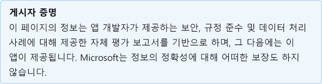

# MeaningCloud Text Analytics for ExcelMeaningCloud Text Analytics for Excel

개발자가 마지막으로 업데이트한 날짜: 2020년 12월 29일Last updated by the developer on: December 29, 2020

* <a href="https://appsource.microsoft.com/product/office/WA200002421" target="_blank">AppSource의 보기</a><a href="https://appsource.microsoft.com/product/office/WA200002421" target="_blank">View in AppSource</a>

::: zone pivot="general"

### 일반 정보General information

MeaningCloud에서 Microsoft에 제공하는 정보:Information provided by MeaningCloud to Microsoft:

| **정보****Information** | **응답****Response** |
|:----------------|:-------------|
| 앱 이름App name | MeaningCloud Text Analytics for ExcelMeaningCloud Text Analytics for Excel |
| IDID | WA200002421WA200002421 |
| Office 365 클라이언트 지원Office 365 clients supported | Excel 2016 Mac, Excel 2013 이상을 Windows 웹용 ExcelExcel 2016 or later on Mac, Excel 2013 or later on Windows, Excel on the web |
| 파트너 회사 이름Partner company name | MeaningCloudMeaningCloud |
| 파트너 웹 사이트의 URLURL of partner website | [ https://appsource.microsoft.com/marketplace/apps?product=of...https://appsource.microsoft.com/marketplace/apps?product=of...](https://appsource.microsoft.com/marketplace/apps?product=office) |
| 개인 정보 취급 방침의 URLURL of Privacy Policy | [https://www.meaningcloud.com/data-protection-policy](https://www.meaningcloud.com/data-protection-policy) |
| 사용 약관 URLURL of Terms of Use | [https://www.meaningcloud.com/terms-and-conditions](https://www.meaningcloud.com/terms-and-conditions) |

 [!INCLUDE [Corrections or suggestions contact information](../includes/corrections-or-suggestions.md)]

::: zone-end

::: zone pivot="data"

### 앱이 데이터를 처리하는 방법How the app handles data

이 정보는 MeaningCloud에서 이 앱이 조직 데이터를 수집 및 저장하는 방법 및 앱이 수집하는 데이터를 통해 조직이 가지는 컨트롤에 대해 제공됩니다.This information has been provided by MeaningCloud about how this app collects and stores organizational data and the control that your organization will have over the data the app collects.

#### Microsoft 365를 사용한 데이터 GraphData access using Microsoft Graph

이 앱에 [Graph Microsoft 사용자 권한을](https://docs.microsoft.com/graph/permissions-reference) 나열합니다.List any [Microsoft Graph permissions](https://docs.microsoft.com/graph/permissions-reference) this app requires.

>이 응용 프로그램은 Microsoft 응용 프로그램을 Graph.This application does not use Microsoft Graph.

#### 비영구 Microsoft 서비스Non-Microsoft services used

앱이 Microsoft가 아닌 서비스로 조직 데이터를 전송하거나 공유하는 경우 앱에서 사용하는 비 Microsoft 서비스, 전송되는 데이터를 나열하고 앱이 이 정보를 전송해야 하는 이유에 대한 사유를 포함합니다.If the app transfers or shares organizational data with non-Microsoft service, list the non-Microsoft service the app uses, what data is transferred, and include a justification for why the app needs to transfer this information.

>비영구 Microsoft 서비스 사용되지 않습니다.Non-Microsoft services are not used.

#### 원격 분석 데이터Telemetry data

이 응용 프로그램의 원격 분석 또는 로그에 OII(조직 식별 정보) 또는 EUII(최종 사용자 식별 정보)가 나타나나요?Does any organizational identifiable information (OII) or end-user identifiable information (EUII) appear in this application's telemetry or logs? 그렇다면 저장되는 데이터와 보존 및 제거 정책에 대해 설명하세요.If yes, describe what data is stored and what are the retention and removal policies?

>응용 프로그램 원격 분석 또는 로그에 OII 또는 EUII가 나타나지 않습니다.No OII or EUII appear in the applications telemetry or logs.

#### 파트너가 저장한 데이터에 대한 조직 제어Organizational controls for data stored by partner

조직의 관리자가 파트너 시스템에서 정보를 제어하는 방법에 대해 설명하는 방법 삭제, 보존, 감사, 보관, 최종 사용자 정책 등Describe how organization's administrators can control their information in partner systems? e.g. deletion, retention, auditing, archiving, end-user policy, etc.

>ISO 27001 절차ISO 27001 procedures

#### 조직 정보의 인적 검토Human review of organizational information

사람이 이 앱에서 수집하거나 저장하는 OII(조직 식별 정보) 데이터를 검토하거나 분석하는 데 관여하나요?Are humans involved in reviewing or analyzing any organizational identifiable information (OII) data that is collected or stored by this app?

>아니요No

[!INCLUDE [Corrections or suggestions contact information](../includes/corrections-or-suggestions.md)]

::: zone-end

::: zone pivot="mcas"

Microsoft Cloud App Security [카탈로그의](https://www.microsoft.com/enterprise-mobility-security/cloud-app-security) 정보가 아래에 표시됩니다.Information from the [Microsoft Cloud App Security](https://www.microsoft.com/enterprise-mobility-security/cloud-app-security) catalog appears below.

<iframe height='1020' title='Microsoft Cloud App Security 정보Microsoft Cloud App Security Information' src='https://appmcasinfoprod.azurewebsites.net/#/dashboard/36382' frameborder='no' style='width: 100%;'></iframe>

<a href="https://appmcasinfoprod.azurewebsites.net/#/dashboard/36382" target="_blank">새 탭에서 보기</a>

<a href="https://appmcasinfoprod.azurewebsites.net/#/dashboard/36382" target="_blank">View in a new tab</a>

[!INCLUDE [Corrections or suggestions contact information](../includes/corrections-or-suggestions.md)]

::: zone-end

::: zone pivot="identity"

### ID 정보Identity information

이 정보는 MeaningCloud에서 이 앱이 인증, 권한 부여, 응용 프로그램 등록 모범 사례 및 기타 ID 조건을 처리하는 방법에 대해 제공했습니다.This information has been provided by MeaningCloud about how this app handles authentication, authorization, application registration best practices, and other Identity criteria.

| **정보****Information** | **응답****Response** |
|:----------------|:-------------|
| Microsoft Identify Platform(Azure AD)과 통합하나요?Do you integrate with Microsoft Identify Platform (Azure AD)?  | 아니요No |

[!INCLUDE [Corrections or suggestions contact information](../includes/corrections-or-suggestions.md)]

::: zone-end
