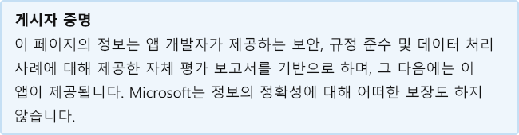

# ApproveSimpleApproveSimple

개발자가 마지막으로 업데이트한 날짜: 2020년 3월 23일Last updated by the developer on: March 23, 2020

* <a href="https://teams.microsoft.com/l/app/c920bd4d-3e2a-449a-b30a-26d2a73fa875" target="_blank">저장소의 Teams 보기</a><a href="https://teams.microsoft.com/l/app/c920bd4d-3e2a-449a-b30a-26d2a73fa875" target="_blank">View in Teams store</a>
* <a href="https://appsource.microsoft.com/product/office/WA104381812" target="_blank">AppSource의 보기</a><a href="https://appsource.microsoft.com/product/office/WA104381812" target="_blank">View in AppSource</a>

::: zone pivot="general"

### 일반 정보General information

Capriza, Inc에서 Microsoft에 제공한 정보:Information provided by Capriza, Inc to Microsoft:

| **정보****Information** | **응답****Response** |
|:----------------|:-------------|
| 앱 이름App name | ApproveSimpleApproveSimple |
| IDID | WA104381812WA104381812 |
| Office 365 클라이언트 지원Office 365 clients supported | Microsoft TeamsMicrosoft Teams |
| 파트너 회사 이름Partner company name | Capriza, IncCapriza, Inc |
| 파트너 웹 사이트의 URLURL of partner website | [https://www.capriza.com/msteams-landing-page](https://www.capriza.com/msteams-landing-page) |
| 응용 프로그램 Teams 페이지의 URL입니다.URL of Teams application info page | [https://support.capriza.com/](https://support.capriza.com/) |
| 개인 정보 취급 방침의 URLURL of Privacy Policy | [https://www.capriza.com/privacy-policy/](https://www.capriza.com/privacy-policy/) |
| 사용 약관 URLURL of Terms of Use | [https://www.capriza.com/mla/](https://www.capriza.com/mla/) |

 [!INCLUDE [Corrections or suggestions contact information](../includes/corrections-or-suggestions.md)]

::: zone-end

::: zone pivot="data"

### 앱이 데이터를 처리하는 방법How the app handles data

이 정보는 Capriza, Inc.에서 이 앱이 조직 데이터를 수집하고 저장하는 방법 및 앱이 수집하는 데이터에 대해 조직이 제어할 수 있는 컨트롤에 대해 제공합니다.This information has been provided by Capriza, Inc about how this app collects and stores organizational data and the control that your organization will have over the data the app collects.

#### Microsoft 365를 사용한 데이터 GraphData access using Microsoft Graph

이 앱에 [Graph Microsoft 사용자 권한을](https://docs.microsoft.com/graph/permissions-reference) 나열합니다.List any [Microsoft Graph permissions](https://docs.microsoft.com/graph/permissions-reference) this app requires.

>이 응용 프로그램은 Microsoft 응용 프로그램을 Graph.This application does not use Microsoft Graph.

#### 비영구 Microsoft 서비스Non-Microsoft services used

앱이 Microsoft가 아닌 서비스로 조직 데이터를 전송하거나 공유하는 경우 앱에서 사용하는 비 Microsoft 서비스, 전송되는 데이터를 나열하고 앱이 이 정보를 전송해야 하는 이유에 대한 사유를 포함합니다.If the app transfers or shares organizational data with non-Microsoft service, list the non-Microsoft service the app uses, what data is transferred, and include a justification for why the app needs to transfer this information.

>비영구 Microsoft 서비스 사용되지 않습니다.Non-Microsoft services are not used.

#### 봇을 통한 데이터 액세스Data access via bots

이 앱에 봇 또는 메시징 확장이 포함되어 있는 경우 팀 구성원의 명단(이름, 성, 표시 이름, 전자 메일 주소)이나 팀 구성원이 추가된 채팅의 최종 사용자 식별 정보(EUII)에 액세스할 수 있습니다.If this app contains a bot or a messaging extension, it can access end-user identifiable information (EUII): the roster (first name, last name, display name, email address) of any team member in a team or chat it's added to. 이 앱이 이 기능을 사용하나요?Does this app make use of this capability?

>| **EUII 액세스의 사유는 무엇입니까?****Justification for accessing EUII?**  | **EUII가 데이터베이스에 저장되어 있나요?****Is EUII stored in database(s)?** | **EUII 저장의 사유는 무엇입니까?****Justification for storing EUII?** |
>|:--------------------------------|:---------------------|:--------------------------|
>| 보류 중인 새 승인 요청에 대한 알림Notify user of a new pending approval request | 전자 메일 주소email address |  |

#### 원격 분석 데이터Telemetry data

이 응용 프로그램의 원격 분석 또는 로그에 OII(조직 식별 정보) 또는 EUII(최종 사용자 식별 정보)가 나타나나요?Does any organizational identifiable information (OII) or end-user identifiable information (EUII) appear in this application's telemetry or logs? 그렇다면 저장되는 데이터와 보존 및 제거 정책에 대해 설명하세요.If yes, describe what data is stored and what are the retention and removal policies?

>이름, 전자 메일 및 팀 이름Name, email and team name

#### 파트너가 저장한 데이터에 대한 조직 제어Organizational controls for data stored by partner

조직의 관리자가 파트너 시스템에서 정보를 제어하는 방법에 대해 설명하는 방법 삭제, 보존, 감사, 보관, 최종 사용자 정책 등Describe how organization's administrators can control their information in partner systems? e.g. deletion, retention, auditing, archiving, end-user policy, etc.

>이 제품은 관리자가 ApproveSimple(LDAP 가져오기 포함)에서 서비스할 사용자를 정의하고 관리자 권한 및 로그인 정책을 포함하여 사용자 정책을 제어할 수 있는 관리자 대시보드를 제공합니다.The product provides an admin dashboard where the administrator can define which users will be serviced by ApproveSimple (including LDAP import) and control the user policy, including admin privileges and login policy. 감사 및 보관은 관리에 기본으로 제공되어 있습니다.Auditing and archiving is built-into the administration. 데이터를 지우기 위해 고객은 서비스 티켓을 발급해야 합니다.For data deletion the customer needs to issue a service ticket. 

[!INCLUDE [Corrections or suggestions contact information](../includes/corrections-or-suggestions.md)]

::: zone-end

::: zone pivot="mcas"

Microsoft Cloud App Security [카탈로그의](https://www.microsoft.com/enterprise-mobility-security/cloud-app-security) 정보가 아래에 표시됩니다.Information from the [Microsoft Cloud App Security](https://www.microsoft.com/enterprise-mobility-security/cloud-app-security) catalog appears below.

<iframe height='1020' title='Microsoft Cloud App Security 정보Microsoft Cloud App Security Information' src='https://appmcasinfoprod.azurewebsites.net/#/dashboard/27275' frameborder='no' style='width: 100%;'></iframe>

<a href="https://appmcasinfoprod.azurewebsites.net/#/dashboard/27275" target="_blank">새 탭에서 보기</a>

<a href="https://appmcasinfoprod.azurewebsites.net/#/dashboard/27275" target="_blank">View in a new tab</a>

[!INCLUDE [Corrections or suggestions contact information](../includes/corrections-or-suggestions.md)]

::: zone-end

